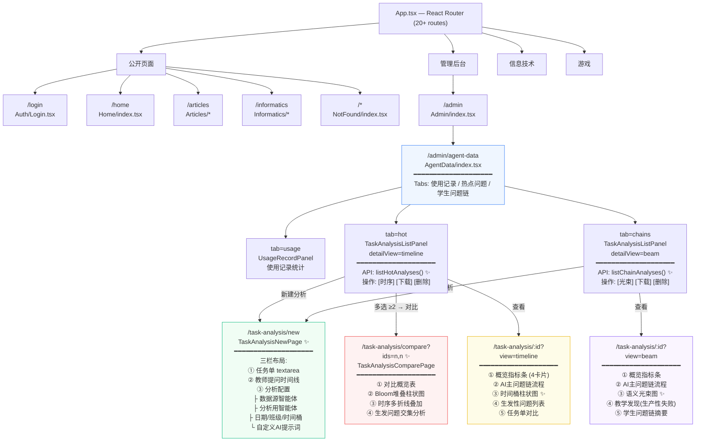
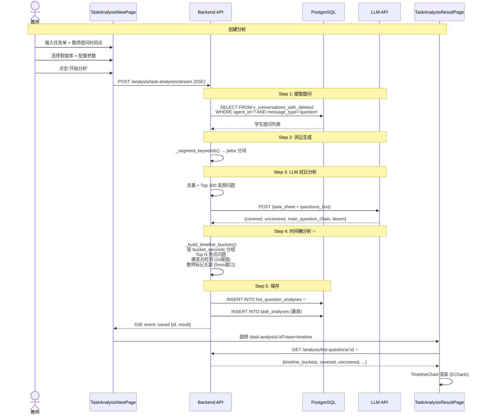
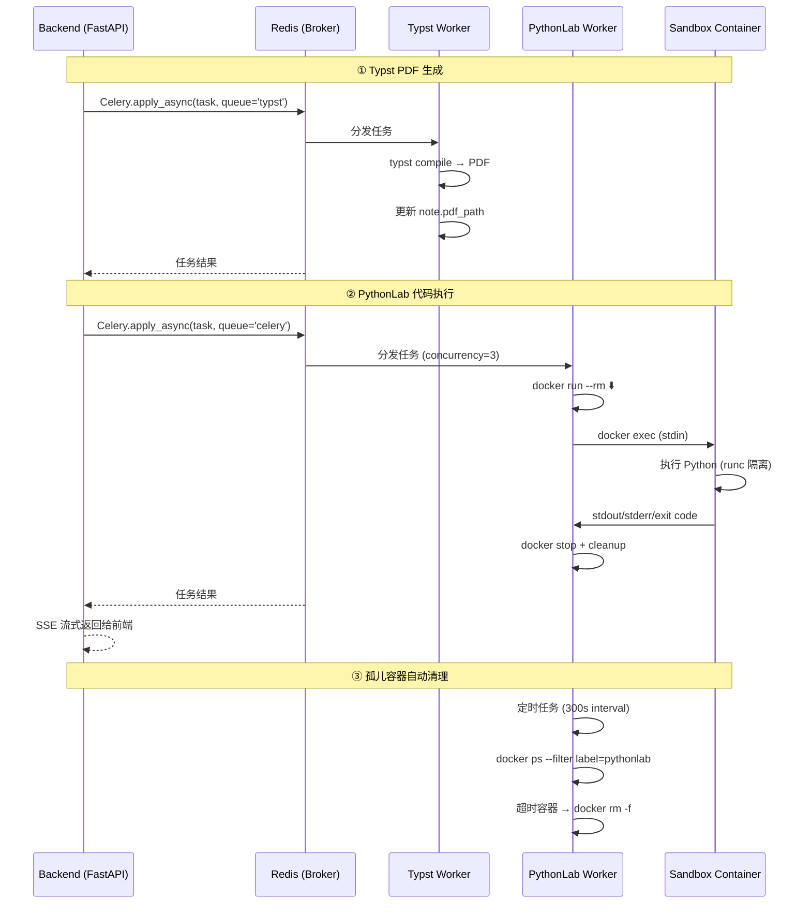
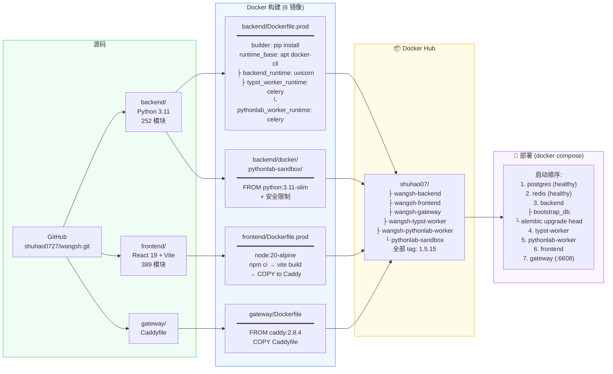

# WangSh 生产环境完整依赖图

> 基于 `docker-compose.yml` · 252 个 Python 模块 · 41 张数据库表 · 34 个前端页面  
> 最后更新: 2026-05-23 · 当前版本: 1.5.15

---

## 一、基础设施层

```mermaid
graph TB
    subgraph External["🌐 外部系统"]
        Browser["🖥 浏览器 / 移动端<br/>:6608"]
        DockerHub["📦 Docker Hub<br/>shuhao07/wangsh-*"]
        GitHub["🔀 GitHub<br/>shuhao0727/wangsh.git"]
        LLM_API["🧠 LLM API<br/>Dify / OpenAI / DeepSeek<br/>httpx AsyncClient timeout=120s"]
        TypstCDN["📄 github.com/typst/typst<br/>v0.14.2 binary"]
        DockerCLI["🐳 download.docker.com<br/>docker-cli v26.1.4"]
    end

    subgraph Network["🔗 Docker Network: wangsh_wangsh-network (bridge)"]
        Gateway["🚪 Caddy 2.8.4<br/>shuhao07/wangsh-gateway:1.5.15<br/>━━━━━━━━━━━━━━━━━━━━<br/>:6608→:80 (HTTP 入口)<br/>:443 (HTTPS 预留)<br/>:2019 (Admin API)<br/>Gzip + Security Headers<br/>Cache: /assets/* 1年"]

        Frontend["🖼 React 19 SPA<br/>shuhao07/wangsh-frontend:1.5.15<br/>━━━━━━━━━━━━━━━━━━━━<br/>Caddy 静态文件<br/>:80 (internal only)<br/>SPA fallback → index.html"]

        Backend["⚙️ FastAPI + Uvicorn<br/>shuhao07/wangsh-backend:1.5.15<br/>━━━━━━━━━━━━━━━━━━━━<br/>:8000 (internal only)<br/>platform: linux/amd64<br/>workers=${UVICORN_WORKERS:-1}<br/>启动: bootstrap_db → alembic → uvicorn"]

        TypstWorker["📝 Typst Worker<br/>shuhao07/wangsh-typst-worker:1.5.15<br/>━━━━━━━━━━━━━━━━━━━━<br/>Celery -Q typst -c 1<br/>platform: linux/amd64<br/>中文字体 + typst CLI"]

        PyLabWorker["🐍 PythonLab Worker<br/>shuhao07/wangsh-pythonlab-worker:1.5.15<br/>━━━━━━━━━━━━━━━━━━━━<br/>Celery -Q celery -c 3<br/>platform: linux/amd64<br/>Docker SDK + docker.sock"]
    end

    subgraph Data["💾 数据层"]
        PG[("PostgreSQL 16-alpine<br/>━━━━━━━━━━━━━━━━━━━━<br/>:5432 (internal)<br/>DB: wangsh_db<br/>User: admin<br/>Mem limit: 512MB<br/>41 张表")]
        Redis[("Redis 7-alpine<br/>━━━━━━━━━━━━━━━━━━━━<br/>:6379 (internal)<br/>AOF 持久化<br/>Mem limit: 256MB<br/>Cache + SSE PubSub + Celery Broker")]
    end

    subgraph Sandbox["🏖 PythonLab 沙箱 (动态创建/销毁)"]
        SB1["pythonlab_u{n}<br/>━━━━━━━━━━━━━━━━━━━━<br/>shuhao07/pythonlab-sandbox:1.5.15<br/>runc 隔离<br/>CPU: 50000 | Mem: 128MB<br/>PID limit: 128<br/>TTL: 3600s<br/>Orphan cleanup: 300s"]
        SB2["pythonlab_u{n}<br/>━━━━━━━━━━━━━━━━━━━━<br/>每个用户独立容器<br/>debugpy :5678 (内部)<br/>自动清理孤儿容器"]
    end

    subgraph Storage["📁 持久化卷"]
        PGVol["postgres_data → /var/lib/postgresql/data"]
        RedisVol["redis_data → /data"]
        UploadsVol["uploads_data → /app/uploads"]
        PDFsVol["typst_pdfs → /app/data/typst_pdfs"]
        WorkspacesVol["HOST_WORKSPACE_ROOT → /tmp/pythonlab/workspaces"]
        DockerSock["/var/run/docker.sock :rw"]
    end

    Browser -->|"HTTP :6608"| Gateway
    Gateway -->|"/api/health → /health"| Backend
    Gateway -->|"/api/* → proxy"| Backend
    Gateway -->|"/* (SPA fallback)"| Frontend

    Backend -->|"asyncpg (连接池)"| PG
    Backend -->|"redis-py (max=150)"| Redis
    Backend -->|"Celery.apply_async → typst queue"| Redis
    Backend -->|"Celery.apply_async → celery queue"| Redis
    Backend -->|"httpx POST (120s timeout)"| LLM_API

    TypstWorker -->|"Celery broker"| Redis
    TypstWorker -->|"asyncpg"| PG
    TypstWorker -->|"子进程 typst compile"| TypstCDN

    PyLabWorker -->|"Celery broker"| Redis
    PyLabWorker -->|"asyncpg"| PG
    PyLabWorker -->|"docker run --rm (runc)"| SB1
    PyLabWorker -->|"docker run --rm (runc)"| SB2

    Backend -.->|"RW volume"| UploadsVol
    Backend -.->|"RW volume"| PDFsVol
    Backend -.->|"RW volume"| DockerSock
    TypstWorker -.->|"RW volume"| PDFsVol
    PyLabWorker -.->|"RW volume"| WorkspacesVol
    PyLabWorker -.->|"RW volume"| DockerSock
    SB1 -.->|"RW volume"| WorkspacesVol
    SB2 -.->|"RW volume"| WorkspacesVol

    DockerHub -->|"pull"| Gateway
    DockerHub -->|"pull"| Frontend
    DockerHub -->|"pull"| Backend
    DockerHub -->|"pull"| TypstWorker
    DockerHub -->|"pull"| PyLabWorker

    style External fill:#f0fdf4,stroke:#22c55e
    style Network fill:#eff6ff,stroke:#3b82f6
    style Data fill:#fef2f2,stroke:#ef4444
    style Sandbox fill:#fefce8,stroke:#eab308
    style Storage fill:#f8fafc,stroke:#94a3b8
```



---

## 二、后端模块依赖

```mermaid
graph TD
    subgraph API["api/endpoints/ — 路由层 (15 模块)"]
        AUTH["auth/auth.py<br/>登录/注册/刷新Token"]
        AGENTS["agents/ai_agents/<br/>━━━━━━━━━━━━━━━━━━<br/>ai_agents.py — 路由注册<br/>analysis.py — 热点/问题链分析 ✨<br/>conversations.py — 对话查询<br/>usage.py — 使用统计<br/>export.py — 数据导出<br/>stream.py — SSE 流<br/>group_discussion.py — 群聊<br/>crud.py — 智能体 CRUD"]
        MODEL_DISCOVERY["model_discovery.py<br/>模型发现"]
        CONTENT["content/<br/>articles/ + categories/"]
        ASSESSMENT["assessment/<br/>测评/问卷系统"]
        CLASSROOM["classroom/<br/>课堂互动/教学计划"]
        INFORMATICS["informatics/<br/>Typst笔记/GitHub同步"]
        LEARNING["learning/<br/>学习内容/进度/思维导图"]
        ML["ml/book.py<br/>机器学习教材"]
        XBK["xbk/<br/>选课系统 (10 文件)"]
        SYSTEM["system/<br/>health/metrics/overview<br/>feature_flags"]
    end

    subgraph Services["services/ — 业务逻辑层 (50+ 文件)"]
        SVC_AGENTS["agents/<br/>━━━━━━━━━━━━━━━━━━<br/>agent_analysis.py ✨<br/>  ├ _segment_keywords<br/>  ├ _call_llm_analysis<br/>  ├ _build_timeline_buckets ✨<br/>  ├ stream_task_sheet_analysis ✨<br/>  ├ analyze_task_sheet<br/>  ├ analyze_hot_questions<br/>  └ analyze_student_chains<br/>chat_stream.py — 流式对话<br/>chat_blocking.py — 同步对话<br/>code_generator.py — 代码生成<br/>group_discussion/ — 群聊服务<br/>providers/<br/>  ├ base.py — LLM 抽象基类<br/>  ├ dify_provider.py<br/>  ├ openai_provider.py<br/>  ├ anthropic_provider.py<br/>  ├ common.py — resolve_credentials<br/>  ├ registry.py — Provider 注册表<br/>  └ circuit_breaker.py — 熔断器"]
        SVC_AUTH["auth.py — JWT 认证"]
        SVC_OTHER["classroom/ informatics/<br/>assessment/ xbk/"]
    end

    subgraph Models["models/ — 数据模型层 (41 张表)"]
        M_CORE["core/ — user, auth, feature_flag"]
        M_AGENTS["agents/<br/>AIAgent (znt_agents)<br/>TaskAnalysis (task_analyses)<br/>HotQuestionAnalysis ✨<br/>StudentChainAnalysis ✨<br/>Conversation, GroupDiscussion"]
        M_CONTENT["articles/ — article, category, style"]
        M_ASSESSMENT["assessment/ — config, session, answer, profile"]
        M_CLASSROOM["classroom/ — plan, activity, response"]
        M_INFORMATICS["informatics/ — typst_note, github_sync"]
        M_LEARNING["learning/ — chapter, content, progress"]
        M_XBK["xbk/ — course, selection, student"]
    end

    subgraph Schemas["schemas/ — Pydantic 验证层"]
        SCH["agents/<br/>AIAgentBase, TaskAnalysisRequest,<br/>HotQuestionAnalysisSaveRequest ✨<br/>TimelineBucket ✨<br/>TeacherQuestionMark ✨<br/>MainQuestionChainItem"]
    end

    subgraph Core["core/ — 核心基础设施"]
        CONFIG["config/ — Settings (pydantic-settings)<br/>SECRET_KEY / POSTGRES / REDIS"]
        DEPS["deps.py — get_db, require_admin,<br/>get_current_user"]
        STARTUP["startup.py — init_super_admin,<br/>init_services"]
        CACHE["utils/cache.py — Redis 连接池 (150)<br/>SSE PubSub"]
        ERRORS["utils/errors.py — safe_error_detail"]
    end

    API --> Services
    API --> Schemas
    API --> Core
    Services --> Models
    Services --> Schemas
    Services --> Core
    Models --> Core

    style API fill:#eff6ff,stroke:#3b82f6
    style Services fill:#f0fdf4,stroke:#10b981
    style Models fill:#fef2f2,stroke:#ef4444
    style Schemas fill:#fefce8,stroke:#eab308
    style Core fill:#f8fafc,stroke:#94a3b8
```



---

## 三、数据库表关系

```mermaid
erDiagram
    sys_users ||--o{ znt_conversations : "对话"
    sys_users ||--o{ task_analyses : "创建"
    sys_users ||--o{ hot_question_analyses : "创建 ✨"
    sys_users ||--o{ student_chain_analyses : "创建 ✨"
    sys_users ||--o{ znt_classroom_responses : "课堂回答"
    sys_users ||--o{ sys_learning_progress : "学习进度"
    sys_users ||--o{ xbk_selections : "选课"
    sys_users ||--o{ sys_refresh_tokens : "刷新Token"

    znt_agents ||--o{ znt_conversations : "对话"
    znt_agents ||--o{ task_analyses : "分析数据源"
    znt_agents ||--o{ hot_question_analyses : "热点数据源 ✨"
    znt_agents ||--o{ student_chain_analyses : "问题链数据源 ✨"
    znt_agents ||--o{ znt_group_discussion_sessions : "群聊"
    znt_agents ||--o{ znt_assessment_config_agents : "测评配置"

    znt_group_discussion_sessions ||--o{ znt_group_discussion_messages : "消息"
    znt_group_discussion_sessions ||--o{ znt_group_discussion_members : "成员"
    znt_group_discussion_sessions ||--o{ znt_group_discussion_analyses : "分析"

    znt_assessment_configs ||--o{ znt_assessment_sessions : "测评"
    znt_assessment_configs ||--o{ znt_assessment_questions : "题目"
    znt_assessment_sessions ||--o{ znt_assessment_answers : "作答"
    znt_assessment_configs ||--o{ znt_student_profiles : "学生画像"

    znt_classroom_plans ||--o{ znt_classroom_plan_items : "计划项"
    znt_classroom_plans ||--o{ znt_classroom_activities : "活动"

    sys_learning_chapters ||--o{ sys_learning_content_items : "内容"
    sys_learning_chapters ||--o{ sys_learning_progress : "进度"

    wz_categories ||--o{ wz_articles : "分类"
    wz_articles ||--o{ wz_markdown_styles : "样式"

    xbk_courses ||--o{ xbk_selections : "选课"
    xbk_students ||--o{ xbk_selections : "学生选课"

    inf_typst_categories ||--o{ inf_typst_notes : "分类"
    inf_typst_styles ||--o{ inf_typst_notes : "样式"
    inf_github_sync_settings ||--o{ inf_github_sync_sources : "源"
    inf_github_sync_settings ||--o{ inf_github_sync_runs : "同步"

    ml_books ||--o{ ml_book_chapters : "章节"

    sys_users {
        int id PK
        string username "唯一"
        string full_name
        string password_hash
        string role "admin/teacher/student"
    }

    znt_agents {
        int id PK
        string name
        string agent_type "general/dify/openai"
        string api_endpoint "LLM API URL"
        string api_key_encrypted
        text system_prompt
        boolean is_active
    }

    znt_conversations {
        int id PK
        int agent_id FK
        int user_id FK
        string message_type "question/answer"
        text content
        timestamp created_at
    }

    hot_question_analyses {
        int id PK
        string title "自动截取"
        text task_sheet "教师任务单"
        int agent_id FK "数据来源智能体"
        int analysis_agent_id FK "分析用智能体"
        int bucket_seconds "时间桶粒度 默认180"
        json teacher_marks "教师提问时间点 []"
        text custom_prompt "自定义AI提示词"
        json result "{timeline_buckets,covered,uncovered,bloom}"
        int created_by FK
        timestamp created_at
    }

    student_chain_analyses {
        int id PK
        string title
        int agent_id FK "数据来源智能体"
        int analysis_agent_id FK "分析用智能体"
        text task_sheet "可空"
        json result "{main_question_chain,beam_data}"
        int created_by FK
        timestamp created_at
    }

    task_analyses {
        int id PK
        string title
        text task_sheet
        int agent_id FK
        json result
        int created_by FK
        timestamp created_at
    }
```



---

## 四、API 路由树（完整）

```
/api/v1/
├── /system
│   ├── GET  /health                         → system/health.py
│   ├── GET  /feature-flags                  → system/feature_flags.py
│   ├── GET  /overview                       → system/overview.py
│   └── GET  /metrics                        → system/metrics.py
├── /auth
│   ├── POST /login                          → auth/auth.py
│   ├── POST /register                       → auth/auth.py
│   ├── POST /refresh                        → auth/auth.py
│   ├── GET  /me                             → auth/auth.py
│   └── POST /logout                         → auth/auth.py
├── /ai-agents
│   ├── GET  /                               → crud.py (list)
│   ├── POST /                               → crud.py (create)
│   ├── GET  /active                         → crud.py
│   ├── GET  /statistics                     → crud.py
│   ├── GET  /{id}                           → crud.py
│   ├── PUT  /{id}                           → crud.py
│   ├── DELETE /{id}                         → crud.py
│   ├── POST /test                           → crud.py
│   ├── POST /{id}/discover-models           → model_discovery.py
│   └── /analysis ✨
│       ├── GET  /hot-questions/live         → 实时热点桶 (live)
│       ├── GET  /student-chains/live        → 实时学生链 (live)
│       ├── POST /task-analysis              → 同步分析
│       ├── GET  /task-analyses              → 旧表列表
│       ├── GET  /task-analyses/{id}         → 旧表详情
│       ├── POST /task-analyses              → 同步保存
│       ├── POST /task-analyses/stream       → 流式分析 (SSE)
│       ├── DELETE /task-analyses/{id}       → 删除
│       ├── GET  /hot-questions              → ✨ 新表列表
│       ├── GET  /hot-questions/{id}         → ✨ 新表详情
│       ├── DELETE /hot-questions/{id}       → ✨ 删除
│       ├── GET  /student-chains             → ✨ 新表列表
│       ├── GET  /student-chains/{id}        → ✨ 新表详情
│       └── DELETE /student-chains/{id}      → ✨ 删除
├── /articles
├── /categories
├── /users
├── /assessment
├── /classroom
├── /informatics
├── /learning
├── /ml-book
├── /xbk
└── /admin/stream                            → admin_stream.py
```

---

## 五、前端页面路由与组件树



---

## 六、热点问题分析数据流 ✨



---

## 七、Celery 异步任务流



---

## 八、请求生命周期

```
1. 浏览器 → DNS → Caddy Gateway (:6608)
2. Caddy 路由匹配:
   ├─ /api/health → rewrite /health → Backend (:8000)
   ├─ /api/* → reverse_proxy → Backend (:8000)
   │   └─ FastAPI 中间件链:
   │       CORS Middleware
   │       → Auth Middleware (JWT Bearer Token)
   │       → Depends(get_db) → AsyncSession (连接池)
   │       → Depends(require_admin) → 权限验证
   │       → Router → 业务逻辑
   │       → Pydantic Response Model 验证
   │       → JSON Response
   └─ /* → reverse_proxy → Frontend (:80)
       └─ Caddy 静态文件:
           /assets/* → Cache-Control: public, max-age=31536000
           其他 → Cache-Control: no-cache
           SPA fallback → index.html
3. Response → Caddy Gzip 压缩 → 浏览器
```

---

## 九、构建与部署流水线



---

## 十、关键文件索引

| 文件 | 用途 | 最近改动 |
|------|------|---------|
| `docker-compose.yml` | 生产部署 (8 容器) | 1.5.15 |
| `docker-compose.dev.yml` | 开发环境 (热重载) | build 配置 |
| `.env` | 密钥/密码/版本号 | IMAGE_TAG=1.5.15 |
| `DEPENDENCY_MAP.md` | 本文档 | ✨ 新增 |
| `backend/Dockerfile.prod` | 后端多阶段构建 | — |
| `backend/Dockerfile.dev` | 开发镜像 | — |
| `backend/alembic/versions/20260522_0719_hot_chain_tables.py` | 新表迁移 | ✨ 新增 |
| `backend/alembic/versions/20260522_0146_task_analyses.py` | task_analyses 迁移 | ✨ 新增 |
| `backend/app/models/agents/ai_agent.py` | 3 个分析模型 | ✨ Hot/Chain 模型 |
| `backend/app/schemas/agents/ai_agent.py` | Pydantic Schema | ✨ TimelineBucket 等 |
| `backend/app/services/agents/agent_analysis.py` | 分析逻辑 | ✨ _build_timeline_buckets |
| `backend/app/api/endpoints/agents/ai_agents/analysis.py` | 分析 API | ✨ 双表 CRUD + /live 路由 |
| `backend/app/api/endpoints/agents/ai_agents/__init__.py` | 路由注册 | ✨ analysis_router |
| `frontend/src/App.tsx` | 前端路由 | ✨ /task-analysis/compare |
| `frontend/src/pages/Admin/AgentData/TaskAnalysisNewPage.tsx` | 新建分析 | ✨ 三栏+双智能体 |
| `frontend/src/pages/Admin/AgentData/TaskAnalysisResultPage.tsx` | 结果页 | ✨ timeline/beam/wordcloud |
| `frontend/src/pages/Admin/AgentData/TaskAnalysisComparePage.tsx` | 多课时对比 | ✨ 新增 |
| `frontend/src/pages/Admin/AgentData/components/TimelineChart.tsx` | 时序图 | ✨ 新增 |
| `frontend/src/pages/Admin/AgentData/components/StudentBeamChart.tsx` | 光束图 | ✨ 增强版 |
| `frontend/src/pages/Admin/AgentData/components/TaskAnalysisListPanel.tsx` | 列表面板 | ✨ 双表 API |
| `frontend/src/services/znt/api/index.ts` | API 调用层 | ✨ 6 个新方法 |
| `gateway/Caddyfile` | Caddy 路由 | — |
