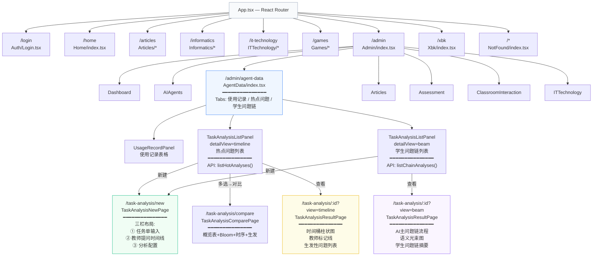
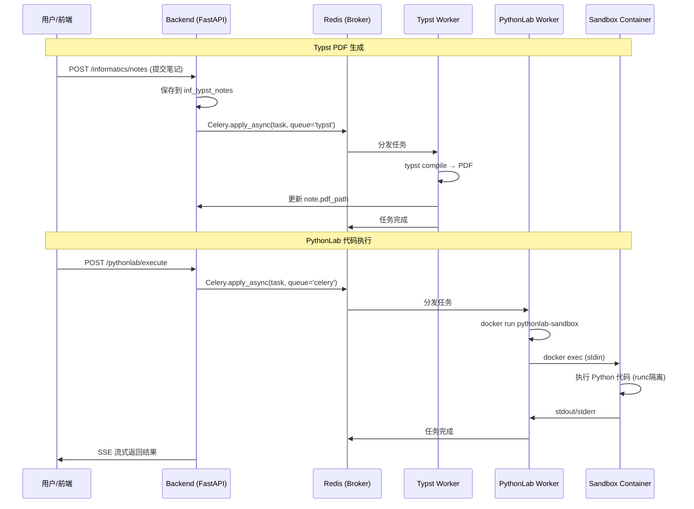
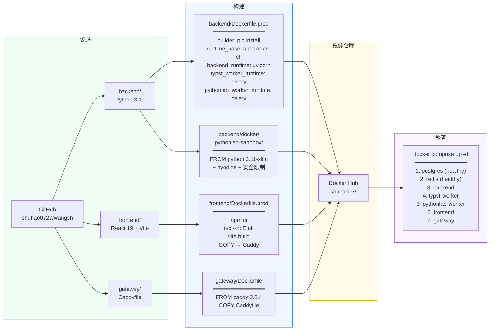

# WangSh 生产环境完整依赖图

> 基于 `docker-compose.yml` · 252 个 Python 模块 · 41 张数据库表 · 34 个前端页面  
> 自动生成 · 上次更新: 2026-05-23

---

## 一、基础设施层

```mermaid
graph TB
    subgraph External["🌐 外部系统"]
        Browser["🖥 浏览器 / 移动端<br/>:6608"]
        DockerHub["📦 Docker Hub<br/>shuhao07/wangsh-*"]
        GitHub["🔀 GitHub<br/>shuhao0727/wangsh.git"]
        LLM_API["🧠 LLM API<br/>Dify / OpenAI / DeepSeek<br/>httpx AsyncClient timeout=120s"]
        TypstCDN["📄 github.com/typst/typst<br/>v0.14.2"]
        DockerCLI["🐳 download.docker.com<br/>docker-cli v26.1.4"]
    end

    subgraph Network["🔗 Docker Network: wangsh_wangsh-network (bridge)"]
        Gateway["🚪 Caddy 2.8.4-alpine<br/>shuhao07/wangsh-gateway<br/>━━━━━━━━━━━━━━━━<br/>:6608→:80 (HTTP)<br/>:443 (HTTPS)<br/>:2019 (Admin API)"]
        
        Frontend["🖼 React 19 SPA<br/>shuhao07/wangsh-frontend<br/>━━━━━━━━━━━━━━━━<br/>Caddy 静态文件服务<br/>:80 (internal)<br/>Cache: /assets/* 1年<br/>Gzip 压缩"]

        Backend["⚙️ FastAPI + Uvicorn<br/>shuhao07/wangsh-backend<br/>━━━━━━━━━━━━━━━━<br/>:8000 (internal)<br/>workers=1<br/>启动: bootstrap_db → alembic → uvicorn"]

        TypstWorker["📝 Typst Worker<br/>shuhao07/wangsh-typst-worker<br/>━━━━━━━━━━━━━━━━<br/>Celery -Q typst<br/>concurrency=1<br/>生成 PDF + 中文字体"]

        PyLabWorker["🐍 PythonLab Worker<br/>shuhao07/wangsh-pythonlab-worker<br/>━━━━━━━━━━━━━━━━<br/>Celery -Q celery<br/>concurrency=3<br/>Docker SDK 管理沙箱"]
    end

    subgraph Data["💾 数据层"]
        PG[("PostgreSQL 16-alpine<br/>━━━━━━━━━━━━━━━━<br/>:5432 (internal)<br/>DB: wangsh_db<br/>User: admin<br/>41 张表")]
        Redis[("Redis 7-alpine<br/>━━━━━━━━━━━━━━━━<br/>:6379 (internal)<br/>AOF 持久化<br/>用途: Cache + SSE PubSub + Celery Broker")]
    end

    subgraph Sandbox["🏖 PythonLab 沙箱 (动态)"]
        SB1["pythonlab_u{n}<br/>━━━━━━━━━━━━━━━━<br/>runc 隔离<br/>CPU: 50000<br/>Mem: 128MB<br/>PID: 128<br/>TTL: 3600s"]
        SB2["pythonlab_u{n}<br/>━━━━━━━━━━━━━━━━<br/>每个用户独立容器<br/>debugpy :5678<br/>自动清理孤儿容器"]
    end

    subgraph Storage["📁 持久化卷 (bind mounts)"]
        PGVol["postgres_data<br/>→ /var/lib/postgresql/data"]
        RedisVol["redis_data<br/>→ /data"]
        UploadsVol["uploads_data<br/>→ /app/uploads"]
        PDFsVol["typst_pdfs<br/>→ /app/data/typst_pdfs"]
        WorkspacesVol["HOST_WORKSPACE_ROOT<br/>→ /tmp/pythonlab/workspaces"]
        DockerSock["🐳 docker.sock<br/>→ /var/run/docker.sock (RW)"]
    end

    Browser -->|"HTTP :6608"| Gateway
    Gateway -->|"/api/health → /health"| Backend
    Gateway -->|"/api/* → proxy"| Backend
    Gateway -->|"/* → SPA"| Frontend
    Gateway -->|"Cache-Control: 1y"| Frontend

    Backend -->|"asyncpg"| PG
    Backend -->|"redis-py"| Redis
    Backend -->|"Celery.apply_async"| Redis
    Backend -->|"httpx POST"| LLM_API

    TypstWorker -->|"Celery broker"| Redis
    TypstWorker -->|"asyncpg"| PG
    TypstWorker -->|"子进程 typst compile"| TypstCDN

    PyLabWorker -->|"Celery broker"| Redis
    PyLabWorker -->|"asyncpg"| PG
    PyLabWorker -->|"docker run --rm"| SB1
    PyLabWorker -->|"docker run --rm"| SB2

    Backend -.->|"RW volume"| UploadsVol
    Backend -.->|"RW volume"| PDFsVol
    Backend -.->|"RW volume"| DockerSock
    TypstWorker -.->|"RW volume"| PDFsVol
    PyLabWorker -.->|"RW volume"| WorkspacesVol
    PyLabWorker -.->|"RW volume"| DockerSock
    SB1 -.->|"RW volume"| WorkspacesVol
    SB2 -.->|"RW volume"| WorkspacesVol

    DockerHub -->|"docker pull"| Gateway
    DockerHub -->|"docker pull"| Frontend
    DockerHub -->|"docker pull"| Backend
    DockerHub -->|"docker pull"| TypstWorker
    DockerHub -->|"docker pull"| PyLabWorker

    style External fill:#f0fdf4,stroke:#22c55e
    style Network fill:#eff6ff,stroke:#3b82f6
    style Data fill:#fef2f2,stroke:#ef4444
    style Sandbox fill:#fefce8,stroke:#eab308
    style Storage fill:#f8fafc,stroke:#94a3b8
```



---

## 二、后端模块依赖

```mermaid
graph TD
    subgraph API["api/endpoints/ — 路由层"]
        AUTH["auth/auth.py<br/>登录/注册/刷新Token"]
        AGENTS["agents/ai_agents/<br/>━━━━━━━━━━━━━<br/>ai_agents.py — CRUD<br/>analysis.py — 热点/问题链<br/>conversations.py — 对话查询<br/>usage.py — 使用统计<br/>export.py — 数据导出<br/>stream.py — SSE流<br/>group_discussion.py — 群聊<br/>crud.py — 智能体管理"]
        MODEL_DISCOVERY["model_discovery.py<br/>模型发现"]
        CONTENT["content/<br/>articles/ + categories/<br/>文章/分类管理"]
        ASSESSMENT["assessment/<br/>测评/问卷系统"]
        CLASSROOM["classroom/<br/>课堂互动/教学计划"]
        INFORMATICS["informatics/<br/>Typst笔记/GitHub同步"]
        LEARNING["learning/<br/>学习内容/进度/思维导图"]
        ML["ml/book.py<br/>机器学习Book"]
        XBK["xbk/<br/>选课系统"]
        SYSTEM["system/<br/>health/metrics/overview<br/>feature_flags"]
    end

    subgraph Services["services/ — 业务逻辑层"]
        SVC_AGENTS["agents/<br/>━━━━━━━━━━━━━<br/>agent_analysis.py — 任务分析<br/>chat_stream.py — 流式对话<br/>chat_blocking.py — 同步对话<br/>code_generator.py — 代码生成<br/>group_discussion/ — 群聊服务<br/>providers/ —LLM适配器<br/>  ├ dify_provider<br/>  ├ openai_provider<br/>  └ anthropic_provider"]
        SVC_AUTH["auth.py<br/>JWT认证"]
        SVC_CLASSROOM["classroom.py<br/>classroom_plan.py"]
        SVC_INFORMATICS["informatics/<br/>typst/styling/sync"]
        SVC_ASSESSMENT["assessment/<br/>session/profile/export"]
        SVC_XBK["xbk/exports/<br/>选课导出"]
    end

    subgraph Models["models/ — 数据模型层 (41 张表)"]
        M_CORE["core/<br/>user, auth, feature_flag"]
        M_AGENTS["agents/<br/>AIAgent, TaskAnalysis,<br/>HotQuestionAnalysis,<br/>StudentChainAnalysis,<br/>Conversation, GroupDiscussion"]
        M_CONTENT["articles/<br/>article, category, style"]
        M_ASSESSMENT["assessment/<br/>config, session, answer, profile"]
        M_CLASSROOM["classroom/<br/>plan, activity, response"]
        M_INFORMATICS["informatics/<br/>typst_note, github_sync"]
        M_LEARNING["learning/<br/>chapter, content, progress"]
        M_XBK["xbk/<br/>course, selection, student"]
    end

    subgraph Schemas["schemas/ — Pydantic 验证层"]
        SCH_AGENTS["agents/<br/>AIAgentBase, TaskAnalysisRequest,<br/>HotQuestionAnalysisSaveRequest,<br/>TimelineBucket, TeacherQuestionMark"]
    end

    subgraph Core["core/ — 核心基础设施"]
        CORE_CONFIG["config/<br/>Settings (pydantic-settings)"]
        CORE_DEPS["deps.py<br/>get_db, require_admin,<br/>get_current_user"]
        CORE_STARTUP["startup.py<br/>init_super_admin, init_services"]
        CACHE["utils/cache.py<br/>Redis 连接池 (max=150)"]
    end

    API --> Services
    API --> Schemas
    API --> Core
    Services --> Models
    Services --> Schemas
    Services --> Core
    Models -->|"Base.metadata"| Core

    style API fill:#eff6ff,stroke:#3b82f6
    style Services fill:#f0fdf4,stroke:#10b981
    style Models fill:#fef2f2,stroke:#ef4444
    style Schemas fill:#fefce8,stroke:#eab308
    style Core fill:#f8fafc,stroke:#94a3b8
```



---

## 三、数据库表关系

```mermaid
erDiagram
    sys_users ||--o{ znt_conversations : "对话"
    sys_users ||--o{ task_analyses : "创建分析"
    sys_users ||--o{ hot_question_analyses : "创建热点分析"
    sys_users ||--o{ student_chain_analyses : "创建问题链分析"
    sys_users ||--o{ znt_classroom_responses : "课堂回答"
    sys_users ||--o{ sys_learning_progress : "学习进度"
    sys_users ||--o{ xbk_selections : "选课"

    znt_agents ||--o{ znt_conversations : "对话"
    znt_agents ||--o{ task_analyses : "分析数据源"
    znt_agents ||--o{ hot_question_analyses : "热点数据源"
    znt_agents ||--o{ student_chain_analyses : "问题链数据源"
    znt_agents ||--o{ znt_group_discussion_sessions : "群聊"

    znt_agents ||--o{ znt_assessment_config_agents : "测评配置"

    znt_group_discussion_sessions ||--o{ znt_group_discussion_messages : "消息"
    znt_group_discussion_sessions ||--o{ znt_group_discussion_members : "成员"
    znt_group_discussion_sessions ||--o{ znt_group_discussion_analyses : "分析"

    znt_assessment_configs ||--o{ znt_assessment_sessions : "测评会话"
    znt_assessment_configs ||--o{ znt_assessment_questions : "题目"
    znt_assessment_sessions ||--o{ znt_assessment_answers : "作答"
    znt_assessment_configs ||--o{ znt_student_profiles : "学生画像"

    znt_classroom_plans ||--o{ znt_classroom_plan_items : "计划项"
    znt_classroom_plans ||--o{ znt_classroom_activities : "活动"

    sys_learning_chapters ||--o{ sys_learning_content_items : "内容"
    sys_learning_chapters ||--o{ sys_learning_progress : "进度"

    wz_categories ||--o{ wz_articles : "分类"
    wz_articles ||--o{ wz_markdown_styles : "样式"

    xbk_courses ||--o{ xbk_selections : "选课"
    xbk_students ||--o{ xbk_selections : "选课"

    inf_typst_categories ||--o{ inf_typst_notes : "分类"
    inf_typst_styles ||--o{ inf_typst_notes : "样式"
    inf_github_sync_settings ||--o{ inf_github_sync_sources : "源"
    inf_github_sync_settings ||--o{ inf_github_sync_runs : "同步运行"

    ml_books ||--o{ ml_book_chapters : "章节"

    sys_users ||--o{ sys_refresh_tokens : "刷新Token"

    sys_users {
        int id PK
        string username
        string full_name
        string password_hash
        string role
    }

    znt_agents {
        int id PK
        string name
        string agent_type "general/dify/openai"
        string api_endpoint
        text system_prompt
        boolean is_active
    }

    znt_conversations {
        int id PK
        int agent_id FK
        int user_id FK
        string message_type "question/answer"
        text content
        timestamp created_at
    }

    hot_question_analyses {
        int id PK
        string title
        text task_sheet
        int agent_id FK
        int analysis_agent_id FK
        int bucket_seconds
        json teacher_marks
        text custom_prompt
        json result "timeline_buckets,covered,uncovered,bloom"
    }

    student_chain_analyses {
        int id PK
        string title
        int agent_id FK
        int analysis_agent_id FK
        text task_sheet "可空"
        json result "main_question_chain,beam_data"
    }

    task_analyses {
        int id PK
        string title
        text task_sheet
        int agent_id FK
        json result
    }
```



---

## 四、API 路由注册树

```
/api/v1/
├── /system
│   ├── GET  /health                    → health.py
│   ├── GET  /feature-flags            → feature_flags.py
│   ├── GET  /overview                 → overview.py
│   └── GET  /metrics                  → metrics.py
├── /auth
│   ├── POST /login                    → auth.py
│   ├── POST /register                 → auth.py
│   ├── POST /refresh                  → auth.py
│   └── GET  /me                       → auth.py
├── /ai-agents
│   ├── GET  /                         → crud.py (list)
│   ├── POST /                         → crud.py (create)
│   ├── GET  /active                   → crud.py
│   ├── GET  /statistics               → crud.py
│   ├── GET  /{id}                     → crud.py
│   ├── PUT  /{id}                     → crud.py
│   ├── DELETE /{id}                   → crud.py
│   ├── POST /test                     → crud.py
│   ├── POST /{id}/discover-models     → model_discovery.py
│   └── /analysis
│       ├── GET  /hot-questions/live   → analysis.py (实时)
│       ├── GET  /student-chains/live  → analysis.py (实时)
│       ├── POST /task-analysis        → analysis.py (同步分析)
│       ├── GET  /task-analyses        → analysis.py (旧列表)
│       ├── GET  /task-analyses/{id}   → analysis.py (旧详情)
│       ├── POST /task-analyses/stream → analysis.py (流式分析)
│       ├── DELETE /task-analyses/{id} → analysis.py
│       ├── GET  /hot-questions        → analysis.py (新列表)
│       ├── GET  /hot-questions/{id}   → analysis.py (新详情)
│       ├── DELETE /hot-questions/{id} → analysis.py
│       ├── GET  /student-chains       → analysis.py (新列表)
│       ├── GET  /student-chains/{id}  → analysis.py (新详情)
│       └── DELETE /student-chains/{id}→ analysis.py
├── /articles
├── /categories
├── /users
├── /assessment
├── /classroom
├── /informatics
├── /learning
├── /ml-book
├── /xbk
└── /admin/stream                     → admin_stream.py
```

---

## 五、前端页面路由



---

## 六、前端组件树（任务分析模块）

```
TaskAnalysisNewPage.tsx
├── ① 任务单输入 (textarea)
├── ② 教师提问时间线
│   ├── 添加/删除时间点按钮
│   ├── Input[type=time] + Input[placeholder=提问内容]
│   └── "从任务单提取问题"按钮
└── ③ 分析配置
    ├── Select[智能体] + 最近活动提示
    ├── Select[分析用智能体]
    ├── Input[type=date] × 2
    ├── Input[班级]
    ├── Input[type=number] 时间桶秒数 + 快捷按钮
    ├── 可折叠 "自定义AI分析提示词" textarea
    └── Button[开始分析] → SSE 流式进度

TaskAnalysisResultPage.tsx
├── Header (标题 + 日期 + 下载)
├── 概览指标条 (4卡片)
├── view=timeline
│   ├── TimelineChart (ECharts 柱状图+折线+爆发点+教师标记)
│   ├── MainQuestionChainFlow (AI主问题链流程)
│   └── 任务单对比 (covered + uncovered)
├── view=beam
│   ├── MainQuestionChainFlow
│   ├── StudentBeamChart (语义光束图)
│   ├── 教学发现 (uncovered → 生产性失败信号)
│   └── ChainCard × 4 (学生问题链摘要)
└── view=wordcloud (保留兼容)

TaskAnalysisComparePage.tsx
├── 对比概览表 (提问总数/生发问题/爆发点/主问题链)
├── Bloom堆叠柱状图 (ECharts)
├── 时序多折线叠加图 (ECharts)
└── 生发问题交集分析 (系统性盲区 vs 偶发性)

TaskAnalysisListPanel.tsx
├── Header (搜索 + 多选对比按钮 + 新建)
└── Table
    ├── checkbox (多选)
    ├── 标题 + 时间 + 发现数
    └── 操作 (查看/下载/删除)
```

---

## 七、Celery 任务流



---

## 八、请求生命周期

```
1. 浏览器 → DNS → Caddy Gateway (:6608)
2. Caddy 路径匹配:
   ├─ /api/* → reverse_proxy → Backend (:8000)
   │   ├─ FastAPI 中间件链:
   │   │   CORS → Auth → Depends(get_db) → Router
   │   │   ├─ require_admin() → JWT 验证
   │   │   ├─ get_db() → AsyncSession (连接池)
   │   │   └─ 业务逻辑 → JSON Response
   │   └─ 数据库查询:
   │       ├─ PostgreSQL (asyncpg)
   │       └─ Redis (redis-py, 连接池 max=150)
   └─ /* → reverse_proxy → Frontend (:80)
       └─ Caddy 静态文件服务
           ├─ /assets/* → Cache 1年
           └─ SPA fallback → index.html
3. Response → Caddy Gzip → 浏览器
```

---

## 九、构建流水线



---

## 十、关键文件索引

| 文件 | 用途 |
|------|------|
| `docker-compose.yml` | 生产部署配置 |
| `docker-compose.dev.yml` | 开发环境（热重载） |
| `.env` | 环境变量（密钥/密码） |
| `backend/Dockerfile.prod` | 后端多阶段构建 |
| `backend/Dockerfile.dev` | 开发镜像 |
| `frontend/Dockerfile.prod` | 前端生产构建 |
| `gateway/Caddyfile` | Caddy 路由规则 |
| `backend/alembic/versions/` | 数据库迁移 |
| `backend/app/core/config/` | 配置管理 |
| `backend/app/core/deps.py` | 依赖注入 |
| `frontend/src/App.tsx` | 前端路由 |
| `frontend/src/services/znt/api/` | API 调用层 |
