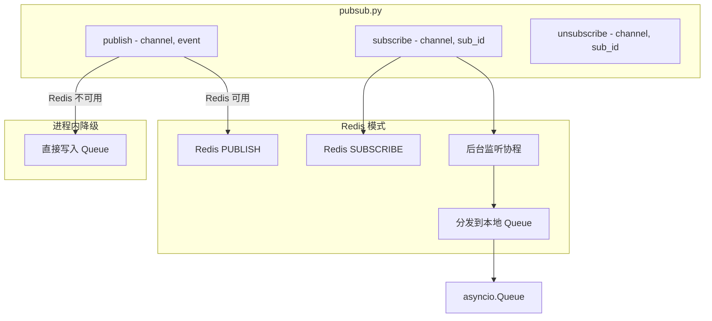

# SSE pub/sub 从进程内迁移到 Redis 方案

> 创建日期：2026-04-02
> 目标：解决 P0 问题 — SSE pub/sub 单进程限制，支持多 worker 部署

---

## 一、问题分析

### 1.1 当前实现

[`backend/app/core/pubsub.py`](backend/app/core/pubsub.py) 使用进程内 `asyncio.Queue` 实现 pub/sub：

```python
_subscribers: Dict[str, Dict[str, asyncio.Queue]] = {}  # channel -> {sub_id: queue}
```

- `publish()` — 同步函数，遍历频道内所有 Queue 推送事件
- `subscribe()` — 创建 Queue 并注册到 `_subscribers`
- `unsubscribe()` — 从 `_subscribers` 移除

**核心限制**：`_subscribers` 是进程级全局变量，多 worker 时每个 worker 有独立的 `_subscribers`，导致：
- Worker A 发布的事件，Worker B 的 SSE 连接收不到
- 用户连接到哪个 worker 是随机的，事件推送不可靠

### 1.2 影响范围

**3 个 SSE 订阅端点**（使用进程内 pub/sub）：

| 端点 | 文件 | 频道 |
|------|------|------|
| `/admin/stream` | `admin_stream.py` | `admin_global` |
| `/classroom/admin/stream` | `classroom/admin.py` | `admin_{user_id}` |
| `/classroom/stream` | `classroom/student.py` | `student` |

**25+ 个 publish 调用点**（6 个模块）：

| 模块 | 频道 | 事件类型 |
|------|------|---------|
| classroom service | `student`, `admin_{user_id}`, `admin_global` | activity_started/ended, new_response |
| classroom admin API | `admin_global` | activity_changed |
| users API | `admin_global` | user_changed |
| agents CRUD API | `admin_global` | agent_changed |
| articles API | `admin_global` | article_changed |
| assessment admin API | `admin_global` | assessment_changed |
| group_discussion API | `admin_global` | discussion_changed |

**已有 Redis pub/sub 的模块**（不受本次改造影响）：

| 模块 | 实现方式 |
|------|---------|
| 小组讨论消息流 | 直接使用 `cache.publish()` + `client.pubsub()` |
| 小组讨论公开配置流 | 直接使用 `cache.publish()` + `client.pubsub()` |

### 1.3 频道模式分析

```mermaid
graph LR
    subgraph 发布者
        P1[classroom service]
        P2[users API]
        P3[agents API]
        P4[articles API]
        P5[assessment API]
        P6[group_discussion API]
    end

    subgraph Redis 频道
        C1[sse:admin_global]
        C2[sse:admin_N]
        C3[sse:student]
    end

    subgraph 订阅者 - SSE 端点
        S1[/admin/stream]
        S2[/classroom/admin/stream]
        S3[/classroom/stream]
    end

    P1 --> C1
    P1 --> C2
    P1 --> C3
    P2 --> C1
    P3 --> C1
    P4 --> C1
    P5 --> C1
    P6 --> C1

    C1 --> S1
    C2 --> S2
    C3 --> S3
```

---

## 二、改造方案

### 2.1 设计原则

1. **向后兼容**：保留进程内 pub/sub 作为降级方案（Redis 不可用时自动回退）
2. **最小改动**：`publish/subscribe/unsubscribe` 接口签名不变，调用方零改动
3. **参考已有实现**：复用 `cache.py` 中的 Redis 客户端和 `cache.publish()` 方法
4. **频道命名空间**：添加 `sse:` 前缀，避免与小组讨论等已有 Redis 频道冲突

### 2.2 新的 pubsub.py 架构



### 2.3 核心改动

#### 改动 1：重写 `backend/app/core/pubsub.py`

**关键设计**：
- `publish()` 改为 `async` 函数，优先通过 Redis 发布，失败时回退到进程内
- `subscribe()` 改为 `async` 函数，创建 Redis pubsub 订阅 + 后台监听协程，将消息分发到本地 `asyncio.Queue`
- `unsubscribe()` 改为 `async` 函数，清理 Redis 订阅和本地 Queue
- 添加配置项 `SSE_REDIS_PUBSUB_ENABLED`（默认 True），可关闭回退到纯进程内模式

**伪代码**：

```python
# backend/app/core/pubsub.py

import asyncio
import json
import logging
from typing import Dict, Optional

logger = logging.getLogger(__name__)

CHANNEL_PREFIX = "sse:"

# 本地订阅者：channel -> {sub_id: asyncio.Queue}
_local_subs: Dict[str, Dict[str, asyncio.Queue]] = {}
# Redis 监听任务：channel -> asyncio.Task
_listener_tasks: Dict[str, asyncio.Task] = {}
# 每个频道的 Redis pubsub 对象
_redis_pubsubs: Dict[str, object] = {}

_redis_available: Optional[bool] = None


async def _is_redis_available() -> bool:
    """检测 Redis pub/sub 是否可用"""
    global _redis_available
    if _redis_available is not None:
        return _redis_available
    try:
        from app.core.config import settings
        if not getattr(settings, "SSE_REDIS_PUBSUB_ENABLED", True):
            _redis_available = False
            return False
        from app.utils.cache import cache
        client = await cache.get_client()
        await client.ping()
        _redis_available = True
    except Exception:
        _redis_available = False
    return _redis_available


async def publish(channel: str, event: dict):
    """发布事件到频道（优先 Redis，降级进程内）"""
    # 1. 尝试 Redis 发布
    if await _is_redis_available():
        try:
            from app.utils.cache import cache
            payload = json.dumps(event, ensure_ascii=False)
            client = await cache.get_client()
            await client.publish(f"{CHANNEL_PREFIX}{channel}", payload)
            return  # Redis 发布成功，由各 worker 的监听协程分发到本地 Queue
        except Exception:
            logger.warning("Redis publish 失败，回退到进程内分发")

    # 2. 降级：进程内直接分发
    _local_publish(channel, event)


def _local_publish(channel: str, event: dict):
    """进程内直接分发到本地 Queue"""
    subs = _local_subs.get(channel, {})
    for q in subs.values():
        try:
            q.put_nowait(event)
        except asyncio.QueueFull:
            pass


async def subscribe(channel: str, sub_id: str) -> asyncio.Queue:
    """订阅频道，返回 asyncio.Queue"""
    q: asyncio.Queue = asyncio.Queue(maxsize=50)
    _local_subs.setdefault(channel, {})[sub_id] = q

    # 确保该频道有 Redis 监听协程
    if await _is_redis_available() and channel not in _listener_tasks:
        _listener_tasks[channel] = asyncio.create_task(
            _redis_listener(channel)
        )

    return q


async def unsubscribe(channel: str, sub_id: str):
    """取消订阅"""
    subs = _local_subs.get(channel, {})
    subs.pop(sub_id, None)

    # 频道无订阅者时，停止 Redis 监听
    if not subs:
        _local_subs.pop(channel, None)
        task = _listener_tasks.pop(channel, None)
        if task:
            task.cancel()
        ps = _redis_pubsubs.pop(channel, None)
        if ps:
            try:
                await ps.unsubscribe(f"{CHANNEL_PREFIX}{channel}")
                await ps.close()
            except Exception:
                pass


async def _redis_listener(channel: str):
    """后台协程：监听 Redis 频道，分发到本地 Queue"""
    redis_channel = f"{CHANNEL_PREFIX}{channel}"
    try:
        from app.utils.cache import cache
        client = await cache.get_client()
        ps = client.pubsub()
        await ps.subscribe(redis_channel)
        _redis_pubsubs[channel] = ps

        while True:
            msg = await ps.get_message(
                ignore_subscribe_messages=True, timeout=1.0
            )
            if msg and msg.get("type") == "message":
                try:
                    event = json.loads(msg["data"])
                    _local_publish(channel, event)
                except (json.JSONDecodeError, KeyError):
                    pass
    except asyncio.CancelledError:
        pass
    except Exception:
        logger.exception(f"Redis listener for {channel} 异常退出")
    finally:
        _redis_pubsubs.pop(channel, None)
        _listener_tasks.pop(channel, None)


async def shutdown_pubsub():
    """应用关闭时清理所有 Redis 订阅"""
    for channel, task in list(_listener_tasks.items()):
        task.cancel()
    _listener_tasks.clear()
    for ps in list(_redis_pubsubs.values()):
        try:
            await ps.close()
        except Exception:
            pass
    _redis_pubsubs.clear()
    _local_subs.clear()
```

#### 改动 2：所有 publish 调用点改为 await

当前 `publish()` 是同步函数，改为 `async` 后，所有调用点需要加 `await`：

| 文件 | 改动 |
|------|------|
| `services/classroom.py` | 6 处 `publish(...)` → `await publish(...)` |
| `api/endpoints/classroom/admin.py` | 1 处 `svc.publish(...)` → `await svc.publish(...)` |
| `api/endpoints/agents/ai_agents/crud.py` | 3 处 |
| `api/endpoints/agents/ai_agents/group_discussion.py` | 2 处 |
| `api/endpoints/management/users/users.py` | 4 处 |
| `api/endpoints/content/articles/articles.py` | 3 处 |
| `api/endpoints/assessment/admin.py` | 3 处 |

**总计约 22 处**，全部在 `async def` 函数内，加 `await` 即可。

#### 改动 3：SSE 端点改为 await subscribe/unsubscribe

3 个 SSE 端点的 `subscribe()` 和 `unsubscribe()` 调用需要加 `await`：

| 文件 | 改动 |
|------|------|
| `admin_stream.py` | `svc.subscribe(...)` → `await svc.subscribe(...)`, `svc.unsubscribe(...)` → `await svc.unsubscribe(...)` |
| `classroom/admin.py` | 同上 |
| `classroom/student.py` | 同上 |

#### 改动 4：配置项

在 [`backend/app/core/config.py`](backend/app/core/config.py) 添加：

```python
# SSE Redis pub/sub 配置
SSE_REDIS_PUBSUB_ENABLED: bool = Field(default=True)
```

#### 改动 5：启动/关闭钩子

在 [`backend/app/core/startup.py`](backend/app/core/startup.py) 的 `shutdown()` 中添加 pubsub 清理：

```python
from app.core.pubsub import shutdown_pubsub

async def shutdown(cleanup_task):
    ...
    await shutdown_pubsub()
    ...
```

#### 改动 6：更新 docker-compose 注释

移除 [`docker-compose.yml`](docker-compose.yml) 中的 SSE 单 worker 警告注释，改为说明已支持多 worker。

---

## 三、数据流对比

### 3.1 改造前（单 worker）

```
publish() → 遍历 _subscribers[channel] → 直接写入 asyncio.Queue → SSE 端点读取
```

### 3.2 改造后（多 worker）

```
publish() → Redis PUBLISH sse:channel
                ↓
    Worker A: _redis_listener → _local_publish → Queue → SSE 端点
    Worker B: _redis_listener → _local_publish → Queue → SSE 端点
    Worker C: _redis_listener → _local_publish → Queue → SSE 端点
```

### 3.3 降级模式（Redis 不可用）

```
publish() → _local_publish → 直接写入 asyncio.Queue → SSE 端点（仅本 worker）
```

---

## 四、影响的文件清单

| 文件 | 改动类型 | 改动量 |
|------|---------|--------|
| `backend/app/core/pubsub.py` | **重写** | ~120 行 |
| `backend/app/core/config.py` | 新增配置项 | +2 行 |
| `backend/app/core/startup.py` | 添加 shutdown 调用 | +3 行 |
| `backend/app/services/classroom.py` | publish 加 await | ~6 处 |
| `backend/app/api/endpoints/admin_stream.py` | subscribe/unsubscribe 加 await，改用 pubsub 导入 | ~3 处 |
| `backend/app/api/endpoints/classroom/admin.py` | subscribe/unsubscribe 加 await | ~3 处 |
| `backend/app/api/endpoints/classroom/student.py` | subscribe/unsubscribe 加 await | ~3 处 |
| `backend/app/api/endpoints/agents/ai_agents/crud.py` | publish 加 await | ~3 处 |
| `backend/app/api/endpoints/agents/ai_agents/group_discussion.py` | publish 加 await | ~2 处 |
| `backend/app/api/endpoints/management/users/users.py` | publish 加 await | ~4 处 |
| `backend/app/api/endpoints/content/articles/articles.py` | publish 加 await | ~3 处 |
| `backend/app/api/endpoints/assessment/admin.py` | publish 加 await | ~3 处 |
| `docker-compose.yml` | 更新注释 | ~2 行 |
| `.env.example` | 新增配置说明 | +2 行 |

**总计 14 个文件，核心改动集中在 pubsub.py 重写**。

---

## 五、测试策略

### 5.1 单元测试

新增 `backend/tests/test_pubsub.py`：
- 测试 Redis 模式下 publish → subscribe 能收到事件
- 测试 Redis 不可用时自动降级到进程内模式
- 测试 unsubscribe 后不再收到事件
- 测试 QueueFull 时不阻塞

### 5.2 集成验证

- 启动 2 个 worker（`UVICORN_WORKERS=2`）
- 连接 SSE 端点
- 在管理端创建/修改数据
- 验证 SSE 事件能在两个 worker 间正确传递

### 5.3 回归测试

- 运行现有全部后端测试（105 passed 基线）
- 验证小组讨论的 Redis pub/sub 不受影响（独立频道命名空间）

---

## 六、风险评估

| 风险 | 概率 | 影响 | 缓解措施 |
|------|------|------|---------|
| Redis 连接中断导致 SSE 失效 | 低 | 中 | 自动降级到进程内模式 + 监听协程异常重连 |
| publish 改 async 遗漏某处调用 | 低 | 高 | grep 全量搜索 + 类型检查 |
| Redis 消息延迟影响实时性 | 极低 | 低 | Redis pub/sub 延迟通常 < 1ms |
| 频道命名冲突 | 极低 | 中 | 使用 `sse:` 前缀隔离 |

---

## 七、执行步骤

1. 重写 `backend/app/core/pubsub.py`（Redis pub/sub + 进程内降级）
2. 在 `config.py` 添加 `SSE_REDIS_PUBSUB_ENABLED` 配置项
3. 在 `startup.py` 添加 `shutdown_pubsub()` 调用
4. 修改 `classroom.py` 中 6 处 publish 为 await
5. 修改 3 个 SSE 端点的 subscribe/unsubscribe 为 await
6. 修改 5 个 API 文件中共 15 处 publish 为 await
7. 更新 `admin_stream.py` 改用 pubsub 直接导入
8. 更新 docker-compose.yml 注释和 .env.example
9. 新增 `tests/test_pubsub.py` 单元测试
10. 运行全量测试验证回归
