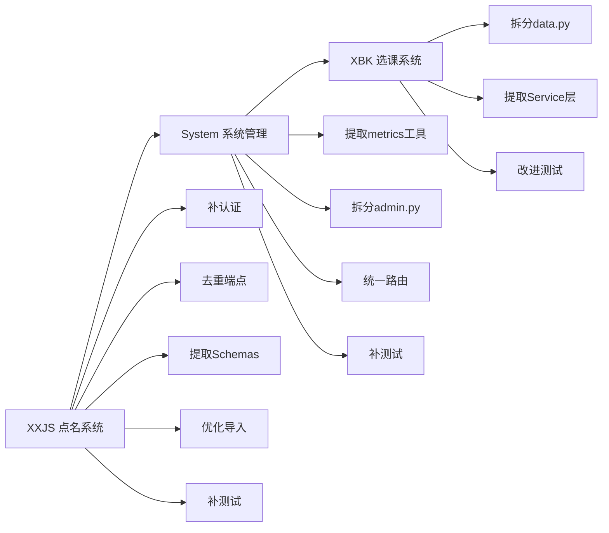

# 三模块改进计划：点名系统 / 系统管理 / 选课系统

> 创建时间：2026-04-02  
> 状态：待实施  
> 优先级顺序：XXJS → System → XBK

---

## 一、点名系统 (XXJS) — 问题最严重

### 1.1 现状分析

| 文件 | 行数 | 问题 |
|------|------|------|
| `api/endpoints/xxjs/dianming.py` | 160 | Schemas 内联、无认证、重复端点、N+1 导入 |
| `models/xxjs/dianming.py` | 17 | 模型简单但缺少 `updated_at` 字段 |
| `frontend/src/services/xxjs/dianming.ts` | 60 | 前端 API 层正常 |
| 测试 | 0 | 完全没有测试 |

### 1.2 改进项

#### P0：补充认证

- 所有写操作端点（`import`、`delete`、`update`）加 `Depends(require_admin)`
- 所有读操作端点加 `Depends(get_current_user)` 或保持开放（根据业务需求）
- 当前 `list_classes` 和 `list_students` 的认证被注释掉了，需要恢复

#### P1：消除重复端点

- `GET /students` 和 `GET /class/students` 功能完全相同
- 保留 `/students`，删除 `/class/students`（或反过来，保持前端兼容）
- 检查前端 `dianming.ts` 的调用情况决定保留哪个

#### P2：Schemas 提取到独立文件

- 将 `DianmingClass`、`DianmingStudentBase`、`DianmingStudent`、`DianmingStudentCreate`、`DianmingImportRequest` 移到 `schemas/xxjs/dianming.py`
- API 文件只保留路由逻辑

#### P3：导入性能优化

- 当前 `import_students` 逐条 `SELECT` 查重（N+1 问题）
- 改为：先批量查询已有学生集合，再用 `set` 判断去重
- 或使用 PostgreSQL `INSERT ... ON CONFLICT DO NOTHING`

#### P4：模型补充 `updated_at`

- `XxjsDianming` 模型添加 `updated_at` 字段，与其他模型保持一致

#### P5：补充测试

- 新建 `tests/xxjs/test_dianming.py`
- 覆盖：list_classes、list_students、import（含去重）、delete_class、update_class_students
- 遵循项目现有测试模式（`asyncio.run()` + monkeypatch）

### 1.3 文件变更清单

```
修改  backend/app/api/endpoints/xxjs/dianming.py     — 认证 + 去重端点 + 性能优化
新建  backend/app/schemas/xxjs/__init__.py            — schemas 包
新建  backend/app/schemas/xxjs/dianming.py            — 提取的 Pydantic 模型
修改  backend/app/models/xxjs/dianming.py             — 添加 updated_at
新建  backend/tests/xxjs/test_dianming.py             — 测试文件
可能  backend/alembic/versions/xxx_add_updated_at.py  — 迁移（如果加字段）
```

---

## 二、系统管理 (System) — 代码重复严重

### 2.1 现状分析

| 文件 | 行数 | 问题 |
|------|------|------|
| `api/endpoints/system/admin.py` | 460 | 3处重复百分位函数、metrics/overview 大量重复代码 |
| `api/endpoints/system/health.py` | 154 | 正常，无需改动 |
| `api/endpoints/system/__init__.py` | 7 | 只导出 health，admin 在 api/__init__.py 单独注册 |
| `models/core/feature_flag.py` | 26 | 正常 |
| 测试 | 0 | system admin 无专门测试 |

### 2.2 改进项

#### P0：提取公共指标采集工具

- 将 `q()` / `pct()` 百分位计算函数提取到 `utils/metrics.py`
- 将 Redis 指标采集（HTTP metrics、Typst metrics）提取为可复用函数
- 将 DB 连接池指标采集提取为可复用函数

#### P1：拆分 admin.py

当前 admin.py 包含 5 个不同职责：
1. Feature Flags CRUD（4个端点）
2. System Overview（1个端点）
3. System Settings（1个端点）
4. Typst Metrics（2个端点：metrics + cleanup）
5. Prometheus Metrics（1个端点）

拆分方案：

```
api/endpoints/system/
├── __init__.py          — 统一注册所有子路由
├── health.py            — 不变
├── feature_flags.py     — Feature Flags CRUD（~75行）
├── overview.py          — system_overview + system_settings（~120行）
├── metrics.py           — typst_metrics + prometheus_metrics + cleanup（~200行）
```

#### P2：统一路由注册

- 修改 `system/__init__.py` 统一注册所有子路由
- 修改 `api/__init__.py` 只引入 `system.router`，不再单独引入 admin

#### P3：消除 prometheus_metrics 中的重复

- `prometheus_metrics` 端点（175行）与 `system_overview` + `typst_metrics` 有大量重复的 Redis 数据采集
- 提取 `_collect_http_metrics()`、`_collect_typst_metrics()`、`_collect_db_pool_metrics()` 三个内部函数
- prometheus_metrics 组合调用这三个函数

#### P4：补充测试

- 新建 `tests/system/test_feature_flags.py` — Feature Flags CRUD 测试
- 新建 `tests/system/test_metrics.py` — 指标端点测试（mock Redis）

### 2.3 文件变更清单

```
删除  backend/app/api/endpoints/system/admin.py       — 拆分为以下3个文件
新建  backend/app/api/endpoints/system/feature_flags.py
新建  backend/app/api/endpoints/system/overview.py
新建  backend/app/api/endpoints/system/metrics.py
修改  backend/app/api/endpoints/system/__init__.py     — 统一注册
修改  backend/app/api/__init__.py                      — 简化 system 引入
新建  backend/app/utils/metrics.py                     — 公共指标工具
新建  backend/tests/system/test_feature_flags.py
新建  backend/tests/system/test_metrics.py
```

---

## 三、选课系统 (XBK) — 大文件拆分

### 3.1 现状分析

| 文件 | 行数 | 问题 |
|------|------|------|
| `api/endpoints/xbk/data.py` | 646 | 3个实体CRUD + 辅助函数全在一个文件 |
| `api/endpoints/xbk/analysis.py` | 350 | 统计分析，有重复的过滤逻辑 |
| `api/endpoints/xbk/import_export.py` | 877 | 导入导出，最大文件 |
| `api/endpoints/xbk/exports.py` | 59 | 表格导出入口 |
| `api/endpoints/xbk/public_config.py` | 28 | 公开配置，正常 |
| `services/xbk/__init__.py` | 5 | 空的 Service 层 |
| `services/xbk/public_config.py` | 37 | 只有公开配置服务 |
| `schemas/xbk/data.py` | ~80 | Schemas 已独立，正常 |
| 测试 | 3文件 | 有但质量低（mock自身函数） |

### 3.2 改进项

#### P0：拆分 data.py 为三个文件

```
api/endpoints/xbk/
├── data.py          → 保留公共函数 + 路由注册
├── students.py      — 学生 CRUD（~130行）
├── courses.py       — 课程 CRUD（~130行）
├── selections.py    — 选课 CRUD + list_selections + list_course_results（~250行）
├── analysis.py      — 不变
├── import_export.py — 不变
├── exports.py       — 不变
├── public_config.py — 不变
```

#### P1：提取 Service 层

- 新建 `services/xbk/student_service.py` — 学生 CRUD 业务逻辑
- 新建 `services/xbk/course_service.py` — 课程 CRUD 业务逻辑
- 新建 `services/xbk/selection_service.py` — 选课 CRUD 业务逻辑
- API 端点只做参数校验 + 调用 Service + 返回响应

#### P2：提取公共过滤函数

- `_apply_common_filters()` 在 data.py 中定义，被 analysis.py 跨文件引用
- 移到 `services/xbk/common.py` 或 `utils/xbk.py`

#### P3：改进测试质量

- 当前测试只是 mock 自身函数然后调用 mock，没有实际测试逻辑
- 改为使用 TestClient + mock DB session 的模式
- 或至少测试 Service 层的业务逻辑

#### P4：delete_data 端点安全加固

- 当前 `DELETE /xbk/data` 可以批量删除数据，需要确认是否有二次确认机制
- 建议添加 `confirm: bool = Query(False)` 参数，必须显式传 `true` 才执行

### 3.3 文件变更清单

```
修改  backend/app/api/endpoints/xbk/data.py           — 保留公共函数 + meta
新建  backend/app/api/endpoints/xbk/students.py        — 学生 CRUD
新建  backend/app/api/endpoints/xbk/courses.py         — 课程 CRUD
新建  backend/app/api/endpoints/xbk/selections.py      — 选课 CRUD
修改  backend/app/api/endpoints/xbk/__init__.py        — 注册新路由
新建  backend/app/services/xbk/student_service.py
新建  backend/app/services/xbk/course_service.py
新建  backend/app/services/xbk/selection_service.py
新建  backend/app/services/xbk/common.py               — 公共过滤函数
修改  backend/tests/xbk/test_xbk_students.py           — 改进测试
修改  backend/tests/xbk/test_xbk_courses.py            — 改进测试
修改  backend/tests/xbk/test_xbk_selections.py         — 改进测试
```

---

## 四、实施顺序与风险控制

### 实施顺序



### 风险控制

1. **每个模块改完后运行全量测试**，确保零回归
2. **前端兼容性**：不改变任何 API 路径和响应格式
3. **数据库迁移**：XXJS 的 `updated_at` 字段需要 Alembic 迁移
4. **渐进式重构**：先拆分文件，再提取 Service 层，最后改进测试

### 预期成果

| 模块 | 改进前评分 | 改进后预期 |
|------|-----------|-----------|
| XXJS 点名系统 | D | B+ |
| System 系统管理 | B- | A- |
| XBK 选课系统 | B- | B+ |
