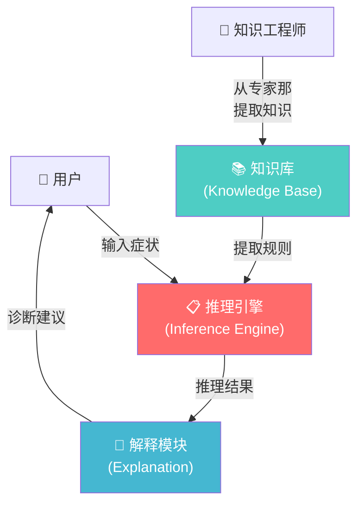

# 专家系统：当AI学会了"看病"

你有没有想过，当你打开手机地图导航、用一个在线症状自查工具、或者让智能客服帮你解决一个操作问题时，背后可能有一个"虚拟专家"在默默工作？

这种"虚拟专家"的学名叫**专家系统（Expert System）**。它是AI在上世纪七八十年代最辉煌的成果，也是第一个大规模商用的AI技术。虽然今天的热点已经转向了深度学习，但专家系统的思想依然贯穿在现代软件的各个角落。

---

## 什么是专家系统？

一句话概括：**把人类专家的知识和经验，编码成一套"如果...那么..."规则，让计算机模拟专家做决策**。

想象一个真实的场景：你去医院看病。医生会怎么诊断？

1. 你告诉医生："我发烧、嗓子疼、流鼻涕。"
2. 医生脑子里有一套经验："发烧 + 嗓子疼 + 流鼻涕 → 大概率是感冒"、"如果还加上全身酸痛 → 可能是流感"、"如果咳嗽超过两周 → 可能需要拍胸片排除肺炎"。
3. 医生还可能让你去验血，根据化验结果进一步缩小范围。
4. 最后，医生告诉你诊断结果和用药建议。

专家系统就是把这个过程自动化。一个典型的医学专家系统长这样：

```
规则1: IF 体温>38℃ AND 咳嗽 AND 喉咙痛 THEN 可能是感冒 (置信度 90%)
规则2: IF 感冒 AND 全身酸痛 AND 高烧不退 THEN 可能是流感 (置信度 85%)
规则3: IF 流感 AND 呼吸困难 THEN 建议立即就医 (置信度 95%)
规则4: IF 感冒 AND NOT 流感 THEN 建议多喝热水、休息 (置信度 80%)
```

这组规则构成了一个**规则引擎**——你输入症状，系统匹配规则，然后给出诊断建议。

---

## 专家系统的三大核心组件



**知识库（Knowledge Base）**：这是专家系统的"大脑"。里面存储了从人类专家那里提取出来的规则和事实。比如一个疾病诊断系统，知识库里可能有几千条"症状→疾病"的规则。

**推理引擎（Inference Engine）**：这是专家系统的"思维逻辑"。它负责根据用户输入的事实，从知识库中找到匹配的规则，进行推理。推理有两种方向：

- **正向推理**：从已知事实出发，推导出结论。就像医生先看到症状，再诊断疾病。
- **反向推理**：先假设一个结论，然后找支持它的证据。就像医生有了一个怀疑（"会不会是肺炎？"），然后去做针对性的检查。

**解释模块（Explanation）**：这是专家系统的"嘴巴"。它会告诉你它是怎么得出结论的——"我判断你得了感冒，因为规则1匹配了：你体温38.5℃（超过38℃），你有咳嗽，你喉咙痛。这三条都满足，所以置信度90%。"

这个解释能力在当年的AI界是革命性的——医生可以审查AI的推理过程，决定要不要采纳AI的建议。这和今天的深度学习"黑箱"形成鲜明对比。

---

## 专家系统的辉煌时刻：MYCIN

历史上最著名的专家系统叫**MYCIN**，1976年由斯坦福大学开发，用于诊断血液感染疾病并推荐抗生素治疗方案。

在严格的测试中，MYCIN的诊断准确率达到了约**69%**，这在当时已经超过了大多数非专科医生的水平。传染病专家组的评估结果是：MYCIN的治疗建议在**65%的案例中被评为"可接受或更好"**。

更令人印象深刻的是：评估发现MYCIN推荐的抗生素方案，比人类医生开的处方**更合理**——因为MYCIN总是遵循最新的临床指南，而人类医生有时会凭经验开出不太规范但"习惯"的药方。

---

## 为什么专家系统在80年代"陨落"了？

MYCIN成功了，但它从未真正在医院里使用过。为什么？

**问题一：知识获取的瓶颈**

要把一个专家的知识"提取"出来并写成规则，太难了。专家自己往往说不清楚自己是怎么做判断的——"我就是凭经验，看到这个症状组合，感觉像XX病。"把这种"直觉"翻译成精确的if-then规则，是异常困难的工作。

这个困难被称为**知识获取瓶颈**——AI领域最经典的难题之一。光是维护MYCIN的知识库，就需要专人不断地找医生访谈、验证、更新规则。

**问题二：规则爆炸**

现实世界的问题比我们想象的复杂得多。一个看似简单的诊断，可能需要成千上万条规则。假设你有20个可能的症状，每个症状有3种程度（轻度/中度/重度），可能的症状组合数量就是3的20次方——天文数字。写出所有可能的规则是不现实的。

**问题三：不会学习**

专家系统的规则是"死的"——写进去是什么，永远就是什么。它不会从新的病例中自动学习。如果一个新疾病出现了，必须有人手动添加新规则。这和人类的"看一个例子就会"的学习能力天差地别。

**问题四：脆弱的边界**

专家系统在它的专业领域内很厉害，但一旦超出边界就完全抓瞎。比如MYCIN不知道"病人已经去世了还开药是不对的"——因为它只被教了"诊断和治疗"的规则，没有关于"常识"的知识。

---

## 专家系统在今天还活着吗？

虽然纯规则式的专家系统已经不流行了，但它的思想渗透到了现代软件的很多角落：

- **业务规则引擎**：银行的风控系统、保险的核保系统，内部还是大量if-then规则。
- **配置校验**：你写代码时IDE的语法检查、部署时的配置校验——本质上就是专家系统。
- **推荐系统**：电商平台的"猜你喜欢"，早期版本结合了规则（"买了A的人通常也买B"）。
- **智能客服**：对话机器人的核心逻辑链——"用户说XX → 匹配到意图Y → 执行操作Z"，本质是规则。

---

## 用Python写一个迷你专家系统

来看看一个简单的"宠物推荐专家系统"：

```python
def pet_expert(answers):
    """根据用户回答推荐宠物"""
    rules = [
        {
            "condition": lambda a: a["space"] == "大" and a["time"] == "多",
            "result": "🐕 大型犬（比如金毛）",
            "reason": "你有大空间和充足时间，大型犬需要很多运动和陪伴"
        },
        {
            "condition": lambda a: a["space"] == "小" and a["allergy"] == "无",
            "result": "🐱 猫",
            "reason": "空间小但有时间，猫不需要大空间也很好养"
        },
        {
            "condition": lambda a: a["time"] == "少" and a["allergy"] == "无",
            "result": "🐟 金鱼",
            "reason": "你时间不多，金鱼几乎不需要日常照顾"
        },
        {
            "condition": lambda a: a["allergy"] == "有",
            "result": "🐢 乌龟",
            "reason": "你对毛发过敏，乌龟不掉毛，是好选择"
        },
    ]

    for rule in rules:
        if rule["condition"](answers):
            return rule["result"], rule["reason"]

    return "🦜 鹦鹉", "综合考虑，小型宠物鸟适合你的条件"

# 测试
user = {"space": "小", "time": "多", "allergy": "无"}
pet, reason = pet_expert(user)
print(f"推荐: {pet}")
print(f"理由: {reason}")
```

---

## 🎮 类比理解

专家系统就像游戏里的新手教程或自动战斗系统：

- **知识库**像《原神》里的"冒险手册"——告诉你每种元素的克制关系、每个怪物的弱点。这些是游戏设计师提前写好的"专家规则"。
- **推理引擎**像《王者荣耀》的"推荐出装"系统——你选了英雄，系统根据内置规则（"法师出法强装、射手出攻击装"）自动推荐装备组合。
- **解释模块**像游戏里的死亡回放——你被杀了，系统告诉你"敌方英雄用了XX技能造成XX伤害，你的装备防御不足，建议出XX防装"。它解释了自己为什么给你这个建议。

但专家系统也像新手指引一样——一旦你出了新手村，规则就覆盖不了所有情况了。这时候就需要"自己学"（机器学习）的能力了。

---

## 💡 本章彩蛋

**为什么MYCIN没有投入使用？** 除了技术问题，还有个哭笑不得的伦理问题：如果AI推荐的方案和医生不同，谁负责？AI说用A药，医生说用B药，最后出事了，锅是谁的？这个问题至今没有完美答案。

**Watson的雄心与挫折**：2011年，IBM的Watson在智力问答节目《危险边缘》中击败了人类冠军。随后IBM把Watson投入医疗领域，号称要"用AI取代诊断医生"。然而十年过去了，Watson Health在2021年被拆分出售。核心问题还是那个——医疗知识太复杂了，规则写不完，而且每个医院、每个地区的诊疗规范都不完全一样。

**思考题**：如果你要做一个"游戏攻略推荐系统"，哪些场景适合用专家系统的规则（比如"BOSS的属性克制表"），哪些场景更适合用机器学习（比如"根据玩家的操作习惯判断他适合什么英雄"）？
