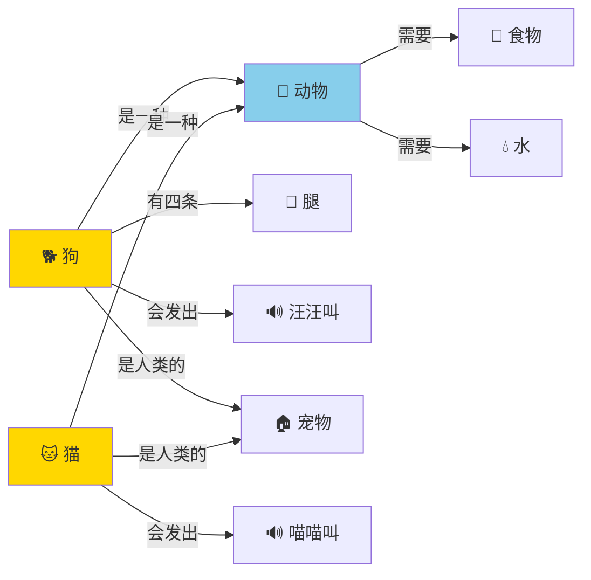

# 知识表示：让AI理解"世界是什么样"

你有没有想过，《原神》里的NPC为什么能回答你的问题？比如你问"蒙德城在哪"，NPC不会一脸茫然，而是能告诉你"往北走，看到大风车就到了"。NPC怎么"知道"蒙德城在哪？它脑子里存了什么？

这就是**知识表示（Knowledge Representation）**——AI领域里一个根本性的问题：如何让计算机"理解"和"存储"关于世界的知识，并在需要时能够推理和使用这些知识。

---

## 什么是知识表示？

人类大脑存储知识的方式非常灵活。你知道"狗是动物"、"狗有四条腿"、"狗会汪汪叫"、"狗是人类的宠物"——这些知识在你大脑里不是孤立存储的，而是相互连接、可以推理的。

比如我问你："猫会汪汪叫吗？"你不需要专门学过"猫不会汪汪叫"这条知识。你的大脑会这样推理：猫是猫科动物，叫声是喵喵叫，汪汪叫是狗的叫声，所以答案是"不会"。

这就是**推理**——从已知的知识中推导出新的知识。

而知识表示要解决的问题就是：**如何用一种结构化的方式把这些知识告诉计算机，让计算机也能做这样的推理？**

---

## 知识的四种"存档格式"

在AI领域，人们发明了多种知识表示的方法。我们来逐一认识它们。

### 方法一：语义网络 —— 用关系连接一切

语义网络是最直观的知识表示方法。它把知识看成一张图：**节点是概念，边是概念之间的关系**。



这张图里，计算机不仅知道"狗是动物"，还能通过链式推理得出："狗需要食物"（因为狗是动物，动物需要食物）。

语义网络的优点是直观——它和我们人类的联想记忆很像。你在现实中也是这样的：提到"狗"，你脑子里就自动蹦出一串相关概念："动物、宠物、汪汪叫、遛狗、狗粮......"

### 方法二：框架系统 —— 给每个概念填一张"档案卡"

框架（Frame）就像一个角色属性面板。玩过《原神》的同学都知道，每个角色都有一张属性卡：名字、等级、元素、武器、生命值、攻击力......

框架表示法就是这个思路：给每类事物定义一张"档案卡"，卡上有各种"槽位"（slot），槽位里填具体的值。

```
框架名: 狗
├── 上位概念: 动物
├── 腿的数量: 4
├── 叫声: 汪汪叫
├── 食性: 杂食
├── 与人关系: 宠物
├── 默认技能: [看门, 捡球, 摇尾巴]
└── 子类: [金毛, 哈士奇, 柯基, 柴犬]
```

框架的好处是结构清晰，而且支持**继承**——"柯基"自动继承"狗"的所有属性，只需要在柯基自己的框架里填上"腿短"这个特殊属性就行了。

这就跟面向对象编程里的"类"和"对象"很像。实际上，面向对象编程的思想就部分来源于AI领域的框架系统。

### 方法三：一阶逻辑 —— 用数学语言写"知识"

这是最严谨、但也最难懂的方式。它的思路是：把所有知识都翻译成数学逻辑语句。

比如"所有狗都是动物"，翻译成逻辑语言：

```
∀x (Dog(x) → Animal(x))
读作：对于任意x，如果x是狗，那么x是动物
```

再比如"小明养了一只叫旺财的狗"：

```
∃x (Dog(x) ∧ Name(x, "旺财") ∧ Owns(小明, x))
读作：存在一个x，x是狗，x叫旺财，小明拥有x
```

这种方式的优点是可以进行**严密推理**：如果"所有狗都是动物"且"旺财是狗"，那么计算机可以严格推导出"旺财是动物"。不会出错，没有歧义。

但缺点也很致命：真实世界的知识太复杂了，用逻辑语言描述整个世界的工作量是天文数字。而且很多日常知识是模糊的——"今天有点热"——这在逻辑系统里很难表示。

### 方法四：知识图谱 —— 站在巨人的肩膀上

知识图谱是近年最火的表示方法，也是Google、百度等搜索引擎背后的核心技术。它本质上是一个巨大的语义网络，包含数以亿计的实体和关系。

```
                              ┌──────────┐
                              │  苹果公司  │
                              └────┬─────┘
                                   │ 创始人
                              ┌────▼─────┐
          ┌────────────────────│ 史蒂夫·乔布斯 │────────────────────┐
          │ 出生地             └────┬─────┘                      │ 创立
          ▼                        │ 配偶                         ▼
    ┌──────────┐              ┌────▼─────┐                ┌──────────┐
    │ 加利福尼亚 │              │ 劳伦·鲍威尔 │                │ 皮克斯动画 │
    └──────────┘              └──────────┘                └──────────┘
```

知识图谱的威力在于：它不仅存储了知识，还能推理出新知识。比如Google搜索"乔布斯的妻子"时，它通过关系链 `乔布斯 → 配偶 → 劳伦·鲍威尔` 就能直接告诉你答案，而不是给你一堆网页让你自己去找。

---

## 知识表示的三大挑战

听起来很美好对吧？但实际上，知识表示是AI领域最困难的问题之一。主要有三个挑战：

**挑战一：知识的规模**

世界上的知识太多了。维基百科有几千万个条目，而且每天都在增长。想想看，你需要告诉AI"天空是蓝的""水会往下流""人有两只眼睛""太阳东升西落"......这还没算那些更专业的知识。这个工程量简直是天文数字。

**挑战二：常识推理**

AI最大的软肋不是不会算微积分，而是缺少**常识**。人类有一些不言自明的常识："如果你把杯子打翻了，里面的水会洒出来""一个人不可能同时在两个城市""如果下雨了，地面会湿"。

这些常识人类从来不觉得需要"学"，但对AI来说，这些都是需要显式编码的知识。CYC项目（1984年启动，至今仍在进行）的目标就是手工输入全人类的常识——几十年来，他们已经输入了数百万条常识规则，但距离"覆盖人类常识"还差得很远很远。

**挑战三：不确定性和模糊性**

人类可以处理模糊的知识："今天可能会下雨""他好像不太高兴""这道菜有点咸"。但传统的知识表示要求精确——"要么下雨要么不下"，没有中间状态。

后来的概率知识表示（比如贝叶斯网络）部分解决了这个问题，但这仍然是一个活跃的研究领域。

---

## 🎮 类比理解

知识表示就像你在游戏里构建世界观：

- **语义网络** 像《原神》里的任务关系图——每个角色都和其他角色有各种关系（朋友、仇人、师徒），你可以顺着关系链推理："公子是愚人众执行官 → 愚人众至冬国的组织 → 所以公子和至冬国有关"。
- **框架系统** 像角色属性面板——每个角色有固定的属性槽位（HP、攻击、防御、元素），新获得的角色自动继承基础属性框架。
- **知识图谱** 像《我的世界》的合成表——你知道"木板 + 木棍 = 镐"，"镐 + 钻石 = 钻石镐"。这些合成关系组成了一张大网，你可以顺着这张网推理出"要造钻石镐需要什么原材料"。
- **一阶逻辑** 像游戏的底层物理引擎——定义了严格的规则："如果一个方块下方没有支撑，它就会往下掉"。这些规则严谨无误，但全部手写是不可能的（Minecraft的世界太大了）。

---

## 💡 本章彩蛋

**CYC的野心和遗憾**：CYC项目是AI史上最野心勃勃的项目之一。它从1984年开始，目标是手动输入全人类的常识知识——"水是湿的""人需要吃饭""鸟有翅膀"。40年过去了，CYC确实存了几百万条常识，但面对ChatGPT这种从海量文本中自动学习知识的模型，手工编码常识的方式显得越来越力不从心。

**Google知识图谱的诞生**：2012年，Google推出了知识图谱功能。背后的直接原因是——Google发现超过16%的搜索查询从未被搜索过，用传统的"关键词匹配网页"的方法无法处理复杂的语义查询。比如搜索"汤姆·克鲁斯的身高"和"汤姆·克鲁斯的电影"，传统搜索给你一样的网页列表，而知识图谱能直接给你不同的精准答案。

**思考题**：如果让你设计一个"游戏NPC的知识系统"，你会用哪种知识表示方式？是给每个NPC写一个框架（属性面板），还是构建一个NPC之间的关系图，还是用逻辑规则？它们各有什么优缺点？
