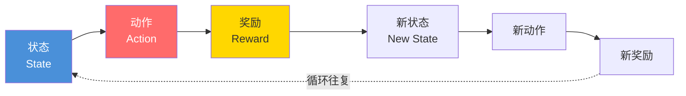

# 强化学习：让AI在"摸爬滚打"中成长

你有没有想过，AlphaGo是怎么从零开始学会下围棋，最终打败世界冠军李世石的？不是人类给它看了几百万份棋谱（那是监督学习），而是它**自己跟自己下了几百万盘棋**，在一次次输赢中自己摸索出了最佳走法。

这就是**强化学习（Reinforcement Learning）**——最接近人类"在实践中学习"的AI范式。你不告诉AI"正确答案是什么"，你只告诉它"这样做是好的（奖励），那样做是坏的（惩罚）"，剩下的让它自己探索。

---

## 什么是强化学习？一个钻石到王者的故事

想象你第一次玩《王者荣耀》。你什么都不会——你不知道什么时候该上、什么时候该跑、什么是补兵、什么是gank。

第一局，你见人就冲——0杀10死。输了。（惩罚）

第二局，你学乖了一点——等等，等队友来了再冲。1杀5死。还是输了，但比上一次好了。（进步）

第十局，你已经摸出了规律——前期猥琐发育，中后期等队友开团再上。5杀3死。赢了！（奖励）

第一百局，你已经能根据局势判断该带线还是参团、什么时候能越塔、什么时候该撤退。你的段位从钻石升到了王者。

这个过程中，你做的事情就是强化学习的精髓：

```
              ┌──────────────┐
              │   环境（游戏）  │
              └──┬───────┬──┘
         状态     │       │  奖励/惩罚
    （看到敌人）   │       │  （赢了+1 / 死了-1）
              ┌──▼───────▼──┐
              │    你（AI）   │
              └──────┬──────┘
                     │
                 动作（冲上去/撤退/发信号）
```



这张图就是强化学习的经典框架——**智能体（Agent）** 在**环境（Environment）** 中不断做动作，环境给它反馈（奖励或惩罚），智能体根据反馈调整自己的策略。

---

## 强化学习的四大要素

| 要素 | 符号 | 游戏中的含义 | 强化学习中的含义 |
|------|------|------------|----------------|
| **状态（State）** | S | 你看到的游戏画面：英雄位置、血量、小地图 | 环境在某一时刻的完整描述 |
| **动作（Action）** | A | 你可以做的操作：移动、攻击、放技能、回城 | 智能体在当前状态下可以做的事 |
| **奖励（Reward）** | R | 击杀+1、死亡-1、推塔+3、胜利+10 | 环境对动作好坏的评价 |
| **策略（Policy）** | π | 你的"游戏理解"：见人就跑 vs 见人就打 | 从状态到动作的映射规则 |

强化学习的终极目标：**找到一个最优策略π\*，使得长期累积奖励最大化**。

注意"长期"这个词——这非常关键。如果你只看眼前奖励（"吃个血包回50血，爽！"），可能会错过更大的长期奖励（"忍住不吃血包、继续蹲草丛，等敌人来了秒杀他，+300金币！"）。

这就是强化学习中最核心的权衡：**探索（Exploration）vs 利用（Exploitation）**。

- **利用**：用你已经掌握的策略，做最有把握的事。就像你只玩最擅长的英雄，稳稳当当。
- **探索**：冒险尝试新策略，看看有没有更好的。就像你尝试一个新英雄，可能被打爆，也可能发现新本命。

强化学习的艺术就在于：在该"稳"的时候稳，在该"浪"的时候浪。

---

## Q-Learning：AI的"经验笔记本"

Q-Learning是强化学习中最经典、最直观的算法。它的核心是一张叫**Q表（Q-Table）** 的大表格。

想象你为《原神》里的每个战斗场景维护一张"策略评分表"：

```
          │ 普通攻击 │ 元素战技 │ 元素爆发 │ 闪避    │ 切换角色 │
──────────┼─────────┼─────────┼─────────┼────────┼─────────┤
敌人远处   │  +0.1   │   +5.0  │   +2.0  │  +0.5  │   +8.0  │
敌人近处   │  +3.0   │   +6.0  │   +0.5  │  +7.0  │   +4.0  │
BOSS放大招 │  +0.1   │   +0.5  │   +1.0  │  +9.0  │   +2.0  │
队友倒了   │  +1.0   │   +3.0  │   +8.0  │  +4.0  │   +9.0  │  ← 切换角色救队友！
```

每个格子里的数字就是**Q值**，代表"在当前状态下，做这个动作有多好"。

Q-Learning的训练过程是这样的：

**1. 初始化**：Q表里所有值都是0（一片空白，什么都不懂）

**2. 每局游戏循环**：
- 观察当前状态（比如"敌人在远处"）
- 选择一个动作（有时候选Q值最高的，有时候随机乱选——这就是"探索"）
- 执行动作，观察结果：得到了多少奖励？进入了什么新状态？
- 更新Q表：

```python
# Q-Learning的核心更新公式
新的Q值 = 旧的Q值 + 学习率 × (
    即时奖励 + 折扣因子 × 新状态下所有动作的最大Q值 - 旧的Q值
)
```

翻译成大白话就是：
> 我之前觉得这个动作值 X 分。实际做了一下，得了 R 分奖励，而且接下来最好的动作值 Y 分。那我更新一下：这个动作的实际价值大概是 R + Y（但要打个折扣，因为未来的奖励不如眼前的靠谱）。如果实际价值比我之前估计的高，我就调高一点；比我估计的低，就调低一点。

**3. 重复**：玩几万局甚至几百万局后，Q表里的值逐渐稳定——AI学会了每个状态下最优的动作。

---

## 用Python实现一个简易Q-Learning

来写一个"迷宫里找出口"的Q-Learning小例子：

```python
import numpy as np
import random

# 4x4 迷宫，0=路, 1=终点, -1=陷阱
maze = [
    [0, 0, 0, -1],
    [0, -1, 0, -1],
    [0, 0, 0, 0],
    [-1, 0, -1, 1]
]

# 动作: 0=上, 1=下, 2=左, 3=右
actions = [(-1,0), (1,0), (0,-1), (0,1)]

# Q表: 4x4个格子 × 4个动作
Q = np.zeros((4, 4, 4))

# 超参数
learning_rate = 0.1
discount = 0.9
epsilon = 0.1  # 10%的概率随机探索

for episode in range(1000):
    x, y = 0, 0  # 起点
    while maze[x][y] != 1 and maze[x][y] != -1:
        # 选动作: epsilon-贪心策略
        if random.random() < epsilon:
            action = random.randint(0, 3)
        else:
            action = np.argmax(Q[x, y])

        # 执行动作
        nx, ny = x + actions[action][0], y + actions[action][1]

        # 撞墙了，保持在原位，给负奖励
        if not (0 <= nx < 4 and 0 <= ny < 4):
            nx, ny = x, y
            reward = -1
        else:
            reward = maze[nx][ny]  # 终点=1, 陷阱=-1, 空地=0

        # Q-Learning更新公式
        Q[x, y, action] += learning_rate * (
            reward + discount * np.max(Q[nx, ny]) - Q[x, y, action]
        )

        x, y = nx, ny

# 看看AI学到的路径
x, y = 0, 0
path = [(x, y)]
while maze[x][y] != 1:
    action = np.argmax(Q[x, y])
    x += actions[action][0]
    y += actions[action][1]
    path.append((x, y))
print(f"AI找到的路径: {path}")
```

---

## 深度强化学习：当Q表不够用了

Q-Learning有个致命问题：现实世界太复杂，状态多到根本建不了表。

比如《王者荣耀》——光是屏幕上的像素组合就是天文数字，更别说包含了英雄位置、血量、技能冷却、小地图等全部信息。Q表的大小会超过宇宙中的原子总数。

这时候**深度Q网络（DQN）** 出场了。它不再用一张大表格，而是**用一个神经网络来"近似"Q函数**——输入一个状态，网络直接输出每个动作的估计价值。

2015年，DeepMind用DQN玩了49款雅达利游戏，在29款上超越了人类专业玩家。AI甚至自己发明了一些人类从未想到过的策略——比如在《打砖块》游戏里，AI发现把球打到砖块墙的顶部（从上面"挖隧道"）比从下面打更高效——这个技巧连游戏开发者自己都不知道。

2017年，DeepMind的AlphaGo Zero完全**不靠任何人类棋谱**，只靠自我对弈强化学习，3天就超越了打败李世石的AlphaGo版本，21天超越了AlphaGo Master——达到人类无法企及的围棋水平。

---

## 强化学习在现实中的应用

强化学习不仅仅用来打游戏。它的应用正在快速扩展到现实世界：

- **自动驾驶**：Waymo让AI在模拟器里开几百万小时的车（撞车了也没关系），学会开车后再迁移到真车上。
- **机器人控制**：波士顿动力的机器人通过强化学习学会了后空翻——用传统编程根本无法写出让双足机器人翻跟头的控制指令。
- **大语言模型对齐**：ChatGPT训练的最后一步叫RLHF（基于人类反馈的强化学习）——人类评判员给ChatGPT的回答打分，AI根据分数调整自己，让回答越来越符合人类偏好。
- **芯片设计**：Google用强化学习设计TPU芯片的布局——原来人类工程师需要几周的工作，AI几个小时就完成了，而且设计出的芯片性能更好。
- **能源优化**：DeepMind用强化学习优化了Google数据中心的冷却系统，节省了40%的冷却能耗。

---

## 🎮 类比理解

强化学习就像三种不同的游戏训练方式：

- **Q-Learning** 像你在笔记本上自己画一张"对局策略表"——《原神》里打每个BOSS你都记下"这招要闪避""这招可以硬吃""这个时机放元素爆发最赚"。刚开始表是空的（总是翻车），打了几十次后表填满了（能无伤通关了）。
- **DQN（深度强化学习）** 像一个"游戏直觉"——你不再查表，而是凭"感觉"判断。看到BOSS抬手你就本能地按闪避，不需要思考"根据Q表第37行第4列，我应该......"这个"感觉"就是一个神经网络在你脑子里训练出来的。
- **AlphaGo Zero** 像一个永动机选手——它不需要看任何人的比赛录像，就自己跟自己下棋。今天"执黑的我"想出了一种新走法，"执白的我"想办法破解它。破解了之后黑方再想新办法——如此循环往复，水平不断提高。

---

## 💡 本章彩蛋

**OpenAI捉迷藏的惊人发现**：2019年，OpenAI让一群AI智能体在一个模拟环境中玩捉迷藏。没有任何人事先教它们任何策略，只有奖励（躲好了加分，找到了加分）。结果AI自己"发明"了一连串越来越高级的策略：

1. 追逐者学会了**追逐**，躲藏者学会了**逃跑**
2. 躲藏者学会了**用箱子搭墙**把自己关起来
3. 追逐者学会了**跳上箱子翻过去**
4. 躲藏者学会了**把箱子锁在原地**（利用物理引擎的bug）
5. 追逐者又学会了**利用另一个bug跳到箱子上面滑过去**

所有这一切都不是人教的——全是"追到就奖励、被追到就惩罚"这两个简单规则下，AI自己创新出来的。

**AlphaGo的"第37手"**：2016年AlphaGo对阵李世石的第二局，AlphaGo下出了震惊围棋界的第37手——在棋盘正中央落了一子。所有人类解说员都以为AI犯错了，因为这步棋看起来完全不符合围棋常识。但几十步之后，这枚棋子成为了整盘棋局势的关键。这是强化学习创造的策略，超越了人类几千年的围棋经验积累。

**思考题**：如果你用强化学习训练一个《王者荣耀》AI，你会怎么设计奖励函数？杀一个人给几分？死一次扣几分？推一座塔给几分？拆掉水晶给几分？你会发现奖励函数的设计直接决定了AI的打法风格——如果杀人奖励太高，AI可能会变成一个"抢人头不推塔"的毒瘤玩家。
