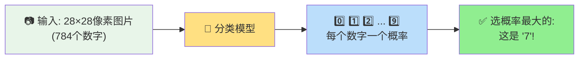
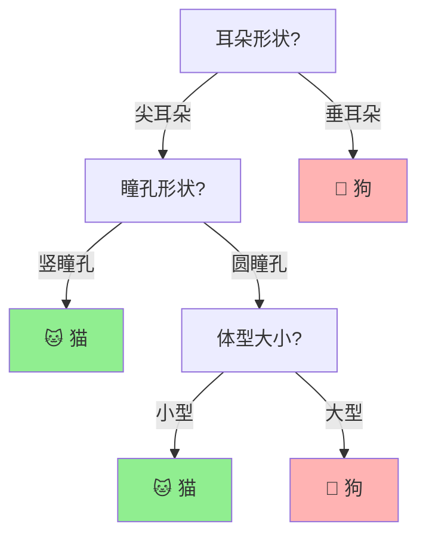

# 监督学习：给AI一本带答案的练习册

你有没有想过，手机相册是怎么自动认出照片里哪张是猫、哪张是狗的？你明明没有教过它——你只是拍了照片，它自己就学会了分辨。

这背后就是**监督学习（Supervised Learning）**——机器学习中最基础、应用最广泛的一类方法。它的核心思想简单到让你惊讶：**给AI一本带标准答案的练习册，让它自己从题目和答案中找规律**。

---

## 什么是监督学习？一个考试的故事

想象你要准备一场关于"分辨猫和狗"的考试。你拿到了一本练习册，里面有10000张动物照片，每张照片下面都有标准答案——写着"猫"或"狗"。

你不会去背每一张照片（因为你不知道考试会考哪些新照片），而是尝试总结规律：

- 猫的耳朵通常是尖的、竖起来的；狗的耳朵通常是下垂的、圆圆的
- 猫的眼睛瞳孔是竖椭圆；狗的瞳孔是圆的
- 猫的鼻子小小的、粉色的多；狗的鼻子通常大一些、黑色的多
- 猫的脸型更圆；狗的嘴部更突出

看得多了，你脑子里就形成了一个"猫狗分类器"。考试的时候，你看到一张新照片，这些规律自动激活，你就能判断了。

**监督学习做的就是一模一样的四件事**：

1. 收集大量"照片+标签"的数据集（训练集）
2. 让模型看这些数据，自己总结规律（训练）
3. 用模型没见过的数据测试它（测试）
4. 如果准确率够高，部署到实际应用中去（推理）

---

## 监督学习的两大任务：分类和回归

监督学习内部，根据"答案是什么类型"，又分为两大类。

### 分类（Classification）：做选择题

答案是一个**类别标签**，从有限的几个选项中选一个。

| 场景 | 输入（特征） | 输出（标签） |
|------|------------|------------|
| 猫狗识别 | 一张照片 | "猫"或"狗" |
| 垃圾邮件过滤 | 一封邮件的内容 | "正常"或"垃圾" |
| 手写数字识别 | 手写数字的图片 | 0~9中的一个 |
| 情感分析 | 一条电影评论 | "正面"或"负面" |

分类的"Hello World"是**手写数字识别**——MNIST数据集。它包含70000张28x28像素的手写数字图片，每张都标注了是0到9中的哪个数字。用最简单的算法训练，准确率就能达到95%以上。



### 回归（Regression）：做填空题

答案是一个**连续的数字**，不是一个类别。

| 场景 | 输入（特征） | 输出（预测值） |
|------|------------|--------------|
| 房价预测 | 面积、地段、房龄、楼层 | 预估成交价（比如532万） |
| 成绩预测 | 平时成绩、出勤率、作业完成率 | 预估期末考试分数 |
| 天气预测 | 气压、湿度、风向、温度 | 明天最高温度 |
| 身高预测 | 父母身高、性别、营养状况 | 成年后预估身高 |

回归的经典例子是**房价预测**：给你1000条历史成交记录（每套房子的面积、卧室数量、地段评分、房龄，以及实际成交价格），让你预测一套新挂牌的房子的成交价。

模型在学习过程中会发现各种规律，比如："每多一个卧室，价格大约涨15%"、"房龄每多一年，价格大约降2%"、"在市中心，面积每增加一平，价格涨得更快（因为在市中心寸土寸金）"。

---

## 监督学习的三大经典算法

### 算法一：K近邻（K-Nearest Neighbors, KNN）—— "跟谁在一起就像谁"

这是最简单的分类算法，甚至不需要"训练"。

原理：一个新的数据点来了，看看离它最近的K个已知数据点是哪类，少数服从多数。

```
新照片 ★ 的类别怎么判断？（K=3）

  🐱  🐱       ← 最近的两个邻居是猫
     ★         ← 新照片
  🐶           ← 第三个最近的邻居是狗

结果：2票猫 vs 1票狗 → 判断为 🐱！
```

KNN就像转学到一个新班级——你想知道自己会被分到哪个学习小组？看看你周围坐的三个同学都在哪个小组，大概率你也去那个组。

### 算法二：决策树（Decision Tree）—— "做20个判断题"

决策树就是一连串的判断题："是不是尖耳朵？→ 是 → 瞳孔是不是竖的？→ 是 → 这是猫！"



决策树的好处是**可解释性**——你完全知道AI为什么做出这个判断。它就像《王者荣耀》的出装决策树："你是法师吗？→ 是 → 对面魔抗高吗？→ 高 → 出法穿棒。"

### 算法三：逻辑回归 — "算一个概率"

别看它名字里带"回归"，它主要是做**分类**用的。逻辑回归会给每个样本打一个0到1之间的分数，表示"属于某一类的概率"。

比如判断一封邮件是垃圾邮件的概率：
- 出现"中奖" → 概率+30%
- 出现"免费" → 概率+20%
- 发件人在通讯录里 → 概率-40%
- 有正常排版和签名 → 概率-20%

最终得分：如果是70%，超过阈值（比如50%），就标记为垃圾邮件。

---

## 训练一个分类器的完整流程

以猫狗分类为例，整个流程是这样的：

```
步骤1: 收集数据
├── 5000张猫的照片（每张标注"猫"）
└── 5000张狗的照片（每张标注"狗"）

步骤2: 划分数据
├── 训练集：8000张（用来学习）
└── 测试集：2000张（用来考试）

步骤3: 训练模型
├── 把训练集的照片喂给模型
├── 模型预测 → 和标签对比 → 算误差
└── 根据误差调整模型参数（反复N次）

步骤4: 测试模型
├── 用测试集的2000张照片考它
└── 正确率 95%？→ 可以部署！
    正确率 60%？→ 回去继续训练或改进模型

步骤5: 部署
└── 把训练好的模型嵌入到手机相册APP里
```

---

## 过拟合：当AI变成了"死记硬背的书呆子"

监督学习中最常见的陷阱就是**过拟合（Overfitting）**——模型把训练集"背"得太熟了，失去了举一反三的能力。

打个比方：你在《王者荣耀》里一直只玩一个英雄——后羿。你把后羿的操作练得滚瓜烂熟，排位也打到了星耀。但有一天后羿被ban了，你被迫玩鲁班——结果发现自己完全不会。因为你"过拟合"了后羿，而没有学会"射手这个位置"的通用打法。

过拟合的AI也一样：它记住了训练集里每一张猫照片的具体样子（"这张照片的猫，左耳朵有块黑斑"），而不是学会了"猫的通用特征"。面对一张新猫的照片，它就懵了。

解决方法：
- **更多数据**：给它看更多样化的猫照片
- **数据增强**：把现有的猫照片翻转、旋转、调颜色——相当于一本练习册变三本
- **正则化**：给模型加"罚单"——你不许记得太细，记太细就扣分
- **Dropout**：训练时随机"关掉"一部分神经元，强制模型不要依赖某一个特征

---

## 🎮 类比理解

监督学习就像三种不同的游戏攻略方式：

- **K近邻（KNN）** 像在《原神》里，你不知道一个怪怎么打，就问身边的朋友——"你们三个遇到这个怪怎么打的？"两个说用火元素、一个说用水元素，你就用火元素打。你不需要理解为什么，跟着多数人走就行。
- **决策树** 像《我的世界》合成表——"要造一把钻石剑？先要有木棍和两块钻石 → 木棍怎么造？两个木板竖排 → 木板怎么来？砍树。"每一步都是一个判断题，顺着问到底就能找到答案。
- **逻辑回归** 像《王者荣耀》的段位评分——每场对局的表现不只看输赢，还看KDA、参团率、经济转化率，综合算出一个"综合实力评分"。评分超过一定阈值就升段。

---

## 💡 本章彩蛋

**ImageNet的故事**：2009年，斯坦福的李飞飞团队发布了ImageNet数据集——包含超过1400万张手工标注的图片，覆盖2万多个类别。2012年，一个叫AlexNet的深度学习模型在ImageNet竞赛中把错误率从前一年的26%降到了16%——震惊了整个AI界，也开启了深度学习的热潮。所以说，监督学习的成功离不开两样东西：**海量标注数据**和**强大的模型**。

**标注数据的代价**：你手机相册能自动分类"猫""狗""风景""食物"，是因为有人在背后一张一张地标注了数百万张照片。标注一张照片可能要5秒钟，标注100万张就是500万秒——约等于58天不吃不喝不睡。这就是为什么高质量的标注数据集如此珍贵。

**思考题**：如果你要做一个"判断《原神》圣遗物好坏"的监督学习系统，你会收集什么特征？标签是什么？你觉得这种问题适合用分类还是回归？
