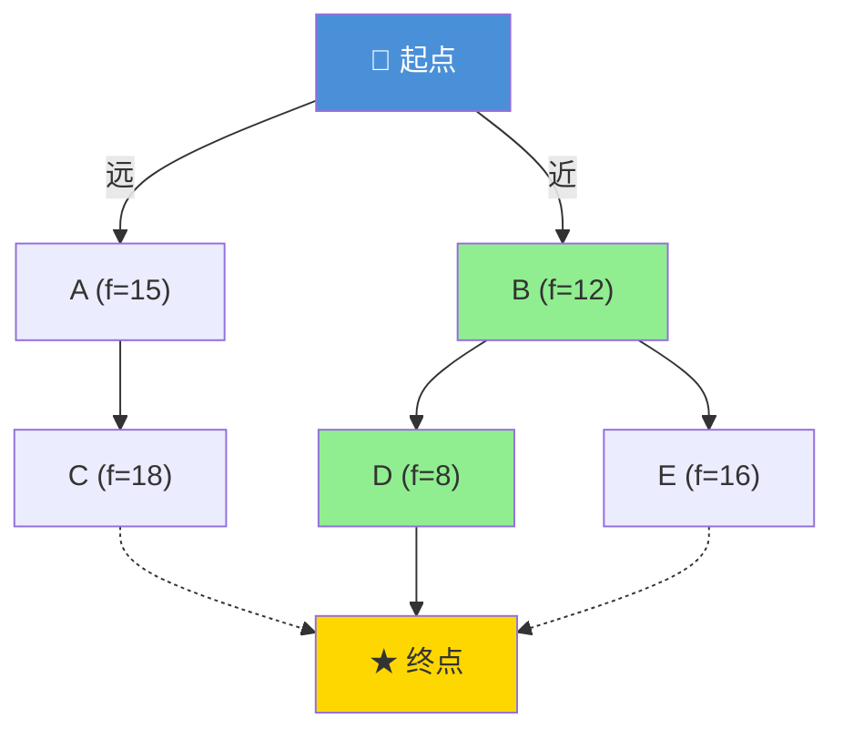

# 符号搜索：让AI学会"找路"

你有没有想过，当你在《原神》里点一下地图上的传送点，角色就自动翻山越岭跑过去了——游戏是怎么算出那条路径的？为什么它不会带着你往悬崖下面跳？为什么它选的路总是最短的？

这背后就是AI最经典的技术之一：**符号搜索（Symbolic Search）**。它是人工智能的"元老级"技术，诞生于20世纪50年代，但直到今天，你的手机导航、游戏寻路、物流路线规划，全都还在用它的思想。

---

## 什么是符号搜索？

一句话概括：**给定一个起点和一个终点，在一张"地图"上找到最优路径**。

这里的"地图"不一定是真实的地图，而是一个**状态空间**。每个"位置"就是一个状态，每次"移动"就是状态之间的转换。搜索算法的任务就是：从起点状态出发，通过一系列操作，最终到达目标状态。

举个最简单的例子：你在《我的世界》里要从家走到矿洞。途中有些地方是水（能走但慢），有些地方是岩浆（不能走），有些是平地（最好走）。你脑子里就在做一个搜索——"走这条路近但有两格岩浆要绕，走那条路远一点但全是平地......"

这就是搜索算法的本质：在有限的可能性中，找到最优的那条路。

---

## 三种搜索策略

AI中有三种经典的搜索算法，分别代表了三种"找路哲学"。

### 策略一：地毯式搜索（广度优先搜索 BFS）

想象你是一个探险队长。到了一个迷宫入口，你命令队员："所有人同步前进，每走一步就向我汇报！"

每到一个岔路口，你的队伍就分成几队，各走一条路。关键规则：**所有队伍必须同步，一次只走一步**。

```
          起点 (第0层)
         /        \
      (1,0)      (0,1)    ← 第1层：两条路都走
      /   \      /   \
   (2,0) (1,1)(1,1)(0,2) ← 第2层：四个方向同时探索
     |     |    |     |
    ...   ...  ...  终点!  ← 最先遇到终点的层，就是最短路径！
```

BFS的最大优点是：**保证找到的路径一定是最短的**（因为没有更短的路径能"跳过"某一层先到终点）。缺点是需要同时记住很多"正在探索中的路"，地图大了内存会爆炸。

### 策略二：一条道走到黑（深度优先搜索 DFS）

这次你不派队伍了，自己一个人走。策略很简单：遇到岔路口就随便选一条，闷头走到底。走不通了？退回到上一个岔路口，换一条继续。

```
起点 → A → C → C是死路！
      ↑退回A
      → D → D是死路！
      ↑退回起点
起点 → B → E → E是死路！
      ↑退回B
      → ★ 找到终点了！（但这可能不是最短的路）
```

DFS省内存（你只需要记住"当前走的路"和"怎么退回去"），但找到的路径不一定是最近的——你可能会绕远路。

### 策略三：开着天眼找路（A\* 算法）

现在你获得了一个"小地图"作弊器——你能看到终点在哪个方向。你不再是盲目探索，而是优先走那些"方向对、距离近"的路。



这就是**A\*算法**的核心思想。它用一个公式来评估每条路的好坏：

```
f(n) = g(n) + h(n)

g(n) = 从起点走到当前位置，已经走了多远
h(n) = 从当前位置到终点，估计还剩多远（"启发函数"）
f(n) = 走这条路的总代价估计值
```

A\*每次都优先探索 f(n) 最小的节点——也就是"看起来总代价最低"的方向。因为它有"方向感"（h(n)提供的预估值），它比BFS少探索很多没用的路，同时还能保证找到最优路径（前提是h(n)不能高估剩余距离）。

---

## 核心概念速查表

| 概念 | 游戏中的类比 | 搜索里的含义 |
|------|------------|------------|
| **状态（State）** | 你在地图上的坐标 | 问题在某一时刻的快照 |
| **操作（Operator）** | 你可以向上下左右走一格 | 从一个状态到另一个状态的动作 |
| **状态空间** | 整张游戏地图 | 所有可能状态的集合 |
| **目标测试** | 检查"我到了吗？" | 判断当前状态是否是目标 |
| **代价（Cost）** | 走一格消耗的体力 | 执行操作付出的代价 |
| **启发式（Heuristic）** | 朝远处的高塔走，感觉方向对 | 对剩余距离的经验性估计 |

---

## 启发式搜索的智慧

"启发式"（Heuristic）这个词来自希腊语"heuriskein"，意思是"发现"或"找到"。在AI里，它代表一种**凭经验猜**的智慧——不是100%准确，但大多数时候能帮你抄近道。

在《原神》里，如果你想去璃月港，你看到远处有高大的建筑群，你大概率会往那个方向走。这个"看到建筑就往那边走"的直觉，就是一个启发式。

好的启发式函数是A\*算法的灵魂。比如在平面地图上，**直线距离**就是一个很好的启发式——因为实际路径不可能比直线更短（这叫"可接受启发式"）。如果你用"随便猜一个数"当启发式，A\*就退化成了普通的搜索。

---

## 搜索算法在今天还重要吗？

有人说现在都是深度学习的时代了，搜索算法是不是过时了？完全不是。

- **AlphaGo下围棋**：本质上是在一个巨大的博弈树上做搜索——每步棋都是一条分支，AlphaGo用深度神经网络来"修剪"那些明显不好的分支，让搜索只集中在有希望的方向上。
- **ChatGPT生成文本**：每输出一个词，它都在"词汇空间"里搜索最合适的下一个词。
- **自动驾驶**：车辆在每一毫秒都在搜索"最优的下一秒操作"。
- **蛋白质折叠预测**：DeepMind的AlphaFold本质上也是在搜索蛋白质可能的三维结构空间。

搜索算法是AI大厦的地基。你不需要每次都用BFS解决问题，但理解搜索，你就理解了AI如何"思考"和"做选择"。

---

## 用Python体验BFS

来写一个简单的BFS，在一个5x5的网格里找路：

```python
from collections import deque

def bfs(grid, start, goal):
    rows, cols = len(grid), len(grid[0])
    queue = deque([(start, [start])])  # (当前位置, 路径)
    visited = {start}

    while queue:
        (x, y), path = queue.popleft()

        if (x, y) == goal:
            return path  # 找到了！

        # 探索上下左右
        for dx, dy in [(-1,0), (1,0), (0,-1), (0,1)]:
            nx, ny = x + dx, y + dy
            if 0 <= nx < rows and 0 <= ny < cols:
                if grid[nx][ny] != '#' and (nx, ny) not in visited:
                    visited.add((nx, ny))
                    queue.append(((nx, ny), path + [(nx, ny)]))

    return None  # 找不到路

# S=起点, G=终点, #=墙, .=路
grid = [
    ['S', '.', '.', '#', '.'],
    ['#', '#', '.', '#', '.'],
    ['.', '.', '.', '.', '.'],
    ['.', '#', '#', '#', '.'],
    ['.', '.', '.', '.', 'G']
]

result = bfs(grid, (0,0), (4,4))
print(f"路径长度: {len(result)} 步")
print(f"路径: {result}")
```

---

## 🎮 类比理解

搜索算法就像三种不同的游戏风格：

- **BFS** 像在《我的世界》里用创造模式飞行探索——你从出生点一层一层往外飞，系统地标记每一块区域，直到找到你要的村庄。你不会错过近处的任何东西，但地图大了之后就飞不过来了。
- **DFS** 像在《原神》里钻山洞——你沿着一条路走到黑，走到了死胡同就往回退，再从上一个岔路口走另一条。你可能钻了很深才找到出口，但这条路可能拐了很多弯。
- **A\*** 像在《王者荣耀》里你往敌方水晶走——你有小地图（启发式），你知道水晶在哪个方向，所以你大致朝那个方向走，同时遇到墙会绕，遇到草丛会探。你不会往回走，因为你知道方向是对的。

---

## 💡 本章彩蛋

**冷知识**：Dijkstra算法（A\*的前身）是Edsger Dijkstra在1956年喝咖啡时想出来的，他只花了20分钟就完成了设计和证明。他当时在荷兰的一个购物中心里，因为没有笔，他就在脑海中完成了整个推导。后来他说："这是我做过的最好的工作之一，而且我没花什么力气。"

**思考题**：如果《原神》的地图上有1000个传送点，每次点传送都需要算最短路径。你觉得游戏会用BFS、DFS还是A\*？为什么？（提示：想想每个算法的时间复杂度）

**动手做**：在纸上画一个10x10的网格迷宫，先用手模仿BFS走一遍（一层一层探索），再用DFS走一遍（闷头走到黑）。你会发现BFS的路径通常更短，但DFS找到出口的速度有时会更快（如果你运气好选了对的方向）。
