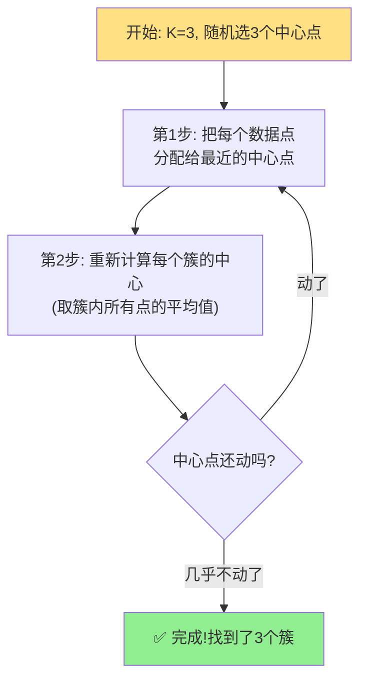

# 无监督学习：当AI没有答案可以参考

你有没有过这种经历：你妈让你收拾自己的房间。房间里乱七八糟——书本、衣服、零食、玩具、电子产品堆在一起。没有人告诉你"书应该放哪""衣服放哪"，但你本能地就开始分类了：书放到书架上，衣服叠好放衣柜，零食放抽屉里，充电线数据线放一起......

你在这个过程中做了什么？你在**没有标准答案的情况下，发现了事物之间的内在相似性**，并据此进行了分组。

这就是**无监督学习（Unsupervised Learning）**的核心——给AI一堆不贴标签的数据，让它自己找出隐藏的结构和规律。

---

## 有答案 vs 没答案：两种学习的本质区别

回顾一下，监督学习和无监督学习最根本的区别：

| 维度 | 监督学习 | 无监督学习 |
|------|---------|-----------|
| 数据标签 | 每条数据都有"标准答案" | 没有任何标签 |
| 学习目标 | 学会从输入推断输出 | 发现数据的内在结构 |
| 像什么 | 做带答案的练习册 | 自己整理乱房间 |
| 谁告诉你对错 | 标签（标注员） | 没有——算法自己判断 |
| 典型任务 | 分类、回归 | 聚类、降维、关联规则 |

监督学习需要人工标注，这很贵。想想看，给100万张医疗影像标注"有没有肿瘤"，需要经验丰富的放射科医生一张一张地看——成本极其高昂。而无监督学习不需要标注，给一堆数据就可以直接开干——这在实际应用中价值巨大。

---

## 聚类：把相似的东西放一起

**聚类（Clustering）** 是无监督学习中最经典的任务。它的目标很简单：把数据分成若干个"簇"（cluster），让同一簇内的数据尽量相似，不同簇之间的数据尽量不同。

### 现实中的聚类应用

- **B站/抖音的推荐系统**：几亿用户，每个人的喜好都不同。聚类算法自动发现了几类典型用户——"考研党""游戏党""美食党""鬼畜党"。你看了几个考研视频后，算法把你归入了"考研党"，然后给你推更多考研内容。
- **电商的客户分群**："高消费高频次"（VIP）、"高消费低频次"（大客户）、"低消费高频次"（活跃用户）、"低消费低频次"（流失风险）。运营团队对每类用户采取不同的营销策略。
- **基因分析**：根据基因表达模式自动发现不同类型的癌症亚型——有些癌症看起来显微镜下差不多，但基因层面是两种完全不同的病，治疗方案也应该不同。

---

## K-Means：最经典的聚类算法

K-Means是入门聚类必须理解的算法。它的思路出奇地简单，就像你把自己房间里的东西分成三堆：



我们来一步步拆解：

**第0步：选K值**。K-Means需要你先告诉它"我想分几类"（这个K值的选择本身就是一门学问）。假设你想把一堆散点分成3组，K=3。

**第1步：随机初始化**。随机选3个点作为初始"中心点"（质心）。就像你在房间地上随机放三个筐。

```
散点分布（*是数据点）：
   *    *
 *   *    *
   *  *  *
 *    *  *
 
随机3个中心点: ▲  ■  ★
```

**第2步：分配**。每个数据点"认领"离自己最近的中心点。就像你把每件东西扔进离它最近的那个筐。

```python
# 伪代码示意
for 每个数据点:
    找离它最近的中心点
    把它归入那个中心点的簇
```

**第3步：更新**。每个簇重新计算自己的中心点——"这个簇里所有数据点的平均值位置"。中心点会"移动"。

```python
for 每个簇:
    新中心 = 簇内所有点的坐标平均值
```

**第4步：重复**。回到第2步，用新的中心点重新分配。直到中心点几乎不再移动（说明已经稳定了）。

---

## K-Means的Python实现

来写一个简单的K-Means，将100个随机点聚成3类：

```python
import numpy as np
import matplotlib.pyplot as plt

# 生成100个随机点
np.random.seed(42)
points = np.random.randn(100, 2) * 2

def kmeans(data, k, max_iters=100):
    # 随机初始化K个中心点
    centers = data[np.random.choice(len(data), k, replace=False)]

    for _ in range(max_iters):
        # 第2步：分配 - 每个点找最近的中心点
        distances = np.sqrt(((data - centers[:, np.newaxis]) ** 2).sum(axis=2))
        labels = np.argmin(distances, axis=0)

        # 第3步：更新 - 每个簇的新中心是簇内点的平均值
        new_centers = np.array([data[labels == i].mean(axis=0)
                                for i in range(k)])

        # 如果中心点基本不移动了，就停止
        if np.allclose(centers, new_centers):
            break
        centers = new_centers

    return labels, centers

labels, centers = kmeans(points, k=3)
print(f"三个簇的点数: {np.bincount(labels)}")
```

---

## 如何选择K值？——"手肘法"

K-Means的一个关键问题是：**K取多少？**分3堆还是4堆？分太多太碎，分太少太粗。

"手肘法"（Elbow Method）是一种经验方法：你试试K=1, 2, 3, 4, 5...每个都算一次"总误差"（所有点到各自中心的距离和）。画成折线图：

```
总误差
  │
  │⧹
  │  ⧹
  │    ⧹___ ← "手肘"位置（K=3）
  │         ⧹___
  │              ⧹___
  └────────────────────── K
     1   2   3   4   5
```

你寻找折线图上"弯折"最明显的地方——那个看上去像"手肘"的位置。在这个点之前，增加K能显著降低误差；在这个点之后，增加K对降低误差的帮助越来越小（说明再增加K就是"过度细分"了）。

---

## 降维：把50维压成2维

无监督学习的第二个重要任务是**降维（Dimensionality Reduction）**。

想象你收集了全班50个同学的数据：语数外物化生政史地......每个同学有10科成绩——这就是10维数据。人类可以想象2维（平面）和3维（立体），但10维是什么样子，没有人能想象出来。

降维的目标就是：**在尽量保留原始信息的情况下，把高维数据"压缩"到低维空间**。

比如10科成绩，降维后可能发现只需要3个维度就能大致描述所有同学的差异：

```
维度1: "理科能力" (数学+物理+化学+生物)
维度2: "文科能力" (语文+英语+历史+政治+地理)
维度3: "学习态度" (所有科目的稳定性和进步趋势)
```

降维的实用价值巨大：
- **可视化**：把复杂数据画在2D平面上，人眼就能看出规律
- **去噪**：扔掉不重要的维度，往往留下的是最核心的信号
- **加速计算**：维度少了，后续的机器学习算法跑得更快

最经典的降维算法叫**PCA（主成分分析）**，它的核心思想是：找到数据里"方差最大"的方向——也就是数据分布最"散"的方向——作为第一主成分；然后找和它正交的、方差第二大的方向作为第二主成分，以此类推。

---

## 无监督学习的其他玩法

除了聚类和降维，无监督学习还有一些有趣的应用：

**关联规则挖掘**：经典的"啤酒和尿布"故事——超市发现买啤酒的男人通常会顺手买尿布（因为被老婆派出来买尿布，顺便给自己买啤酒）。无监督学习能从海量购物记录中自动发现"买了A的人有70%的可能也会买B"这类关联。

**异常检测**：信用卡公司用无监督学习来发现异常消费——"这个用户平时午餐消费30元左右，今天突然刷了一笔2万块的奢侈品"。算法没有标签（不知道哪些是"诈骗"），但通过统计规律发现这笔消费和用户的日常模式差异极大，自动标记为"可疑"。

**自编码器（Autoencoder）**：一种深度学习模型，试图"把输入变成自己的输出"——听起来很蠢，但在"压缩→还原"的过程中，模型自动学到了数据最核心的特征。这被广泛用于图像去噪、数据压缩等任务。

---

## 🎮 类比理解

无监督学习就像在游戏里做三件事：

- **聚类** 像你在《我的世界》里整理箱子——你把所有东西从背包倒出来，然后"矿石放这个箱子、食物放那个箱子、工具放那个箱子、建筑材料放那个箱子"。你不需要别人告诉你"铁锭应该和钻石放一起"——你自己就能发现它们都是"矿石类"。
- **降维** 像《原神》里角色的属性面板——每个角色有十几项属性（生命、攻击、防御、元素精通、暴击率、暴击伤害......），但评价一个角色时你通常只看几个核心维度："这是个主C（输出型）还是辅助？""他的伤害是高是低？""他适合打什么元素反应？"——你把十几维信息压缩成了"定位"和"强度"两个维度。
- **关联规则** 像《王者荣耀》的阵容搭配——算法发现"选了吕布的玩家，队友高概率会选貂蝉"（因为他们在游戏里是CP关系，玩家喜欢凑一对）。这不是任何人事先标注的，而是从几百万场对局数据中自动发现的。

---

## 💡 本章彩蛋

**"啤酒和尿布"是编的？** 这个数据挖掘领域最经典的段子，其实很可能是虚构的。但它的道理是真的——关联规则算法确实在零售业发现了大量反直觉的购买习惯，只是没有那么戏剧化。

**乐高的无监督分类**：假设你有5000块乐高积木混在一起（各种颜色、各种形状），你怎样快速把它们分类？你用无监督学习——先按颜色聚类（红的一堆、蓝的一堆），再在每堆里按形状聚类（方块、长条、特殊件）。实际上，这就是机器人在自动化工厂里分拣零件的基本逻辑。

**思考题**：你手机里的相册App自动按"人物"分类照片——它先要把照片里出现的所有人脸聚成若干个"身份"（同一个人在不同照片里的脸），但App不知道这些人叫什么名字。它怎么做到了"把同一个人的人脸归到一起"？这个过程中，标签（人名）是在什么时候出现的？
