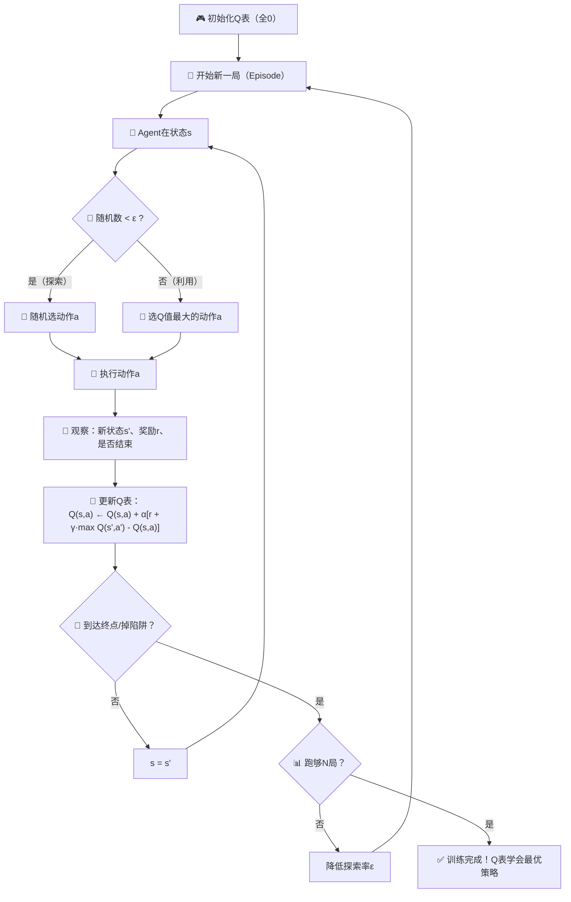
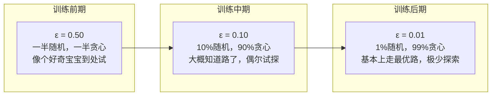

# 第12章：强化学习基础

## 🎯 读完本章你能...

理解强化学习的核心思想——让AI通过"试错"学会决策，掌握Q-Learning算法的完整推导，并能用20行Python代码让AI自己学会走迷宫。

## 📖 从一个故事开始

小明在玩一个从未玩过的游戏。游戏规则很简单：在一个5x5的棋盘上，从左上角出发，走到右下角就赢了。但棋盘上有陷阱，踩上去会扣分。更关键的是——没人告诉小明哪条路安全。他只能一次次尝试：第一次向右走，掉进陷阱，扣了10分；第二次向下走，平安无事，加1分；第三次...经过几十次尝试后，小明发现：先向下、再向右、遇到陷阱就绕开——他"学会"了通关。

这就是强化学习（Reinforcement Learning, RL）的核心思想：**Agent（小明）在Environment（棋盘）中不断尝试Action（上下左右），根据得到的Reward（加分/扣分）来调整自己的策略，最终学会最优行为**。

不同于监督学习需要正确答案，也不同于无监督学习只找规律——RL让AI像玩游戏一样，在"试错"中成长。AlphaGo下围棋、自动驾驶躲避障碍、ChatGPT对齐人类偏好，背后都有强化学习的影子。

本章我们不会一上来就讲AlphaGo，而是从一个"走迷宫"的小AI开始——它一开始什么都不知道，随机乱撞。你会亲眼看到，它是如何通过不断"踩坑→记教训→改策略"这个过程，最终变成迷宫大师的。

## 📖 原理讲解

### 12.1 强化学习的三要素：Agent、Environment、Reward

强化学习最核心的概念只有三个，理解了这个三角形，你就理解了RL的一半：

**Agent（智能体）**：做决策的"人"。它可以是游戏角色、机器人、推荐系统——任何需要通过"选择动作"来达成目标的实体。

**Environment（环境）**：Agent所处的世界。这个世界的规则是固定的（比如棋盘不会突然变大），但Agent不知道全部规则。

**Reward（奖励信号）**：环境给Agent的"反馈"。走对路+1分，掉陷阱-10分。Reward是RL中唯一的"老师"——Agent不需要正确答案，只需要知道"这么做是好是坏"。

用大白话说：**你（Agent）在一个陌生城市（Environment）里找好吃的，每吃一家餐厅你会得到一个评价（Reward）——好吃给正分，难吃给负分。你的目标是让总分最大。**

关键洞察：Reward告诉Agent"眼前这一步好不好"，但不告诉你"长远来看该怎么走"。这就是RL的核心难题——短期的好选择不一定是长期的好选择。比如：走捷径能快速到达，但可能错过打卡点（长期奖励更低）。

### 12.2 探索 vs 利用：RL的永恒矛盾

RL有一个经典的两难困境，就像你暑假面临的灵魂拷问：

- **探索（Exploration）**：去没去过的地方，尝试新东西。可能发现惊喜（一条更快的路），也可能踩雷（一条死胡同）。
- **利用（Exploitation）**：走已经确认安全的路线。可靠、稳当，但可能错过更好的选择。

想象你在学校门口选午餐：你最爱的那家兰州拉面从来没让你失望过（利用），但隔壁新开了一家螺蛳粉店，满街飘"香"——要不要尝试（探索）？

数学上，这个问题通常用 **ε-贪心策略（ε-greedy）** 来解决：
- 以概率 \(1-\varepsilon\) 选当前已知最好的动作（利用）
- 以概率 \(\varepsilon\) 随机选一个动作（探索）
- \(\varepsilon\) 通常开始时较大（如0.3），随时间逐渐减小（如降到0.01）

就像你刚转学到一所新学校：第一周到处逛、什么都试（高探索）。慢慢熟悉后，你就知道哪家食堂最好吃，开始固定去（高利用）。但偶尔还是要试试新窗口——万一出了新菜品呢？

### 12.3 Q-Learning：AI的"记忆笔记本"

现在进入核心算法。Q-Learning是一种**基于值函数**的RL方法。核心思想极其朴素：

**Q(s, a)** 代表"在状态s下做动作a，长期能拿多少分"。

你可以把Q想象成一张大表格，行是所有状态（比如"在棋盘的哪个格子"），列是所有动作（"向上/下/左/右"）。每个格子里填的数值就是Q值。

```
       向上    向下    向左    向右
格(0,0)  -100    0.5    -100    0.3
格(0,1)  -100    0.8    0.2     0.9
格(1,0)  0.3     0.1    -100    0.1
...
```

AI要做的就是**不断更新这张表**，让Q值越来越准确。等Q值准确了，策略就简单了：**在每个状态选择Q值最大的动作**。

### 12.4 Q-Learning的核心更新公式

这是本章最重要的公式。别看它长，逐符号解释后你会觉得非常合理：

\[
Q(s, a) \leftarrow Q(s, a) + \alpha \left[ r + \gamma \max_{a'} Q(s', a') - Q(s, a) \right]
\]

**逐符号大白话解释：**

- \(Q(s, a)\)：当前状态下做当前动作的"估值"
- \(\alpha\)（学习率，alpha）：学多快。\(0 < \alpha \leq 1\)，太大则"一惊一乍"不稳定，太小则学得太慢。类比：你对新信息有多"信"——是把旧经验全盘推翻，还是微调一下？
- \(r\)：刚刚拿到的即时奖励（走一步加1分，踩陷阱扣10分）
- \(\gamma\)（折扣因子，gamma）：对未来的"打折率"。\(0 \leq \gamma < 1\)。\(\gamma=0.9\)意味着"明天的1分只相当于今天的0.9分"——AI更看重近期奖励。类比：一个月后的100元和今天的100元，你选哪个？
- \(s'\)：做完动作a之后到达的新状态
- \(\max_{a'} Q(s', a')\)：在新状态s'下，所有可能动作里Q值最大的那个。这是AI对"未来最好情况"的估计
- 方括号整体 \(r + \gamma \max Q(s',a') - Q(s,a)\)：称为 **TD误差（Temporal Difference Error）**——"我原本以为做这件事值多少分"和"实际拿到的分+未来预期分"之间的差距。差距越大，说明我对这件事的判断越不准，越需要更新

**公式的直觉理解**：

新Q值 = 旧Q值 + 学习率 x（实际体验 - 预期）

就像你第一次去一家餐厅，本来预期打3分，结果吃得超好吃给了5分。那你对这家餐厅的评价就会往5分靠近：
新评价 = 3 + 0.5 x (5 - 3) = 4分

### 12.5 Bellman方程：Q-Learning背后的数学根基

Q-Learning不是凭空发明的，它背后有一个更深刻的数学原理——**Bellman最优方程**。

Richard Bellman在1957年提出了动态规划的核心思想：**一个最优策略，不管第一步怎么走，剩下的步骤也必须是最优的**。这就是"最优性原理"。

翻译成大白话：如果你从北京到广州的最短路线经过武汉，那么"武汉到广州"这段也必须是最短路线——否则你从北京到广州就不可能是最短的。

Bellman方程的形式：

\[
Q^*(s, a) = \mathbb{E}\left[ r + \gamma \max_{a'} Q^*(s', a') \mid s, a \right]
\]

\(Q^*\)表示"最优Q值"（完美知道一切时应该填的值）。但现实中我们不知道最优值，所以用Q-Learning不断逼近它。

### 12.6 Q-Learning的完整训练流程

现在让我们把算法串起来。从"一张全是零的Q表"开始：

**步骤1：初始化**
- Q表全部填0（或随机小数）
- 设学习率α=0.1，折扣因子γ=0.9
- 设探索率ε=0.2

**步骤2：开始一局（Episode）**
- Agent回到起点（s = 起始状态）

**步骤3：每一步的决策循环**
1. 生成一个0到1的随机数
2. 如果随机数 < ε → **探索**，随机选一个动作
3. 如果随机数 ≥ ε → **利用**，选Q值最大的动作
4. 执行动作，观察：新状态s'、奖励r、是否结束
5. 用公式更新Q(s,a)：`Q(s,a) += α * (r + γ*max(Q(s')) - Q(s,a))`
6. 如果到达终点/掉进陷阱 → 结束本局，回到步骤2
7. 否则 s=s'，回到步骤3

**步骤4：重复**
- 跑几百局（Episode）后，Q表逐渐收敛
- 探索率ε逐渐降低（前期多探索，后期多利用）

### 12.7 从Q-Learning到Deep Q-Network (DQN)

Q-Learning很简单，但有一个致命的限制：**状态太多时，Q表装不下**。

想象围棋：状态数是 \(3^{361}\)（每个位置可以是空/黑/白），这比宇宙中的原子还多。根本不可能建一张这么大的表。

于是就有了**Deep Q-Network (DQN)**：把Q表换成神经网络。输入是状态（围棋盘面），输出是每个动作的Q值——网络自己"学会"了那张大到装不下的表。

```
Q-Learning:   Q表[状态][动作] = 数值
DQN:        神经网络(状态) → [Q(动作1), Q(动作2), ...]
```

2015年，DeepMind用DQN在49款Atari游戏中超越了人类玩家——输入只有屏幕像素，输出是摇杆动作。AI完全靠自己"看"屏幕学会打游戏，没有人类告诉它规则。这是强化学习最著名的里程碑之一。

### 12.8 强化学习概览：不止Q-Learning

RL是一个庞大的家族，Q-Learning只是其中一种。快速一览：

| 方法类型 | 核心思想 | 代表算法 | 适用场景 |
|---------|---------|---------|---------|
| **基于值（Value-based）** | 学Q值，选最大Q的动作 | Q-Learning, DQN | 离散动作（上下左右） |
| **基于策略（Policy-based）** | 直接学"选哪个动作的概率" | REINFORCE, PPO | 连续动作（方向盘转多少度） |
| **Actor-Critic** | 值+策略双网络，一个评一个演 | A3C, SAC | 通用，当前最主流 |

ChatGPT背后的RLHF（从人类反馈中强化学习）本质上也是一种强化学习——Reward不是来自环境，而是来自人类标注员的"这个回答好不好"。

---

## 🎨 图解专区

### Q-Learning完整算法流程图



### 探索 vs 利用 对比表

| 维度 | 探索（Exploration） | 利用（Exploitation） |
|------|-------------------|---------------------|
| 做什么 | 尝试没做过的动作 | 选已知最好的动作 |
| 短期回报 | 风险大，可能很低 | 稳定，已知不错 |
| 长期价值 | 可能发现更优策略 | 可能错过最优解 |
| 类比 | 新生第一周到处逛食堂 | 老生每天去最爱的窗口 |
| 数学表达 | 随机选动作 | 选argmax Q(s,a) |
| ε大的后果 | 一直乱试，永不收敛 | — |
| ε太小的后果 | — | 停在局部最优，错过全局最优 |

### Q表更新示意图（ASCII）

```
更新前：Q[格(2,3)][向右] = 3.0

执行"向右"后：
  - 即时奖励 r = -10  (踩到陷阱！)
  - 新状态 s' = 格(2,4)
  - max Q(s') = 5.0  (在(2,4)处，最好的动作值5分)
  - α = 0.1, γ = 0.9

TD误差 = r + γ·maxQ(s') - Q(s,a)
       = -10 + 0.9×5.0 - 3.0
       = -10 + 4.5 - 3.0
       = -8.5

更新：Q_new = 3.0 + 0.1×(-8.5) = 3.0 - 0.85 = 2.15

更新后：Q[格(2,3)][向右] = 2.15

→ AI学乖了：往右走会掉陷阱，Q值从3.0降到2.15
→ 多踩几次后Q值变成负的，"向右"就不太可能被选了
```

### ε-贪心策略随训练变化



---

## 🤔 课堂活动

### 🤔 活动1：教室寻宝——你来做Q-Learning

**场景**：在教室里布置一个4x4的"格子迷宫"。起点是左上角，宝藏在右下角。某些格子里有"陷阱"（踩到扣分）。同学们扮演AI，自己"更新Q表"。

**材料准备**：
- 粉笔在地上画4x4格子（或在地上贴纸标记）
- 纸和笔（每人一本"Q表"——4x4的表格，每个格子记录4个方向的值）
- 一个骰子（决定探索还是利用）
- 宝藏标记物和陷阱标记物

**任务**：
1. 4人一组：1人当"Agent"走格子，1人当"Environment"告知奖励，1人记录Q表，1人计时
2. 初始Q表全填0，α=0.3，γ=0.9，ε从0.3开始
3. 每走一步前掷骰子：1-2点=探索（随机选方向），3-6点=利用（选Q值最大的方向）
4. 到达宝藏+10分（结束），踩陷阱-5分（结束），每走一步-0.1分（鼓励走短路径）
5. 走10局后，比较各组的Q表——看哪组的Q表"发现了"最优路线

**讨论**：
- 为什么不同的ε值会导致不同的学习速度？如果ε一直很大（比如0.8），会发生什么？
- 观察Q表：哪些格子的Q值更新最多？哪些几乎不变？这说明了什么？
- 如果把陷阱位置换一下（环境变了），Agent需要从头学起吗？已经学到的知识有没有可以"迁移"的？

### 🤔 活动2：AlphaGo的强化学习讨论

**场景**：2016年，AlphaGo以4:1击败围棋世界冠军李世石。这背后，强化学习是最核心的技术之一。

**材料**：观看AlphaGo纪录片片段（推荐B站搜索"AlphaGo 纪录片"，观看前15分钟）

**任务**：
1. 查阅资料，回答：AlphaGo用了哪些"奖励信号"？（提示：赢棋+1，输棋-1，还有什么？）
2. 讨论：围棋的状态空间约为 \(3^{361}\)（远超宇宙原子数），AlphaGo为什么不能用Q表？它用了什么来代替？
3. 思考：AlphaGo的"探索"体现在哪里？是和人类对弈（利用已知），还是和自己下棋（探索新走法）？

**讨论**：
- AlphaGo和李世石的第二局，"第37手"被全场惊呼为"神之一手"——AI走了一手人类从未见过的棋。从"探索vs利用"的角度，怎么理解这一步？
- 如果一个RL系统太贪婪（只利用、不探索），它能下出创新性的棋吗？
- 你怎么看待"人类冠军输给AI"这件事？这对你未来选择专业有什么影响？

---

## 🔬 动手写代码

用20行Python实现Q-Learning走迷宫，AI从乱撞到找到最优路径。

```python
"""
Q-Learning走迷宫实验
环境：5x5网格，从(0,0)走到(4,4)，某些格子有陷阱会扣分
"""
import numpy as np

# ─── 1. 环境设定 ───
SIZE = 5  # 5x5迷宫
ACTIONS = [(-1,0), (1,0), (0,-1), (0,1)]  # 上、下、左、右
Q = np.zeros((SIZE, SIZE, len(ACTIONS)))   # Q表：5×5×4
# 陷阱位置：(1,2)和(3,3)是陷阱，(4,4)是宝藏
TRAPS = {(1,2): -10, (3,3): -10}
GOAL = (4, 4)
ALPHA, GAMMA, EPISODES = 0.1, 0.9, 500

# ─── 2. 训练 ───
for ep in range(EPISODES):
    s = (0, 0)  # 起点
    eps = max(0.01, 0.3 * (1 - ep/EPISODES))  # 探索率逐渐降低
    while s != GOAL:
        # ε-贪心：探索还是利用？
        a = np.random.randint(4) if np.random.random() < eps \
            else np.argmax(Q[s[0], s[1]])
        # 执行动作，计算新状态
        ns = (max(0, min(SIZE-1, s[0]+ACTIONS[a][0])),
              max(0, min(SIZE-1, s[1]+ACTIONS[a][1])))
        # 获取奖励
        r = 10 if ns == GOAL else TRAPS.get(ns, -0.1)
        # Q-Learning核心更新公式
        Q[s[0],s[1],a] += ALPHA * (
            r + GAMMA * np.max(Q[ns[0],ns[1]]) - Q[s[0],s[1],a])
        s = ns  # 移动到新状态
        if r == -10 or r == 10: break  # 踩陷阱或到终点则结束本局

# ─── 3. 展示学会的路径 ───
arrow = ['↑','↓','←','→']
print("学会的最优路径（每格的最佳方向）：")
for i in range(SIZE):
    for j in range(SIZE):
        best = np.argmax(Q[i,j])
        print(f"{arrow[best]:>2}", end=" ")
    print()
```

**运行后你会看到**：AI从完全乱走（前50局各种撞陷阱），到逐渐"学会"避开陷阱直奔终点。打印出的箭头矩阵就是它发现的最优策略。试试把TRAPS的位置改了——AI会自己"重新学习"适应新环境！

---

## 📝 本节小结

1. 强化学习让AI通过"试错"学习决策——Agent在Environment中做Action，根据Reward调整策略，不需要人类标注正确答案。
2. Q-Learning是RL的入门算法——核心就是维护一张Q表，用一个简单公式 `Q(s,a) ← Q(s,a) + α[r + γ·maxQ(s') - Q(s,a)]` 不断更新对"在状态s做动作a有多好"的估计。
3. 探索vs利用是RL的永恒矛盾——ε-贪心策略通过随机概率控制两者平衡，探索率从大到小的"退火"过程让AI先广泛尝试再专注最优。

---

## 📚 参考文献

1. **Sutton, R. & Barto, A. (2018).** *Reinforcement Learning: An Introduction (2nd Edition)*. MIT Press. —— RL领域的"圣经"，全书免费在线阅读（incompleteideas.net/book/），强烈推荐第1-6章。
2. **Mnih, V., et al. (2015).** Human-level control through deep reinforcement learning. *Nature, 518*, 529-533. —— DQN的里程碑论文，AI首次在多个Atari游戏上超越人类玩家。
3. **3Blue1Brown - "Reinforcement Learning" 系列** —— YouTube频道，用精美动画直观解释RL核心概念，零基础友好。
4. **莫烦Python - "强化学习" 教程** —— B站搜索"莫烦 强化学习"，中文讲解最通俗的RL入门系列，代码实战丰富。
5. **Silver, D., et al. (2016).** Mastering the game of Go with deep neural networks and tree search. *Nature, 529*, 484-489. —— AlphaGo原论文，了解RL如何攻克人类最复杂的棋类游戏。
6. **OpenAI Spinning Up** (spinningup.openai.com) —— OpenAI官方RL教程，包含从基础到PPO的完整代码实现。
7. **《强化学习（第2版）》中文版** —— 俞凯等译，电子工业出版社。Sutton经典教材的中文版，公式推导清晰。
8. **Gymnasium (gymnasium.farama.org)** —— OpenAI Gym的继承者，提供大量标准化RL环境（CartPole、MountainCar等），本章代码可以无缝迁移过去实验。
