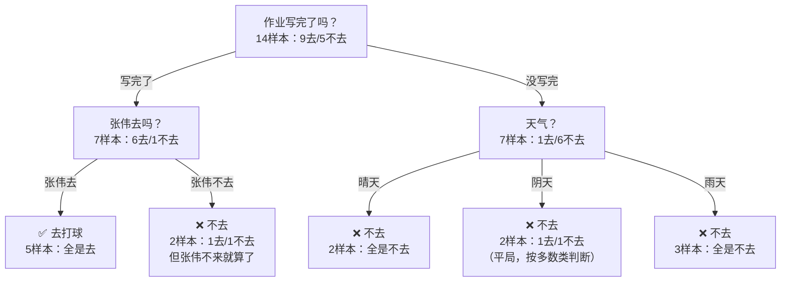
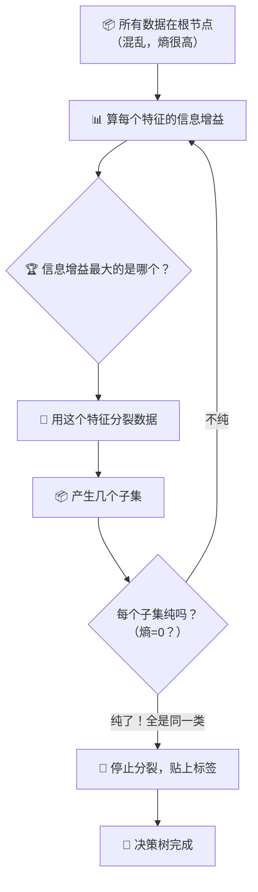

# 第4章：决策树

## 🎯 读完本章你能...

用纸笔手算信息增益来画一棵决策树，理解"熵"为什么能衡量混乱程度，知道过拟合和剪枝是怎么回事。

## 📖 从一个故事开始

周六早上9点，赵明轩躺在床上刷手机，看到班群里有人在约下午3点打篮球。他手指悬在屏幕上方，犹豫着要不要回复"我来"。

他在心里飞快地盘算：

"首先，下午会不会下雨？——天气预报说多云，概率不大。好，第一个条件过了。"

"其次，几点能写完作业？——数学卷子还剩3道大题，如果上午能搞定，下午就自由了。但如果卡在最后一道压轴题上……"

"还有——谁去？如果只有几个不太熟的同学去，那打着也没意思。但如果张伟去，那就有意思了。张伟在群里说他要来。"

赵明轩的大脑在三秒钟之内跑完了一整棵"决策树"：

- 先看天气：下雨就不去，不下雨继续判断。
- 再看作业：没写完就不去，写完了继续判断。
- 最后看队友：张伟去就去，张伟不去再考虑。

三秒后，他敲下回复："我来！"

赵明轩刚才做的事情，就是决策树算法的完整直觉——从一个最核心的问题出发，根据答案走到下一个问题，层层剥开，最终得到一个结论。每一个问题都是二选一或多选一，每一条"如果...那么..."的分支都通向一个确定的答案。

决策树之所以叫"树"，就是因为这个结构——从唯一的"根"开始，不断分叉，最后在每个枝条的末端长出"叶子"（结论）。

## 📖 原理讲解

### 树的基本结构：根、枝、叶

把赵明轩的决策过程画出来：

```
                    要不要去打球？
                        │
                 ┌──────┴──────┐
              下雨？          不下雨？
                │                │
              "不去"          作业写完了吗？
                                │
                         ┌──────┴──────┐
                      没写完          写完了
                        │                │
                      "不去"          张伟去吗？
                                        │
                                 ┌──────┴──────┐
                                去            不去
                                 │               │
                               "去"          人太少
                                                │
                                              "不去"
```

一棵决策树由三种节点组成：

- **根节点（Root Node）**：整棵树的入口，包含所有数据。对应你问的第一个问题——"天气怎么样？"
- **内部节点（Internal Node）**：中间的判断节点。每个节点根据一个特征来分裂数据——"作业写完了吗？""张伟来了吗？"
- **叶节点（Leaf Node）**：最后一层，不再分裂，直接给结论——"去"或者"不去"。

树是怎么"长"出来的？不是人手动指定"先问天气、再问作业、再问张伟"，而是算法自己根据数据自动选出——**哪个特征最有用，就先问哪个问题。**

### 怎么判断"有用"？引入熵的概念

要让决策树自动决定"先问哪个问题"，我们需要一个能度量"数据纯不纯"的工具。这个工具叫**熵（Entropy）**。

熵衡量的是"混乱程度"。一群数据如果全是同一类（比如全是要去打球的人），熵就低（纯，不混乱）。如果一半要去一半不去，熵就高（杂，很混乱）。

一个直观的类比：一个班级里如果全是打篮球的，老师问"谁是打篮球的？"不需要问，因为全班都是——这是最"纯"的状态，熵最低。如果一个班里有打篮球的、踢足球的、跳街舞的、打电竞的，老师要分辨谁是谁就很困难——最"混乱"的状态，熵最高。

数学上的熵公式：
\[
H(S) = -\sum_{c \in \text{类别}} p_c \cdot \log_2(p_c)
\]

逐符号拆解：
- \(H(S)\)：数据集合S的熵。取值范围从0到 \(\log_2(\text{类别数})\)。0表示最纯（只有一类），值越大越混。
- \(\sum\)：对所有类别求和。
- \(p_c\)：第c类在S中的占比。比如30个样本里18个选"去"，12个选"不去"——\(p_{\text{去}} = 0.6\), \(p_{\text{不去}} = 0.4\)。
- \(\log_2(p_c)\)：以2为底的对数。为什么用对数？把概率"压缩"成信息量——小概率事件包含更多信息（比如"一个从不运动的人突然去打篮球"比"运动健将去打篮球"更有信息量）。
- 前面的负号：因为 \(p_c\) 在0到1之间，\(\log_2(p_c)\) 是负数，加个负号让熵变成正数。

**用数感受熵的变化**（两类问题，\(\log_2\) 值近似）：

| 类别分布 | 熵的值 | 直观含义 |
|:-------:|:------:|---------|
| 全是A类 (100%-0%) | \(-(1 \times 0 + 0 \times \dots) = 0\) | 极纯，不需要再分了 |
| 多数A类 (80%-20%) | \(-(0.8\log_2 0.8 + 0.2\log_2 0.2) \approx -( -0.258 - 0.464) \approx 0.72\) | 比较纯，但还有点混 |
| 五五开 (50%-50%) | \(-(0.5\log_2 0.5 + 0.5\log_2 0.5) = -( -0.5 - 0.5) = 1.0\) | 最混乱，急需分类 |

熵的最大值为1.0（二分类、各占一半时）。熵为0意味着数据已经"纯"了——没必要再分了。

### 信息增益：一个分叉让数据变"纯"了多少

有了熵这个"混乱度量尺"，接下来就可以衡量"按某个特征分裂数据，让数据变纯了多少"——这叫做**信息增益（Information Gain）**。

\[
\text{信息增益} = H(\text{分裂前}) - \sum_{\text{每个子集}} \frac{|S_v|}{|S|} \cdot H(\text{子集})
\]

这个公式就是：
- 分裂前的熵（有多混乱）
- 减去
- 分裂后每个子集的熵的加权平均（还剩下多少混乱）

信息增益越大，说明按这个特征分裂"让数据变得更纯"——这个特征就是一个"好问题"。

**类比分蛋糕**：有一盘混合糖（酸糖和甜糖各一半，熵=1.0）。你按"颜色"分：红色糖100%是甜的（熵=0），蓝色糖100%是酸的（熵=0）。分完后两个子集的熵都是0——信息增益 = 1.0 - 0 = 1.0，满分。

再试按"形状"分：圆形糖50%甜50%酸（熵=1.0），方形糖50%甜50%酸（熵=1.0）。分完后两个子集还是乱如麻——信息增益 = 1.0 - 1.0 = 0，白分。

### 手算信息增益：完整走一遍

用"要不要去打球"的场景。假设我们有14个样本的历史数据：

| 编号 | 天气 | 作业写完没 | 张伟去吗 | 最终去打球？ |
|:---:|:---:|:------:|:-----:|:-------:|
| 1 | 晴 | 写完了 | 去 | 去 |
| 2 | 晴 | 写完了 | 去 | 去 |
| 3 | 阴 | 写完了 | 去 | 去 |
| 4 | 雨 | 没写完 | 去 | 不去 |
| 5 | 雨 | 写完了 | 不去 | 不去 |
| 6 | 雨 | 写完了 | 去 | 去 |
| 7 | 阴 | 没写完 | 不去 | 不去 |
| 8 | 晴 | 没写完 | 去 | 不去 |
| 9 | 晴 | 写完了 | 不去 | 去 |
| 10 | 雨 | 没写完 | 不去 | 不去 |
| 11 | 晴 | 没写完 | 不去 | 不去 |
| 12 | 阴 | 写完了 | 去 | 去 |
| 13 | 阴 | 没写完 | 去 | 去 |
| 14 | 雨 | 没写完 | 不去 | 不去 |

最终结果：9个人去了，5个人没去。

**第1步：算分裂前的熵**

14个样本中，9个"去"，5个"不去"。\(p_{\text{去}} = 9/14\), \(p_{\text{不去}} = 5/14\)。

\[
H(\text{全部}) = -\frac{9}{14}\log_2\frac{9}{14} - \frac{5}{14}\log_2\frac{5}{14} \approx -0.643 \times (-0.637) - 0.357 \times (-1.485) \approx 0.410 + 0.530 = 0.940
\]

（快速心算法：9/14约0.64，\(\log_2 0.64 \approx -0.644\)，乘积约0.41；5/14约0.36，\(\log_2 0.36 \approx -1.474\)，乘积约0.53；加起来约0.94。精确值为0.940。）

**第2步：算按"天气"分裂后的熵**

天气有三个值：晴、阴、雨。

- 晴（5个样本）：编号1、2、8、9、11。其中去的是1、2、9（3个），不去的是8、11（2个）。
  \[
  H(\text{晴}) = -\frac{3}{5}\log_2\frac{3}{5} - \frac{2}{5}\log_2\frac{2}{5} \approx 0.971
  \]

- 阴（4个样本）：编号3、7、12、13。其中去的是3、12、13（3个），不去的是7（1个）。
  \[
  H(\text{阴}) = -\frac{3}{4}\log_2\frac{3}{4} - \frac{1}{4}\log_2\frac{1}{4} \approx 0.811
  \]

- 雨（5个样本）：编号4、5、6、10、14。其中去的是6（1个），不去的是4、5、10、14（4个）。
  \[
  H(\text{雨}) = -\frac{1}{5}\log_2\frac{1}{5} - \frac{4}{5}\log_2\frac{4}{5} \approx 0.722
  \]

加权平均子熵：
\[
\text{加权子熵} = \frac{5}{14} \times 0.971 + \frac{4}{14} \times 0.811 + \frac{5}{14} \times 0.722 \approx 0.347 + 0.232 + 0.258 = 0.837
\]

信息增益 = 父熵 - 加权子熵 = 0.940 - 0.837 = **0.103**

**第3步：同样算按"作业"分裂的信息增益**

- 写完了（7个样本：1、2、3、5、6、9、12）：去的是1、2、3、6、9、12（6个），不去的是5（1个）。H ≈ 0.592
- 没写完（7个样本：4、7、8、10、11、13、14）：去的是13（1个），不去的是4、7、8、10、11、14（6个）。H ≈ 0.592

加权子熵 = (7/14)×0.592 + (7/14)×0.592 = 0.592

信息增益 = 0.940 - 0.592 = **0.348**

**第4步：算按"张伟去吗"分裂的信息增益**

- 张伟去（8个样本：1、2、3、4、6、8、12、13）：去的是1、2、3、6、12、13（6个），不去的是4、8（2个）。H ≈ 0.811
- 张伟不去（6个样本：5、7、9、10、11、14）：去的是9（1个），不去的是5、7、10、11、14（5个）。H ≈ 0.650

加权子熵 = (8/14)×0.811 + (6/14)×0.650 ≈ 0.463 + 0.279 = 0.742

信息增益 = 0.940 - 0.742 = **0.198**

**结论**：三个特征的信息增益分别是：
- 天气：0.103
- 作业：**0.348**（最高！）
- 张伟：0.198

**"作业写没写完"的信息增益最大——所以决策树会优先选它当根节点，先问"作业写完了吗"。**

### 决策树长什么样——ID3算法

ID3是最经典的决策树算法之一。它的规则很简单：
1. 从根节点开始，计算所有特征的信息增益。
2. 选信息增益最大的特征作为当前节点的"分裂问题"。
3. 按这个特征的不同取值，把数据分成几个子集。
4. 对每个子集，递归重复步骤1-3。
5. 直到某个子集纯了（熵=0，全是同一类），或者没特征可用了，或者数据太少不值得再分——这个节点变成叶节点，贴上"最多的一类"的标签。

用我们手算的结果，完整决策树是这样的：



### 过拟合：树长得太大反而不准

决策树有两个危险的极端：

**树太小（欠拟合）**：只分了一两轮就停了，根本没学到数据里的规律。就像老师只问"男生还是女生？"来判断谁会打篮球——太粗糙了。

**树太大（过拟合）**：树一直分一直分，直到每个叶节点里只有一个样本。这棵树完美记住所有训练数据，但来了新数据就懵了——因为它记的是"个别同学的怪癖"而不是"一般规律"。

打个比方：你用"这个同学喜欢吃香菜"来预测他期末成绩——在你的训练数据里可能恰好是准的（爱吃香菜的几个同学成绩刚好都不错），但这显然不是真正的规律。树长得太深就会学到这种"虚假关联"。

### 剪枝：给疯长的树"剃头"

解决过拟合的方法叫**剪枝（Pruning）**——把太长太细的分支剪掉。

两种剪枝方式：
- **预剪枝（Pre-pruning）**：树还没长大就设好规则——比如"一个节点至少要有10个样本才能继续分""最多只能分5层"。做事前就定好上限。
- **后剪枝（Post-pruning）**：先让树疯长，长成参天大树，然后用验证数据测试：把这个分支砍掉，准确率是升了还是降了？如果砍掉反而更准，说明这个分支就是过拟合的——砍掉。

预剪枝像"从小规定不让玩游戏超过1小时"——事前规矩。后剪枝像"玩到停不下来，爸妈来检查，发现你作业还没写就直接拔电源"——事后干预。

### 决策树的优缺点

**优点：**
- 可解释性极强。KNN告诉你"这个人属电竞社因为最近3个邻居里2个是电竞的"，这比较模糊；决策树可以给你一句完整的解释："因为作业写完了，而且张伟去了，而且天气不是雨天。"
- 不需要归一化。决策树只在每个特征内部比较大小（"晴天还是阴天？""分数大于60还是小于60？"），数值范围不影响判断。
- 能同时处理数值和类别数据。"温度 > 30度吗？"（数值）和"天气是晴/阴/雨？"（类别）可以在同一棵树上共存。
- 可以应付缺失值——如果某个特征的值缺失了，可以先走其他分支，或者用概率代替。

**缺点：**
- 容易过拟合。如果不剪枝，决策树是出了名的"过拟合大王"——因为它太灵活了，能任意弯曲去贴合每一个数据点。
- 不稳定。数据微小变化可能导致完全不同的树结构。比如只要删掉一条"张伟不去但作业写完了也去打球"的记录，整棵树的结构可能就变了。
- 对不平衡数据敏感。如果90%的样本是"去打球"，即使不问任何问题，树直接判"去"都能有90%的准确率——但这棵树其实什么都没学到。
- 不能学"异或（XOR）"这种复杂关系。有些规律不是一层一层问问题就能发现的。

## 🎨 图解专区

### 图1：决策树构建的完整流程



### 图2：过拟合 vs 欠拟合 vs 刚好

| 情况 | 树的特征 | 在训练数据上 | 在没见过的数据上 | 类比 |
|------|---------|:----------:|:----------:|------|
| 欠拟合 | 太浅，节点太少 | 60% 准确率 | 58% | 考试只复习了第一章 |
| 刚好 | 深度适中，经过剪枝 | 85% | 82% | 学懂了原理，会举一反三 |
| 过拟合 | 太深，每个叶子里只有一两个样本 | 99% | 68% | 把答案全背下来，一换数字就不会 |

## 🤔 课堂活动

### 活动一：手算信息增益——哪个特征先问？

**场景**：下表是8个"周末写不写作业"的历史数据。你的任务是算信息增益，决定决策树先问哪个问题。

| 学号 | 有电子产品吗 | 有人监督吗 | 作业难度 | 写作业了吗 |
|:---:|:---------:|:------:|:-----:|:------:|
| 1 | 有 | 有 | 简单 | 写了 |
| 2 | 有 | 无 | 简单 | 没写 |
| 3 | 有 | 有 | 难 | 没写 |
| 4 | 无 | 无 | 简单 | 写了 |
| 5 | 无 | 有 | 难 | 写了 |
| 6 | 无 | 无 | 难 | 没写 |
| 7 | 有 | 无 | 难 | 没写 |
| 8 | 无 | 有 | 简单 | 写了 |

**材料**：纸、笔、计算器（算log2可以用近似值：log2 0.5 = -1, log2 0.25 = -2, log2 0.75 ≈ -0.415, log2 0.375 ≈ -1.415）。

**任务**（2人一组，20分钟）：
1. 计算根节点的熵（8个样本：4个"写了"，4个"没写"）。
2. 分别计算按"有电子产品吗""有人监督吗""作业难度"分裂后的加权子熵和信息增益。
3. 信息增益最大的特征是什么？它应该成为根节点。
4. 根节点分裂后，对其中一个子集再算一轮信息增益，找下一层的分裂特征。

**讨论**（5分钟）：
- 你画出的决策树跟你自己写作业的实际情况像吗？
- 如果样本数据里"写了"和"没写"是7:1而不是4:4，根节点的熵是多少？更大了还是更小了？

### 活动二：画一棵"周末干什么"的决策树

**场景**：不需要真实数据——用你自己的经验画一棵描述"周末怎么过"的决策树。

**材料**：A4纸和彩色笔（不同颜色区分不同问题）。

**任务**（2人一组，15分钟）：
1. 想一个"周末要不要做某事"的决策（比如：要不要打游戏、要不要约同学出去玩、要不要去图书馆）。
2. 列出至少3个影响你决定的因素（比如：作业做完了吗、爸妈在不在家、天气好不好等）。
3. 用手画一棵决策树，根节点是你觉得最重要的那个因素。用不同颜色标出根节点、内部节点、叶节点。
4. 你的树最多有多少层？如果"过拟合"你的树会变成什么样——再画一棵"过拟合版"做对比。

**讨论**（5分钟）：各组交换看。谁的决策树最"像真的"？谁的树最能解释自己的周末行为？哪个决定因素最让人意外？

## 🔬 动手写代码

```python
# 决策树信息增益计算（中文注释，≤30行Python）
import numpy as np

# 计算熵：labels是标签列表 [0,1,1,0,0,...]
def entropy(labels):
    _, counts = np.unique(labels, return_counts=True)
    probs = counts / len(labels)        # 每类的占比
    return -np.sum(probs * np.log2(probs))  # 熵公式：-Σ p·log₂(p)

# 算按feature_idx分裂的信息增益
def info_gain(X, y, feature_idx):
    parent_entropy = entropy(y)         # 分裂前的混乱度
    values, counts = np.unique(X[:, feature_idx], return_counts=True)
    # 加权子熵：每个子集的熵 × 该子集大小的权重
    child_entropy = sum(
        (counts[i]/len(y)) * entropy(y[X[:, feature_idx] == v])
        for i, v in enumerate(values)
    )
    return parent_entropy - child_entropy  # 信息增益 = 变纯了多少

# 示例数据：[作业写了没? 张伟去吗?] → 最终去没去打球
X = np.array([[1,1],[1,1],[1,1],[0,1],[0,0],[0,1],[0,1],[1,0],[1,0],[0,0]])
y = np.array([1,1,1,0,0,1,0,1,0,0])  # 1=去, 0=不去

for i, name in enumerate(["作业写完了吗", "张伟去吗"]):
    ig = info_gain(X, y, i)
    print(f"{name}的信息增益 = {ig:.3f}")
print(f"→ 根节点应该选：{'作业' if info_gain(X, y,0) > info_gain(X, y,1) else '张伟'}")
```

## 📝 本节小结

- 决策树模仿人类的"如果...那么..."决策过程，把数据从根节点开始一层一层地问问题，直到叶节点给出结论。
- 熵衡量数据的"混乱程度"，信息增益衡量"按某个特征分裂后变纯了多少"——信息增益最大的特征优先当树的根节点。
- 决策树最大的优势是可解释性极强，但最大的风险是过拟合（树长得太深太细）——需要用剪枝来控制。

## 📚 参考文献

1. 周志华.《机器学习》. 清华大学出版社, 2016. 第4章决策树，包括ID3、C4.5和CART三种经典算法。
2. Quinlan, J.R. "Induction of Decision Trees". *Machine Learning*, 1986. ID3算法的原始论文，决策树的奠基之作。
3. 李航.《统计学习方法》. 清华大学出版社, 2019. 第5章决策树，推导清晰，有完整例题。
4. 3Blue1Brown. "How does entropy work, and why is it useful?". https://www.youtube.com/watch?v=9r7FIXEAGvs — 虽然是讲物理熵，但完全适用于信息熵，动画极佳。
5. StatQuest with Josh Starmer. "Decision Trees, Clearly Explained". https://www.youtube.com/watch?v=_L39rN6gz7Y — 一步一步画决策树，用颜色和图形讲得特别清楚。
6. scikit-learn官方文档 - Decision Trees. https://scikit-learn.org/stable/modules/tree.html — sklearn的决策树实现，写了本章代码后可以看官方接口。
7. B站UP主"菜鸡一枚". "决策树算法原理及实现". https://www.bilibili.com/ — 中文讲解决策树，从信息论基础讲到代码实现。
8. Google ML Crash Course. "Decision Trees". https://developers.google.com/machine-learning/decision-trees — 谷歌ML速成课，几分钟就能可视化理解决策树的决策边界。
