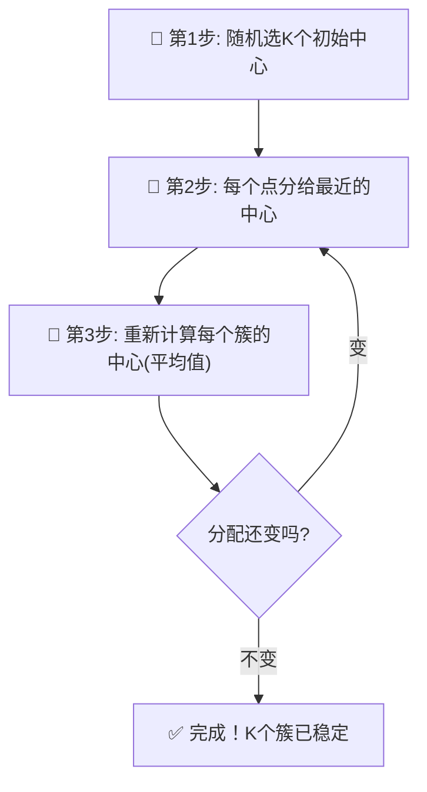

# 第10章：K-Means聚类——没有标准答案，AI自己"分班"

## 🎯 读完本章你能...

理解K-Means聚类的"分配→更新→重复"三步循环，用肘部法则选出合适的K值，并用sklearn的KMeans完成一个聚类任务。

## 📖 从一个故事开始

林老师是新上任的高一班主任。开学第一天，她面对40个完全不认识的学生。座位是随机排的，但她知道每个学生的中考成绩——语、数、外、理综、文综五科。

她想要把全班分成4个学习小组，但不想随便分。她想让**组内水平接近**（方便互相讨论）、**组间差异明显**（各组可以互相学习）。但她不知道怎么分——让学生自己选？大概率是好学生扎堆，谁都不跟"拖后腿的"一组。随机抽签？那4个组可能没有任何区分度。

林老师想了一个办法：

1. 她先在成绩单上随便**指了4个人**当"临时组长"
2. 然后宣布：**其他36个人，每人加入离自己成绩最接近的那个组长所在的组**
3. 分完4个组，她重新计算每组**各科成绩的平均值**——新的"虚拟组长"诞生了
4. 然后她说：**再比一次！每个人重新加入离自己的成绩最接近的虚拟组长**
5. 重新算平均值，重新分组……如此反复了几轮后，分组不再变化了

最终，她发现这4个组非常合理——第一组是五科均衡的全能型、第二组理科强文科弱、第三组文科强理科弱、第四组整体偏弱需要帮扶。

林老师无意中发明了**K-Means聚类算法**。没有正确答案（没人告诉她"谁该跟谁一组"），AI自己找到了一种合理的分组方式。

## 📖 原理讲解

### 什么是聚类

**聚类**（Clustering）是无监督学习中最常见的一种。和"监督学习"不同——没有标签、没有标准答案。你给AI一堆数据，AI说："我发现这些数据里藏着几堆'长得像的'东西，我来把它们分组。"

生活中的聚类例子：
- 网易云音乐把你和品味相似的用户归在一起，互相推荐歌单
- B站根据你的观看记录判断你是"二次元用户"还是"学习区用户"
- 超市发现"买啤酒的人通常也买尿布"（经典营销案例），其实就是对购物篮做聚类

### K-Means的核心：三步循环

K-Means是最简单也最常用的聚类算法。它只需要一个输入：**K**——要分成几组。然后执行一个三步循环：

**第1步：初始化**
随机选K个点作为"初始聚类中心"（也叫"质心"，Centroid）。

**第2步：分配（Assignment）**
对每个数据点，计算它到K个聚类中心的距离，把它分配给最近的那个中心。

**第3步：更新（Update）**
对于每个聚类，重新计算其中心——取该聚类内所有点的平均值。

**重复第2步和第3步**，直到聚类分配不再改变（或变化极小）。

用数学语言描述K-Means的目标函数：

\[
\min_{C_1, \ldots, C_K} \sum_{k=1}^{K} \sum_{\mathbf{x}_i \in C_k} \|\mathbf{x}_i - \boldsymbol{\mu}_k\|^2
\]

**逐符号解释**：
- \(C_k\)：第k个簇（组），包含所有"属于第k组"的样本
- \(\mathbf{x}_i\)：第i个样本的坐标（如一个学生的五科成绩向量）
- \(\boldsymbol{\mu}_k\)：第k个簇的**质心**——该簇内所有样本的平均坐标
- \(\|\mathbf{x}_i - \boldsymbol{\mu}_k\|^2\)：样本到它所属簇中心的**平方距离**
- \(\sum_{\mathbf{x}_i \in C_k}\)：对第k个簇内的所有样本求和
- \(\sum_{k=1}^{K}\)：把K个簇的"混乱程度"加起来

目标：让这个总和**最小**。即让每个点离它所属组的中心越近越好——组内紧凑，组间远离。

🎮 **类比**：K-Means就像玩《王者荣耀》选人分队。假设有10个人，系统不知道谁打什么位置。它先随机选5个人当"队长"（5个位置：上单、打野、中单、射手、辅助），然后每个人去找自己擅长的位置——"我玩法师，辅助最近的中单队长"。每轮打完重新评估：谁表现好就当新队长。来回几轮，10个人就自然地分到了各自最擅长的位置。

### 距离怎么算

K-Means中最常用的是**欧几里得距离**（就是空间中两点之间的直线距离）：

\[
d(\mathbf{a}, \mathbf{b}) = \sqrt{(a_1 - b_1)^2 + (a_2 - b_2)^2 + \cdots + (a_n - b_n)^2}
\]

比如两个学生A(80, 70)和B(60, 85)，他们的距离是：

\[
d = \sqrt{(80-60)^2 + (70-85)^2} = \sqrt{400 + 225} = \sqrt{625} = 25
\]

代码里`sklearn`默认用的就是这个距离。

### 肘部法则：怎么选K

K-Means最大的问题是：**你得自己告诉它分几组**。怎么选K？

**肘部法则**（Elbow Method）是最常用的方法：

1. 试试不同的K值（比如K=1, 2, 3, ..., 10）
2. 对每个K，训练K-Means，计算"簇内平方和"（也叫"畸变程度"，Distortion / Inertia）
3. 画K-vs-畸变度曲线
4. 找到曲线出现"拐点"（像人的手肘一样弯曲的地方）——那就是最优K

为什么叫"肘部"？因为曲线通常会先陡降，然后趋于平缓。拐点就像是手臂自然下垂时肘部的位置——在肘部之前降得很快（增加组数很有用），在肘部之后降得很慢（再加组数也没太大改善）。

除了肘部法则，**轮廓系数**（Silhouette Score）是另一个常用方法。它对每个点算一个-1到1之间的分数——1表示该点在自己簇里很紧凑、离其他簇很远；0表示在边界上；-1表示可能分错了簇。取所有点的平均轮廓系数，越高越好。

### K-Means的优缺点

**优点**：
1. **极其简单**——三步循环，几行代码搞定。CPU跑起来也飞快。
2. **可解释性强**——每个簇的中心是一个"平均样本"，你可以直接说："第1组的人语文平均75、数学平均82……"
3. **适合大数据**——时间复杂度O(n·K·d·迭代次数)，几乎是线性的。
4. **结果稳定**——在"正常"形状的数据上，随机初始化影响不大。

**缺点**：
1. **必须提前指定K**——现实生活中你往往不知道数据该分几类。选K是一门艺术。
2. **假设簇是圆形的**——K-Means认为每个簇都是围绕一个中心的球形分布。如果数据是月牙形、环形或蛇形，K-Means就完全搞不定。
3. **对初始中心敏感**——如果初始中心选得太倒霉（都挤在数据一角），可能收敛到很差的局部最优。实践中用K-Means++（智能初始化）可以缓解。
4. **对异常值敏感**——一个"离谱的点"可以大幅拉偏聚类中心。
5. **不适合类别型特征**——"城市=北京"和"城市=上海"怎么算平均？算不了。只能处理数值型数据。

### K-Means++：告别"倒霉的初始化"

sklearn中的`KMeans`默认使用**K-Means++**初始化——它不只选"最远的点"，而是按概率选择相互远离的初始中心：

1. 随机选第一个中心
2. 对每个点，计算它到最近已有中心的距离
3. 按距离的平方作为概率，选下一个中心——远的点更可能被选中
4. 重复2-3直到选出K个中心

这大大降低了"倒霉初始化"的概率，让聚类结果更稳定。

### K-Means vs KNN：别搞混了！

| 维度 | K-Means | KNN (K-Nearest Neighbors) |
|------|---------|---------------------------|
| 类型 | 无监督（没标签） | 监督（有标签） |
| K的含义 | 分成几组 | 参考几个邻居 |
| 做的事 | 自动分组 | 分类/回归预测 |
| 训练 | 需要迭代 | 不训练，纯记数据 |

很多初学者被两个"K"搞混——它们没有任何关系，就像"Java"和"JavaScript"一样。

## 🎨 图解专区

### 图1：K-Means三步循环



### 图2：肘部法则示意表

| K值 | 畸变程度(Inertia) | 相比K-1的改善 | 判断 |
|-----|-------------------|--------------|------|
| 1 | 8500 | — | — |
| 2 | 4200 | ↓4300 (↓50.6%) | 大幅改善 |
| 3 | 1800 | ↓2400 (↓57.1%) | 大幅改善 |
| **4** | **1100** | **↓700 (↓38.9%)** | **← 肘部！之后改善变小** |
| 5 | 900 | ↓200 (↓18.2%) | 改善不大 |
| 6 | 780 | ↓120 (↓13.3%) | 改善不大 |
| 7 | 700 | ↓80 (↓10.3%) | 改善很小 |
| 8 | 650 | ↓50 (↓7.1%) | 意义不大 |

### 图3：K-Means vs DBSCAN（形状对比）

| 数据类型 | K-Means表现 | DBSCAN表现 | 推荐 |
|----------|------------|-----------|------|
| 球形簇(如成绩分群) | ✅ 完美 | ✅ 可以 | K-Means（更快） |
| 月牙形簇 | ❌ 乱分 | ✅ 完美 | DBSCAN |
| 同心圆簇 | ❌ 乱分 | ✅ 完美 | DBSCAN |
| 含大量噪点的数据 | ⚠️ 被噪点带偏 | ✅ 自动识别噪点 | DBSCAN |
| 超大数据（百万+） | ✅ 很快 | ❌ 很慢 | K-Means |

## 🤔 课堂活动

### 活动一：分3组——亲身体验K-Means

**场景**：全班同学模拟K-Means聚类。

**材料**：在教室地板或操场上画一个坐标系（横轴=身高，纵轴=体重）。每人拿到自己的身高体重坐标，站到对应位置。准备3个不同颜色的丝带（红黄蓝）。

**任务**：
1. **初始化**：老师随机指定3个同学（分别站在不同位置）举起红、黄、蓝彩旗——这是初始聚类中心。
2. **分配**：其他所有同学观察自己离哪个旗子最近，走过去拿对应颜色的丝带。
3. **更新**：每个颜色组内部求平均位置，新的"组长"走到平均位置举起旗子。
4. **重复**：所有人重新分配到最近的旗子，再次更新组长位置。
5. 直到分组不再变化。

**讨论**：
- 如果老师一开始把3个旗子都放在同一个角落，分组会怎样？（初始化敏感问题）
- 如果把身高和体重的单位换一下——身高用米（1.65m）代替厘米（165cm）——分组结果会变吗？（引出标准化的必要性）
- 如果班里有一个身高2.05m的篮球特长生，他可能"拐跑"整个组的平均位置吗？（异常值敏感性）

### 活动二：改K值——感受"分几组"的影响

**场景**：用同一个数据，换不同的K值，观察结果变化。

**材料**：黑板上已经有一批散点（提前画好的30个点，大致分布在3个密集区但边界模糊）。

**任务**：
1. 全班讨论：K=2，这30个点怎么分成2组？画圈标注。
2. K=3，重新分组。
3. K=5，再重新分组。
4. 画出"K vs 组内平均距离"的曲线，找肘部。

**讨论**：
- K=5时，有些组是不是只有一个点？"单点成组"有意义吗？
- 如果K=30（和样本数一样多），每个点自成一个簇——畸变度=0，但这算"好聚类"吗？（引出过拟合概念）
- 肘部法则只提供参考——如果数据本身没有自然的"簇"结构，硬分也没有意义。怎么知道自己是不是"硬分"？

## 🔬 动手写代码

```python
# 导入库
import numpy as np
from sklearn.cluster import KMeans
from sklearn.preprocessing import StandardScaler
from sklearn.datasets import make_blobs

# === 第1步：生成模拟数据——300个学生的5科成绩 ===
X, true_labels = make_blobs(
    n_samples=300, n_features=5,
    centers=4,        # 真实有4个簇
    cluster_std=1.5,  # 簇内标准差
    random_state=42
)

# === 第2步：标准化（重要！K-Means依赖距离）===
X_scaled = StandardScaler().fit_transform(X)

# === 第3步：训练K-Means ===
km = KMeans(n_clusters=4,     # 分成4组
            init='k-means++', # 智能初始化
            n_init=10,        # 跑10次取最好结果
            random_state=42)
labels = km.fit_predict(X_scaled)

# === 第4步：查看结果 ===
print(f"每个簇的人数: {np.bincount(labels)}")
print(f"畸变程度(Inertia): {km.inertia_:.2f}")

# === 第5步：肘部法则——选最佳K ===
print("\n📊 肘部法则分析:")
for k in range(1, 9):
    km_test = KMeans(n_clusters=k, init='k-means++',
                     n_init=10, random_state=42)
    km_test.fit(X_scaled)
    bar = '█' * int(km_test.inertia_ / 100)
    print(f"  K={k}: Inertia={km_test.inertia_:.0f} {bar}")
```

**运行结果解读**：肘部法则中，`Inertia`会随着K增大而单调递减。但注意看——K从1到4时Inertia急剧下降，超过4后下降速度明显减缓。4就是"肘部"，意味着分成4组是自然选择。

## 📝 本节小结

- K-Means是经典的无监督聚类算法，通过**"分配→更新→重复"三步循环**将数据分成K组。它的目标是最小化每个点与其所属簇中心的距离平方和\(\min \sum \sum \|\mathbf{x}_i - \boldsymbol{\mu}_k\|^2\)。
- **肘部法则**是选K值的常用方法——画出K与畸变度的关系曲线，找到改善速度从"陡"变"缓"的拐点。也可配合轮廓系数综合判断。
- K-Means简单快速，但假设簇是圆形且需要提前指定K。对非球形数据（月牙形、环形），应改用DBSCAN等算法。K-Means对特征尺度敏感，必须先标准化。

## 📚 参考文献

1. **StatQuest: K-Means Clustering (B站/YouTube)** — Josh Starmer用逐帧动画演示K-Means的每一步迭代，连初始化到收敛全程可视化，全网最佳K-Means入门视频。
2. **MacQueen, J. (1967). Some Methods for Classification and Analysis of Multivariate Observations. *Proceedings of 5th Berkeley Symposium*, 1, 281-297.** — K-Means算法的原始论文，James MacQueen在1967年提出了这个影响深远的算法。
3. **Arthur, D., & Vassilvitskii, S. (2007). K-Means++: The Advantages of Careful Seeding. *SODA 2007*.** — 提出K-Means++初始化方法的论文，从数学上证明了好的初始化能显著提升聚类质量。
4. **Scikit-learn官方文档: KMeans** — https://scikit-learn.org/stable/modules/generated/sklearn.cluster.KMeans.html — 所有参数和属性的官方文档，每种聚类算法都有直观的对比图。
5. **周志华.《机器学习》第9.4节 k均值算法. 清华大学出版社, 2016.** — 中文教材里对K-Means数学推导最清晰的章节，从向量量化（VQ）的角度切入讲K-Means。
6. **3Blue1Brown: 聚类和降维 (B站)** — 虽然没有专门讲K-Means，但其"高维空间直觉"系列让你真正理解"欧几里得距离"和"质心"在高维空间的几何意义。
7. **Rousseeuw, P. J. (1987). Silhouettes: A Graphical Aid to the Interpretation and Validation of Cluster Analysis. *J. Computational and Applied Mathematics*, 20, 53-65.** — 轮廓系数的原始论文，比肘部法则更"正式"的聚类质量评估方法。
8. **Kaggle Learn: Clustering with K-Means** — Kaggle官方的免费互动教程，在浏览器里做K-Means实践，有可视化聚类边界。
