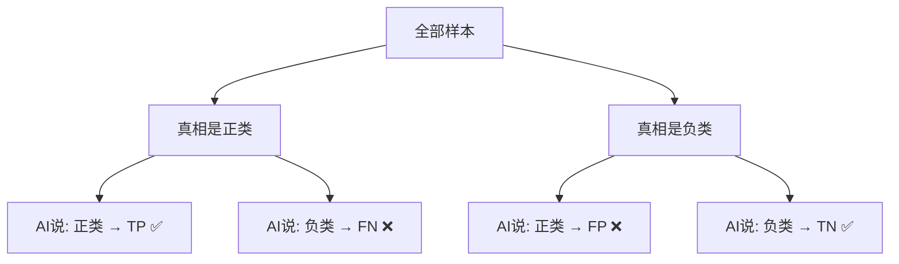
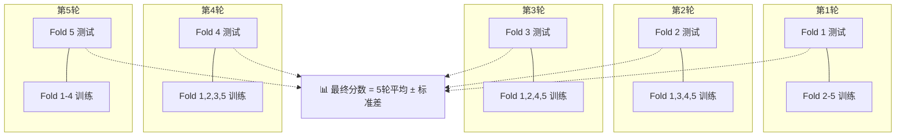

# 第9章：模型评估——AI考完试，怎么给它打分？

## 🎯 读完本章你能...

读懂混淆矩阵的四个格子，根据场景选择合适的评估指标（精确率/召回率/F1），看懂ROC曲线和AUC，并用交叉验证防止模型"背答案"作弊。

## 📖 从一个故事开始

小刘在B站上做了一个AI——"弹幕情绪识别器"。输入一条弹幕，输出"正面"或"负面"。他选了1000条弹幕做测试，AI答对了920条。小刘激动地跑去找老师说："老师！我的AI准确率92%，是不是可以发了？"

老师翻了翻他的测试数据，说："你1000条测试弹幕里，有多少条是负面的？"

小刘一看，愣住了——1000条中只有23条是负面的。

"你的AI只要闭着眼睛、把每条弹幕都猜成'正面'，准确率就是977/1000 = 97.7%。"老师说，"你的92%还不如全猜'正面'呢。"

这个故事揭示了一个残酷的事实：**只看准确率是会上当的**。尤其在数据不均衡的时候（比如正类占99%、负类占1%），准确率几乎没用。

那么应该看什么？这一章就是答案。

## 📖 原理讲解

### 混淆矩阵：四种"考试结果"

要深入评价模型，需要把预测结果分解成四种情况。想象AI在判断一堆弹幕：

|  | AI说"正面" | AI说"负面" |
|--|-----------|-----------|
| **真的是正面** | ✅ TP（蒙对了） | ❌ FN（漏掉了） |
| **真的是负面** | ❌ FP（瞎说） | ✅ TN（蒙对了） |

这四个格子合在一起叫**混淆矩阵**（Confusion Matrix）。四个字母是：
- **TP（True Positive）**：真的是正面，AI也说是正面 —— 对了
- **TN（True Negative）**：真的是负面，AI也说是负面 —— 对了
- **FP（False Positive）**：其实是负面，AI非说是正面 —— 冤枉了
- **FN（False Negative）**：其实是正面，AI非说是负面 —— 漏掉了

记住一个规律：T开头=判断对了，F开头=判断错了；P结尾=AI说了正面，N结尾=AI说了负面。

### 精确率：AI"张嘴"有多靠谱

精确率（Precision）回答的问题是：**AI说有猫的照片里，真的有猫的占多少？**

\[
\text{Precision} = \frac{TP}{TP + FP}
\]

- 分子TP：AI说"正面"且说对的
- 分母TP+FP：AI说了"正面"的全部（不管对不对）

如果AI很"嘴碎"——动不动就说"这是猫"——FP就大，精确率就低。精确率高意味着"AI不轻易下结论，但说了一般都准"。

**高中场景**：班主任判断"谁会考上985"。精确率高 = "班主任点到的学生基本都考上了"。如果精确率低 = "班主任说了一大堆人，好多没考上"。

### 召回率：该找的全找到了吗

召回率（Recall）回答的问题是：**所有真的有猫的照片里，AI找到了多少？**

\[
\text{Recall} = \frac{TP}{TP + FN}
\]

- 分子TP：AI说"正面"且说对的
- 分母TP+FN：所有真正的正面（AI发现的+AI漏掉的）

如果AI很"怂"——明明有猫也不敢说——FN就大，召回率就低。召回率高意味着"宁可错杀也不放过，把真猫基本都揪出来了"。

**高中场景**：班主任判断"谁会考上985"。召回率高 = "真正考上985的学生，几乎都被班主任提前看出来了"。如果召回率低 = "有好几个考上的，班主任都没看出来"。

### F1分数：在精确和召回之间找平衡

精确率和召回率往往**此消彼长**。AI胆子大（多说是猫）→召回率高、精确率低。AI胆子小（少说是猫）→精确率高、召回率低。

F1分数是两者的调和平均，在精确率和召回率之间做一个平衡：

\[
F_1 = 2 \cdot \frac{\text{Precision} \times \text{Recall}}{\text{Precision} + \text{Recall}}
\]

F1的取值范围也是0到1，越高越好。只有在精确率和召回率都高时，F1才高——任何一个拉胯，F1都会跟着降。

**为什么用调和平均而不用普通平均？** 调和平均对"短腿"更敏感。比如Precision=0.9, Recall=0.1，普通平均=0.5，调和平均只有0.18。F1不想被高的一方"带飞"——它要求两边都好。

### 准确率的公式

准确率（Accuracy）虽然有时候不靠谱，但公式很简单：

\[
\text{Accuracy} = \frac{TP + TN}{TP + TN + FP + FN} = \frac{\text{所有预测正确的}}{\text{总数}}
\]

在一眼能看出"数据均衡不平衡"的时候，准确率还是可以用的。数据均衡（正负比例接近1:1）时，准确率是很好的全局衡量。

### 该用哪个指标？场景决定一切

| 场景 | 最在意的指标 | 为什么 |
|------|------------|--------|
| AI诊断癌症 | 召回率 | 宁可把健康人叫回来再查一次，也不能漏掉真正的患者 |
| AI推送广告 | 精确率 | 推得精准才省钱，少推几个没事，推错了用户烦 |
| B站审核违规视频 | 召回率 | 宁审错不放过——漏掉违规内容的代价远大于多审几个 |
| 垃圾邮件过滤器 | 精确率 | 把重要邮件扔到垃圾箱比漏掉垃圾邮件严重得多 |
| AI判学生是否及格 | F1 | 误判"能及格"和漏掉"不能及格的"代价都很大 |

💡 **场景对比**：新冠检测——很多专家说召回率更重要："宁肯把健康人隔离错（FP升高，精确率下降），也不能放走一个确诊患者（FN升高，召回率下降）。"而信用卡盗刷检测——精确率更重要："如果把每笔正常消费都冻结了（FP极高），用户早就疯了。"

### ROC曲线和AUC：看AI的"全局水平"

前面的指标都需要你选一个"判断门槛"（比如概率>50%算正类）。但门槛不同，精确率和召回率也不同。怎么不依赖门槛、全面评价一个模型？

**ROC曲线**（Receiver Operating Characteristic Curve）：横轴是**假阳性率**（FPR = FP/(FP+TN) = 把负类错判为正类的比例），纵轴是**真阳性率**（TPR = TP/(TP+FN) = 召回率）。

随着"判断门槛"从最严（基本不说正类）调到最松（基本都说正类），模型会在ROC空间画出一条从左下到右上的曲线。好的ROC曲线会"拱"向左上角——真阳性率高、假阳性率低。

**AUC**（Area Under the Curve）：ROC曲线下的面积。取值范围0到1。
- AUC = 1.0：完美分类器。
- AUC = 0.9：非常优秀的分类器。
- AUC = 0.7-0.8：还行的分类器。
- AUC = 0.5：跟瞎猜没区别（曲线就是对角线）。
- AUC < 0.5：比瞎猜还差（你大概率把正负类搞反了）。

🎮 **类比**：ROC曲线就像你玩游戏时调节"鼠标灵敏度"——从最慢调到最快，记录每个灵敏度下的"命中率"（真阳性率）和"误触率"（假阳性率）。AUC衡量的是：不管灵敏度多少，你的"基本功"好不好。

### 交叉验证：别让模型"背答案"

如果测试集和训练集"长得太像"——比如你随机打乱就分了——模型可能在测试集上表现好，只是因为碰巧见过"类似"的题。

**K折交叉验证**的做法：
1. 把数据随机分成K份（通常K=5或10）
2. 轮流用其中1份当测试集，其余K-1份当训练集
3. 训练K次，记录K次评估分数
4. 取K次的平均值和标准差

\[
\text{CV Score} = \frac{1}{K} \sum_{i=1}^{K} s_i
\]

K次分数的标准差越小，说明模型越稳定——不会因为数据换了一部分就表现大幅度波动。

💡 **特别注意**：交叉验证应该在**预处理（如标准化）之前**就做好划分。如果在全量数据上做了标准化再划分，等于把测试集的信息"泄漏"给了训练集——这算作弊。

## 🎨 图解专区

### 图1：混淆矩阵结构



### 图2：精确率 vs 召回率的权衡

| 比较维度 | 精确率(Precision) | 召回率(Recall) |
|----------|-----------------|---------------|
| 问的问题 | AI说的里面有几分真？ | 真的里面AI找到了多少？ |
| 分母 | TP + FP（AI说正的全部） | TP + FN（真正正的全部） |
| 高风险场景 | 误报代价大（如"判作弊"） | 漏报代价大（如"诊疾病"） |
| AI 嘴碎 | **低**（动不动说正类，FP暴增） | 高 |
| AI 嘴怂 | 高 | **低**（不敢说正类，FN暴增） |

### 图3：K折交叉验证流程



## 🤔 课堂活动

### 活动一：全员猜猫——陷阱在准确率里

**场景**：亲身体验"数据不均衡时准确率会骗人"。

**材料**：PPT上展示20张图片，其中18张有猫、2张没有。每人一张答题纸。

**任务**：
1. 每个同学对每张图判断"有猫/没猫"，记在答题纸上。
2. 统计全班同学的召回率（有猫的18张里找出了多少）、精确率（你说有猫的里面，真的有猫的占多少）。
3. 揭晓"全猜猫"策略——准确率=18/20=90%！和你们真实判断的准确率比比。

**讨论**：
- 如果"猜对就有奖"，全猜"有猫"的人准确率90%，认真判断的你84%——谁更"聪明"？为什么这不合理？
- 如果有同学对没猫的图特别敏感（一张都没放过），他的召回率是多少？精确率呢？
- 在什么情况下，全猜"有猫"比一只一只认真看更合理？（引出不同场景不同指标）

### 活动二：召回率vs精确率——两种场景的角色扮演

**场景**：分两组辩论——哪个指标更重要。

**任务**：
- **A组场景**：你是高考作弊检测AI的产品经理。每年100万考生，作弊的只有300人。你的AI要标记出可疑考生。
- **B组场景**：你是校园表白墙审核AI的产品经理。每天500条帖子，其中约50条含不良信息。你的AI要自动屏蔽不良帖子。

每组列出：如果"误报"（FP）太多会怎样？如果"漏报"（FN）太多会怎样？你们组更在意哪个指标？为什么？

**讨论**：
- A组：误报→冤枉一个没作弊的学生，毁了他的前途。漏报→放走了作弊者，影响考试公平。哪个后果更严重？
- B组：误报→把正常表白帖删了，用户炸毛。漏报→不良信息出现在表白墙，学校处罚。哪个后果更严重？
- 有没有可能在同一个场景中，精确率和召回率的"成本"随时间变化？（如新病毒刚出现时召回率更重要→了解后精确率变重要）

## 🔬 动手写代码

```python
# 导入库
from sklearn.linear_model import LogisticRegression
from sklearn.model_selection import train_test_split, cross_val_score
from sklearn.metrics import (accuracy_score, classification_report,
                              confusion_matrix, roc_auc_score)
import numpy as np

# === 第1步：生成不均衡模拟数据 ===
np.random.seed(42)
n = 1000
X = np.random.randn(n, 5)
score = X[:, 0] + 0.5 * X[:, 1] - 0.3 * X[:, 2] + np.random.randn(n) * 0.5
y = (score > 1.5).astype(int)  # 故意让正类很少（约12%）
print(f"正类比例: {y.mean():.1%}")

# === 第2步：划分 ===
X_train, X_test, y_train, y_test = train_test_split(
    X, y, test_size=0.2, stratify=y, random_state=42
)

# === 第3步：训练 ===
model = LogisticRegression(max_iter=2000)
model.fit(X_train, y_train)
y_pred = model.predict(X_test)

# === 第4步：多指标报告 ===
print(f"\n准确率: {accuracy_score(y_test, y_pred):.3f}")
print("\n📊 分类报告:")
print(classification_report(y_test, y_pred, target_names=['负类', '正类']))
print(f"AUC: {roc_auc_score(y_test, model.predict_proba(X_test)[:, 1]):.4f}")

# === 第5步：5折交叉验证 ===
scores = cross_val_score(model, X, y, cv=5, scoring='f1')
print(f"\n5折F1分数: {scores}")
print(f"平均F1: {scores.mean():.4f} ± {scores.std():.4f}")
```

**运行结果解读**：注意看数据不均衡时准确率很高但F1可能很低（尤其是正类的F1）。交叉验证的5次分数如果波动大（标准差高），说明模型对不同数据划分敏感，不够稳定。

## 📝 本节小结

- **混淆矩阵**（TP/FP/FN/TN）是评估分类模型的基石。精确率回答"AI说的里面有多准"，召回率回答"该找的里面找到了多少"，F1是两者的调和平均。不同场景看重不同指标。
- 在数据不均衡时，**准确率会骗人**——全猜多数类也可能得高分。这时必须结合精确率、召回率和F1综合判断。
- **ROC曲线和AUC**让你不依赖具体门槛来评价模型。**K折交叉验证**通过"多轮训练-评估-取平均"防止模型靠运气在某一组数据上表现好。

## 📚 参考文献

1. **Powers, D. M. W. (2011). Evaluation: From Precision, Recall and F-Measure to ROC. *Journal of Machine Learning Technologies*, 2(1), 37-63.** — 对各评估指标最全面的综述，深入剖析了每个指标的数学含义和使用场景。
2. **Fawcett, T. (2006). An Introduction to ROC Analysis. *Pattern Recognition Letters*, 27(8), 861-874.** — ROC曲线最经典的入门文章，从二战雷达操作员讲到现代机器学习评估。
3. **Saito, T., & Rehmsmeier, M. (2015). The Precision-Recall Plot Is More Informative than the ROC Plot When Evaluating Binary Classifiers on Imbalanced Datasets. *PLOS ONE*.** — 解释了为什么在数据严重不均衡时PR曲线比ROC曲线更好用。
4. **StatQuest: ROC and AUC (B站/YouTube)** — Josh Starmer用一个超简单的例子（老鼠体重分类）把ROC/AUC讲得明明白白。
5. **Scikit-learn官方文档: Metrics** — https://scikit-learn.org/stable/modules/model_evaluation.html — sklearn中所有评估指标的官方文档，每个都有公式+代码示例。
6. **Google Machine Learning Crash Course: Classification — Evaluation** — https://developers.google.com/machine-learning/crash-course/classification — 谷歌官方的分类评估入门教程，有交互式的混淆矩阵演示。
7. **Kohavi, R. (1995). A Study of Cross-Validation and Bootstrap for Accuracy Estimation and Model Selection. *IJCAI'95*.** — 交叉验证的经典研究，解释了为什么5折和10折是最常用的选择。
8. **周志华.《机器学习》第2.3节 性能度量. 清华大学出版社, 2016.** — 中文教材里对评估指标数学定义最严谨的章节，和英文术语对照清晰。
