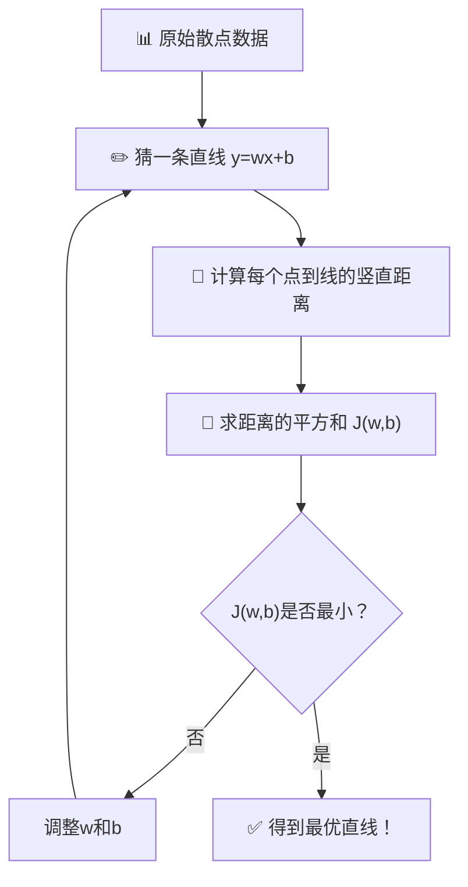

# 第8章：线性回归——用数学画一条最"贴"数据的直线

## 🎯 读完本章你能...

理解最小二乘法如何找到最优拟合直线，掌握多元线性回归和R²的含义，并能用sklearn训练一个线性回归模型预测数值。

## 📖 从一个故事开始

小陈想攒钱买一台Switch游戏机，价格1999元。他每周零花钱50元，偶尔帮邻居遛狗还能赚30元。他开始在本子上记流水账：

第1周：零花50 + 遛狗0 = 余额50
第2周：零花50 + 遛狗30 = 余额130
第3周：零花50 + 遛狗0 = 余额180
第4周：零花50 + 遛狗30 = 余额260
第5周：零花50 + 遛狗60 = 余额370

小陈想：照这个趋势，我还要几周才能攒够1999元？

他没有继续记下去，而是画了一张图——横轴是周数，纵轴是余额，在坐标纸上描了5个点。然后他拿出一把尺子，试着画一条"最能代表这些点趋势"的直线，沿着这条线往前延伸，预测第20周、第30周的余额。

小陈画的这条线，就是**线性回归**。用一条直线去"拟合"散落的数据点，然后用这条直线的趋势来预测未来。

但问题来了——怎么画才算"最好"？尺子往上偏一点还是往下偏一点？这就引出了线性回归的核心数学问题。

## 📖 原理讲解

### 线性回归的基本形式

**线性回归**（Linear Regression）是最简单的机器学习算法之一，用来预测一个**数值**。它假设目标值\(y\)和特征\(x\)之间是**线性关系**——即可以用一条直线来描述：

\[
y = wx + b
\]

当有多个特征时（多元线性回归）：

\[
y = w_1 x_1 + w_2 x_2 + \cdots + w_n x_n + b
\]

写成向量形式（更简洁）：

\[
y = \mathbf{w}^T \mathbf{x} + b
\]

其中：
- \(y\)是预测值（如"第N周余额"）
- \(x_1, x_2, \ldots, x_n\)是输入特征（如"零花钱金额""遛狗收入"）
- \(w_1, w_2, \ldots, w_n\)是**权重**（每个特征的重要程度）
- \(b\)是**偏置**（截距，当所有特征都为0时的"基础值"）

### 最小二乘法：找到"最好的"那条线

什么样的直线才是"最好"的？直观上：**让所有数据点到这条直线的"竖直距离"之和最小**。

把每个数据点和直线上对应点的竖直距离叫**残差**（Residual）。第i个点的残差为：

\[
e_i = y_i - \hat{y}_i = y_i - (w x_i + b)
\]

其中\(y_i\)是真实值，\(\hat{y}_i\)是预测值。

如果直接把所有残差加起来，正负会抵消（有些点在线上方，有些在下方）。所以我们用**残差的平方和**作为衡量标准——这就是**最小二乘法**（Ordinary Least Squares, OLS）的名字来源。"二乘"就是平方的意思。

残差平方和（也叫损失函数）：

\[
J(w, b) = \sum_{i=1}^{n} (y_i - w x_i - b)^2
\]

我们的目标：找到\(w\)和\(b\)，让\(J(w, b)\)最小。

通过微积分求导（设偏导数为0），可以得到最优\(w\)和\(b\)的闭合解（对于一元线性回归）：

\[
w = \frac{\sum_{i=1}^{n} (x_i - \bar{x})(y_i - \bar{y})}{\sum_{i=1}^{n} (x_i - \bar{x})^2}
\]

\[
b = \bar{y} - w \bar{x}
\]

其中\(\bar{x}\)和\(\bar{y}\)分别是所有\(x\)和\(y\)的均值。

**大白话翻译公式**：
- \(w\)的计算：分子是"\(x\)和\(y\)偏离各自均值的乘积之和"（表示\(x\)和\(y\)的协同变化），分母是"\(x\)偏离均值的平方和"（\(x\)自身的变化幅度）。本质上w就是"\(x\)变化1单位时，\(y\)倾向于变化多少"。
- \(b\)的计算：等于"平均\(y\)值"减去"\(w\)倍的\(x\)均值"——确保回归线穿过数据中心点\((\bar{x}, \bar{y})\)。

### 多元回归：不止一个特征

如果不止一个特征（比如预测余额，同时用到"周数""零花金额""遛狗收入"三个特征），就是一个**多元线性回归**。

此时没法直接给出封闭公式了（需要矩阵运算），但核心思路完全一样——找一组\(w_1, w_2, \ldots, w_n\)和\(b\)，让预测值\(\hat{y} = w_1 x_1 + \cdots + w_n x_n + b\)和真实值\(y\)的残差平方和最小。

用矩阵表示（了解即可）：

\[
\mathbf{w} = (\mathbf{X}^T \mathbf{X})^{-1} \mathbf{X}^T \mathbf{y}
\]

其中\(\mathbf{X}\)是所有样本的特征矩阵（每行一个样本），\(\mathbf{y}\)是所有样本的真实值组成的向量。

🎮 **类比**：一元回归就像"用一个变量（时间）预测余额"。多元回归就像"用好几个变量（时间、收入来源、花费）一起预测余额"。多一个人提供信息，预测自然更准。

### MSE：衡量"平均差了多少"

训练完模型，怎么知道它好不好？最常用的指标是**均方误差**（Mean Squared Error, MSE）：

\[
\text{MSE} = \frac{1}{n} \sum_{i=1}^{n} (y_i - \hat{y}_i)^2
\]

**逐符号解释**：把每个样本的（真实值-预测值）平方，整个数据集全加起来，再除以样本数。单位是原始单位的平方（比如预测余额的话，MSE的单位是"元²"）。

MSE的特点是：对大错误惩罚极重。差10块→惩罚100；差100块→惩罚10000。这个平方惩罚让模型特别怕"大偏差"。

另一个常用指标是**MAE**（Mean Absolute Error，平均绝对误差）：

\[
\text{MAE} = \frac{1}{n} \sum_{i=1}^{n} |y_i - \hat{y}_i|
\]

MAE用的绝对值而非平方，所以对大错误没那么"敏感"——差100块就惩罚100，不会放大到10000。

### R²：模型比"瞎猜"好了多少

MSE和MAE的绝对值不够直观——MSE=100算好还是算坏？这取决于数据本身的波动有多大。

**R²**（决定系数，R-Squared）解决了这个问题。它的核心思想：把你的模型和"世界上最蠢的模型"（就是永远只输出\(y\)的平均值的那个模型）比较：

\[
R^2 = 1 - \frac{\sum_{i=1}^{n} (y_i - \hat{y}_i)^2}{\sum_{i=1}^{n} (y_i - \bar{y})^2}
\]

- 分子\(\sum (y_i - \hat{y}_i)^2\)：你的模型犯的错误（残差平方和）
- 分母\(\sum (y_i - \bar{y})^2\)：最蠢模型犯的错误（只用均值预测的残差平方和）

如果\(R^2 = 0.85\)，意味着"你的模型比瞎猜好了85%"。\(R^2\)越接近1越好（最高就是1，表示完美预测），\(R^2 = 0\)意味着"你的模型跟瞎猜没区别"，\(R^2\)甚至可以为负数（说明你的模型比瞎猜还差）。

### 线性回归的假设和局限

线性回归虽然简单好用，但有几个重要前提：

1. **线性关系**：\(y\)和\(x\)之间确实存在大致的线性关系。如果数据的真实模式是抛物线形的，线性回归就不适合。
2. **特征间独立**：多个特征之间不能高度相关（如"身高"和"体表面积"几乎是一回事——这叫多重共线性）。
3. **残差正态分布**：预测残差应大致呈钟形分布——这确保最小二乘法是最优。
4. **对异常值敏感**：极端的"离谱数据"（如一个人的余额突然是1万）会严重影响回归线的斜率。

### 在线性回归和更复杂模型之间的选择

| 场景 | 推荐模型 | 理由 |
|------|---------|------|
| 数据关系明显是直线 | 线性回归 | 简单、快速、可解释 |
| 需要解释"为什么" | 线性回归 | 每个系数的含义非常清楚 |
| 特征和目标的线性关系弱 | Ridge/Lasso回归 | 加正则化，控制过拟合 |
| 数据量极大 | SGDRegressor | 随机梯度下降，不占内存 |
| 明显非线性 | 随机森林/XGBoost | 自动捕捉复杂模式 |

## 🎨 图解专区

### 图1：线性回归的"最优拟合线"



### 图2：残差示意表

| 样本 | x (学习时长h) | y真实值(考试分) | ŷ预测值 | 残差(y-ŷ) | 残差平方 |
|------|-------------|---------------|---------|-----------|---------|
| A | 2 | 55 | 59.0 | -4.0 | 16.00 |
| B | 5 | 68 | 68.4 | -0.4 | 0.16 |
| C | 8 | 85 | 77.8 | +7.2 | 51.84 |
| D | 12 | 92 | 90.2 | +1.8 | 3.24 |
| E | 15 | 95 | 99.6 | -4.6 | 21.16 |

### 图3：R²解读速查表

| R²值 | 含义 | 通俗解释 |
|------|------|---------|
| 1.00 | 完美预测 | 每个点都恰好落在回归线上 |
| 0.90+ | 非常好 | 模型解释了90%以上的数据波动 |
| 0.70-0.89 | 不错 | 模型基本捕捉到了趋势 |
| 0.50-0.69 | 一般 | 有预测力，但还有很大改进空间 |
| 0.30-0.49 | 偏弱 | 只能解释一小部分变化 |
| <0.30 | 很差 | 和瞎猜差别不大 |
| 负数 | 离谱 | 连用均值预测都不如 |

## 🤔 课堂活动

### 活动一：收集5人数据手算w和b

**场景**：在课堂上收集真实的"身高-体重"数据，用最小二乘法公式手算回归直线。

**材料**：黑板、粉笔、计算器，5位志愿者的身高(cm)和体重(kg)。

**任务**：
1. 请5位志愿者报出身高和体重，写在黑板上：
   | 人 | 身高(x) | 体重(y) |
   |----|--------|--------|
   | 1 | 165 | 55 |
   | 2 | 170 | 60 |
   | 3 | 175 | 68 |
   | 4 | 180 | 73 |
   | 5 | 185 | 78 |
   （用真实数据替换）
2. 计算\(\bar{x}\)和\(\bar{y}\)（身高均值、体重均值）
3. 用公式手算\(w = \frac{\sum (x_i - \bar{x})(y_i - \bar{y})}{\sum (x_i - \bar{x})^2}\)
4. 计算\(b = \bar{y} - w \bar{x}\)
5. 得到回归方程：体重 = w × 身高 + b
6. 验证：把每个人的身高代回去，算预测体重，算残差和MSE。

**讨论**：
- 哪个人的"残差"最大？为什么这个人偏离回归线最多？
- 如果再加一个人——身高170cm但体重95kg——回归线会怎么变？这个人的数据算"异常值"吗？
- 用这个回归方程预测身高200cm的人的体重，靠谱吗？为什么？（外推风险）

### 活动二：R²的直觉——"比瞎猜好了多少"

**场景**：体验R²的数学含义。

**材料**：活动一中收集的5组数据，计算器。

**任务**：
1. 计算"瞎猜模型"的MSE：用体重均值\(\bar{y}\)预测每个人，计算\(\frac{1}{5}\sum (y_i - \bar{y})^2\)
2. 计算"线性回归模型"的MSE：用回归方程预测每个人，计算\(\frac{1}{5}\sum (y_i - \hat{y}_i)^2\)
3. 手算R² = 1 - (回归模型的MSE / 瞎猜模型的MSE)

**讨论**：
- 如果R²=0.9，意味着"数据中90%的波动被模型解释了，还有10%解释不了"——那10%可能是什么？（测量误差、每个人体型的个体差异等）
- 如果只有2个数据点，R²会是多少？（永远是1，因为两点确定一条直线——说明了样本量对评估的重要性）

## 🔬 动手写代码

```python
# 导入库
import numpy as np
from sklearn.linear_model import LinearRegression
from sklearn.model_selection import train_test_split
from sklearn.metrics import mean_squared_error, r2_score

# === 第1步：生成模拟数据——学习时长vs考试分数 ===
np.random.seed(42)
n = 200
study_hours = np.random.uniform(1, 20, n).reshape(-1, 1)  # 学习时长1-20h
exam_score = 40 + 3.5 * study_hours.flatten() + np.random.normal(0, 8, n)

# === 第2步：划分训练集和测试集 ===
X_train, X_test, y_train, y_test = train_test_split(
    study_hours, exam_score, test_size=0.2, random_state=42
)

# === 第3步：训练线性回归 ===
model = LinearRegression()
model.fit(X_train, y_train)
# 模型学到的参数
print(f"回归方程: 分数 = {model.coef_[0]:.2f} × 学习时长 + {model.intercept_:.2f}")

# === 第4步：预测并评估 ===
y_pred = model.predict(X_test)
mse = mean_squared_error(y_test, y_pred)
r2 = r2_score(y_test, y_pred)
print(f"\n✅ MSE = {mse:.2f}  (平方分)")
print(f"✅ R²  = {r2:.4f}  (越接近1越好)")

# === 第5步：预测新数据 ===
new_hours = np.array([[10], [15], [20]])  # 学了10h、15h、20h
new_scores = model.predict(new_hours)
for h, s in zip(new_hours.flatten(), new_scores):
    print(f"  学了{h:.0f}小时 → 预计得分 {s:.1f} 分")
```

**运行结果解读**：`model.coef_`告诉学习时长每增加1小时，考试分预期增加约3.5分。`model.intercept_`是截距（学了0小时的"基础分"）。R²接近0.9说明学习时长确实能很好地解释考试分数的变化。

## 📝 本节小结

- 线性回归用一条直线\(y=wx+b\)拟合数据，通过**最小二乘法**找到最优的\(w\)和\(b\)——让所有点到直线的竖直距离平方和最小。多元回归扩展为\(y=w_1x_1+\cdots+w_nx_n+b\)。
- **MSE**（均方误差）是大错误惩罚重的损失函数，**R²**告诉你的模型比"瞎猜均值"好了多少。R²接近1是好模型，接近0等于白干。
- 线性回归是最简单的机器学习算法，但它的可解释性极强——每个系数的含义一目了然。在需要"说清楚为什么"的场景（如医疗、金融）中，它往往是首选。

## 📚 参考文献

1. **StatQuest: Linear Regression (B站/YouTube)** — Josh Starmer用最直观的动画讲解最小二乘法，把MSE、MAE、R²讲透了。
2. **3Blue1Brown: 线性代数与最小二乘法 (B站/YouTube)** — Grant Sanderson从线性代数的视角解释最小二乘法的几何意义，让你看到"数据→直线"背后的向量投影之美。
3. **Scikit-learn官方文档: LinearRegression** — https://scikit-learn.org/stable/modules/generated/sklearn.linear_model.LinearRegression.html — 官方文档加代码示例，用法一目了然。
4. **Andrew Ng. *Machine Learning* (Coursera) — Linear Regression章节** — 从单个变量到多元回归，从梯度下降到正规方程，Ng的讲解极其系统。
5. **周志华.《机器学习》第3.2节 线性回归. 清华大学出版社, 2016.** — 中文教材里对线性回归数学推导最详尽的章节，包括从最小二乘法到多元回归的完备推导。
6. **Geron, A. *Hands-On Machine Learning with Scikit-Learn, Keras, and TensorFlow*. O'Reilly, 2022. (中文版《机器学习实战》)** — 第4章用实际代码带你跑线性回归以及各种正则化变体。
7. **Kutner, M. H., et al. *Applied Linear Statistical Models*. McGraw-Hill, 2005.** — 线性回归统计学的"圣经"，适合想深入研究回归诊断和假设检验的读者。
8. **Kaggle Learn: Data Cleaning — Linear Regression exercise** — https://www.kaggle.com/learn — Kaggle官方的互动编程练习，在浏览器里就能写线性回归代码。
