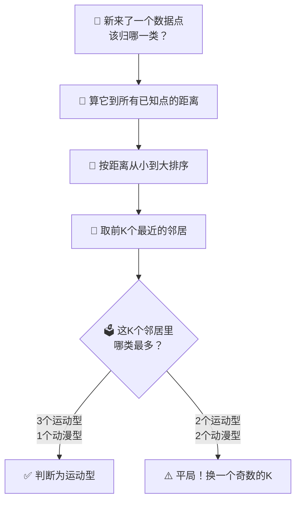

# 第2章：K近邻（KNN）

## 🎯 读完本章你能...

自己动手用KNN算法判断一个新数据点属于哪一类，理解K值怎么影响结果，知道数据"归一化"到底是干什么用的。

## 📖 从一个故事开始

高二（5）班今天换座位。班主任赵老师拿着一份新的座位表走进来，大家都紧张地等着——谁会坐在我旁边？

李小明在班里人缘不错，但他心里有个算盘：他特别想和有共同爱好的同学坐在一起。最好是个也喜欢打篮球、也看动漫、也玩《原神》的人。可他不知道全班每个人的兴趣爱好，他只知道他平时一起玩的几个好朋友的。

于是他偷偷扫了一圈教室，看到坐在第二排的陈浩。他跟陈浩不太熟，但他注意到一个现象：陈浩经常和张伟在一起，而张伟是李小明的铁哥们——两人都喜欢打篮球和看动漫。陈浩还经常和刘洋一起吃午饭，刘洋也玩《原神》。

李小明在心里盘算："陈浩周围的人——张伟和刘洋——都跟我兴趣很像，那陈浩大概率也跟我差不多吧？"于是他悄悄跟班主任申请，换到了陈浩旁边。换了之后果然发现，陈浩也爱看《进击的巨人》，也在攒原石抽卡。

李小明可能自己都没意识到，他刚刚完整地执行了一遍KNN算法——K近邻算法（K-Nearest Neighbors）。他不知道陈浩是什么样的人（不知道他的"标签"），但他看了陈浩周围最亲近的几个朋友（K个最近的邻居），发现他们大部分跟自己很像，于是他推断：陈浩应该也跟自己很像。

这就是KNN的核心思想：**想判断一个东西属于哪一类？看看它周围最近的K个邻居，少数服从多数。**

## 📖 原理讲解

### KNN的核心逻辑：近朱者赤，近墨者黑

KNN可能是所有机器学习算法里最简单的。它不做任何"训练"，不需要学习什么复杂的参数。它的全部逻辑只有一句话：**如果要判断一个未知数据点属于哪一类，就找出训练数据中离它最近的K个点，这K个邻居里哪一类最多，它就属于哪一类。**

为什么这么简单的方法能有效？因为现实生活中，"相似的输入通常会产生相似的输出"这个假设经常是成立的。身高体重相近的人鞋码也相近；成绩差不多的人考同一张卷子的分数也差不多；住在同一片区域的人房价也差不多。KNN就是把这个直觉变成了一个算法。

用更正式的话说，KNN属于"基于实例的学习"或"惰性学习"——它把所有的训练数据都记在脑子里，每次来了一个新问题，不去做复杂的推理，而是直接翻记忆："我见过类似的情况吗？类似情况的结果是什么？"然后照搬答案。

这就好比你不背数学公式（不训练模型），但你有一本收录了所有历年真题和答案的书。考试时遇到一道没见过的题，你就翻书找跟这道题最像的几道真题，看它们的答案是什么，然后选一个出现最多的答案。如果像的真题大部分选A，那你也选A。KNN做的就是这个。

### 什么叫"近"？欧氏距离

既然要"找最近的K个邻居"，就得有一种方法度量两个数据点之间有多"近"。最常用的就是欧氏距离（Euclidean Distance）——你初中就学过的勾股定理的推广。

在平面上（2维空间），两点 \((x_1, y_1)\) 和 \((x_2, y_2)\) 之间的距离是：
\[
d = \sqrt{(x_1 - x_2)^2 + (y_1 - y_2)^2}
\]

现在假设每个同学有3个"特征"来描述他：打篮球喜爱程度（0到10分）、看动漫喜爱程度（0到10分）、玩原神喜爱程度（0到10分）。那每个同学就是一个三维空间里的点：
\[
\text{张伟} = (9, 8, 10), \quad \text{刘洋} = (8, 7, 9), \quad \text{赵明} = (2, 1, 3)
\]

三维空间中两点 \((a_1, a_2, a_3)\) 和 \((b_1, b_2, b_3)\) 的距离公式就是：
\[
d = \sqrt{(a_1 - b_1)^2 + (a_2 - b_2)^2 + (a_3 - b_3)^2}
\]

推广到N维空间——不管有多少个特征，公式的逻辑完全一样：
\[
d(\mathbf{A}, \mathbf{B}) = \sqrt{(A_1 - B_1)^2 + (A_2 - B_2)^2 + \cdots + (A_n - B_n)^2}
\]

我们来逐符号解释这个公式：

- \(d(\mathbf{A}, \mathbf{B})\)：读作"A和B之间的欧氏距离"。结果是一个正数，越大说明两个点越"不像"。
- \(\mathbf{A}\) 和 \(\mathbf{B}\)：代表两个数据点（向量），比如代表两个同学的属性集合。
- \(A_1\)：A的第1个特征的值。比如"打篮球分数"。
- \(B_1\)：B的第1个特征的值。
- \((A_1 - B_1)\)：第1个特征上，A和B的"差距"。差距越大，这个平方就越大。
- \((A_1 - B_1)^2\)：把差距平方。为什么平方？两个原因：第一，让正负差距都变成正的（差距没法互相抵消）；第二，让大差距受到更重的"惩罚"（2的平方是4，3的平方是9——3和2的差距只有1，但平方后贡献的"距离"却从4跳到了9）。
- \(\sum\) 符号就是"全加起来"。
- 最外面的 \(\sqrt{\quad}\)：开根号，把平方"还回去"一部分，让距离的单位和原始数据的单位一致。

**用数字算一遍**。张伟 = (9, 8, 10)，赵明 = (2, 1, 3)。他们之间的距离：

\[
\begin{align}
d &= \sqrt{(9-2)^2 + (8-1)^2 + (10-3)^2} \\
  &= \sqrt{7^2 + 7^2 + 7^2} \\
  &= \sqrt{49 + 49 + 49} \\
  &= \sqrt{147} \\
  &\approx 12.12
\end{align}
\]

再算张伟和刘洋的距离：张伟 = (9, 8, 10)，刘洋 = (8, 7, 9)。

\[
\begin{align}
d &= \sqrt{(9-8)^2 + (8-7)^2 + (10-9)^2} \\
  &= \sqrt{1^2 + 1^2 + 1^2} \\
  &= \sqrt{3} \\
  &\approx 1.73
\end{align}
\]

一目了然：张伟和刘洋的距离（1.73）远小于张伟和赵明的距离（12.12）。所以如果K=2，要找张伟的"同类"，刘洋无疑比赵明近得多——张伟和刘洋是同一类人。

### K值选多大？大有讲究

KNN里唯一需要你手动设定的参数就是K——要看离它最近的几个邻居。K的大小直接决定了你的判断是"敏锐"还是"稳健"。

**K=1（只问最近的一个邻居）**。就像一个只听最好朋友意见的人——朋友说啥就是啥。优点是非常灵敏，如果最近的那个邻居恰好很有代表性，判断会非常准。但风险也很大。想象一下：班里最安静的同学碰巧坐在全班唯一的"摇滚音乐爱好者"旁边——如果K=1，安静同学也会被判断为摇滚爱好者，这显然是错的。这叫做"对噪声敏感"——一个不正常的点就可能带偏整个判断。

**K选很大（比如K=全班人数）**。这就像一个凡事都要问所有人意见的人——问来的答案永远是大流，缺乏个性。如果K=50，那不管你是谁，判断结果都差不多——全是"大多数人喜欢什么你就被判断为什么"。K太大了就不叫"看邻居"，而叫"看全局"，失去了"近邻"的意义。

**K选中等（比如K=3、5或7）**，既能参考足够多的邻居（不怕一两个噪声点影响），又能保持足够的"局部性"（远的人的意见不掺和进来）。经验值：通常选奇数（K=3、5、7），这样可以避免投票平局；一般取总数据量的开方来估计一个起步值，比如100条数据，K从10左右开始试。

用例子感受一下K值的影响。假设有下面这组数据，每个人的"爱好类型"是标签（运动型/动漫型/学习型），现在来了一个属性是(7, 8)的新同学，你分别用K=3和K=7来判断：

| 同学 | 特征1（游戏） | 特征2（运动） | 到新同学的距离 | 类型 |
|------|:----------:|:----------:|:-----------:|------|
| 新同学 | 7 | 8 | 0 | ？ |
| A | 8 | 9 | \(\sqrt{2} \approx 1.4\) | 运动型 |
| B | 6 | 8 | \(\sqrt{1} = 1.0\) | 运动型 |
| C | 5 | 3 | \(\sqrt{29} \approx 5.4\) | 动漫型 |
| D | 6 | 2 | \(\sqrt{37} \approx 6.1\) | 动漫型 |
| E | 9 | 9 | \(\sqrt{5} \approx 2.2\) | 运动型 |
| F | 3 | 9 | \(\sqrt{17} \approx 4.1\) | 学习型 |
| G | 4 | 5 | \(\sqrt{18} \approx 4.2\) | 学习型 |
| H | 2 | 6 | \(\sqrt{29} \approx 5.4\) | 学习型 |

按距离从近到远排序：B(运动) < A(运动) < E(运动) < F(学习) < G(学习) < C(动漫) < H(学习) < D(动漫)

- **K=3**：最近的是B、A、E——全是运动型 → 判断新同学是**运动型**
- **K=7**：B、A、E、F、G、C、H——3个运动型、3个学习型、1个动漫型 → **平局了！**

可以看到，K值不同可能导致完全不同的判断。这就是为什么选K值是KNN最重要的决定。

### 数据的"度量衡"问题：归一化

有一个非常容易被忽视但极其重要的问题。假设你用来描述同学的三个特征是：

- 身高（单位：厘米，范围大概150-190）
- 体重（单位：公斤，范围大概40-100）
- 每周打游戏的小时数（范围大概0-30）

现在算两个同学的距离：
- 同学A：(170cm, 60kg, 15h)
- 同学B：(175cm, 65kg, 10h)

\[
d = \sqrt{(170-175)^2 + (60-65)^2 + (15-10)^2}
  = \sqrt{25 + 25 + 25}
  = \sqrt{75} \approx 8.66
\]

看起来三个特征贡献一样（都是25）。但如果有人的数据是：
- 同学C：(170cm, 60kg, 0h)
- 同学D：(185cm, 65kg, 0h)

\[
d = \sqrt{(170-185)^2 + (60-65)^2 + (0-0)^2}
  = \sqrt{225 + 25 + 0}
  = \sqrt{250} \approx 15.81
\]

发现没有？身高差了15厘米，贡献了225；体重差了5公斤，只贡献了25。在这个距离公式里，身高"说话的声音"几乎是体重的9倍——不是因为身高更重要，而仅仅因为身高的数值范围更大。这是严重的问题。

欧氏距离有一个天然的缺陷：数值范围越大的特征，对距离的影响就越大。如果你不做任何处理，计算出来的"距离"根本不是真正意义上的"相似度"，而是"谁数值大谁说了算"。

解决方案就是**归一化（Normalization）**。最常用的一种叫Z-score标准化：
\[
x_{\text{新}} = \frac{x_{\text{原}} - \mu}{\sigma}
\]

逐符号解释：
- \(x_{\text{原}}\)：原始数值（比如身高170）
- \(\mu\)（读作"谬"，希腊字母mu）：这个特征所有数据的**平均值**（mean）
- \(\sigma\)（读作"西格玛"，希腊字母sigma）：这个特征所有数据的**标准差**（standard deviation），衡量数据"散得有多开"
- \(x_{\text{新}}\)：归一化之后的值

这个公式做的事情很简单：**把每个特征的数值都变成"离平均值有几个标准差"**。处理完后，不管你原始用的是厘米还是公斤还是小时，所有特征的数值范围都会变得差不多——平均值变成0，大多数值会在-3到+3之间。

为什么叫"Z-score"？因为归一化后的值在统计学里叫Z值，代表了"你离正常水平有多远"。

类比：全班50人考试，平均分70，标准差10。你考了85——你用Z-score算一下，(85-70)/10 = 1.5。你比平均高了1.5个标准差。张三考了45分，(45-70)/10 = -2.5——比平均低了2.5个标准差。把原始分都换成这种"离平均有几个标准差"的分数，不同科目之间就可以公平比较了——语文85分和数学85分的含金量可能完全不同，但Z-score 1.5不管是哪科都是一个意思。

### KNN的优缺点

**优点：**
- 极其简单，不需要数学基础就能理解。没有复杂的训练过程，没有损失函数，没有梯度——就是"找邻居投票"。
- 不需要"训练"时间。新数据来了直接用，模型不需要重新训练。
- 天然支持多分类——不止能判断A/B两类，三类五类十类都能做。
- 对异常值不太敏感（只要K不太小）——几个奇怪的邻居不至于带偏整个判断。

**缺点：**
- 预测很慢。每次来了一个新数据，都要算它和所有训练数据的距离。如果训练数据有100万条，每预测一次就要算100万次距离——巨慢。这就像每次考试你都要翻遍整本书找相似题，而不是考前把知识记在脑子里。
- 需要存下所有训练数据，占内存。训练数据越多，存的东西越多。
- "维数灾难"：特征越多（维数越高），距离就越容易"失效"。在高维空间里，几乎所有点之间的距离都差不多——"近"和"远"失去了意义。
- 对不相关特征敏感。如果混进了无关特征（比如学号），KNN会把它们也当成正经特征来算距离，干扰判断。

## 🎨 图解专区

### 图1：KNN工作原理



### 图2：K值大小对分类结果的影响

| K值 | 直观理解 | 决策边界 | 风险 |
|:---:|---------|---------|------|
| K=1 | 只听最好的那个朋友 | 非常曲折，紧紧贴着每个数据点 | 一个噪声点就能带偏，过拟合 |
| K=3 | 找三四个好朋友商量 | 大致平滑，有少数弯折 | 少数噪声影响有限 |
| K=7 | 找一桌人讨论 | 相当平滑，不容易被个别点带偏 | 可能忽略小群体的特殊性 |
| K=50（全班） | 全班投票 | 几乎一条直线 | 完全失去个性，欠拟合 |

## 🤔 课堂活动

### 活动一：手工KNN——你是什么"玩家类型"？

**场景**：学校要组建社团，想知道一个新来的同学最适合什么社团。你没有问他本人的兴趣，但你收集了全班的"游戏时长"和"运动时长"数据，标签是每个同学目前的社团归属（电竞社/篮球社/自习社）。

**材料**：纸、笔、计算器（或手机计算器）。

**数据表**（老师投影或写在黑板上）：

| 同学 | 每周游戏(小时) | 每周运动(小时) | 社团类型 |
|------|:----------:|:----------:|------|
| A | 20 | 1 | 电竞社 |
| B | 18 | 3 | 电竞社 |
| C | 15 | 5 | 篮球社 |
| D | 5 | 18 | 篮球社 |
| E | 3 | 20 | 篮球社 |
| F | 2 | 3 | 自习社 |
| G | 5 | 2 | 自习社 |
| H | 1 | 1 | 自习社 |

**新同学（你要判断的）**：每周打游戏12小时，每周运动6小时。

**任务**（2人一组，15分钟）：
1. 用欧氏距离公式，手算新同学到8个已知同学的距离（可以用计算器算平方和开根号）。
2. 把距离从小到大排序。
3. 取K=3，新同学被分到哪个社团？
4. 把K改成5，结果变化了吗？哪个K值你更相信，为什么？

**讨论**（5分钟）：
- 你觉得哪两个同学算出来的距离最大？为什么？
- 如果不用欧氏距离，你自己能想出一种"度量相似度"的方法吗？比欧氏距离好在哪？

### 活动二：K值辩论赛

**场景**：同一组数据（上面的社团数据），但这次把K分别设为1、3、5、7，分别判断新同学的类型。

**材料**：活动一算好的距离列表。

**任务**（2人一组，10分钟）：
1. 分别用K=1、K=3、K=5、K=7判断新同学的社团类型。
2. 哪一个K值给出的结果最让你信服？为什么？
3. 如果K=1的判断结果和K=7的判断结果完全不同，你会怎么调和？

**讨论**（5分钟）：各组分享"最佳K值"的选择理由。引导结论：没有一个绝对正确的K值，需要通过"交叉验证"等方法在具体数据上试，找到最合适的。K太小容易受噪声干扰，K太大又太保守。

## 🔬 动手写代码

```python
# KNN算法完整实现（中文注释，≤30行Python）
import numpy as np

# 训练数据：5个同学的[游戏时长, 运动时长]和他们的社团类型
X_train = np.array([[20,1], [18,3], [15,5], [5,18], [3,20], [2,3], [5,2], [1,1]])
y_train = np.array(["电竞","电竞","篮球","篮球","篮球","自习","自习","自习"])

# 新同学：[游戏12小时, 运动6小时]
new_student = np.array([12, 6])

# 第1步：算到所有训练数据的欧氏距离
distances = np.sqrt(np.sum((X_train - new_student) ** 2, axis=1))

# 第2步：按距离从小到大排序，拿到排序后的索引
sorted_idx = np.argsort(distances)

# 第3步：取最近K个邻居的标签，投票
K = 3
nearest_labels = y_train[sorted_idx[:K]]        # 最近K个邻居的标签
print(f"最近{K}个邻居的距离: {distances[sorted_idx[:K]]}")
print(f"他们的标签: {nearest_labels}")

# 第4步：统计每个标签出现的次数，选出最多的
unique, counts = np.unique(nearest_labels, return_counts=True)
result = unique[np.argmax(counts)]
print(f"\nKNN判断（K={K}）：新同学属于 → {result}社")
```

## 📝 本节小结

- KNN的核心思想简单但强大：要看一个东西属于哪一类，看看它周围最近的K个邻居属于哪一类，少数服从多数。
- 欧氏距离是最常用的"相似度量尺"，它的原理就是勾股定理从二维推广到N维。算之前一定要做归一化，否则数值范围大的特征会"说话太大声"。
- K值是KNN里唯一需要调的参数：K太小容易过拟合（被噪声点带偏），K太大容易欠拟合（失去个性）。

## 📚 参考文献

1. 周志华.《机器学习》. 清华大学出版社, 2016. 第10章专门讲K近邻，有详细的算法推导。
2. Cover, T. & Hart, P. "Nearest Neighbor Pattern Classification". *IEEE Transactions on Information Theory*, 1967. KNN原论文，奠定了理论基础。
3. 3Blue1Brown. "Essence of linear algebra"系列. https://www.youtube.com/playlist?list=PLZHQObOWTQDPD3MizzM2xVFitgF8hE_ab — 向量和距离的动画讲解，理解欧氏距离的绝佳资源。
4. scikit-learn官方文档 - KNeighborsClassifier. https://scikit-learn.org/stable/modules/generated/sklearn.neighbors.KNeighborsClassifier.html — sklearn的KNN实现，写了本章代码之后可以看看专业库怎么写的。
5. B站UP主"深度之眼". "KNN算法原理与实现". https://www.bilibili.com/ — 中文讲解，有配套代码。
6. 莫烦Python. "KNN分类器". https://mofanpy.com/tutorials/machine-learning/sklearn/knn/ — 简洁的入门教程，有视频。
7. StatQuest with Josh Starmer. "K-nearest neighbors, Clearly Explained". https://www.youtube.com/watch?v=HVXime0nQeI — 英文但极其直观，用图一步一步讲KNN。
8. Google ML Crash Course. "Normalization". https://developers.google.com/machine-learning/data-prep/transform/normalization — 谷歌ML速成课的归一化章节，深入理解为什么需要normalize。
