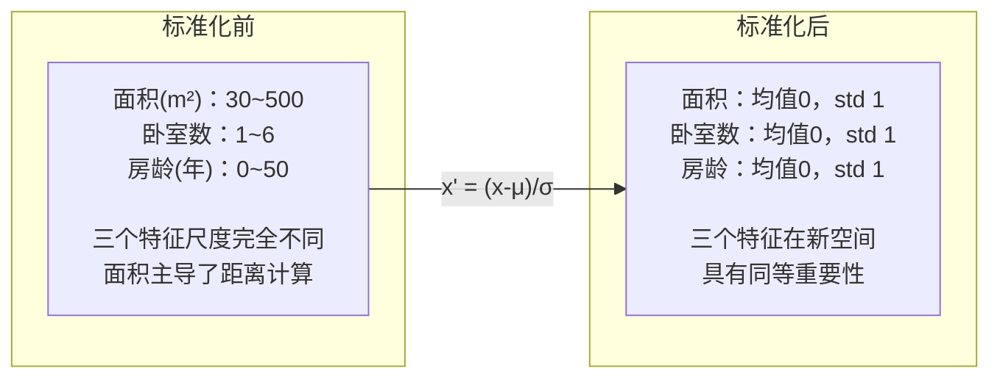
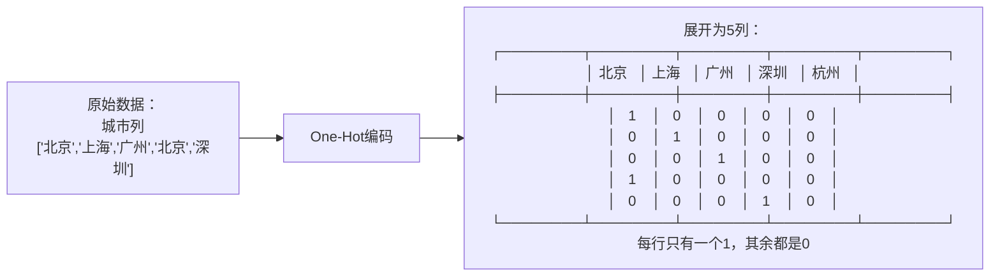
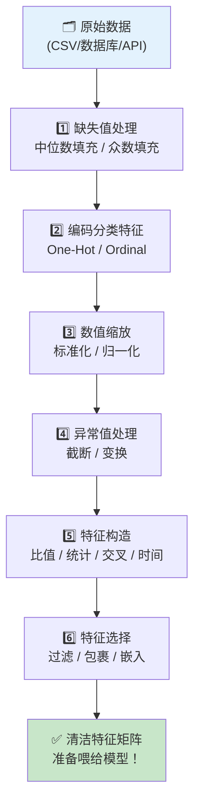

# 第15章：特征工程

## 🎯 读完本章你能...

理解"数据质量决定模型上限"这一ML第一定律，掌握标准化、归一化、One-Hot编码、特征构造与选择的完整方法论，并能用sklearn工具对真实数据集做全流程特征工程。

## 📖 从一个故事开始

张老师是学校的教务主任，最近在做一个"预测学生期末成绩"的项目。他把数据导入模型一跑，准确率只有62%——连瞎猜都不如。

他困惑地把数据拿给做数据分析的毕业生李明看。李明看了一眼就笑了："张老师，你这数据太'脏'了——"

首先，各科成绩的尺度不一样。语文满分150，数学满分150，但物理满分100、体育满分50。一个"85分"在物理是高分，在体育是满分水平——但模型不知道这个，它以为所有"85"都一样重要。

其次，数据里有缺失值。几个请病假的学生缺了月考成绩，张老师直接填了0——模型以为这些学生"考了0分"。

还有，数据里有"文字"列。"是否班干部"这一列填的是"是"/"否"，但模型只懂数字。张老师直接删了这一列，丢掉了一个可能很有用的信息。

最后，他发现其实最有价值的特征根本不在原始数据里。比如"成绩波动度"（平时成绩稳不稳定）比"某次月考成绩"对期末的预测力强得多——但张老师没有构造这个特征。

李明帮张老师做了四件事：标准化不同尺度、合理填充缺失值、把文字变成数字、构造了几个新特征（如"成绩趋势""偏科指数"）。同样的模型，准确率飙升到89%。

**特征工程（Feature Engineering）** 是机器学习中"枯燥但决定胜负"的环节。有一句著名的行话：**"数据和特征决定了机器学习的上限，而模型和算法只是在逼近这个上限而已。"** 本章，我们将系统学习特征工程的四大核心操作。

## 📖 原理讲解

### 15.1 什么是特征工程？为什么它比模型更重要？

**特征（Feature）** 就是模型用来做预测的"输入"。在房价预测里，特征包括：面积、楼层、卧室数、房龄、是否学区房...

**特征工程**就是对原始数据做的一系列"加工"操作，让数据变得"更容易被模型消化"。它包括：
- **特征变换**：标准化、归一化、编码（改变特征的"形态"）
- **特征构造**：从原始特征"发明"新特征（如从"身高""体重"构造出"BMI"）
- **特征选择**：筛掉没用的特征，只保留有用的（防止"垃圾进垃圾出"）

**为什么特征工程这么重要？** 用一个极端例子：如果你给模型输入的是"图片每个像素的RGB值"，它可能学出不错的分类器。但如果你输入的是"图片所有像素的平均值"（一个数），任何模型都救不回来——因为信息在特征阶段就丢光了。

反过来，如果你不仅给模型像素值，还帮它算好了"边缘强度""纹理方向""颜色直方图"等高质量特征，同样的模型效果会好得多——甚至简单的线性模型也能有不错的表现。

### 15.2 标准化：把不同"尺子"的数据拉平

**问题**：不同特征的取值范围差异巨大。比如房价预测中：
- "面积"范围：30 ~ 500（平方米）
- "卧室数"范围：1 ~ 6（间）
- "房龄"范围：0 ~ 50（年）

在梯度下降时，"面积"这个特征的梯度会比其他特征大得多，导致优化路径歪歪扭扭（像一个很扁的碗，梯度下降在里面Z字形来回震荡）。

**标准化（Standardization / Z-score Normalization）** 把每个特征变换为"均值为0、标准差为1"的分布：

\[
x' = \frac{x - \mu}{\sigma}
\]

**逐符号解释**：
- \(x\)：原始值
- \(\mu\)：该特征在所有样本上的均值（平均值）
- \(\sigma\)：该特征的标准差（衡量数据有多"散"）
- \(x'\)：标准化后的值。现在这个特征的分布是"以0为中心，大多数值在[-3, +3]之间"

**大白话类比**：期末考试后，语文满分150你考了120，物理满分100你考了80。标准化就是把你放到"全班排名"的尺度上看——你在语文班排前10%，物理班排前30%。标准化后，模型就知道"你语文比物理好"而不是"120比80大"。

**Z-score的直觉**：一个学生的标准分 \(z = 1.5\) 意味着"他的成绩比全班平均分高1.5个标准差"——这大约意味着他排在全班前7%（根据正态分布性质）。

### 15.3 归一化：把所有值压到同一小区间

**标准化** 不改变分布形状（还是原来的形状，只是平移和缩放了）。**归一化（Normalization）** 则是把所有值强行映射到[0, 1]区间：

**Min-Max归一化**（最常用）：

\[
x' = \frac{x - x_{\min}}{x_{\max} - x_{\min}}
\]

- \(x_{\min}\)：该特征的最小值
- \(x_{\max}\)：该特征的最大值
- 结果：最小值变成0，最大值变成1，中间值按比例缩放

**为什么需要归一化？** 某些算法对特征的绝对值范围非常敏感。比如：
- **KNN（K近邻）**：计算距离时，大范围的特征会主导距离计算
- **神经网络**：输入在[0, 1]或[-1, 1]时，激活函数（如Sigmoid）工作得最好
- **图像像素值**：通常从[0, 255]归一化到[0, 1]

**标准化 vs 归一化 怎么选？**

| 方法 | 公式 | 结果范围 | 对异常值 | 适合算法 |
|------|------|---------|---------|---------|
| 标准化 | \(\frac{x-\mu}{\sigma}\) | 无固定范围，以0为中心 | 较鲁棒（异常值会被方差吸收） | SVM、线性回归、逻辑回归、PCA |
| Min-Max归一化 | \(\frac{x-x_{min}}{x_{max}-x_{min}}\) | 精确[0, 1] | 很敏感（一个极端值就扭曲整个范围） | 神经网络、KNN、需要对输入有界的方法 |

**通用建议**：不确定就用标准化（更鲁棒）。神经网络优先用Min-Max归一化（因为激活函数在[0,1]附近表现最好）。

### 15.4 One-Hot编码：把"文字类别"变成"数字开关"

机器学习模型只懂数字。但现实数据充满"类别"："红色/蓝色/绿色"、"男/女"、"北京/上海/广州"——怎么喂给模型？

**绝对不能做的**：直接映射成1, 2, 3。因为模型会以为"上海(2) = 北京(1) + 广州(1)"或"红色(0) < 蓝色(1) < 绿色(2)"——类别之间没有大小关系！

**One-Hot编码** 的解决方案：每个类别变成一个"独立开关"。

```
原始：颜色 = ["红", "蓝", "绿", "蓝", "红"]

One-Hot编码后：
        红  蓝  绿
样本1: [ 1,  0,  0 ]  ← "红"
样本2: [ 0,  1,  0 ]  ← "蓝"
样本3: [ 0,  0,  1 ]  ← "绿"
样本4: [ 0,  1,  0 ]  ← "蓝"
样本5: [ 1,  0,  0 ]  ← "红"
```

现在"红""蓝""绿"是三个完全独立的维度——模型不会错误地认为它们之间存在大小或顺序关系。

**大白话类比**：你在填一份选择题答题卡——每个选项是一个独立的小格子。你涂黑A格，不意味着A比B"大"或A加C等于D。One-Hot编码就是给每个类别建一个"答题卡格子"。

**一个陷阱**：如果类别太多（比如城市名有300个），One-Hot会让特征从1列暴涨到300列——维度灾难。解决方案是使用**Embedding（嵌入）**，把高维One-Hot向量压缩成低维稠密向量。

### 15.5 特征构造：从数据中"发明"金刚钻

**特征构造（Feature Engineering 的核心手艺）** 是最能体现数据分析师"创造力"的环节。原始数据里没有"黄金特征"，你需要从现有特征中"合成"出来。

**经典的构造模式**：

**1. 比值特征**：
- 从"身高"和"体重"构造"BMI = 体重 / 身高²"
- 从"卧室数"和"总面积"构造"平均卧室面积"
- 从"收入"和"支出"构造"储蓄率"

**2. 统计特征**（窗口/聚合）：
- 从"学生历次月考成绩"构造"成绩均值""成绩方差""成绩趋势（最近3次是上升还是下降）"
- 从"用户购买记录"构造"近7天购买次数""总消费金额""客单价"

**3. 交叉特征**（特征的"化学反应"）：
- "年龄" × "收入水平" → 可能比两个特征各自更有效
- "是否周末" × "时间段" → 预测餐厅客流量时非常关键

**4. 时间特征**：
- 从时间戳提取："星期几""是否是节假日""是一天中的第几个小时"
- 这些简单特征在预测用户行为时往往比复杂模型更有用

**一个重要原则**：构造特征要在"训练集上"做统计，不要用"全量数据"统计（否则就是作弊——模型在训练时偷看了测试集的信息，这叫**数据泄露**）。

### 15.6 特征选择：给模型"瘦身"

特征不是越多越好。冗余特征和不相关特征不仅浪费计算，还可能导致过拟合（模型记住了噪音）。

**三种特征选择策略**：

**1. 过滤法（Filter）**：用一个统计指标给每个特征单独打分，取前K个。
- **方差阈值**：方差太小的特征（几乎所有样本值都一样）→ 删掉，它提供不了区分信息
- **相关系数**：计算每个特征和目标值的相关系数，保留相关性强的
- **卡方检验/互信息**：衡量"知道这个特征的值能在多大程度上减少对目标值的不确定性"

**2. 包裹法（Wrapper）**：用模型本身来评估特征子集的好坏。
- 前向选择：从空集开始，每次加一个"最能提升模型效果"的特征
- 后向消除：从全集开始，每次删一个"对模型影响最小"的特征
- 递归特征消除（RFE）：训练模型→删掉最不重要的特征→再训练→再删...

**3. 嵌入法（Embedded）**：把特征选择"嵌入"到训练过程中。
- **L1正则化（Lasso回归）**：训练时自动把不重要的特征权重压缩到0
- **树模型的特征重要性**：随机森林和XGBoost自带特征重要性排名
- **决策树的特征重要性**：看每个特征在树的节点分裂中被用了多少次

### 15.7 特征工程实战路线图

总结成一条流水线：

```
原始数据
    │
    ├── 1. 处理缺失值（不能乱填0！）
    │      方法：中位数填充 / 众数填充 / 模型预测填充
    │
    ├── 2. 编码类别特征（One-Hot / Label Encoding / 目标编码）
    │
    ├── 3. 数值特征缩放（标准化 / 归一化 / 稳健缩放）
    │
    ├── 4. 处理异常值（盒须图法 / 3σ原则 / 分位数截断）
    │
    ├── 5. 构造新特征（比值 / 统计 / 交叉 / 时间）
    │
    ├── 6. 特征选择（过滤→包裹→嵌入，去粗取精）
    │
    └── 7. 输出：干净、信息丰富的特征矩阵 ✓
```

---

## 🎨 图解专区

### 标准化前后数据分布对比



### One-Hot编码过程



### 特征工程全景流水线



### 特征选择的三种策略

| 策略 | 思想 | 代表方法 | 优点 | 缺点 |
|------|------|---------|------|------|
| **过滤法** | 用统计量单独评估每个特征 | 方差阈值、相关系数、卡方检验 | 快速，不依赖模型 | 忽略特征间的协同效应 |
| **包裹法** | 用模型效果评估特征子集 | 前向选择、后向消除、RFE | 选出的子集效果好 | 计算量大（要反复训练模型） |
| **嵌入法** | 在训练过程中自动选 | L1正则化、树模型特征重要性 | 高效，兼顾效果 | 依赖特定模型 |

---

## 🤔 课堂活动

### 🤔 活动1：给房价数据"发明"新特征

**场景**：你拿到了一份房价数据，包含以下原始特征：总面积(m²)、卧室数、卫生间数、房龄(年)、到最近地铁站距离(m)、是否有电梯(是/否)、楼层、总楼层。

**材料**：纸、笔、计算器

**任务**：
1. 识别至少3个需要做特征工程处理的"问题"（提示：有类别特征、尺度不统一的特征、可能有用的组合特征）
2. 设计并计算至少5个新特征（比如：人均卧室面积？容积率代理指标？是否需要爬楼梯？）
3. 给每个新特征写一句话说明"为什么这个特征可能比原始特征更管用"
4. 讨论：你的5个新特征里，哪个你觉得最"聪明"？为什么？

**讨论**：
- "房龄"和"到地铁站距离"都是以"小为好"的特征。标准化后，这种"越小越好"的关系会被破坏吗？（不会——标准化只改变中心和尺度，不改变单调关系）
- 如果某个特征90%的值都缺失了（比如"是否有游泳池"，大部分房子没标注），你会怎么处理？直接用？填充？还是丢掉？
- 有人提出一个新特征："价格/面积=单价"。这个特征用在"预测房价"模型里合适吗？为什么？（提示：这算不算数据泄露？）

### 🤔 活动2：用"逆推法"理解标准化的必要性

**场景**：两个同学的身高体重数据如下。给定KNN算法要用"欧氏距离"来衡量两个同学的相似度。

**材料**：纸、笔

**给定数据**：
- 小明：身高175cm，体重65kg
- 小红：身高162cm，体重52kg
- 小刚：身高170cm，体重80kg

**任务**：
1. 用原始数据计算"小明-小红"和"小明-小刚"之间的欧氏距离
2. 观察：体重的差异(65-52=13和80-65=15)和身高的差异(175-162=13和175-170=5)在距离计算中的"贡献"比例合理吗？
3. 对身高和体重分别做Min-Max归一化，重新计算距离。观察距离排序变了吗？
4. 如果改用标准化，重新计算距离。两种缩放方法给出了相同的"谁更相似"的判断吗？

**讨论**：
- 在原始尺度下，KNN判断"小明和谁更相似"几乎完全由身高主导（因为身高的数值范围大）。这是合理的吗？KNN能自动"意识"到这个问题吗？
- 如果有一个新同学身高250cm（输入错误？），Min-Max归一化会出什么问题？标准化会怎么处理？

---

## 🔬 动手写代码

用sklearn对真实数据集做全流程特征工程。

```python
"""
特征工程实战：房价预测数据全流程预处理
依赖：pip install scikit-learn pandas numpy
"""
import pandas as pd
import numpy as np
from sklearn.preprocessing import StandardScaler, OneHotEncoder
from sklearn.compose import ColumnTransformer
from sklearn.pipeline import Pipeline

# ─── 1. 创建模拟房价数据集 ───
df = pd.DataFrame({
    '面积_m2': [80, 120, 95, 150, 60, 200, 88, 105],
    '卧室数': [2, 3, 2, 4, 1, 4, 2, 3],
    '房龄_年': [5, 15, 8, 2, 20, 1, 10, 12],
    '朝向': ['南', '南', '北', '南北', '北', '南北', '南', '东'],
    '装修': ['精装', '简装', '毛坯', '精装', '简装', '豪装', '毛坯', '简装'],
    '房价_万': [320, 450, 280, 680, 200, 900, 300, 420],  # 目标值
})

# ─── 2. 构造新特征 ───
df['平均卧室面积'] = df['面积_m2'] / df['卧室数']        # 比值特征
df['房龄_对数'] = np.log1p(df['房龄_年'])                # 对数变换（压缩大值）
df['单价_万每平'] = df['房价_万'] / df['面积_m2']        # 派生特征

print("原始数据 + 新构造特征：")
print(df.head())

# ─── 3. 全流程预处理 ───
# ColumnTransformer：对不同列做不同处理
preprocessor = ColumnTransformer([
    # 数值列：标准化
    ('num', StandardScaler(), 
     ['面积_m2', '卧室数', '房龄_年', '平均卧室面积', '房龄_对数']),
    # 类别列：One-Hot编码
    ('cat', OneHotEncoder(sparse_output=False), 
     ['朝向', '装修']),
])

# 执行预处理
X = df.drop('房价_万', axis=1)  # 特征
X_transformed = preprocessor.fit_transform(X)

# 获取处理后的列名
num_cols = ['面积_m2', '卧室数', '房龄_年', '平均卧室面积', '房龄_对数']
cat_cols = (preprocessor.named_transformers_['cat']
            .get_feature_names_out(['朝向', '装修']))
all_cols = list(num_cols) + list(cat_cols)

result = pd.DataFrame(X_transformed, columns=all_cols)
print(f"\n预处理后（{result.shape[1]}维特征矩阵）：")
print(result.round(3))
print(f"\n✅ 特征工程完成！数值列已标准化，类别列已One-Hot编码")
```

**代码解析**：`StandardScaler()` 一行实现所有数值列的标准化。`OneHotEncoder()` 一行把"朝向"和"装修"文字列变成数值开关。`ColumnTransformer` 让你对不同列用不同预处理策略——这是sklearn最实用的功能之一。预处理后的数据可以直接喂给任何sklearn模型。

---

## 📝 本节小结

1. 特征工程是ML的"脏活累活"但也是"胜负手"——数据质量直接决定了模型效果的上限，标准化（\(x'=(x-\mu)/\sigma\)）和归一化让不同尺度的特征能"公平比较"，One-Hot编码把类别变成独立的数字开关。
2. 特征构造是特征工程中最需要创造力的环节——通过比值、统计聚合、交叉组合、时间拆分等方法从原始数据中"发明"出更有预测力的新特征，一个好特征胜过调半天参数。
3. 特征选择遵循"去粗取精"原则——用过滤法（统计打分）、包裹法（模型评估子集）、嵌入法（L1/树重要性）筛掉冗余和噪音特征，让模型更简洁、更快、更不容易过拟合。

---

## 📚 参考文献

1. **Kuhn, M. & Johnson, K. (2019).** *Feature Engineering and Selection: A Practical Approach for Predictive Models*. CRC Press. —— 特征工程领域最系统的著作，从理论到R代码全覆盖。
2. **"A Few Useful Things to Know About Machine Learning"** —— Pedro Domingos, *Communications of the ACM, 2012*. 机器学习经典文章，明确提出"特征工程是ML的关键"这一观点。
3. **Scikit-Learn 官方预处理指南** (scikit-learn.org/stable/modules/preprocessing.html) —— 标准化、归一化、编码、缺失值处理等所有工具的官方文档和示例代码。
4. **Kaggle Learn - "Feature Engineering"** 短期课程 —— Kaggle官方推出的免费互动课程，在浏览器里直接写代码练特征工程，30分钟完成。
5. **郑之杰《特征工程入门与实践》** —— 中文入门书，用Python和sklearn讲解常见特征工程方法，适合高中生阅读。
6. **"Feature Engineering for Machine Learning"** —— Alice Zheng & Amanda Casari著，O'Reilly出版。精炼实用，每个方法都有清晰的"什么时候用"和"为什么"。
7. **B站"同济子豪兄"《机器学习》系列** —— B站搜索"同济子豪兄 特征工程"，中文讲解，有配套的Notebook代码可以跟着跑。
8. **Pandas 官方教程** (pandas.pydata.org/docs/getting_started) —— 特征工程80%的操作都在用Pandas（分组、聚合、合并、填充），10分钟入门教程值得一看。
