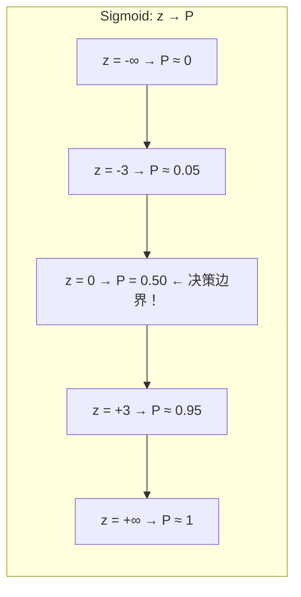
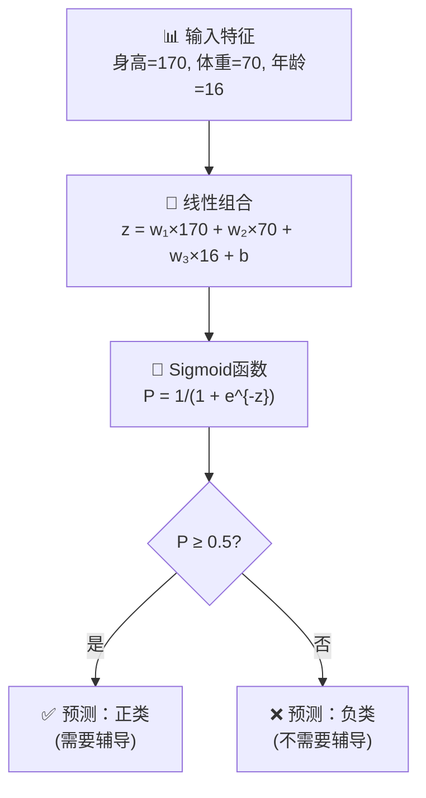

# 第7章：逻辑回归——把"是/否"变成一道数学题

## 🎯 读完本章你能...

理解Sigmoid函数如何将任意实数转化为0到1之间的概率，掌握逻辑回归的决策边界和最大似然的核心直觉，并用sklearn完成一个二分类任务。

## 📖 从一个故事开始

李医生是学校医务室的校医。每年体检季，她要面对几百个学生的体检报告，判断每个人是否需要"重点关注"——有没有肥胖风险、会不会近视加深太多。

她发现有一个"黄金公式"很有用：**BMI = 体重(kg) / 身高(m)^2**。BMI > 24 算超重，要提醒多运动。

但她很快发现不对劲。有些同学BMI很高但浑身肌肉（体育生）、有些同学BMI不高但体脂率很高（"瘦胖子"）。BMI这条硬杠杠太粗暴了——过了24就"警告"、23.9就"没事"，这合理吗？一个24.0和一个23.9的人，本质上几乎没有区别啊！

李医生想：如果能输出一个**概率**就好了——不是"你有问题/你没问题"，而是"你有72%的风险"。这样她可以按概率排序，优先关注风险最高的一批人。

这就引出了**逻辑回归**。和名字里的"回归"不同，逻辑回归其实是一个**分类**算法——但它输出的不是干巴巴的"是/否"，而是一个**概率**。

## 📖 原理讲解

### 为什么叫"逻辑"回归——Sigmoid函数登场

回忆一下线性回归（第8章），它输出的是一个**任意实数**——"这房子大概值300万"、"他期末能考87分"。但如果你的任务是"判断一张图里有没有猫"，需要的不是"87分"这个实数，而是一个**0到1之间的概率**——"有猫的概率是87%"。

问题是：线性回归算出来的`w·x + b`可以大到正无穷、小到负无穷。怎么把它变成0到1之间？

答案就是**Sigmoid函数**（也叫逻辑函数，Logistic Function）：

\[
P(y=1|\mathbf{x}) = \frac{1}{1 + e^{-(\mathbf{w}^T\mathbf{x} + b)}}
\]

其中：
- \(\mathbf{w}\)是权重向量，每个特征对应一个权重
- \(\mathbf{x}\)是输入特征向量（如身高、体重、年龄）
- \(b\)是偏置项
- \(e\)是自然常数（约2.71828...）
- \(P(y=1|\mathbf{x})\)是在给定特征\(\mathbf{x}\)的条件下，样本属于正类的概率

这个公式看起来吓人，其实特别好理解。把几个关键数字代进去感受一下：

- 当\(\mathbf{w}^T\mathbf{x} + b = 0\)时：\(P = \frac{1}{1 + e^0} = \frac{1}{1 + 1} = 0.5 \rightarrow \textbf{50%概率}\)
- 当\(\mathbf{w}^T\mathbf{x} + b = 3\)时：\(P = \frac{1}{1 + e^{-3}} \approx \frac{1}{1 + 0.05} \approx 0.953 \rightarrow \textbf{95%概率}\)
- 当\(\mathbf{w}^T\mathbf{x} + b = -3\)时：\(P = \frac{1}{1 + e^{3}} \approx \frac{1}{1 + 20.1} \approx 0.047 \rightarrow \textbf{5%概率}\)

看出来了吗？Sigmoid是一个**平滑的"S形"曲线**——左边趋近于0，右边趋近于1，中间在\(z=0\)时恰好是0.5。

🎮 **类比**：Sigmoid就像一个"打分换算表"。你在《王者荣耀》里的综合评分（KDA+输出+参团）是一个很大的范围（可能0到100多），但最终的"MVP概率"要压到0到1之间——50%以上你就有希望拿MVP。Sigmoid就是这个"换算表"。

### 决策边界：那条"50%的线"

既然Sigmoid在\(z=0\)时输出50%，那么\(z=0\)在哪条线上？答案是\(\mathbf{w}^T\mathbf{x} + b = 0\)——这就是**决策边界**。

在这条线的一边，模型判断"正类"（概率>50%）；在另一边，判断"负类"（概率<50%）。

关键是：\(\mathbf{w}^T\mathbf{x} + b = 0\)恰好是一条**直线**（在二维平面上）或一个**超平面**（在高维空间）。这意味着逻辑回归本质上是用一条直线把两类分开。

💡 **重要**：为什么\(\mathbf{w}^T\mathbf{x} + b = 0\)时概率恰好是50%？因为\(e^0 = 1\)，分母变成\(1+1=2\)，所以\(P=1/2=0.5\)。数学上这是定义在Sigmoid函数中的——当线性组合为零时，模型表示"我不知道，各50%"。这就是逻辑回归最核心的直觉。

### 样本权重：线性组合的含义

把\(\mathbf{w}^T\mathbf{x} + b\)展开写：

\[
w_1 \cdot x_1 + w_2 \cdot x_2 + \cdots + w_n \cdot x_n + b
\]

- 如果\(w_1\)是一个很大的正数（比如+5），说明特征\(x_1\)每增大1，样本属于正类的概率就明显增加
- 如果\(w_2\)是一个很大的负数（比如-3），说明特征\(x_2\)每增大1，样本属于正类的概率就明显下降
- 如果\(w_3\)接近0，说明特征\(x_3\)对预测结果几乎没影响

这就是逻辑回归比随机森林"可解释"的地方——你可以直接读出每个特征对结果**朝哪个方向影响**和**影响有多大**。

### 怎么学习：最大似然估计的直觉

逻辑回归里的\(\mathbf{w}\)和\(b\)怎么学到的？核心方法是**最大似然估计**（Maximum Likelihood Estimation）。

直觉版：假设已经有了一个猜出来的\(\mathbf{w}\)和\(b\)。把每个训练样本的特征代进去，算出一个"属于正类的概率"。对于真正是正类的样本（\(y=1\)），我们希望这个概率越大越好；对于真正是负类的样本（\(y=0\)），我们希望预测的正类概率越小越好（即属于负类的概率越大越好）。

综合起来，要最大化的是所有样本的"预测对了"的概率之乘积：

\[
L(\mathbf{w}, b) = \prod_{i=1}^{n} \left[P(y_i=1|\mathbf{x}_i)\right]^{y_i} \cdot \left[1 - P(y_i=1|\mathbf{x}_i)\right]^{1-y_i}
\]

这个公式的解读：对于每个样本\(i\)，
- 如果它的真实标签\(y_i = 1\)（正类），左边的\([P]^{1}\)起作用，我们希望\(P\)大
- 如果它的真实标签\(y_i = 0\)（负类），右边的\([1-P]^{1}\)起作用，我们希望\(1-P\)大（即\(P\)小）

把整个乘积最大化——这就是"最有可能（似然）产生当前数据"的那组参数。

实际计算时，通常对似然函数取对数（乘积变成求和，更好算），变成**对数似然**，然后用梯度下降法找到最优参数。

### 多分类逻辑回归：一对多策略

如果不止两个类别（比如判断"猫/狗/鸟"三个种类），怎么办？

逻辑回归最常用的多分类策略叫**一对多**（One-vs-Rest，OvR）：
1. 训练3个二分类器：猫vs非猫、狗vs非狗、鸟vs非鸟
2. 每个分类器输出样本属于该类的概率
3. 选概率最大的那个类别作为最终预测

还有另一种策略叫**一对一**（One-vs-One），但实践中OvR更常用。

在sklearn中，`LogisticRegression`默认对多分类问题使用OvR策略（通过内部封装）。

### 逻辑回归的优缺点

**优点**：
1. **输出概率**——这是逻辑回归最重要的优势。不是"是/否"，而是"78%的置信度"。在风控、医疗等场景至关重要。
2. **高度可解释**——每个特征的系数\(w_j\)直接告诉你该特征的影响方向和大小。
3. **计算快速**——模型简单，训练和预测都很快。
4. **不易过拟合**——模型复杂度低，天然有正则化效果。

**缺点**：
1. **假设线性可分**——如果数据用一条直线分不开（如同心圆问题），逻辑回归就不行了。
2. **对特征尺度敏感**——需要标准化。
3. **不能处理复杂交互**——除非你手动构造特征交互（如BMI）。

## 🎨 图解专区

### 图1：Sigmoid函数曲线



### 图2：逻辑回归工作流程



### 图3：不同z值对应的Sigmoid概率（手算表）

| 输入(z) | \(e^{-z}\) | 分母 \(1+e^{-z}\) | 概率P | 含义 |
|----------|-----------|-------------------|-------|------|
| -5 | 148.4 | 149.4 | 0.007 | 几乎肯定是负类 |
| -3 | 20.1 | 21.1 | 0.047 | 大概率是负类 |
| 0 | 1 | 2 | **0.500** | **不确定，50/50** |
| +3 | 0.050 | 1.050 | 0.953 | 大概率是正类 |
| +5 | 0.007 | 1.007 | 0.993 | 几乎肯定是正类 |

## 🤔 课堂活动

### 活动一：手算Sigmoid——为什么z=0时概率是50%

**场景**：用计算器或手算，亲身感受Sigmoid函数的"S形"特性。

**材料**：每个同学一张A5小纸条、计算器（或手机计算器）。

**任务**：
1. 分别计算\(z=0\)、\(z=3\)、\(z=-3\)时的Sigmoid值（公式\(P=1/(1+e^{-z})\)，\(e≈2.718\)）。
2. 验证：当\(z=0\)时，概率是不是恰好50%？
3. 想一想：如果模型判断"需要辅导"的概率是50%，这意味着什么？这个学生到底需要还是不需要？

**讨论**：
- 为什么Sigmoid在z=0时恰好是50%？这是"碰巧"还是"设计好"的？（答：设计好的，e^0=1，所以分母=2，概率=0.5）
- 如果z从3变到10，概率从95%变到99.995%——"性价比"高吗？在什么场景下我们需要"超高置信度"才敢下结论？（如疾病诊断）
- 逻辑回归为什么叫"回归"却做分类？（因为它的核心是线性回归wx+b，外面套了一层Sigmoid，把回归结果转换成了概率。）

### 活动二：决策边界——橡皮泥模拟分类

**场景**：用触觉感受"决策边界"的含义。

**材料**：橡皮泥（两种颜色，如蓝色和红色），直尺。

**任务**：
1. 把蓝色橡皮泥捏成10个小球（代表正类），红色橡皮泥捏成10个小球（代表负类），在桌面上摆成两个大致能区分的"阵营"。
2. 用直尺在中间放一条线——这就是逻辑回归的"决策边界"（z=0线）。
3. 用线到每个球的"距离"估算一个概率：离蓝阵营很近的红球，逻辑回归会给出"可能是蓝色"的概率。找到离蓝阵营最近的红球和最远的蓝球——它们的概率分别接近多少？

**讨论**：
- 如果把线稍微移动一点，哪些球的预测会改变？（离边界很近的球——类比"支持向量"）
- 如果一个球恰好压在线上（z≈0），模型说概率50%——这算是"对了"还是"错了"？
- 线的方向和斜率由什么决定？（由w各分量的比值决定）

## 🔬 动手写代码

```python
# 导入库
import numpy as np
from sklearn.linear_model import LogisticRegression
from sklearn.model_selection import train_test_split
from sklearn.preprocessing import StandardScaler
from sklearn.metrics import accuracy_score, classification_report

# === 第1步：模拟学生辅导数据 ===
np.random.seed(42)
n = 500
# 特征：出勤率、作业分、学习时长
X = np.column_stack([
    np.clip(np.random.normal(0.7, 0.2, n), 0, 1),
    np.clip(np.random.normal(65, 15, n), 0, 100),
    np.clip(np.random.normal(8, 3, n), 1, 20),
])
score = 0.4*X[:,0]*100 + 0.3*X[:,1] + 0.2*X[:,2]*5 + np.random.normal(0, 5, n)
y = (score < 62).astype(int)  # 1=需要辅导

# === 第2步：划分+标准化 ===
X_train, X_test, y_train, y_test = train_test_split(
    X, y, test_size=0.2, stratify=y, random_state=42
)
scaler = StandardScaler()
X_train_s = scaler.fit_transform(X_train)
X_test_s = scaler.transform(X_test)

# === 第3步：训练逻辑回归 ===
lr = LogisticRegression(max_iter=1000, random_state=42)
lr.fit(X_train_s, y_train)

# === 第4步：评估 ===
y_pred = lr.predict(X_test_s)
print(f"✅ 准确率: {accuracy_score(y_test, y_pred):.3f}")
print(classification_report(y_test, y_pred, target_names=['不需要', '需要']))

# === 第5步：输出概率（不只是0/1！）===
y_proba = lr.predict_proba(X_test_s[:5])
print("\n📊 前5个样本的'需要辅导'概率:")
for i, proba in enumerate(y_proba):
    print(f"  样本{i+1}: 不需要={proba[0]:.2%}, 需要={proba[1]:.2%}")
```

**运行结果解读**：`predict_proba`输出的是每个样本属于各个类别的概率。注意看哪些样本的概率"坚定"（95%+），哪些"摇摆"（50%出头）。概率接近50%的样本就是"难以判断"的边缘案例。

## 📝 本节小结

- 逻辑回归是分类算法，核心部件是**Sigmoid函数**\(P=\frac{1}{1+e^{-z}}\)，它将任意实数平滑地映射到0到1之间，输出概率而非干巴巴的标签。当\(z=0\)即线性组合为零时，概率恰好50%。
- 逻辑回归的**决策边界**是一条直线（超平面）\(\mathbf{w}^T\mathbf{x}+b=0\)。它通过最大似然估计学习最优的\(\mathbf{w}\)和\(b\)，使得模型对训练数据的"解释力"最强。
- 逻辑回归最大的优势是**输出概率且高度可解释**——每个特征的系数告诉你影响方向和大小。但如果数据不是线性可分的，需要换用更复杂的模型。

## 📚 参考文献

1. **StatQuest: Logistic Regression (B站/YouTube)** — Josh Starmer用一个最简单的例子（老鼠的体重vs是否肥胖）从头推导了逻辑回归的全部数学。全网最清晰的逻辑回归入门视频。
2. **Andrew Ng. *Machine Learning* (Coursera) — Logistic Regression章节** — Ng用"肿瘤良性/恶性"的经典案例讲解Sigmoid和决策边界，配合生动的动画。
3. **Scikit-learn官方文档: LogisticRegression** — https://scikit-learn.org/stable/modules/generated/sklearn.linear_model.LogisticRegression.html — 所有参数的官方说明和代码示例。
4. **3Blue1Brown: 微积分的本质 (B站)** — 理解梯度下降（逻辑回归的参数优化方法）的最好途径。第4-7集专门讲导数和优化。
5. **周志华.《机器学习》第3.3节 对数几率回归. 清华大学出版社, 2016.** — 中文教材里对逻辑回归数学推导最严谨的章节。"对数几率"这个翻译也比"逻辑回归"更准确。
6. **Hosmer, D. W., & Lemeshow, S. *Applied Logistic Regression*. Wiley, 2000.** — 逻辑回归的"百科全书"，适合想深入了解最大似然和模型诊断的读者。
7. **Google Machine Learning Crash Course: Logistic Regression** — https://developers.google.com/machine-learning/crash-course/logistic-regression — 谷歌出品，有交互式的Sigmoid函数演示，可以拖动滑块感受z和P的关系。
8. **B站"机器学习白板推导"系列 — 逻辑回归推导** — 从交叉熵损失函数到梯度更新，纯白板推导，适合想看清每一步数学的同学。
