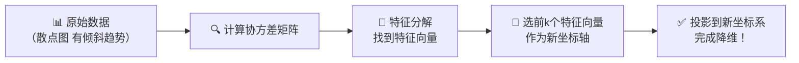

# 第11章：PCA降维——把15门课"压"成2种能力

## 🎯 读完本章你能...

理解PCA如何找到数据中"方差最大"的方向，用协方差矩阵和特征分解提取主成分，并用sklearn的PCA将高维数据降维可视化。

## 📖 从一个故事开始

李老师是年级主任。期末考试成绩出来了，每科老师都给她发了一张表格。物理老师说"看物理"，化学老师说"看化学"，历史老师说"看历史"……

李老师面前有15个科目的成绩单——15列数字，200个学生。她看得头晕眼花。15个维度，人脑根本没法同时处理。

但李老师有个直觉：这15门课之间其实有很多"重复信息"。比如物理分高的人，数学一般也高——说明"理科"这个隐藏能力同时影响了两门课。语文分高的人，英语也不差——说明"语言"这个隐藏能力同时影响了多门课。

她突然想到：如果能把15个科目"浓缩"成几个"底层能力"就好了——比如一个"理科能力"和一个"文科能力"，用这两个维度来概括每个学生的大致水平。虽然会损失一些细节（比如某个学生化学特别好但物理特别差），但**信息的主要部分被保留下来了**。

李老师凭经验选了物理成绩作为"理科能力"的代表，语文成绩作为"文科能力"的代表。但这太粗糙了——物理计算能力≠全部的理科能力，为什么不把数理化生四科的信息都用上呢？

本章要讲的**PCA（主成分分析）**，就是用数学方法，自动完成李老师想做但做不好的事：**找到数据中最重要的几个方向，把高维数据"压"成低维，同时保留尽可能多的信息。**

## 📖 原理讲解

### 为什么要降维

在机器学习中，数据往往有几十、几百甚至几千个特征。但许多特征是高度相关的（提供重叠信息），还有许多特征根本就是噪声。

降维的目的：
1. **去冗余**：去掉"重复信息"。比如物理成绩和理科综合成绩高度相关——留一个就够了。
2. **去噪声**：去掉那些完全没用或和任务无关的特征。
3. **可视化**：把高维数据压到2维或3维，画在纸上能看出来分组。
4. **加速运算**：维度少了，模型训练快很多——有些算法复杂度随维度爆炸增长（维度灾难）。

### PCA的核心直觉：找"方差最大"的方向

PCA（Principal Component Analysis，主成分分析）的核心思想可以用三句话概括：

1. **找到数据中变化最大的方向**，把它作为第一主成分（PC1）
2. **找到和第一主成分垂直、且变化第二大的方向**，作为第二主成分（PC2）
3. 以此类推……

为什么是"变化最大"的方向？因为如果所有学生在某个维度上得分都一样（方差接近0），这个维度就没有什么"信息价值"——它不能帮你区分任何一个学生。方差大的维度才包含着"区分不同学生"的关键信息。

🎮 **类比**：PCA就像你站在不同角度观察一个3D物体。有些角度看到的"影子"包含的信息多——比如从正面看一个人，能看清楚五官；有些角度信息量少——比如从头顶正上方往下看，只能看到一个"发旋"。PCA自动找到"让人看到最多信息"的那个投影角度。

### 协方差矩阵：衡量"谁跟谁一起变"

PCA的第一步是计算**协方差矩阵**。

**协方差**衡量两个特征是否"一起变大一起变小"：

\[
\text{Cov}(X, Y) = \frac{1}{n-1} \sum_{i=1}^{n} (x_i - \bar{x})(y_i - \bar{y})
\]

**逐符号解释**：
- \(x_i\)和\(y_i\)：第i个学生的两个特征值（如物理和数学成绩）
- \(\bar{x}\)和\(\bar{y}\)：两个特征的均值
- \((x_i - \bar{x})\)：这个学生的物理成绩"偏离平均值多少"
- \((y_i - \bar{y})\)：这个学生的数学成绩"偏离平均值多少"
- 乘积：如果两者偏离方向一致（都大于均值或都小于均值），乘积为正；反之乘积为负
- \(\sum\)求平均：所有学生的协方差平均值

如果Cov(X,Y) > 0 → X和Y正相关（物理高→数学高）
如果Cov(X,Y) < 0 → X和Y负相关（物理高→语文低，不太可能但可以是）
如果Cov(X,Y) ≈ 0 → X和Y基本无关

把所有特征两两之间的协方差放在一张矩阵里，就是**协方差矩阵**。假如有5个特征（五科成绩），协方差矩阵就是5×5的对称矩阵——第i行第j列是特征i和特征j的协方差。

### 特征分解：协方差矩阵的"基因"

有了协方差矩阵，PCA对它做**特征分解**（Eigendecomposition）：

\[
\Sigma \mathbf{v} = \lambda \mathbf{v}
\]

其中：
- \(\Sigma\)：协方差矩阵（d×d大小，d是原始维度）
- \(\mathbf{v}\)：**特征向量**，即主成分的方向
- \(\lambda\)：**特征值**，该方向上的方差大小

特征值越大，说明该方向上的方差越大——信息量越多。PCA的做法是：把特征值从大到小排序，取前k个特征向量，用它们构成新的坐标系。把原始数据投影到这个新坐标系上，就完成了降维。

**大白话翻译**：特征分解相当于给协方差矩阵做"CT扫描"——找到数据中最重要的"骨架方向"。特征值大的方向是"大骨架"（主要变化方向），特征值小的方向是"细枝末节"（可以扔掉）。

### PCA的数学目标

PCA的优化目标可以写成：

\[
\max_{\mathbf{w}} \frac{1}{n} \sum_{i=1}^{n} (\mathbf{w}^T \mathbf{x}_i)^2
\quad \text{约束条件：} \|\mathbf{w}\| = 1
\]

翻译成人话：找一个单位长度的方向\(\mathbf{w}\)，使得把所有数据点投影到该方向上后，投影值的**方差最大**。

第一主成分\(\mathbf{w}_1\)是使方差最大的方向。第二主成分\(\mathbf{w}_2\)在和\(\mathbf{w}_1\)垂直的方向中使方差最大，以此类推。

### 选几个主成分：保留多少方差

PCA降维到几维，是一个需要抉择的问题。通常看**累计方差解释率**（Cumulative Explained Variance Ratio）：

\[
\text{累计解释率} = \frac{\lambda_1 + \lambda_2 + \cdots + \lambda_k}{\lambda_1 + \lambda_2 + \cdots + \lambda_d}
\]

分子是前k大的特征值之和（被保留的方差），分母是所有特征值之和（总方差）。

常见的选择标准：取能让累计解释率达到85%-95%的最小k。比如5科成绩，前2个主成分解释了92%的方差——降维到2维只丢了8%的信息，完全可以接受。

在代码中，可以直接设置`PCA(n_components=0.95)`——自动选择能让累计解释率达到95%的最小维度。

### PCA的注意事项

**1. 必须先标准化**

PCA对特征的尺度非常敏感。如果用原始数据（身高150-200cm，体重40000-90000g），体重会主导所有主成分，因为它的数值范围太大了。所以PCA之前必须做标准化——让每个特征的均值为0、标准差为1。

**2. 主成分没有直接的物理含义**

PCA输出的主成分是新坐标轴上的值——"PC1 = 2.3"，而不是"理科能力 = 85分"。第一主成分是原始特征的线性组合，比如：

\[
\text{PC1} = 0.42 \times 数学 + 0.38 \times 物理 + 0.35 \times 化学 + 0.30 \times 生物 + \cdots
\]

它不直接对应"理科能力"，但它的系数可以大致解释其含义——系数大的特征共同定义了这个主成分的"语义"。

**3. PCA假设数据是线性关系**

如果数据存在复杂的非线性关系（比如数据呈螺旋形分布），PCA的效果不好。因为PCA本质上是一个线性变换（旋转+投影），无法捕捉非线性结构。

### PCA vs t-SNE vs UMAP

| 维度 | PCA | t-SNE | UMAP |
|------|-----|-------|------|
| 类型 | 线性降维 | 非线性降维 | 非线性降维 |
| 速度 | 极快 | 慢 | 较快 |
| 用途 | 降维+后续建模 | 仅可视化 | 可视化+后续建模 |
| 可解释性 | 高（有特征向量） | 低 | 中 |
| 保留全局结构 | ✅ | ❌（簇间距离无意义） | ⚠️（比t-SNE好） |
| 保留局部结构 | ⚠️ | ✅ | ✅ |

## 🎨 图解专区

### 图1：PCA的几何直觉——找到方差最大的方向



### 图2：协方差含义速查表

| 协方差值 | 两个特征的关系 | 例子 |
|---------|-------------|------|
| 大正数（如+120） | 强正相关——一个高另一个也高 | 物理vs数学 |
| 小正数（如+5） | 弱正相关——有点关系但不强 | 体育vs体重 |
| 接近0（如+0.3） | 基本无关 | 数学vs爱吃啥 |
| 小负数（如-5） | 弱负相关 | 游戏时间vs成绩 |
| 大负数（如-80） | 强负相关——一个高另一个就低 | 很难找到 |

### 图3：PCA累计方差解释率示例

| 主成分 | 特征值(λ) | 单独解释率 | 累计解释率 | 建议 |
|--------|----------|-----------|-----------|------|
| PC1 | 3.82 | 63.7% | 63.7% | 第一主成分很强 |
| PC2 | 1.50 | 25.0% | 88.7% | ← 前2个已近90% |
| PC3 | 0.42 | 7.0% | 95.7% | 贡献不大 |
| PC4 | 0.18 | 3.0% | 98.7% | 几乎无贡献 |
| PC5 | 0.08 | 1.3% | 100% | 可忽略 |

**结论**：取前2个主成分，信息保留率88.7%。降维到2维完全可行。

## 🤔 课堂活动

### 活动一：5科成绩提取文理能力

**场景**：用真实的班级成绩数据，手动模拟PCA的前两步。

**材料**：从全班挑5个志愿者，收集他们语文、数学、英语、物理、历史五科的成绩（或直接使用期中考试真实数据）。黑板、粉笔、计算器。

**任务一：手动感受"相关性"**
1. 在黑板上一行一人，写出5人的5科成绩
2. 全班讨论：哪两科成绩看起来最"一起高一起低"？哪两科看起来最"没关系"？
3. 粗略分组：哪些科目属于"理科组"（数学、物理），哪些属于"文科组"（语文、历史、英语）？

**任务二：感受降维**
1. 给每个人的"理科分" = (数学 + 物理) / 2，"文科分" = (语文 + 历史 + 英语) / 3
2. 用这两个分画散点图（横轴=理科分，纵轴=文科分）
3. 观察：5个人的分布有没有规律？谁"偏科"了？

**讨论**：
- 我刚才做的"取平均"是一种"手动降维"，PCA比这好在哪？（PCA会自动找到最优的线性组合权重，不是简单平均）
- 英语到底算"文科"还是"理科"？把它放文科组合适吗？（PCA会根据实际数据算出最优系数——如果英语在你的班里和数学更相关，PCA就会把英语的系数往"理科主成分"上偏）
- 降维后丢失的信息是什么？比如有个人化学很差但物理很好——"理科分"能反映这种差异吗？（不能——这就是被丢失的"细节"）

### 活动二：用影子体会投影——PCA的几何本质

**场景**：用实际物体感受"从不同角度投影=不同信息保留率"。

**材料**：一本书、一盏台灯（或手机手电筒）、一面白墙。

**任务**：
1. 把书竖在白墙前约半米处，打开台灯照向书本。
2. 转动书本——观察墙上影子的形状变化。
   - 正面照 → 影子是长方形（信息完整：宽×高）
   - 旋转45° → 影子变窄（高度保留，宽度压缩）
   - 旋转90° → 影子是一条线（只剩高度，宽度信息全丢失！）
3. 哪个角度投影的"信息量"最大？哪个最小？

**讨论**：
- 正面投影=第一主成分（方差最大），侧面投影=第二主成分。协方差矩阵的特征向量就相当于"最佳投影角度"。
- 如果你只能保留一个投影（降维到1维），你会保存哪个角度的影子？（正面的——信息量最大）
- 这本书的投影类比到学生成绩数据中："书"=原始数据，"影子的宽高"=各维度的信息，"转动书本"=调整投影方向（找最佳特征向量）。

## 🔬 动手写代码

```python
# 导入库
import numpy as np
from sklearn.decomposition import PCA
from sklearn.preprocessing import StandardScaler

# === 第1步：生成模拟数据——200个学生的10科成绩 ===
np.random.seed(42)
n = 200
# 假设有2个隐藏能力：理科能力和文科能力
science_ability = np.random.normal(0, 1, n)    # 理科能力
arts_ability = np.random.normal(0, 1, n)       # 文科能力

# 10科成绩 = 隐藏能力 + 随机噪声
X_raw = np.column_stack([
    70 + 12*science_ability + np.random.normal(0, 5, n),  # 数学
    68 + 11*science_ability + np.random.normal(0, 5, n),  # 物理
    65 + 10*science_ability + np.random.normal(0, 6, n),  # 化学
    72 + 9*science_ability + np.random.normal(0, 5, n),   # 生物
    75 + 3*science_ability + np.random.normal(0, 5, n),   # 计算机
    72 + 10*arts_ability + np.random.normal(0, 5, n),     # 语文
    68 + 11*arts_ability + np.random.normal(0, 5, n),     # 英语
    70 + 9*arts_ability + np.random.normal(0, 6, n),      # 历史
    66 + 8*arts_ability + np.random.normal(0, 5, n),      # 政治
    73 + 5*arts_ability + np.random.normal(0, 6, n),      # 地理
])

# === 第2步：标准化 ===
X_scaled = StandardScaler().fit_transform(X_raw)

# === 第3步：PCA降维——保留95%方差 ===
pca = PCA(n_components=0.95)
X_pca = pca.fit_transform(X_scaled)
print(f"原始维度: {X_raw.shape[1]} → PCA后维度: {X_pca.shape[1]}")
print(f"信息保留: {pca.explained_variance_ratio_.sum():.1%}")

# === 第4步：查看每个主成分的"构成" ===
print("\n📊 PC1的构成（各科系数）:")
subjects = ['数学','物理','化学','生物','计算机','语文','英语','历史','政治','地理']
for name, coef in zip(subjects, pca.components_[0]):
    bar = '█' * int(abs(coef) * 30)
    print(f"  {name}: {coef:+.4f} {bar}")
```

**运行结果解读**：PCA会把10科成绩自动降到约2-3个维度（因为模拟数据只有两个隐藏能力+噪声）。观察PC1的系数——你会发现理科科目（数学、物理、化学）在同一个主成分上系数显著，而文科科目在另一个主成分上系数显著。PCA自动"发现"了文理分科！

## 📝 本节小结

- PCA（主成分分析）的核心是**找方差最大的方向**——方差大的方向包含区分样本的关键信息。通过协方差矩阵的特征分解，PCA找到最优投影方向（特征向量），按特征值大小排序后取前k个作为主成分。
- PCA目标是在约束\(\|\mathbf{w}\|=1\)下最大化投影方差\(\frac{1}{n}\sum (\mathbf{w}^T\mathbf{x}_i)^2\)。累计方差解释率帮助决定保留多少个主成分——通常选能解释85%-95%方差的最小维度数。
- PCA是线性降维方法，速度快、可解释性高。但必须先标准化数据，且无法处理非线性结构。主成分没有直接的物理含义——它是原始特征的线性组合。

## 📚 参考文献

1. **3Blue1Brown: Principal Component Analysis (B站/YouTube)** — Grant Sanderson用绝美的动画展示PCA的几何直觉——数据→协方差→特征向量→投影，每一步都极其清晰。这是全网最推荐的PCA入门视频。
2. **StatQuest: PCA (B站/YouTube)** — Josh Starmer用一步一步的图示走完PCA全部计算过程，英文清晰易懂，是完美的代码实现前导视频。
3. **Jolliffe, I. T. *Principal Component Analysis* (2nd ed.). Springer, 2002.** — PCA领域的"圣经"，从数学基础到应用技巧全面覆盖。第1-4章适合希望深入理解PCA数学原理的读者。
4. **Pearson, K. (1901). On Lines and Planes of Closest Fit to Systems of Points in Space. *Philosophical Magazine*, 2(11), 559-572.** — PCA最原始的论文！Karl Pearson（就是"皮尔逊相关系数"的那个Pearson）在1901年就提出了PCA的思想，比计算机的诞生还早几十年。
5. **Scikit-learn官方文档: PCA** — https://scikit-learn.org/stable/modules/generated/sklearn.decomposition.PCA.html — 所有参数和属性的官方文档，配合示例代码，即学即用。
6. **周志华.《机器学习》第10.3节 主成分分析. 清华大学出版社, 2016.** — 中文教材里对PCA降维数学推导最严谨的章节，从最小重构误差角度给出了另一套等价推导。
7. **McInnes, L., et al. (2018). UMAP: Uniform Manifold Approximation and Projection for Dimension Reduction. *arXiv:1802.03426*.** — 介绍UMAP的论文——它是PCA的"升级版"，在非线性降维上效果极好，且比t-SNE快很多。
8. **Kaggle Learn: Dimensionality Reduction** — Kaggle官方的免费互动教程，在浏览器里跑PCA和t-SNE的实际代码，可视化感受降维前后数据的变化。
