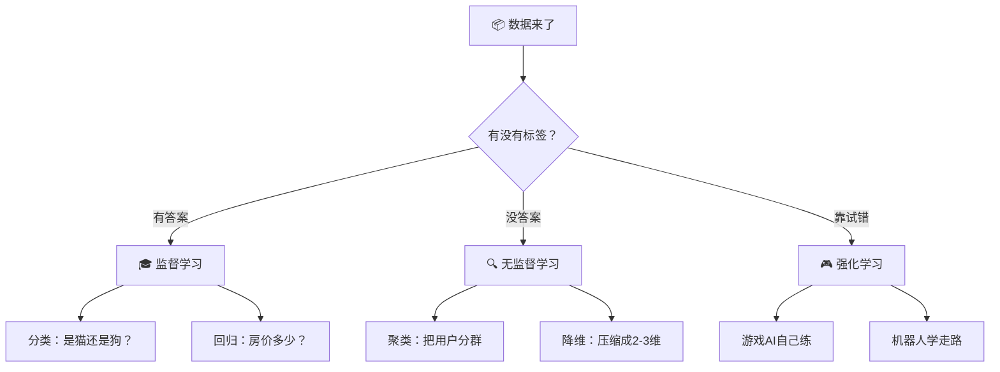

# 第1章：机器学习是什么

## 🎯 读完本章你能...

说清楚机器学习到底在"学"什么，分清监督学习、无监督学习和强化学习这三种模式，知道一个机器学习项目从头到尾要经过哪些步骤。

## 📖 从一个故事开始

王小明是高二（3）班新来的转学生。开学第一天，他坐在教室最后一排，看着前面四十几个陌生的同学，心里想：这些人里，谁会跟我成为朋友呢？

他没有傻等着——他开始观察。第一天，他发现坐他前面的张伟跟他一样在课间刷B站；第二天，他注意到坐在窗边的李婷也在看《三体》；第三天，他发现有个叫刘洋的同学放学后跟他走同一条路。一周下来，王小明把班里的同学大致分成了三类：很可能成为好朋友的、可以聊几句的、可能没太多交集的。

第十天，班主任让王小明选同桌。他毫不犹豫地选了张伟——因为他已经"学到了"谁更合拍。

你可能会说：这不就是交朋友的常识吗？没错。但如果你仔细想一想，王小明做的事情其实包含了一套完整的学习模式——观察（收集数据）、找规律（发现特征）、做预测（判断谁适合做朋友）、根据新信息调整判断（有人对他好他就加分）。而这，恰恰就是机器学习的全部思路。

机器学习和王小明交朋友的唯一区别是：做这件事的不是人，而是计算机程序。

## 📖 原理讲解

### 传统编程 vs 机器学习 —— 两种完全不同的思路

要真正理解机器学习，首先得搞清楚它跟传统编程有什么不同。这是整个领域最基础也最重要的概念区别。

**传统编程**的思维是：程序员写出明确的规则，计算机照章执行。比如你要写一个成绩预警系统，传统做法是：你作为程序员，先想好"什么情况算需要预警"，然后写成代码：`if 出勤率 < 60% and 期中成绩 < 40: return "需要辅导"`。每条规则都是人脑想出来的，计算机只是个听话的执行者。

**机器学习**的思维完全反过来：你给计算机一堆历史数据（500 个学生的出勤率、成绩、课堂表现，以及他们最后有没有真的挂科），然后让计算机自己从数据里找到"什么样的学生容易挂科"的规律。你不用告诉它规则，它自己学。

用一个表格来对比最清楚：

| 对比维度 | 传统编程 | 机器学习 |
|---------|---------|---------|
| 谁写规则 | 程序员手动编写每一条 if-else | 计算机从数据里自动发现规律 |
| 输入什么 | 规则 + 数据 | 数据 + 答案（标签） |
| 输出什么 | 计算结果 | 一个能自动判断的"模型" |
| 举个例子 | 程序员写："如果年龄<18，推荐青少年模式" | 给AI看100万条视频观看记录，让它自己学会给每个人推荐 |
| 优势 | 规则明确，容易调试，出错了能查到哪条规则的问题 | 能发现人脑根本想不到的规律，适应复杂场景 |
| 劣势 | 规则一旦多起来（比如几千条），人脑根本写不过来 | 需要大量数据，结果有时候难以解释"为什么" |
| 适合什么任务 | 算工资、判断素数、格式化文本 | 人脸识别、语音助手、推荐系统 |

用一个生活中的类比来加深印象。传统编程像是在玩《我的世界》里的创造模式——你知道每一块方块放在哪，房子是你一块一块搭出来的。机器学习像是在玩《宝可梦》——你不断让宝可梦对战（给它数据），宝可梦自己升级变强（学习），对战越多越厉害，而你不需要知道它内部每个属性数值是怎么涨的。

### 机器学习的三种模式

机器学习不是只有一种做法。根据你"有没有答案"和"环境给不给反馈"，分为三种模式。

**模式一：监督学习 —— 有答案的练习册**

想象你有一本带标准答案的练习册。你每做一道题，就能对答案：做对了信心加倍，做错了就想想为什么错、下次改正。做得越多，你考试的正确率就越高。

监督学习就是这个思路：给计算机一堆"题目 + 标准答案"（专业术语叫"有标签的数据"），让它在做题和对照中学会从题目推出答案。

监督学习内部又分为两种：

- **分类问题（判断题）**：答案只有几个选项。比如"这封邮件是垃圾邮件还是正常邮件？"（二分类）、"这张照片里是猫、狗还是兔子？"（多分类）、"这个学生期末会挂科吗？"（二分类）。
- **回归问题（填空题）**：答案是连续的数字。比如"这套房子大概值多少钱？"、"明天上海的最高温度是多少？"、"这个学生期末能考多少分？"

举个例子：假设你要做一个"判断照片里有没有猫"的程序。你准备了10000张照片，每张都标好了"有猫"或"没猫"。你把照片和标签一起喂给模型，模型看了几千张后，自己总结出了一套"猫的特征"——尖耳朵、胡须、竖瞳孔。下次看到一张新照片，它就能判断了。

**模式二：无监督学习 —— 没有答案，自己找规律**

这回你拿到的是一堆练习题，但没有任何答案。怎么办？

你可能会翻看这些题，发现它们可以分成几类：有一类全是计算题，有一类全是背诵题，有一类全是理解分析题。你还可能发现某两道题特别像，可能是同一个知识点。你不知道每道题的"标准答案"，但你发现了题与题之间的内在结构。

无监督学习就是这样：把一堆没有标签的数据丢给计算机，让它自己找出隐藏的规律和结构。

两个典型应用：

- **聚类（自动分类）**：B站有上亿用户，怎么给每个人推荐不同的内容？聚类算法会自动把用户分成"只刷鬼畜的""只看考研视频的""只看游戏直播的""什么都看的"等群体——不需要人手动给每个用户贴标签，算法自己就能识别出相似的群体。
- **降维（压缩信息）**：假设你有50个科目的成绩数据，每科都是一维，一共有50维。降维算法可以发现：其实这50科可以压缩成两三个核心维度——比如"文科能力""理科能力"和"艺术能力"。把50维压缩到3维，人类就能看懂了。

**模式三：强化学习 —— 打游戏升级**

这是最接近人类学习方式的模式。你玩《王者荣耀》，每赢一局获得一颗星，输了掉一颗星。你不断调整策略：什么时候该去支援？什么时候该带线？哪个英雄你玩得最好？你通过"试错"和"奖惩"逐步找到最佳打法。

强化学习完全一样：AI智能体在一个环境里不断尝试各种动作，做对了环境给它奖励（reward），做错了给它惩罚（negative reward）。它的目标很简单——让总奖励最大化。

2017年的AlphaGo就是这样学会下围棋的。它没有看人类棋谱（不像监督学习），而是和自己下了几百万盘棋。每盘棋结束后，赢了就"奖励"自己走的那几步，输了就"惩罚"。下到后面，它从完全不会到战胜了世界冠军李世石和柯洁。

强化学习最经典的场景是游戏AI和机器人控制：让AI自己学会走路、学会抓取物体、学会玩超级马里奥——没人教它怎么按手柄，它自己试出来的。

**三模式对比速查表：**

| 对比维度 | 监督学习 | 无监督学习 | 强化学习 |
|---------|---------|-----------|---------|
| 给什么数据 | 题目 + 答案（有标签） | 只有题目（无标签） | 环境反馈（奖励/惩罚） |
| 像什么 | 有答案的练习册 | 自己整理错题本 | 打游戏练级 |
| 谁告诉它"对错" | 数据的标签 | 没人告诉，自己找 | 环境的奖惩信号 |
| 典型任务 | 分类、回归 | 聚类、降维 | 游戏AI、机器人、自动驾驶 |
| 高中生能理解的例子 | 判断照片里有没有猫 | 把B站用户分成几个兴趣群 | AlphaGo学下围棋 |

### 一个机器学习项目从零到上线：8步走

你以后如果真的做一个机器学习项目，会经过这8个步骤。现在不用记住每一步的细节，先有个全景地图就够了。我们用"帮学校预测哪些同学有挂科风险"当例子来走一遍：

```
                        ┌─────────┐
                        │ ① 定目标 │
                        └────┬────┘
                             │  我们要预测什么？→ 期末数学是否及格
                             ▼
                        ┌─────────┐
                        │ ② 收数据 │
                        └────┬────┘
                             │  收集：平时成绩、出勤率、举手次数、作业提交率...
                             ▼
                        ┌─────────┐
                        │ ③ 洗数据 │
                        └────┬────┘
                             │  缺的填上，错的改掉，重复的删除
                             ▼
                        ┌─────────┐
                        │ ④ 选特征 │
                        └────┬────┘
                             │  学号没用去掉，出勤率和作业完成率很有用留下
                             ▼
                        ┌─────────┐
                        │ ⑤ 选模型 │
                        └────┬────┘
                             │  数据少用简单模型，数据多用复杂模型
                             ▼
                        ┌─────────┐
                        │ ⑥ 训练   │
                        └────┬────┘
                             │  喂数据 → 模型调整参数 → 越来越准
                             ▼
                        ┌─────────┐
                        │ ⑦ 测试   │
                        └────┬────┘
                             │  用没见过的数据考模型 → 看真实水平
                             ▼
                        ┌─────────┐
                        │ ⑧ 上线   │
                        └─────────┘
                             │  部署到学校系统，真的用来预警
                             ▼
                          🎉 完成！
```

**第1步：定目标** —— 这是最重要的一步。你想预测什么？是预测"会不会挂科"（分类问题），还是预测"能考多少分"（回归问题）？目标不清晰，后面全白干。

**第2步：收数据** —— 收集对预测有帮助的信息。比如：平时作业成绩、上课出勤率、课堂举手次数、期中考试分数、家长会出勤率、有没有参加课后辅导班、每日平均睡眠时间……收集得越全面越好，但不相关的信息不要乱收（比如学号就跟成绩毫无关系）。

**第3步：洗数据** —— 真实数据永远是脏的。有人出勤率填了200%（明显手误），有人的成绩空白（缺考或忘了填），同一个人的记录录了两遍（重复数据）。这一步虽然枯燥，但决定模型的上限——垃圾进、垃圾出。

**第4步：选特征** —— 不是所有收集到的信息都有用。学号和成绩无关，"喜欢的颜色"可能也和成绩无关。你得选出真正有预测能力的特征。这一步需要领域知识——你得大概知道"什么会影响学习成绩"。

**第5步：选模型** —— 该用一个简单的线性模型，还是一个复杂的神经网络？一般原则：数据量小选简单模型（不容易过拟合），数据量大选复杂模型（可以学到更精细的规律）。

**第6步：训练** —— 把数据喂给模型，让模型一遍一遍地看，不断调整自己的内部参数，让预测越来越接近真实答案。这就像你反复做同一类型的题，慢慢就掌握了。

**第7步：测试** —— 这步最关键！训练完后，不能拿训练时用过的数据来"考试"（那样就像你考试前刚好做过一样的题，分高但不代表真会了）。必须用模型从没见过的新数据来测——如果新数据上的表现也很准，说明模型真的学会了规律而不是死记硬背。

**第8步：上线** —— 把训练好的模型部署到实际系统中。比如接入学校的教务系统，每当有新数据进来，模型就自动计算挂科风险，及时提醒老师和家长。

想一想：如果你要做"预测今天食堂哪个菜最先卖完"的机器学习项目，每一步你会怎么做？你觉得最难的是哪一步？

### 一个重要定理：天下没有免费的午餐

机器学习里有一个著名定理叫"No Free Lunch"（NFL，没有免费的午餐）。用最通俗的话讲：

**不存在一个在所有问题上都表现最好的算法。**

就像世界上没有一把能打开所有锁的万能钥匙。适合做人脸识别的算法，不一定适合做股票预测；在1000条小数据上表现好的算法，不一定在1000万条大数据上还能赢。

用游戏打比方：《原神》里没有一个角色在打所有副本时都是最强的。胡桃单体爆发伤害极高，但打群怪时就乏力了；妮露绽放队清群怪无敌，但打单体Boss就吃力。选角色要看副本机制——选算法要看数据特点。

又比如运动：博尔特跑100米天下无敌，但让他跑马拉松就不如基普乔格；基普乔格跑马拉松是王者，但100米可能连高中生都跑不过。没有"全能运动员"，同样没有"全能算法"。

"没有免费午餐"定理告诉我们两件事：第一，学机器学习不是学"哪个算法最厉害"，而是学"在什么情况下该用什么算法"；第二，如果有人跟你说他发明了一个"在所有任务上都吊打其他算法"的AI，你可以肯定他在吹牛。

### AI简史：人类追梦80年

机器学习不是突然冒出来的。人类想让机器"思考"的梦想已经追了80多年。看一下这段历程，你会发现今天的ChatGPT其实是几代科学家一步一步铺出来的路。

**1950年 —— 图灵之问**
英国数学家艾伦·图灵发表论文，第一句话就问："机器能思考吗？"他设计了一个"图灵测试"：如果一个人跟一台机器聊天，分辨不出对面是人还是机器，那这台机器就可以说是在思考了。这个测试到今天仍然是AI领域的重要话题。

**1956年 —— AI的生日**
一群科学家在美国达特茅斯学院开了一个暑期会议，会上"人工智能（Artificial Intelligence）"这个词被正式提出来。虽然当时计算机的算力连今天的手机都不如，但大家信心满满，觉得20年内就能造出真正的智能机器。

**1960-1980年 —— 两次"AI寒冬"**
早期的乐观情绪很快被现实打脸。翻译质量差、推理能力弱、算力远远不够——政府和企业纷纷撤资。AI经历了两次"冬天"，许多研究者都不好意思说自己研究AI。

**1997年 —— 深蓝击败国际象棋冠军**
IBM的"深蓝"计算机在国际象棋比赛中击败了世界冠军卡斯帕罗夫。这虽然是一个非常专用、只会下棋的系统，但它第一次向世界证明了：机器在特定智力任务上可以超越人类。

**2012年 —— 深度学习爆发**
这一年被称为"深度学习元年"。一个叫AlexNet的深度学习模型在图像识别比赛中大比分碾压了所有传统方法，错误率一下从26%降到了16%。业界震惊了。从此以后，深度学习开始席卷各个领域。

**2016年 —— AlphaGo击败围棋冠军**
围棋的搜索空间比国际象棋大得多得多——曾经被认为是AI"不可能攻克"的领域。但DeepMind的AlphaGo以4:1击败了世界冠军李世石。尤其是第二盘的第37手棋，被评论员称为"神之一手"——AlphaGo下了一步人类专家根本不会想到的棋，而且最后证明它是对的。

**2017年 —— Transformer诞生**
Google团队发表了论文"Attention Is All You Need"，提出了Transformer架构。这篇8页的论文可能是过去10年最重要的计算机科学论文——因为ChatGPT、文心一言、通义千问、Claude，所有现代大语言模型都基于Transformer。

**2022年底 —— ChatGPT引爆全球**
OpenAI发布了ChatGPT。两个月内用户突破1亿——成为人类历史上增长最快的消费产品。一夜之间，"AI"从实验室走进了每个人的生活。

## 🎨 图解专区

### 图1：机器学习三种模式的直观对比



### 图2：AI发展关键里程碑时间线

| 年份 | 事件 | 关键词 | 影响 |
|------|------|--------|------|
| 1950 | 图灵提出"机器能思考吗" | 图灵测试 | 种下了AI的种子 |
| 1956 | 达特茅斯会议 | "AI"一词诞生 | 确立了研究方向 |
| 1974-1980 | 第一次AI寒冬 | 期望过高 | 经费被砍 |
| 1987-1993 | 第二次AI寒冬 | 专家系统失败 | AI成了贬义词 |
| 1997 | 深蓝击败卡斯帕罗夫 | 国际象棋 | 机器首次在智力游戏赢人类 |
| 2012 | AlexNet夺冠 | 深度学习 | GP​​U+大数据引爆AI革命 |
| 2016 | AlphaGo击败李世石 | 围棋 | 攻克"不可能"领域 |
| 2017 | Transformer论文发表 | 注意力机制 | 现代LLM的基石 |
| 2022 | ChatGPT发布 | 大语言模型 | AI走进亿万人生活 |

## 🤔 课堂活动

### 活动一：拆解抖音推荐算法

**场景**：你打开抖音（或B站），首页给你推荐了一条"猫咪搞笑视频"。三秒钟后你又刷到一条"篮球教学"——因为你昨天点赞了一个NBA集锦。

**材料**：纸和笔，不需要电脑。

**任务**（3人一组，15分钟）：
1. 抖音的推荐算法是"监督学习""无监督学习"还是两者结合？为什么？
2. 列出抖音"收集"了你哪些数据来给你做推荐（至少列5个）。
3. 讨论：如果抖音只用监督学习，可能会出现什么问题？如果只用无监督学习呢？

**讨论**（5分钟）：各组分享结论。引导大家理解：推荐系统其实是监督学习和无监督学习的结合——先用无监督学习把用户聚成相似群体，再用监督学习预测每个用户会对哪个视频点赞。

### 活动二：你手机里有多少ML？

**场景**：你每天用的手机，可能是你接触机器学习最频繁的设备。

**材料**：手机（如果课堂允许）或纸笔回忆。

**任务**（个人或2人一组，10分钟）：
1. 打开你手机的各个App，列出至少10个你"怀疑"用到机器学习的功能。
2. 对每个功能，判断它用的是监督学习、无监督学习还是强化学习。
3. 挑一个你觉得最神奇的功能，想一想：它到底"学"了什么？用了什么数据？

**讨论**（5分钟）：全班汇总，看哪些功能被提到最多次。常见的答案：输入法预测下一个字（监督学习）、相册自动分类人脸（无监督/监督结合）、地图预测路况（回归）、游戏匹配对手（强化学习）。

## 🔬 动手写代码

本章不写代码。这一章的目标是帮你建立一个清晰的"机器学习地图"。后面的每一章会带你实操每一个具体的算法。现在，你只需要带着这张地图，知道接下来要去的方向。

不过如果你实在手痒，可以在浏览器里打开这个链接体验一下，不用安装任何东西：

- Google的Teachable Machine（可教机器学习）：https://teachablemachine.withgoogle.com/ —— 用摄像头教AI识别你的手势，3分钟就能体验"训练一个AI模型"的完整流程。

## 📝 本节小结

- 机器学习的本质是让计算机自己从数据中发现规律，而不是程序员手写规则。
- 三种模式各有各的适用场景：有答案用监督学习，没答案用无监督学习，有奖惩环境用强化学习。
- 一个ML项目从开始到结束有8个步骤，最难的不是写代码，而是搞清楚你要解决什么问题、数据哪里来、以及数据是不是干净的。
- "没有免费午餐"定理告诉我们：不存在万能算法——真正的能力是知道在什么场景用什么方法。

## 📚 参考文献

1. 周志华.《机器学习》. 清华大学出版社, 2016. 国内最经典的机器学习入门教材，被戏称为"西瓜书"（因为封面上的西瓜），适合有一定基础后精读。
2. 李航.《统计学习方法》. 清华大学出版社, 2019. 算法推导非常严谨清晰，适合配合西瓜书一起看。
3. 3Blue1Brown YouTube频道. "Neural Networks"系列. https://www.youtube.com/@3blue1brown — 用顶级动画讲数学和ML，英文但B站有搬运翻译版，强烈推荐。
4. Andrew Ng. "Machine Learning" Coursera课程. https://www.coursera.org/learn/machine-learning — 全球最著名的机器学习入门课，有中文字幕，每年几百万人学。
5. Google. "Machine Learning Crash Course". https://developers.google.com/machine-learning/crash-course — 谷歌出品，完全免费，网页交互式学习，15小时就能学完。
6. Kaggle Learn. https://www.kaggle.com/learn — 直接在浏览器里写Python跑模型，边做边学，有中文版。
7. Teachable Machine. https://teachablemachine.withgoogle.com/ — 谷歌的零代码机器学习体验工具，用摄像头训练AI，好玩又好懂。
8. B站UP主"3Blue1Brown官方中文". https://space.bilibili.com/88461692 — 3Blue1Brown的中文频道，深度学习的动画讲解非常适合入门。
