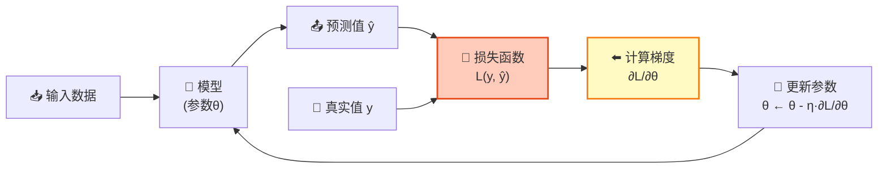
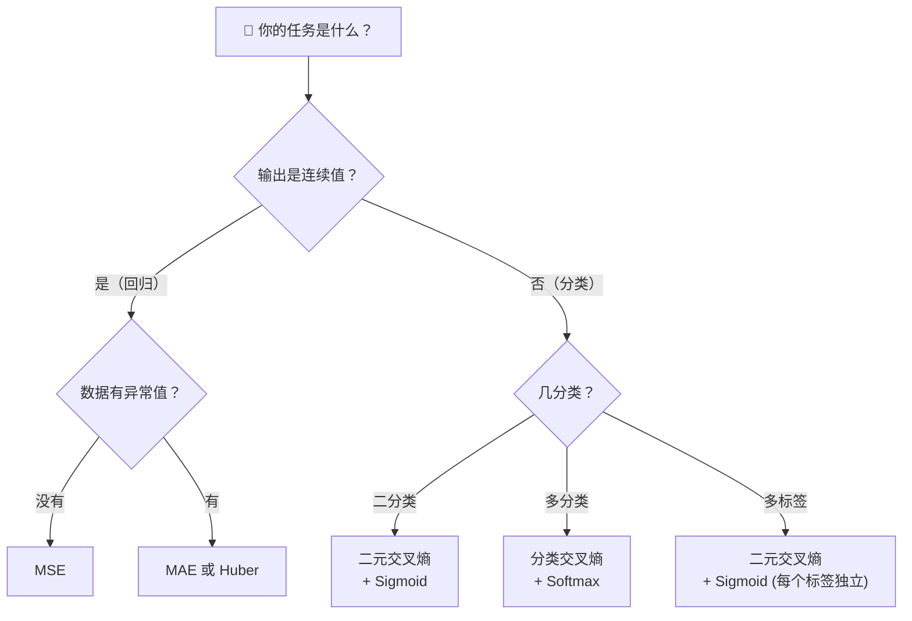

# 第16章：损失函数

## 🎯 读完本章你能...

彻底搞懂损失函数为什么是机器学习的"方向盘"，掌握MSE和交叉熵两个核心损失函数的公式、直觉和使用场景，理解"为什么分类不用MSE"的深层原因，并能手写10行代码实现这两个损失函数。

## 📖 从一个故事开始

陈老师让体育委员"评估"20个同学的投篮水平。体育委员想了一个办法：

对每个同学，他记录"预测进球数"和"实际进球数"，然后计算两者差距——差距越小，说明预测越准。比如小明预测进8个，实际进了7个，差距是1。小华预测进2个，实际进了9个，差距是7。体育委员把所有同学的差距平方加起来除以总人数，得到一个"平均误差"——这就是**均方误差（MSE）** 的雏形。

但问题来了：如果任务不是"预测进球数"，而是"判断这个同学能不能进校队（能/不能）"？这时"差距"的衡量方式完全不同——你不能用"预测'能'、实际'不能'，差距有7个球那么多"来衡量。分类任务的"错误"需要用完全不同的方式来量化。

这就是**损失函数（Loss Function）** 的核心意义：它是机器学习的"计分板"、"方向盘"和"唯一的老师"。

神经网络里所有的参数（成千上万个权重w和偏置b）都靠损失函数来"指导"调整——损失函数告诉网络：你现在的预测和正确答案差多少？往哪个方向调参数能让这个差距变小？没有损失函数，神经网络就像没有GPS的汽车，不知道自己在哪，更不知道往哪开。

## 📖 原理讲解

### 16.1 什么是损失函数？一针见血的定义

**损失函数** \(L(y, \hat{y})\) 是一个衡量"模型预测值 \(\hat{y}\) 和真实值 \(y\) 之间差距"的函数。

这个定义有三个关键：

1. **它是一个函数**：输入是"预测值"和"真实值"，输出是一个数字（损失值）
2. **它衡量"差距"**：预测越接近真实值，损失越小；差距越大，损失越大
3. **它指导学习方向**：损失函数对参数的梯度 \(\frac{\partial L}{\partial w}\) 告诉模型"往哪调参数能让预测变得更准"

**最核心的性质**：损失函数必须是**可导**的（能算梯度），否则反向传播无法工作。

**大白话类比**：损失函数就是"考试改卷老师"——它不关心你是怎么解题的（模型结构），只关心你的答案（预测值）和标准答案（真实值）差了多少分。模型的目标就是"下次少扣点分"。

### 16.2 损失函数 vs 成本函数 vs 评估指标

这三个概念经常被混用，但含义不同：

| 概念 | 符号 | 范围 | 用途 |
|------|------|------|------|
| **损失函数** | \(L(y, \hat{y})\) | 单个样本 | 计算一个样本的误差，反向传播直接用它算梯度 |
| **成本函数** | \(J(\theta) = \frac{1}{n}\sum L(y_i, \hat{y}_i)\) | 整个训练集 | 衡量"模型在整个训练集上的平均表现"，梯度下降实际优化这个 |
| **评估指标** | 如准确率、F1 | 整个测试集 | 告诉"人"这个模型好不好，不参与训练（不要求可导） |

**关键区别**：评估指标不一定能当损失函数。比如"准确率"不可导（预测从错变对时，准确率是跳跃的），所以不能直接优化——这就是为什么分类任务用交叉熵而不用准确率做损失函数。

### 16.3 均方误差（MSE）：回归任务的"标准答案"

**均方误差（Mean Squared Error, MSE）** 是回归任务最常用的损失函数。

**公式**（对单个样本的损失，即平方误差）：

\[
L(y, \hat{y}) = (y - \hat{y})^2
\]

**公式**（对整个数据集，即均方误差）：

\[
\text{MSE} = \frac{1}{n} \sum_{i=1}^{n} (y_i - \hat{y}_i)^2
\]

**逐符号解释**：
- \(y_i\)：第i个样本的真实值（比如：这套房子实际卖了500万）
- \(\hat{y}_i\)：模型对第i个样本的预测值（模型猜是480万）
- \(y_i - \hat{y}_i\)：误差（实际-预测 = 500-480 = 20万）
- \((y_i - \hat{y}_i)^2\)：平方误差。为什么平方？一是消掉正负号（高估和低估都是"错"），二是"大错重罚"——差2倍就是4倍的惩罚
- \(\sum\)：对所有n个样本求和
- \(\frac{1}{n}\)：取平均，让损失不依赖于样本数量

**为什么MSE用平方而不是绝对值？**

绝对值误差 \(L = |y - \hat{y}|\) 也能用，但有一个致命问题：它在 \(y = \hat{y}\) 处不可导（绝对值函数在0点有个尖角）——梯度下降需要"平滑"的导数。

平方误差处处可导，且导数非常简洁：
\[
\frac{\partial L}{\partial \hat{y}} = -2(y - \hat{y})
\]

梯度恰好与误差成正比——误差越大，梯度越大，参数调整越快。这非常符合直觉："错得离谱就使劲改，差不多对了就微调"。

### 16.4 交叉熵（Cross-Entropy）：分类任务的"专属裁判"

**交叉熵损失（Cross-Entropy Loss）** 是分类任务的标准损失函数。

**二分类的交叉熵**（最常用形式）：

\[
L(y, \hat{y}) = - \left[ y \log(\hat{y}) + (1 - y) \log(1 - \hat{y}) \right]
\]

**多分类的交叉熵**：

\[
L(\mathbf{y}, \hat{\mathbf{y}}) = - \sum_{c=1}^{C} y_c \log(\hat{y}_c)
\]

**逐符号解释**：
- \(y\)：真实标签（1或0，或者多分类中是One-Hot向量）
- \(\hat{y}\)：模型预测的"概率"（经过Sigmoid或Softmax，值在0到1之间）
- \(\log(\hat{y})\)：对数。\(\hat{y} \to 1\)时，\(-\log(\hat{y}) \to 0\)（损失很小）；\(\hat{y} \to 0\)时，\(-\log(\hat{y}) \to +\infty\)（损失爆炸）
- \(C\)：类别总数

**交叉熵的直觉**：

当你预测一个样本是"猫"的概率 \(\hat{y} = 0.9\)，而它确实是猫（y=1）：
\(\text{CE} = -\log(0.9) \approx 0.105\)——损失很小，模型很自信且正确。

当你预测它是猫的概率 \(\hat{y} = 0.1\)，但它是猫（y=1）：
\(\text{CE} = -\log(0.1) \approx 2.303\)——损失很大，模型犯了严重错误。

**交叉熵的梯度**（Softmax + Cross-Entropy 组合的优雅性质）：

\[
\frac{\partial L}{\partial z_c} = \hat{y}_c - y_c
\]

这是一个极其简洁的结果——损失对第c类输出logit的梯度，就等于"预测概率减去真实标签"！这就是为什么深度学习框架"默认"用交叉熵做分类损失。

### 16.5 为什么分类不用MSE？深度解读

这是初学者最容易困惑的问题之一，也是最值得深入理解的。

**表面原因**：分类任务的输出是"概率"（0到1之间）和"类别"（0或1），MSE在这种场景下不是不行，但有三大致命问题：

**问题1：梯度消失**

当Sigmoid输出接近0或1时（模型很"自信"但可能自信错了），Sigmoid的导数 \(\sigma(z)(1-\sigma(z))\) 非常接近0。MSE损失乘以这个几乎为0的梯度 → 梯度几乎消失 → 模型学不动。

而交叉熵在处理Softmax/Sigmoid输出时，Sigmoid的导数恰好被"消掉"了——梯度变成简单的 \(\hat{y} - y\)，不会消失。

**问题2：损失曲面不平坦**

用MSE训练分类器时，损失曲面"坑坑洼洼"——有很多平坦区域（梯度很小，几乎不更新）和陡峭区域（梯度突变）。优化器在这种曲面上走得非常慢。

交叉熵的损失曲面更"光滑"、"更像一个碗"——梯度下降能更顺畅地滑向最优解。

**问题3：概率解释不匹配**

MSE假设"预测值"和"真实值"之间的误差服从高斯分布（正态分布的误差）。这在回归任务中是合理的假设。但分类任务的真实值是离散的（0或1）——明显不服从高斯分布，MSE的假设不成立。

交叉熵则直接来自**最大似然估计（Maximum Likelihood Estimation）**——假设数据服从伯努利分布（二分类）或分类分布（多分类），这是分类的"自然"数学框架。

**对比总结**：

| 维度 | MSE（回归） | 交叉熵（分类） |
|------|-----------|-------------|
| 适用任务 | 预测连续值（房价、温度） | 预测离散类别（猫/狗、垃圾/正常） |
| 输出范围 | 任意实数 | (0, 1)的概率 |
| 对"自信错误"的惩罚 | 惩罚有限（最多1） | 惩罚爆炸（对数的威力） |
| 梯度性质 | 乘Sigmoid导数→可能消失 | \(\hat{y}-y\)，永不消失 |
| 概率假设 | 误差服从高斯分布 | 标签服从伯努利/分类分布 |

### 16.6 其他重要损失函数速览

| 损失函数 | 公式 | 适用场景 | 特点 |
|---------|------|---------|------|
| **MAE**（平均绝对误差） | \(\frac{1}{n}\sum\|y-\hat{y}\|\) | 回归，有异常值时 | 对异常值不敏感（不像MSE那样"平方放大"），但0点不可导 |
| **Huber损失** | 分段：小误差用MSE，大误差用MAE | 回归，兼顾MSE和MAE | MSE的平滑 + MAE的鲁棒 |
| **Hinge损失** | \(\max(0, 1-y\cdot\hat{y})\) | SVM分类 | "只要分对了就不惩罚"，关注"分得够不够开" |
| **KL散度** | \(\sum y\log(y/\hat{y})\) | 概率分布对比 | 衡量两个概率分布的差异 |
| **CTC损失** | 略 | 语音识别、OCR | 处理"输入和输出没对齐"的序列问题 |

---

## 🎨 图解专区

### MSE与交叉熵的损失值随预测值变化曲线

```mermaid
graph LR
    subgraph MSE损失 L=y-ŷ²
        direction TB
        M1["当 y=1时：<br/>ŷ=0.0 → L=1.0<br/>ŷ=0.5 → L=0.25<br/>ŷ=0.9 → L=0.01<br/>ŷ=1.0 → L=0.0<br/><br/>惩罚对称且温和"]
    end
    subgraph 交叉熵损失 L=-ylogŷ-(1-y)log(1-ŷ)
        direction TB
        C1["当 y=1时：<br/>ŷ=0.0 → L=∞<br/>ŷ=0.5 → L≈0.69<br/>ŷ=0.9 → L≈0.11<br/>ŷ=1.0 → L=0.0<br/><br/>对错误预测惩罚极重"]
    end
```

### 分类任务用MSE vs 交叉熵的梯度对比（ASCII示意图）

```
                    真实标签 y=1（这是猫！）

模型预测ŷ              如果用MSE：                      如果用交叉熵：
（Sigmoid输出）         梯度 = 2(ŷ-1)·ŷ(1-ŷ)           梯度 = ŷ - 1

ŷ=0.99（正确，自信）    2(-0.01)×0.99×0.01              -0.01
                       ≈ -0.0002（几乎不更新 ✓）        （小梯度，微调 ✓）

ŷ=0.01（错误，自信）    2(-0.99)×0.01×0.99               -0.99
                       ≈ -0.0196（还是很小！✗）         （大梯度，猛学 ✓）

交叉熵的胜利：当模型"自信地错了"（如ŷ=0.01，但实际y=1），MSE的梯度被Sigmoid
导数压缩到只有约0.02——模型几乎学不动；而交叉熵的梯度约为0.99，能强力纠正错误。
```

### 损失函数在训练中的角色



### 损失函数选择决策树



---

## 🤔 课堂活动

### 🤔 活动1：手算MSE和交叉熵——感受两者的"惩罚力度"

**场景**：给定3个样本的真实值和模型预测值，分别计算MSE和交叉熵，比较两者的"惩罚力度"差异。

**材料**：纸、笔、计算器（手机即可）

**给定数据**：
```
样本    真实值y   预测值ŷ（回归用）   预测概率p̂（分类用）
 A        5            4.8                0.9（类别=1）
 B        5            3.0                0.5（类别=1）
 C        5            1.0                0.1（类别=1）
```

**任务**：
1. 对样本A/B/C分别计算MSE的单样本损失：（y - ŷ）²
2. 对样本A/B/C分别计算交叉熵的单样本损失：-log(p̂)（因为y=1）
3. 填入对比表格，观察：当预测越来越离谱时，MSE和交叉熵的惩罚增长速率有何不同？
4. 思考：样本C中模型给出了非常错误的预测——但交叉熵给的惩罚远大于MSE的相对增长比例。这对"模型的纠正意愿"有什么影响？

**参考结果**：
```
样本    MSE      交叉熵
 A     0.04      0.105
 B     4.00      0.693
 C     16.00     2.303
```

**讨论**：
- MSE从A到C增长了400倍（0.04→16），交叉熵增长了22倍（0.105→2.303）。等等——MSE增长倍数更大？重新想一想：我们比较的是"绝对值"还是"梯度"？哪个更重要？
- 如果模型输出概率p̂=0.001（几乎断定"绝对不是猫"），但确实是猫——交叉熵损失值是多少？这个损失值会让模型"震惊"到什么程度？

### 🤔 活动2：设计你自己的"损失函数"

**场景**：你被任命为一款"智能营养App"的算法工程师。App需要根据用户输入的"今天吃了什么"，预测他今天摄入了多少卡路里。

**特殊需求**：产品经理告诉你——"高估卡路里"比"低估卡路里"更严重。因为高估意味着App告诉用户"你吃超了"，用户会注意控制饮食（只是小小的不便）；低估意味着App说"没事你没超"，用户就放心大吃（健康风险更大）。

**任务**：
1. 在标准MSE中，高估和低估受到的惩罚是对称的。设计一个**不对称的损失函数**——高估时惩罚更大（或低估时惩罚更大）
2. 写出你的损失函数的公式，并解释每一项的含义
3. 讨论：除了惩罚系数，还有什么方法可以实现"不对称惩罚"？比如对MSE做分段处理？
4. 从数学上验证：你的损失函数在哪些点可导？如果不可导，有什么变通办法？（提示：可以用Huber损失的思想来"平滑"转折点）

**讨论**：
- 这个例子说明了一个重要观点：损失函数不仅是"数学工具"，更是"把业务需求翻译成数学"的桥梁。你能想到其他需要"不对称损失"的场景吗？（提示：医疗诊断——漏诊 vs 误诊，哪个更严重？）
- 如果损失函数不可导，模型还能训练吗？有没有其他优化方法？（提示：进化算法、贝叶斯优化不依赖梯度）

---

## 🔬 动手写代码

亲手实现MSE和交叉熵损失函数，并验证与PyTorch官方实现一致。

```python
"""
手写MSE和交叉熵损失函数
目标：深入理解两个核心损失函数的计算过程
依赖：pip install torch numpy
"""
import torch
import torch.nn.functional as F

# ─── 1. 手写MSE ───
def my_mse(y_pred, y_true):
    """均方误差：MSE = (1/n) * Σ(y_true - y_pred)²"""
    return ((y_true - y_pred) ** 2).mean()

# ─── 2. 手写二分类交叉熵 ───
def my_binary_ce(y_pred, y_true):
    """二分类交叉熵：- [y·log(ŷ) + (1-y)·log(1-ŷ)]"""
    y_pred = torch.clamp(y_pred, 1e-7, 1-1e-7)  # 防log(0)
    return -(y_true * torch.log(y_pred) + 
             (1 - y_true) * torch.log(1 - y_pred)).mean()

# ─── 3. 测试 ───
# 回归场景
pred = torch.tensor([4.8, 3.0, 1.0])
true = torch.tensor([5.0, 5.0, 5.0])
print(f"手写MSE:    {my_mse(pred, true):.4f}")
print(f"PyTorch MSE:{F.mse_loss(pred, true):.4f}")

# 分类场景（概率输出 + 真实标签）
pred_p = torch.tensor([0.9, 0.5, 0.1])   # 预测概率（是猫的概率）
true_l = torch.tensor([1.0, 1.0, 1.0])    # 真实标签（都是猫）
print(f"\n手写CrossEntropy:  {my_binary_ce(pred_p, true_l):.4f}")
print(f"PyTorch BCE:        {F.binary_cross_entropy(pred_p, true_l):.4f}")

# ─── 4. 动手验证：对"自信错误"的惩罚 ───
print("\n=== 验证：自信错误 vs 不自信错误 ===")
for p in [0.99, 0.9, 0.5, 0.1, 0.01]:
    p_tensor = torch.tensor([p])
    t_tensor = torch.tensor([1.0])
    ce = my_binary_ce(p_tensor, t_tensor).item()
    mse = my_mse(p_tensor, t_tensor).item()
    print(f"p̂={p:.2f} → 交叉熵={ce:.4f}, MSE={mse:.4f}")
```

**运行后你会看到**：当模型"自信地错"（p̂=0.01）时，交叉熵=4.605，而MSE=0.980。交叉熵给了近5倍的惩罚强度——这就是它"使劲纠正"自信错误的机制。手写结果和PyTorch官方实现应该完全一致。

---

## 📝 本节小结

1. 损失函数是机器学习的"唯一老师"——它量化预测值和真实值的差距，其梯度指导模型参数往哪个方向调整，不同任务（回归/分类）需要完全不同的损失函数。
2. MSE（\(\frac{1}{n}\sum(y-\hat{y})^2\)）用于回归，通过平方放大大误差的惩罚；交叉熵（\(-\sum y\log\hat{y}\)）用于分类，通过对数函数让"自信错误"付出极高代价，且梯度永不消失。
3. 分类不用MSE的根本原因有三：Sigmoid在极端输出处梯度消失（MSE的梯度乘了Sigmoid导数）、损失曲面不平坦优化困难、概率假设不匹配（分类数据不服从高斯分布）——交叉熵在三个维度上都碾压MSE。

---

## 📚 参考文献

1. **Goodfellow, I., Bengio, Y., & Courville, A. (2016).** *Deep Learning*. MIT Press. —— 第6.2节"Cost Functions"系统讲解了MSE、交叉熵及其概率解释，是本章内容的权威来源。
2. **Bishop, C. (2006).** *Pattern Recognition and Machine Learning*. Springer. —— 第4章从最大似然估计推导交叉熵损失函数，数学严谨，想要深入理解必读。
3. **"Understanding Categorical Cross-Entropy Loss"** —— Raúl Gómez的博客文章 (gombru.github.io)，用大量精美图表解释分类损失函数，比教科书好懂得多。
4. **3Blue1Brown - "Gradient Descent"** —— YouTube频道（B站有翻译），用动画展示损失曲面和梯度下降如何找到最低点，建立直觉的最佳视频。
5. **李宏毅《机器学习》2021 - 第3讲"深度学习基础"** —— B站搜索，台湾大学教授用极其通俗的语言讲解损失函数的作用，并做了精彩的"为什么分类不用MSE"实验演示。
6. **PyTorch官方损失函数文档** (pytorch.org/docs/stable/nn.html#loss-functions) —— 列出了PyTorch内置的20+种损失函数及其公式和使用场景，快速查阅手册。
7. **"Loss Functions in Machine Learning"** —— Towards Data Science上的综述文章，对比了10+种常用损失函数，每种都有公式+代码+可视化。
8. **《统计学习方法（第2版）》** —— 李航著，清华大学出版社。第1章从"损失函数→风险最小化→经验风险最小化"逐步推导机器学习的基本框架，中文阅读体验极佳。
