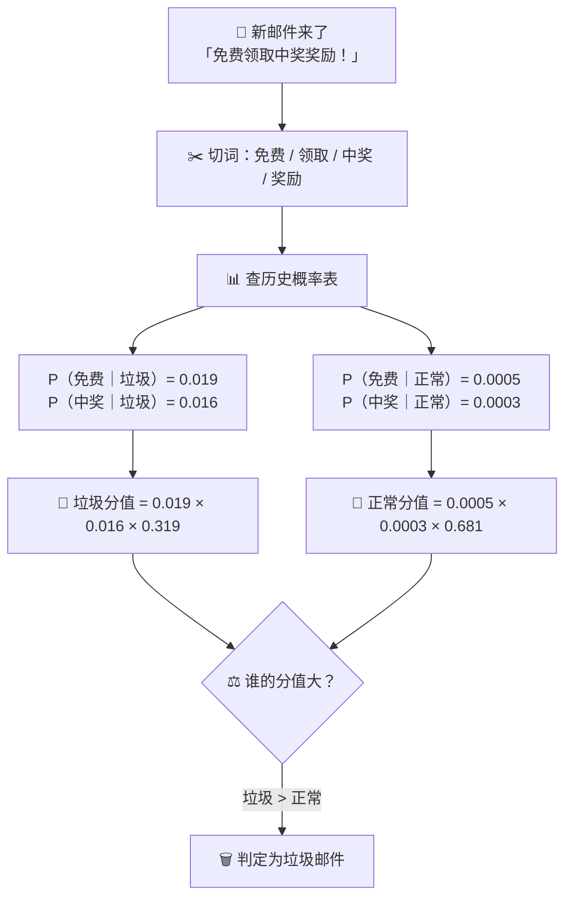

# 第3章：朴素贝叶斯

## 🎯 读完本章你能...

用手算的方式判断一封邮件是不是垃圾邮件，理解贝叶斯定理的直觉含义，知道"朴素"假设为什么既粗暴又好用。

## 📖 从一个故事开始

林小凡打开QQ邮箱，发现收件箱里躺着47封未读邮件。其中有32封是"正常邮件"——同学发的作业、社团通知、B站关注UP主的更新提醒。剩下15封全是垃圾邮件——什么"恭喜您中奖了""免费领取游戏皮肤""您的快递丢失请点击链接"。

林小凡烦透了。她不想每天早上花10分钟手动分辨垃圾邮件。她想写一个"智能垃圾邮件过滤器"。

她翻了翻这些历史邮件，发现了一个规律：垃圾邮件里总是反复出现某些词——"免费"出现了14次，"中奖"出现了12次，"点击"出现了13次；而在正常邮件里，这些词很少出现——"免费"只出现了1次，"中奖"出现了0次，"点击"出现了2次。

于是她总结了一套规则：如果一封新邮件含有"免费"两个字，它是垃圾邮件的概率就很高。如果它同时含有"免费"和"中奖"，那就几乎是100%的垃圾邮件了。

第48封邮件来了。标题是："【重要通知】免费领取您的学期奖励，点击中奖入口"。

林小凡看了一眼，"免费""中奖""点击"三个词全中——拉黑，毫无疑问。

她刚刚做的事情，就是朴素贝叶斯算法的完整直觉过程：根据每个词在垃圾邮件和正常邮件里出现的历史概率，综合判断一封新邮件的"垃圾程度"。

## 📖 原理讲解

### 贝叶斯定理：世界上最强的信念更新法则

朴素贝叶斯算法的底层是一个数学公式，叫贝叶斯定理（Bayes' Theorem）。这个定理只有四块积木，但搭起来的力量极其强大。

先看公式：
\[
P(A \mid B) = \frac{P(B \mid A) \cdot P(A)}{P(B)}
\]

别被符号吓到。我用一个你每天都会遇到的场景来解释：**点外卖**。

### 点外卖类比：一步一步拆解贝叶斯定理

你和一个同学一起点外卖。你想吃黄焖鸡米饭，但你在等外卖的时候不知道这份外卖到底是你的还是他点的。你有一个"初始信念"：因为你俩都爱吃黄焖鸡，所以你觉得这份外卖有50%的概率是你的。

这时你闻到了一股酸味——这份外卖里好像加了很多醋。你知道，你吃黄焖鸡喜欢狂加醋（80%的概率），但你同学吃黄焖鸡很少加醋（只有10%的概率）。

你的大脑自动更新了判断："这份加了醋的黄焖鸡，更像是我点的。"你的信念从"50%是我的"更新到了"89%是我的"。

这就是贝叶斯定理在做的——**根据新证据，更新旧信念**。

现在我们把这个过程拆成四块积木，一一对上公式的每个符号：

- **\(P(A)\)** 是**先验概率**（Prior Probability）——在你闻到醋味之前，你觉得外卖是你的概率。这里是50%，写作 \(P(\text{我的}) = 0.5\)。

- **\(P(B \mid A)\)** 是**似然度**（Likelihood）——如果这份外卖确实是你的，它加醋的概率是多少？你知道自己80%的情况下会加醋，所以 \(P(\text{加醋} \mid \text{我的}) = 0.8\)。"|"读作"在...条件下"，\(P(B \mid A)\) 读作"在A发生了的条件下B发生的概率"。

- **\(P(B)\)** 是**证据概率**（Evidence）——不管外卖是谁的，这份外卖加醋的总概率是多少？这等于"你的外卖加醋"加上"你同学的外卖加醋"：
  \[
  P(\text{加醋}) = P(\text{加醋} \mid \text{我的}) \cdot P(\text{我的}) + P(\text{加醋} \mid \text{同学的}) \cdot P(\text{同学的})
  \]
  = 0.8 × 0.5 + 0.1 × 0.5 = 0.4 + 0.05 = 0.45

- **\(P(A \mid B)\)** 是**后验概率**（Posterior Probability）——闻到了醋味之后，你更新过的信念：这份外卖有多大概率是你的？
  \[
  P(\text{我的} \mid \text{加醋}) = \frac{0.8 \times 0.5}{0.45} = \frac{0.4}{0.45} \approx 0.89
  \]

从50%更新到89%——这就是贝叶斯定理的威力。

**一句话总结贝叶斯定理的直觉**：
> 新判断 = 旧判断 × 新证据的强度

旧判断是你的先验概率，新证据的强度是"如果假设正确，看到这个证据的概率"。证据越独特（比如加醋这个习惯只有你有），更新力度就越大。

### 从贝叶斯定理到朴素贝叶斯

理解了贝叶斯定理，接下来就是把它用到垃圾邮件识别上。

假设你收到了一封邮件，里面出现了三个词："免费""中奖""点击"。你想知道这封邮件是垃圾邮件（Spam）的概率：
\[
P(\text{垃圾邮件} \mid \text{免费, 中奖, 点击}) = ?
\]

用贝叶斯公式展开：
\[
P(\text{垃圾} \mid \text{免费, 中奖, 点击}) = \frac{P(\text{免费, 中奖, 点击} \mid \text{垃圾}) \cdot P(\text{垃圾})}{P(\text{免费, 中奖, 点击})}
\]

问题来了：\(P(\text{免费, 中奖, 点击} \mid \text{垃圾})\) 怎么算？这表示"在垃圾邮件中，'免费'、'中奖'、'点击'这三个词同时出现的概率"。如果你词库里有10000个词，那这三个词的组合可能有10000^3种——你根本没有足够的数据来统计每一种三词组合在垃圾邮件里出现的概率。

### "朴素"假设：简单粗暴但出奇制胜

朴素贝叶斯的"朴素"（Naive）就是来解决这个问题的。它做了一个非常"天真"的假设：

> **假设所有词之间是独立的——一个词出现与否，不影响另一个词出现的概率。**

在我们的例子里，"免费"出不出现在邮件里，跟"中奖"出不出现在邮件里，完全没有关系。

这个假设显然不符合现实——垃圾邮件里"免费"和"中奖"经常同时出现，"优惠"和"折扣"也经常打包出现。但有意思的是，虽然在理论上这个假设是错的，在实践中它却工作得非常好。因为即使它把每个词的概率估得不准，但只要不同类别之间的大小关系保持正确，最终分类结果就依然是对的。

有了"朴素"假设之后，联合概率可以拆成单独概率的乘积：
\[
P(\text{免费, 中奖, 点击} \mid \text{垃圾}) = P(\text{免费} \mid \text{垃圾}) \cdot P(\text{中奖} \mid \text{垃圾}) \cdot P(\text{点击} \mid \text{垃圾})
\]

这些单独的概率非常好算——统计一下每个词在各类邮件里出现的频率就行：

\[
P(\text{免费} \mid \text{垃圾}) = \frac{\text{"免费"在垃圾邮件里出现的次数}}{\text{所有垃圾邮件的总词数}}
\]

### 完整手算一遍

用林小凡的数据。她有32封正常邮件和15封垃圾邮件。我们只关注三个词：免费、中奖、点击。

**先验概率**（在不知道内容的情况下，一封新邮件是垃圾邮件的概率）：
\[
P(\text{垃圾}) = \frac{15}{15+32} \approx 0.319
\]
\[
P(\text{正常}) = \frac{32}{15+32} \approx 0.681
\]

**各词在各类中出现的概率**（统计所有邮件中每个词出现的次数）：

假设统计结果是：
- "免费"：垃圾邮件里出现了14次（共15封），正常邮件里出现1次（共32封）
- "中奖"：垃圾邮件里出现了12次，正常邮件里出现0次
- "点击"：垃圾邮件里出现了13次，正常邮件里出现2次

假设垃圾邮件平均每封有50个词（总词数 = 15 × 50 = 750），正常邮件平均每封60个词（总词数 = 32 × 60 = 1920）。

那么：
\[
P(\text{免费} \mid \text{垃圾}) = \frac{14}{750} \approx 0.0187
\]
\[
P(\text{免费} \mid \text{正常}) = \frac{1}{1920} \approx 0.00052
\]
\[
P(\text{中奖} \mid \text{垃圾}) = \frac{12}{750} = 0.0160
\]
\[
P(\text{中奖} \mid \text{正常}) = \frac{0}{1920} = 0
\]
\[
P(\text{点击} \mid \text{垃圾}) = \frac{13}{750} \approx 0.0173
\]
\[
P(\text{点击} \mid \text{正常}) = \frac{2}{1920} \approx 0.00104
\]

现在来了一封新邮件，包含"免费 中奖 点击"。算它是垃圾邮件的概率：

\[
\begin{align}
P(\text{垃圾} \mid \text{免费, 中奖, 点击}) &\propto P(\text{免费} \mid \text{垃圾}) \cdot P(\text{中奖} \mid \text{垃圾}) \cdot P(\text{点击} \mid \text{垃圾}) \cdot P(\text{垃圾}) \\
&= 0.0187 \times 0.0160 \times 0.0173 \times 0.319 \\
&\approx 1.65 \times 10^{-6}
\end{align}
\]

同理算它是正常邮件的概率：
\[
\begin{align}
P(\text{正常} \mid \text{免费, 中奖, 点击}) &\propto 0.00052 \times 0 \times 0.00104 \times 0.681 \\
&= 0
\end{align}
\]

正常邮件的概率变成了0！因为"中奖"在正常邮件里一次都没出现过。垃圾邮件的得分远大于正常邮件——果断判断为垃圾。

### 拉普拉斯平滑：帮"没见过"的词说话

上面的计算暴露了一个严重问题：因为"中奖"在32封正常邮件里从未出现，导致 \(P(\text{中奖} \mid \text{正常}) = 0\)，然后不管其他证据有多强，整个正常邮件的得分直接归零——因为乘法里有一个0。

这叫"零概率问题"。在真实世界里，"中奖"完全可能出现在正常邮件里（比如有人发"我考试中奖了"虽然用词奇怪但不是垃圾邮件）。只是因为你的训练数据恰好没包含，算法就永远把它判死了。

**拉普拉斯平滑**（Laplace Smoothing）是解决这个问题的标准方法。做法极其简单：**在所有计数上加一个小的正数，让每个词至少都有"一点点"概率**。

最常用的拉普拉斯平滑（也叫"加1平滑"）：
\[
P(\text{词} \mid \text{类别}) = \frac{\text{该词在该类的出现次数} + 1}{\text{该类所有词总数} + \text{不同词的个数}}
\]

分子加1，分母加所有不同词的个数（保证加起来概率还是1）。

回到我们的例子，假设整个词库一共有2000个不同的词。加上拉普拉斯平滑后：
\[
P(\text{中奖} \mid \text{正常}) = \frac{0 + 1}{1920 + 2000} = \frac{1}{3920} \approx 0.000255
\]

不再是0了。虽然这个概率很小，但至少不会因为一个词没见过就把整个判断锁死。

拉普拉斯平滑的本质是给"没见过的东西"留一点余地。就像你做选择题，你从没见过A选项的题，但你也不能说A选项的概率是0——万一这次就考到了呢？

### 朴素贝叶斯的几种变体

根据数据的特征类型，朴素贝叶斯有三种常见变体：

- **多项式朴素贝叶斯（Multinomial NB）**：适合词频数据——比如"这封邮件里'免费'出现了3次"。离散计数。垃圾邮件过滤就用这个。
- **伯努利朴素贝叶斯（Bernoulli NB）**：适合"出现/不出现"的二值数据——"这封邮件里有没有'免费'这个词"。有就是1，没有就是0。适合短文本。
- **高斯朴素贝叶斯（Gaussian NB）**：适合连续数值数据——比如"身高175cm"。这时不用计数，而是假设每个特征的数值符合正态分布（钟形曲线）。

### 朴素贝叶斯的优缺点

**优点：**
- 极其快。训练只需要数一遍所有词的出现次数（时间复杂度O(N)），预测只需要查表和做几次乘法。对比KNN每次预测要算所有距离，朴素贝叶斯快得多。
- 对小数据也很有效。因为模型简单（只是"记住每个词的概率"），不容易在小数据上过拟合。
- 对不相关特征有天然的抵抗力。如果一个词在各个类别里出现概率差不多（比如"的""了""是"这种停用词），它在乘法里不贡献区分度，几乎不影响判断。
- 可解释。你可以直接说出"这封邮件被判为垃圾邮件，主要是因为'免费'和'中奖'的概率贡献太大"。

**缺点：**
- "朴素"假设在现实里是错的。词和词之间有关系——"机器学习"和"深度学习"经常一起出现。这种关联信息被忽略了。
- 对概率估计偏差敏感。如果某个词在正常邮件里恰好没出现，拉普拉斯平滑虽然能救回来，但如果数据极度不平衡（比如垃圾邮件只有1%），概率估计仍然会不稳定。
- 不能用于回归——朴素贝叶斯本质上是分类算法，不能预测连续数值。

## 🎨 图解专区

### 图1：朴素贝叶斯邮件分类全过程



### 图2：贝叶斯定理四块积木速查

| 符号 | 名字 | 大白话 | 点外卖例子 |
|------|------|--------|-----------|
| \(P(A)\) | 先验概率 | 见到证据之前的信念 | 闻之前觉得50%是我的 |
| \(P(B \mid A)\) | 似然度 | 如果A成立，看到B的概率 | 如果是我的外卖，80%会加醋 |
| \(P(B)\) | 证据概率 | 不管谁点，出现这个证据的总概率 | 随便一份外卖加醋的概率45% |
| \(P(A \mid B)\) | 后验概率 | 见到证据后更新的信念 | 闻到醋味后觉得89%是我的 |

## 🤔 课堂活动

### 活动一：手工朴——素贝叶斯判断邮件

**场景**：你邮箱里有以下历史数据：
- 正常邮件10封：共200个词，其中"作业"出现15次，"考试"出现10次，"免费"出现1次，"中奖"出现0次
- 垃圾邮件5封：共100个词，其中"作业"出现1次，"考试"出现2次，"免费"出现12次，"中奖"出现8次

**材料**：纸、笔、计算器。

**任务**（2人一组，15分钟）：
1. 计算先验概率：\(P(\text{垃圾})\) 和 \(P(\text{正常})\)
2. 计算每个词在每类中的概率：\(P(\text{免费} \mid \text{垃圾})\) 等（不用拉普拉斯平滑）
3. 假设不同词总数为1000个，加上拉普拉斯平滑后重新算 \(P(\text{中奖} \mid \text{正常})\)
4. 来了一封新邮件包含"免费"和"中奖"，分别用两种方式（有平滑和没平滑）算垃圾得分，比较结果差异

**讨论**（5分钟）：拉普拉斯平滑对你算的结果影响大吗？有没有出现"零概率问题"？如果没有平滑，"中奖"恰好没在正常邮件里出现过，这个结果合理吗？

### 活动二：你是垃圾邮件制造者——对抗贝叶斯

**场景**：分组扮演"垃圾邮件发送者"和"贝叶斯过滤器"两个角色。

**材料**：每组一张A4纸。

**任务**（2人一组，10分钟）：
1. A组写一封垃圾邮件（20-30字），目标是骗过贝叶斯过滤器。
2. B组根据本章的方法，手工分析这封邮件：找出哪些词会暴露它的垃圾身份，计算垃圾分值。
3. A组挑战：怎么写一封贝叶斯过滤器完全识别不出的垃圾邮件？有没有"好词"可以加进去？
4. B组回答：如果垃圾邮件故意加入了大量正常词（比如从新闻里复制一段文字），过滤器还能识别吗？为什么？

**讨论**（5分钟）：这揭示了真实世界中垃圾邮件制造者和过滤器之间的军备竞赛——制造者不断想办法伪装，过滤器不断更新规则。朴素贝叶斯有什么弱点可以被利用？

## 🔬 动手写代码

```python
# 朴素贝叶斯垃圾邮件过滤器（中文注释，≤30行Python）
from collections import Counter
import numpy as np

# 训练数据：每封邮件的词列表和标签（0=正常，1=垃圾）
emails = [
    (["免费","领取","大奖","点击"], 1),
    (["中奖","幸运","免费","领取"], 1),
    (["作业","数学","考试","复习"], 0),
    (["周末","篮球","一起","打球"], 0),
    (["免费","皮肤","中奖","点击","领取"], 1),
    (["明天","作业","交","老师","课堂"], 0),
]

# 统计每个词在垃圾/正常邮件中的出现次数和总词数
spam_words, ham_words = Counter(), Counter()
spam_total, ham_total = 0, 0
for words, label in emails:
    for w in words:
        if label == 1: spam_words[w] += 1; spam_total += 1
        else: ham_words[w] += 1; ham_total += 1

# 所有不同词的总数（用于拉普拉斯平滑）
vocab = set(w for words, _ in emails for w in words)
V = len(vocab)

# 新邮件判断
new_email = ["免费", "中奖"]
p_spam = 3/6   # 垃圾邮件先验（6封中3封垃圾）
p_ham = 3/6    # 正常邮件先验（6封中3封正常）

spam_score = np.log(p_spam)
ham_score = np.log(p_ham)
for word in new_email:
    # 拉普拉斯平滑：出现次数+1，总词数+词库大小
    spam_score += np.log((spam_words.get(word,0)+1)/(spam_total+V))
    ham_score += np.log((ham_words.get(word,0)+1)/(ham_total+V))

print(f"垃圾得分: {spam_score:.2f}, 正常得分: {ham_score:.2f}")
print(f"判断结果: {'垃圾邮件' if spam_score > ham_score else '正常邮件'}")
```

## 📝 本节小结

- 贝叶斯定理是一个信念更新工具：新判断 = 旧判断 × 新证据。先验概率是你最初的猜测，看到证据后用似然度去更新它。
- 朴素贝叶斯把这个定理用于分类，做了一个"天真但好用"的假设：所有特征（词）之间互相独立——这样复杂的联合概率就被拆成了简单概率的乘积。
- 拉普拉斯平滑解决了"训练数据里没见过的词概率为0"的问题——在所有计数上加一个很小的数，给未知留点余地。

## 📚 参考文献

1. 周志华.《机器学习》. 清华大学出版社, 2016. 第7章详细讲解贝叶斯分类器，包括朴素贝叶斯的三种变体。
2. 李航.《统计学习方法》. 清华大学出版社, 2019. 第4章朴素贝叶斯，推导严谨，配有例题。
3. 3Blue1Brown. "Bayes theorem, the geometry of changing beliefs". https://www.youtube.com/watch?v=HZGCoVF3YvM — 用动画和几何图形让你直观理解贝叶斯定理，改变思维方式。
4. B站UP主"漫士沉思录". "贝叶斯定理——你一生的框架". https://www.bilibili.com/ — 中文讲贝叶斯，用生活中的例子让你彻底懂。
5. scikit-learn官方文档 - 朴素贝叶斯. https://scikit-learn.org/stable/modules/naive_bayes.html — 三种朴素贝叶斯的sklearn实现，写了本章代码可以对比。
6. Andrew Ng. "Generative Learning Algorithms" 讲座. https://www.youtube.com/ — Stanford CS229课程中关于朴素贝叶斯的章节，数学推导清晰。
7. Kaggle "Spam Classification" 数据集. https://www.kaggle.com/datasets — 找一份垃圾邮件数据集，用本章的代码试试真实效果。
8. 阮一峰.《朴素贝叶斯分类器的应用》. https://www.ruanyifeng.com/blog/ — 中文技术博客中讲解朴素贝叶斯最通俗的文章之一。
