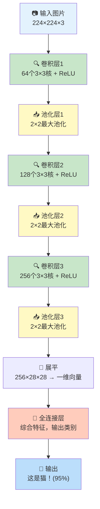
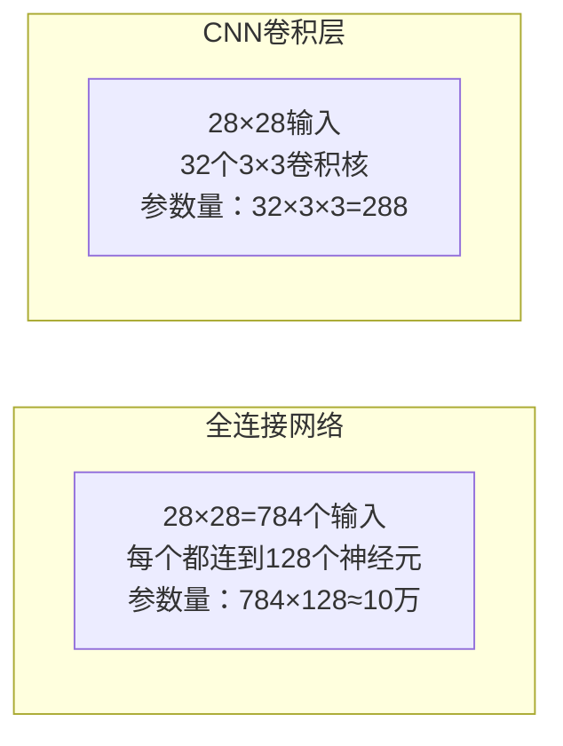
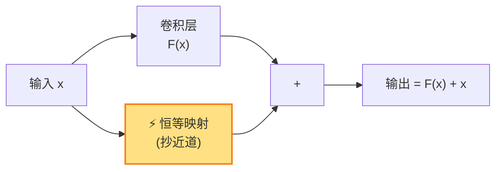

# 第14章：卷积神经网络（CNN）

## 🎯 读完本章你能...

理解卷积神经网络如何像"数字放大镜"一样从像素中逐层提取特征，掌握卷积、池化、全连接三层架构，并能用15行PyTorch代码搭建一个能识别猫狗图片的CNN模型。

## 📖 从一个故事开始

小美在翻家里的老相册。一张泛黄的照片上，奶奶年轻时的脸庞已有些模糊。但小美一眼就认出来了——她不需要看清每一根头发，只需要那双标志性的弯弯笑眼、那个特别的鼻子轮廓。

人类认照片的过程非常神奇：我们不会把照片上的每一个像素都"平等地"看一遍。我们的视觉系统是**分层处理**的：先识别"这里有道边"，再组合成"这是眼睛的形状"，再往上组合成"这是一张人脸"。

而上一章我们学的普通全连接神经网络（MLP），处理图片时却非常"笨"——它把整张图片"摊平"成一长串数字，然后让所有神经元去连接所有像素。一张28x28的小图片就有784个像素，如果是1000x1000的高清图呢？1,000,000个输入→第一层1000个神经元就有10亿个参数！这不仅计算量爆炸，而且完全浪费——判断图片是不是猫，只需要看"猫耳朵区域的像素"，不需要看右下角的天空。

**卷积神经网络（Convolutional Neural Network, CNN）** 被发明出来，就是为了解决这个问题。它模仿人类视觉系统的工作方式：用小窗口在图片上滑动，每次只看一小块区域，逐层从"边缘→形状→部件→物体"地理解图片。1998年的LeNet能识别手写邮政编码，2012年的AlexNet在ImageNet大赛上掀起了深度学习革命，今天你的手机相册、人脸解锁、CT影像分析——背后都是CNN在工作。

## 📖 原理讲解

### 14.1 图像在计算机眼中就是一个数字矩阵

在深入CNN之前，必须建立这个核心认知：**对计算机来说，一张图片就是一堆排列整齐的数字**。

一张灰度图是一个二维矩阵，每个位置的数值代表该像素的亮度（0=全黑，255=全白）：

```
一张5×5的手写数字"1"的灰度图：
┌─────────────────────┐
│   0   0  255   0   0 │
│   0  50  255   0   0 │
│   0   0  255   0   0 │
│   0   0  255   0   0 │
│   0   0  255   0   0 │
└─────────────────────┘
```

而彩色图是三个这样的矩阵叠加在一起——R（红）、G（绿）、B（蓝）三个通道。一张1920×1080的彩色照片 = 1920 × 1080 × 3 ≈ 620万个数字。

CNN要做的，就是从这数百万个数字中，自动"看出"里面的物体是什么。

### 14.2 卷积：CNN的灵魂操作

**卷积（Convolution）** 是CNN的核心操作。它的工作方式极其朴素：

你有一个**卷积核（Kernel/Filter）**——一个小矩阵（比如3×3），里面装着一些数字。这个卷积核像一把"梳子"，在图片上从左到右、从上到下地滑动。每滑到一个位置，就把核里的数字和图片对应位置的像素做**逐元素相乘再求和**，得到一个输出值。

```
3×3卷积核在5×5图片上滑动的第一步：

图片（5×5）：          卷积核（3×3）：        计算：
 1  2  3  4  5        -1  0  1            (-1)×1 + 0×2 + 1×3
 6  7  8  9  0   ⊗    -2  0  2    =       + (-2)×6 + 0×7 + 2×8
 1  2  3  4  5        -1  0  1            + (-1)×1 + 0×2 + 1×3
 6  7  8  9  0                            = -1+0+3-12+0+16-1+0+3 = 8
 1  2  3  4  5

                         卷积核                          输出矩阵
第二步（卷积核右移一格）：                                 (称为"特征图")
用图片的第2-4列、1-3行   →  计算下一个值                 ┌──┬──┬──┐
...以此类推，直到滑完整张图                               │8 │. │. │
整个3×3核在5×5图上总共                                 ├──┼──┼──┤
有(5-3+1)×(5-3+1)=3×3=9个位置                          │. │. │. │
                                                        ├──┼──┼──┤
                                                        │. │. │. │
                                                        └──┴──┴──┘
```

**数学公式**（离散二维卷积）：

\[
(f * g)(i, j) = \sum_{m=1}^{k} \sum_{n=1}^{k} f(i+m-1, j+n-1) \cdot g(m, n)
\]

- \(f\)：输入图片矩阵
- \(g\)：卷积核（k×k的小矩阵）
- \(i, j\)：输出特征图上的位置
- 求和范围m,n从1到k：核的每个元素和图片对应位置相乘后累加

**大白话类比**：卷积核就像一枚"印章检测器"。比如一个设计用来检测"竖直线条"的卷积核，当它滑到图片中竖线的位置时，输出值会特别大——"报告！这里有一道竖线！"

来看一个真实的边缘检测核：

```
水平边缘检测核：          经过一个有水平边缘的区域时：
[[-1, -1, -1],            上半暗（像素值小）  ×  负权重  →  正值
 [ 2,  2,  2],            下半亮（像素值大）  ×  正权重  →  正值
 [-1, -1, -1]]            全部相加              →  很大的正值！
                           → "这里有道水平边缘！"
```

### 14.3 为什么卷积特别适合图像？两大超能力

**超能力1：局部连接（Local Connectivity）**

普通全连接层里，每个输出神经元要连接**所有**输入像素。CNN的卷积层里，输出神经元只连接一个**小窗口**里的像素（比如3×3=9个）。这意味着：
- 参数数量大幅减少：一个输出神经元只需要9个权重，而不是整个图片的像素数
- 更符合视觉原理：判断"这里有没有猫耳朵"只需要看局部区域

**超能力2：参数共享（Parameter Sharing）**

同一个卷积核在图片的**所有位置共享**。用来检测"猫耳朵"的核在左上角能用，在右下角也能用——同一个模式只需要学一次。

这两个超能力让CNN的参数量比同等规模的全连接网络少了几百到几千倍，训练效率成倍提升。

### 14.4 池化：给特征图"瘦身"

卷积之后，特征图可能还是很大。**池化（Pooling）** 的作用就是对特征图"压缩"，只保留最重要的信息。

**最大池化（Max Pooling）**：在一个小窗口（如2×2）里取最大值。这是最常用的池化方式。

```
2×2最大池化示例（步长=2）：

输入特征图（4×4）：          输出（2×2）：
┌───────────────┐          ┌─────┬─────┐
│ 1   3 │ 2   4 │          │     │     │
│ 5   6 │ 7   8 │    →     │  6  │  8  │
├───────┼───────┤          ├─────┼─────┤
│ 2   1 │ 9   3 │          │     │     │
│ 4   7 │ 2   5 │          │  7  │  9  │
└───────────────┘          └─────┴─────┘

左上角窗口[1,3,5,6]→取最大=6
右上角窗口[2,4,7,8]→取最大=8
左下角窗口[2,1,4,7]→取最大=7
右下角窗口[9,3,2,5]→取最大=9
```

**三种池化方式对比**：

| 池化类型 | 做什么 | 效果 | 用在 |
|---------|--------|------|------|
| 最大池化 (Max) | 取窗口内最大值 | 保留最"激活"的特征 | CNN标配 |
| 平均池化 (Avg) | 取窗口内平均值 | 平滑，保留背景信息 | 全局平均池化常用于最后层 |
| 全局平均池化 | 整张特征图取平均 | 直接得到一个数 | ResNet等现代网络常用 |

池化的好处：
1. **减小尺寸**：特征图越来越小，计算越来越快
2. **防止过拟合**：压缩过程自然会丢失一些不重要细节，反而让模型更泛化
3. **平移不变性**：物体在图片里稍微移动了一下，池化后的结果基本不变

### 14.5 CNN的标准三层架构

一个典型的CNN就是"卷积+池化+全连接"的交替组合：

```
输入图片（如28×28×3彩色图）
        ↓
    卷积层1（如32个3×3卷积核，提取简单特征→边缘、颜色块）
        ↓
    池化层1（2×2最大池化，尺寸减半→14×14×32）
        ↓
    卷积层2（如64个3×3卷积核，提取中级特征→形状、纹理）
        ↓
    池化层2（2×2最大池化，尺寸再减半→7×7×64）
        ↓
    展平（把三维张量拉成一维向量）
        ↓
    全连接层（综合所有特征，做出最终判断）
        ↓
    输出："这是猫！（置信度95%）"
```

关键观察：随着层数加深，特征图的**空间尺寸越来越小**（28→14→7），但**通道数越来越多**（3→32→64）。空间变小是因为池化的压缩，通道变多是因为高层需要更多"种类"的特征（一个通道检测猫耳朵、一个检测猫胡须、一个检测猫眼睛...）。

### 14.6 Padding和Stride：控制特征图大小的两个旋钮

卷积操作有两个重要参数影响输出特征图的尺寸：

**Padding（填充）**：在图片边缘补一圈0。为什么需要它？因为不补的话，卷积核无法"走到"边缘像素——每次卷积输出尺寸都比输入小一点。补了0之后，边缘像素也能被完整扫描。

**Stride（步长）**：卷积核每次移动的"步数"。Stride=2意味着核每次跳两格，输出尺寸直接减半（比池化还狠）。

输出尺寸计算公式：
\[
\text{output\_size} = \left\lfloor \frac{\text{input\_size} - \text{kernel\_size} + 2 \times \text{padding}}{\text{stride}} \right\rfloor + 1
\]

### 14.7 CNN经典架构：从LeNet到ResNet

| 模型 | 年份 | 层数 | 核心创新 | 意义 |
|------|------|------|---------|------|
| LeNet-5 | 1998 | 7 | CNN的蓝图 | 识别手写邮政编码，奠定了Conv→Pool→FC架构 |
| AlexNet | 2012 | 8 | ReLU+Dropout+GPU | 深度学习复兴的起点，ImageNet错误率从26%降到15% |
| VGG-16 | 2014 | 16 | 全部用3×3小卷积核 | 证明"小而深"优于"大而浅" |
| ResNet-50 | 2015 | 50 | **残差连接**（跳过几层） | 解决了深层网络"越深越差"的退化问题 |
| EfficientNet | 2019 | — | 用NAS自动搜索最佳结构 | 同等精度下参数最少、速度最快 |

**ResNet的残差连接**值得单独讲讲。直觉上，52层网络应该比20层网络效果更好（至少不应该更差——大不了后32层什么都不做，原样传递）。但实践证明，深层网络确实会"退化"——梯度在反向传播时越来越小，前面层的参数几乎不更新。

残差连接的解决方案极其优雅：
\[
\mathbf{y} = \mathcal{F}(\mathbf{x}) + \mathbf{x}
\]

就是把输入\(\mathbf{x}\)直接"抄近道"加到输出上。这样即使\(\mathcal{F}\)什么都没学到（学废了），输出至少等于输入——网络不会比浅层更差。反向传播时，梯度也可以通过这条"近道"直接传到前面，不会衰减。

---

## 🎨 图解专区

### 3×3卷积核在5×5图上滑动的完整过程（ASCII图）

```
图 片（5×5）：                 卷积核（3×3）：
┌──────────────────┐          ┌──────────┐
│ 1   2   3   4   5 │          │ -1  0  1 │
│ 6   7   8   9   0 │          │ -2  0  2 │
│ 1   2   3   4   5 │          │ -1  0  1 │
│ 6   7   8   9   0 │          └──────────┘
│ 1   2   3   4   5 │
└──────────────────┘

步骤1（核在左上角，覆盖[1:3, 1:3]）：
  1×(-1)+2×0+3×1 + 6×(-2)+7×0+8×2 + 1×(-1)+2×0+3×1 = 8

步骤2（核右移1格，覆盖[1:3, 2:4]）：
  2×(-1)+3×0+4×1 + 7×(-2)+8×0+9×2 + 2×(-1)+3×0+4×1 = ...

步骤3（核再右移1格，覆盖[1:3, 3:5]）：
  3×(-1)+4×0+5×1 + 8×(-2)+9×0+0×2 + 3×(-1)+4×0+5×1 = ...

...以此类推，共9个位置。输出3×3特征图：
┌──────┬──────┬──────┐
│  8   │  .   │  .   │
├──────┼──────┼──────┤
│  .   │  .   │  .   │
├──────┼──────┼──────┤
│  .   │  .   │  .   │
└──────┴──────┴──────┘
```

### CNN完整处理流水线



### 普通全连接网络 vs CNN对比



| 对比维度 | 全连接网络（MLP） | 卷积神经网络（CNN） |
|---------|-----------------|-------------------|
| 连接方式 | 每个输出连接所有输入 | 每个输出只连一个小窗口 |
| 参数共享 | 不同位置用不同参数 | 同一核在所有位置共享 |
| 参数量（28×28图→128神经元） | 784×128 ≈ 10万 | 32×3×3 = 288 |
| 对空间位置的敏感度 | 像素移动一位，输入完全变了 | 卷积+池化有平移不变性 |
| 适合的数据 | 表格数据（房价、成绩） | 图像、视频等有空间结构的数据 |

### 残差连接示意图



---

## 🤔 课堂活动

### 🤔 活动1：手算2×2最大池化

**场景**：给定一个4x4的特征图，手动执行最大池化操作，理解池化如何"保留最重要的信息"。

**材料**：纸、笔

**给定特征图（4×4）**：
```
 3   7   2   1
 5   9   0   4
 1   2   8   6
 4   3   7   5
```

**任务**：
1. 用2×2最大池化，步长=2。画出输出矩阵（2×2）。每个格子的值是对应2×2窗口的最大值
2. 用2×2平均池化，步长=2。画出输出矩阵（2×2）。每个格子的值是对应2×2窗口的平均值
3. 比较两种池化的结果。哪个保留了更多的"尖峰信号"？哪个更"平滑"？
4. 思考：如果原特征图中某个值是"噪声"（意外的高值，比如那个9可能是个噪音），平均池化和最大池化哪个更能"压制"噪音？

**讨论**：
- 最大池化的一个潜在风险是什么？（提示：如果真正重要的信号不在最大值里...）
- 如果步长改成1（每个窗口有重叠），输出尺寸是多少？信息保留更多了，但有什么代价？
- 为什么现代CNN通常在浅层用较小池化窗口、深层用更大池化（或全局平均池化）？

### 🤔 活动2：用手机相机体验"特征提取"

**场景**：你的手机相机里其实已经跑着CNN的各种变体。打开相机，用不同模式（普通拍照、人像模式、夜景模式）拍照，分析背后的CNN在做什么。

**材料**：智能手机、同一场景、不同物体

**任务**：
1. 打开手机相机，对准一个有不同纹理的表面（比如木桌、布沙发、毛绒玩具）。观察：相机对焦框出现在哪里？为什么是那里？（提示：CNN先用边缘检测找到"对比度高"的区域）
2. 拍一张有人脸的照片，再拍一张完全没有脸的风景照。查看相册——人脸自动分组功能工作了吗？这就是CNN的"人脸检测"在背后运行
3. 试拍一张手写文字的照片（比如课本一页）。如果手机有"文字识别"功能，看看识别准确率如何。手写体和印刷体哪个更难识别？为什么？

**讨论**：
- 手机相机能"实时"做人脸检测（每秒30帧）。CNN怎么做到这么快的？（提示：模型本身就小，加上手机有专门的AI芯片）
- 如果让你自己训练一个CNN来认你的家人，你需要收集什么数据？大概需要多少张照片？
- 你觉得"让AI认脸"这个技术，除了方便还有什么潜在风险？

---

## 🔬 动手写代码

用15行PyTorch代码搭建一个简单CNN做图像分类。

```python
"""
你的第一个CNN：用PyTorch搭建卷积神经网络做CIFAR-10图像分类
CIFAR-10：6万张32×32彩色图片，10个类别（飞机、汽车、鸟、猫...）
依赖：pip install torch torchvision
"""
import torch
import torch.nn as nn
from torch.utils.data import DataLoader
from torchvision import datasets, transforms

# ─── 1. 加载CIFAR-10数据并做数据增强 ───
transform = transforms.Compose([
    transforms.ToTensor(),
    transforms.Normalize((0.5,),(0.5,))  # 归一化到[-1,1]
])
train_data = datasets.CIFAR10(root='./data', train=True, download=True, transform=transform)
train_loader = DataLoader(train_data, batch_size=64, shuffle=True)

# ─── 2. 定义CNN结构 ───
class SimpleCNN(nn.Module):
    def __init__(self):
        super().__init__()
        self.conv1 = nn.Conv2d(3, 16, 3, padding=1)  # 输入3通道→16个3×3卷积核
        self.pool = nn.MaxPool2d(2, 2)                # 2×2最大池化
        self.conv2 = nn.Conv2d(16, 32, 3, padding=1) # 16通道→32通道
        self.fc = nn.Linear(32 * 8 * 8, 10)           # 全连接→10类输出

    def forward(self, x):
        x = self.pool(torch.relu(self.conv1(x)))   # 卷积→ReLU→池化
        x = self.pool(torch.relu(self.conv2(x)))   # 再来一次
        x = x.view(x.size(0), -1)                   # 展平
        return self.fc(x)                            # 全连接输出

model = SimpleCNN()
criterion = nn.CrossEntropyLoss()
optimizer = torch.optim.Adam(model.parameters(), lr=0.001)

# ─── 3. 训练 ───
for epoch in range(3):
    for images, labels in train_loader:
        optimizer.zero_grad()
        loss = criterion(model(images), labels)
        loss.backward()
        optimizer.step()
    print(f"Epoch {epoch+1}/3, Loss: {loss.item():.4f}")
print("✅ CNN训练完成！")
```

**代码解析**：`nn.Conv2d(3, 16, 3)` 创建了一个输入3通道、输出16通道、核大小为3×3的卷积层——这就是CNN的核心。`padding=1`保证输出尺寸不变。`nn.MaxPool2d(2,2)` 用2×2窗口做最大池化，步长也是2。整个网络训练只需一个三重循环——前向、反向、更新。

---

## 📝 本节小结

1. 卷积神经网络（CNN）通过"卷积核在图片上滑动提取局部特征"的方式，模拟了人类视觉系统从边缘到形状再到物体的分层识别过程，相比全连接网络大幅度减少了参数量。
2. CNN的经典架构是"卷积层（提取特征）+ 池化层（压缩尺寸）+ 全连接层（综合判断）"的交替堆叠，通过Padding控制边界处理、Stride控制滑动步长、残差连接解决深层退化。
3. 从1998年的LeNet到2015年的ResNet再到手机里的实时人脸检测，CNN已经渗透进我们日常生活的方方面面——理解CNN就是理解了"AI如何看懂世界"。

---

## 📚 参考文献

1. **LeCun, Y., Bottou, L., Bengio, Y., & Haffner, P. (1998).** Gradient-based learning applied to document recognition. *Proceedings of the IEEE, 86*(11), 2278-2324. —— LeNet-5的原始论文，CNN的奠基之作。
2. **Krizhevsky, A., Sutskever, I., & Hinton, G. (2012).** ImageNet Classification with Deep Convolutional Neural Networks. *NeurIPS 2012*. —— AlexNet论文，深度学习在视觉领域"复兴"的里程碑。
3. **He, K., Zhang, X., Ren, S., & Sun, J. (2016).** Deep Residual Learning for Image Recognition. *CVPR 2016*. —— ResNet原论文，引用超20万次，残差连接改变了深度学习架构。
4. **Stanford CS231n** (cs231n.stanford.edu) —— 斯坦福大学"计算机视觉与CNN"公开课，含完整视频、笔记和编程作业，CNN学习的第一推荐资源。
5. **3Blue1Brown - "But what is a convolution?"** —— YouTube频道（B站有搬运），用精美的可视化解释卷积的数学本质，看一遍胜过读十篇文章。
6. **动手学深度学习 (d2l.ai)** —— 阿斯顿·张等著，免费在线阅读。第7章"现代卷积神经网络"有详细代码和交互式示例，非常适合边学边练。
7. **Papers With Code - Image Classification** (paperswithcode.com/task/image-classification) —— 跟踪CNN各架构在ImageNet上最新性能排名的网站，了解技术前沿。
8. **PyTorch Vision 官方教程** (pytorch.org/vision) —— 包含图像分类、目标检测、图像分割的完整PyTorch实现代码，适合练手。
