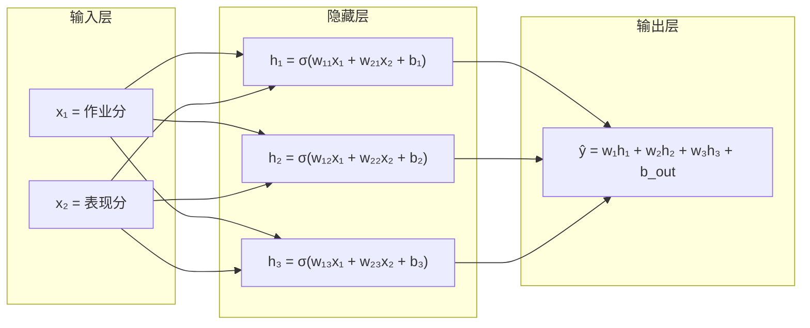
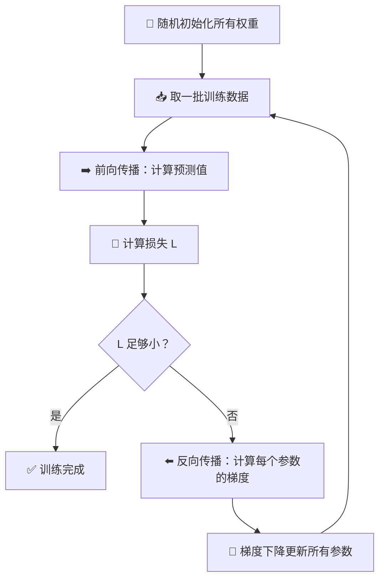

# 第13章：神经网络基础

## 🎯 读完本章你能...

理解人工神经网络如何从神经元"堆叠"出智能，掌握前向传播和反向传播的核心直觉，并能用15行PyTorch代码搭建你的第一个多层神经网络。

## 📖 从一个故事开始

李华是高二(3)班的数学课代表。班主任给了他一个任务：根据每个同学的"平时作业分"和"课堂表现分"，预测他们期末能考多少分。

李华先试了一个简单的办法：期末分 = 0.6x作业分 + 0.4x表现分。预测了几个同学后，发现误差很大——显然，这个关系不是简单的"线性"加法能描述的。有些同学作业分高但考试心态差，有些平时一般但临场爆发力强——分数背后藏着更复杂的规律。

于是李华想：能不能搭一个"多层判断系统"？第一层：两个老师分别评估"基础扎实度"和"考试心态"；第二层：班主任综合这两个评估给出最终分数预测。每层之间不是简单的加权平均，而是经过"筛选"——只有超过某个阈值的信号才向下传递。

李华同学无意中发明的东西，就是**人工神经网络（Artificial Neural Network, ANN）**。本章，我们将把这个直觉严格化——从单个"神经元"开始，一步步搭建出能拟合任意复杂函数的神经网络。

## 📖 原理讲解

### 13.1 感知机：神经网络的"原子"

1957年，Frank Rosenblatt 发明了感知机（Perceptron）——神经网络的最基本单元。它的设计灵感直接来自生物神经元：

**生物神经元的工作方式**：树突接收其他神经元的信号 → 如果总信号超过阈值 → 轴突放电，向下一个神经元传递信号。

**人工感知机的工作方式**：输入 \(x_1, x_2, ..., x_n\) → 加权求和 \(w_1x_1 + w_2x_2 + ... + w_nx_n + b\) → 如果结果>0输出1，否则输出0。

用公式表示：

\[
y = \begin{cases}
1, & \text{if } \sum_{i=1}^n w_i x_i + b > 0 \\
0, & \text{otherwise}
\end{cases}
\]

**逐符号解释**：
- \(x_i\)：第i个输入特征（比如"作业分"和"表现分"）
- \(w_i\)：权重（weight），表示"这个输入有多重要"。w越大，对应的x对结果影响越大
- \(b\)：偏置（bias），相当于"基础分"——所有输入为0时，输出是什么
- 比较 > 0：阈值判断，决定是否"激活"

**大白话**：感知机就是一个"打分+过线判断"机器。∑wx+b算出总分，超过0就算"及格"(输出1)，否则"不及格"(输出0)。

### 13.2 从感知机到多层网络：为什么需要"深度"

单个感知机有个致命缺陷：它只能解决**线性可分**的问题。什么是线性可分？就是能用一条直线把两类数据分开。

```
线性可分 ✓                      线性不可分 ✗
  ●  ●  ●  │  ○  ○  ○            ●  ○  ●
  ●  ●  ●  │  ○  ○  ○            ○  ●  ○
  ●  ●  ●  │  ○  ○  ○            ●  ○  ●
   一条直线就能分开                  一条线分不开！
```

现实中的问题几乎都是线性不可分的。比如：判断一张图片是不是猫，这是极其复杂的非线性问题了一一个感知机根本无力处理。

**解决方案**：把多个感知机叠起来。第一层提取简单特征（"有没有边缘"），第二层组合成更复杂的特征（"有没有圆形的眼睛"），第三层进一步组合（"这些特征组合起来像不像猫脸"）。

这就是**多层感知机（MLP, Multi-Layer Perceptron）** 的思想——通过"堆叠"层数，网络能拟合任意复杂的函数。理论上，只要层数够多、神经元够多，MLP可以逼近任何连续函数（万能近似定理）。

### 13.3 前向传播：信息如何在网络中流动

假设我们有一个最简单的三层网络：
- 输入层：2个神经元（接收 \(x_1, x_2\)）
- 隐藏层：3个神经元
- 输出层：1个神经元（输出预测值）

**第一层到隐藏层的计算**：

对于隐藏层的每个神经元j，它的输入是：

\[
z_j = w_{1j} x_1 + w_{2j} x_2 + b_j
\]

然后用**激活函数** \(a_j = \sigma(z_j)\) 得到该神经元的输出。

**隐藏层到输出层**：输出神经元接收所有隐藏层神经元的输出作为自己的输入：

\[
z_{out} = w_{1} a_1 + w_{2} a_2 + w_{3} a_3 + b_{out}
\]

最终预测值 \(\hat{y} = \sigma(z_{out})\)（如果是回归问题，可能不用σ）。

写成矩阵形式（更简洁）：

\[
\mathbf{a}^{(1)} = \sigma(\mathbf{W}^{(1)} \mathbf{x} + \mathbf{b}^{(1)})
\]
\[
\hat{\mathbf{y}} = \mathbf{W}^{(2)} \mathbf{a}^{(1)} + \mathbf{b}^{(2)}
\]

**逐符号解释**：
- \(\mathbf{x}\)：输入向量，如 \([x_1, x_2]^T\)
- \(\mathbf{W}^{(1)}\)：第1层的权重矩阵，第i行第j列是"输入i到隐藏层神经元j"的权重
- \(\mathbf{b}^{(1)}\)：第1层的偏置向量
- \(\sigma\)：激活函数（下一节详解）
- \(\mathbf{a}^{(1)}\)：第1层（隐藏层）的输出

### 13.4 激活函数：给网络注入"非线性灵魂"

如果没有激活函数（或者激活函数是线性的，如 \(f(x)=2x\)），那无论堆多少层，整个网络等价于一个线性变换——和单层感知机没区别。

激活函数的作用就是**引入非线性**，让网络能拟合复杂函数。最常用的三个：

**1. Sigmoid函数**：

\[
\sigma(x) = \frac{1}{1 + e^{-x}}
\]

把任意实数压缩到(0, 1)之间。像一道"软门"：输入很大时，输出接近1（门几乎全开）；输入很小时，输出接近0（门几乎全关）。

**缺点**：输入很大或很小时，梯度接近0（"梯度消失"），网络学不动。

**2. ReLU函数（Rectified Linear Unit，修正线性单元）**：

\[
\text{ReLU}(x) = \max(0, x)
\]

目前最常用的激活函数。极其简单：负数直接变0，正数原样输出。就像一道"单向门"——只让正信号通过，负信号全部拦截。

**优点**：计算快（就一个max操作），不会梯度消失（正数区梯度始终为1）。

**3. Tanh函数**：

\[
\tanh(x) = \frac{e^x - e^{-x}}{e^x + e^{-x}}
\]

把输入压缩到(-1, 1)，相当于Sigmoid的"居中版"。比Sigmoid更好，但仍有梯度消失问题。

**选型指南**：隐藏层默认用ReLU（简单有效），输出层如果是二分类用Sigmoid，多分类用Softmax。

### 13.5 损失函数：告诉网络"你错得有多离谱"

训练神经网络的本质，是不断调整所有权重w和偏置b，让预测值越来越接近真实值。但怎么量化"有多接近"呢？

**损失函数（Loss Function）** 就是用来衡量"预测值和真实值差距"的。网络的目标是**最小化**这个损失。

最常用的两个（第16章会深度学习函数本身）：

- **均方误差 MSE**（回归任务）：\(\text{MSE} = \frac{1}{n}\sum(y_i - \hat{y}_i)^2\)
- **交叉熵 CE**（分类任务）：\(\text{CE} = -\sum y_i \log(\hat{y}_i)\)

### 13.6 反向传播：网络如何"从错误中学习"

如果把前向传播理解为"网络给出一个答案"，那反向传播就是"网络根据答案的对错，反过去修正自己的参数"。

**核心思想（链式法则）**：损失L对某个权重w的"影响力" = 损失对输出的导数 x 输出对中间值的导数 x 中间值对w的导数。

写成数学：

\[
\frac{\partial L}{\partial w} = \frac{\partial L}{\partial \hat{y}} \cdot \frac{\partial \hat{y}}{\partial z} \cdot \frac{\partial z}{\partial w}
\]

**大白话类比**：你在调一个复杂音响系统的音量。你发现最终输出声音太小了（损失大）。于是你顺着信号线往回查：喇叭正常→功放增益太低→调音台这路推子没推上去。你直接从最终效果"反向推导"出哪个环节该调——这就是反向传播。

**梯度下降回顾**：有了每个参数的梯度 \(\frac{\partial L}{\partial w}\)，就可以用梯度下降更新参数：

\[
w_{new} = w_{old} - \eta \cdot \frac{\partial L}{\partial w}
\]

其中 \(\eta\) 是学习率——太小则学得慢，太大则可能跳过最优解。

### 13.7 训练一个神经网络的全流程串讲

把以上所有概念串起来，训练一个神经网络就是这么个循环：

```
1. 随机初始化所有权重（不能全0，否则所有神经元学得一样）
2. 重复以下步骤直到损失足够小：
   a. 前向传播：输入→层层计算→输出预测值
   b. 计算损失：预测值 vs 真实值，算出差多少
   c. 反向传播：从输出层往回，逐层算梯度
   d. 更新参数：每个w += -学习率 × 该w的梯度
```

---

## 🎨 图解专区

### 三层神经网络前向传播流程图



### 三种激活函数对比

| 函数 | 公式 | 输出范围 | 优点 | 缺点 | 用在哪 |
|------|------|---------|------|------|--------|
| Sigmoid | \(\frac{1}{1+e^{-x}}\) | (0, 1) | 平滑、可解释为概率 | 梯度消失，输出非零中心 | 二分类输出层 |
| Tanh | \(\frac{e^x-e^{-x}}{e^x+e^{-x}}\) | (-1, 1) | 零中心，比Sigmoid好 | 仍有梯度消失 | 早期网络常用 |
| ReLU | \(\max(0, x)\) | [0, +∞) | 计算快，不梯度消失 | 负数区"死掉" | 隐藏层首选 |
| Leaky ReLU | \(\max(0.01x, x)\) | (-∞, +∞) | 解决"死神经元" | 多了个超参数 | ReLU改进版 |

### 反向传播示意（数值例子）

```
前向传播（假设简单网络，激活函数用Sigmoid）：

x₁=1.0 ──w₁=0.5──┐
                  ├──→ z = 0.5×1.0 + 0.3×0.5 + 0.1 = 0.75
x₂=0.5 ──w₂=0.3──┘              b=0.1
                                    │
                              ŷ = σ(0.75) ≈ 0.679
                              真实值 y = 1.0
                              损失 L = (1.0 - 0.679)² = 0.103

反向传播（链式法则）：

∂L/∂ŷ = -2(1.0 - 0.679) = -0.642
∂ŷ/∂z = σ(0.75)·(1-σ(0.75)) = 0.679×0.321 ≈ 0.218
∂z/∂w₁ = x₁ = 1.0

∂L/∂w₁ = ∂L/∂ŷ × ∂ŷ/∂z × ∂z/∂w₁ = (-0.642) × 0.218 × 1.0 ≈ -0.140

更新（学习率 η=0.5）：
w₁_new = 0.5 - 0.5×(-0.140) = 0.5 + 0.070 = 0.570
→ w₁增大了，因为增大w₁能让ŷ增大，向y=1靠拢 ✓
```

### 神经网络训练全过程



---

## 🤔 课堂活动

### 🤔 活动1：手算一个2输入→1输出的前向传播

**场景**：给定一个最小的"神经网络"——2个输入，1个隐藏层（2个神经元，ReLU激活），1个输出。给定所有权重和输入值，手算输出。

**材料**：纸、笔、计算器（手机即可）

**给定数据**：
- 输入：\(x_1 = 0.8\)（作业分），\(x_2 = 0.6\)（表现分）
- 隐藏层神经元h1：权重 \(w_{11}=0.7, w_{21}=0.4\)，偏置 \(b_1=-0.2\)
- 隐藏层神经元h2：权重 \(w_{12}=0.3, w_{22}=0.9\)，偏置 \(b_2=0.1\)
- 输出层：权重 \(w_1=1.2, w_2=-0.5\)，偏置 \(b_{out}=0.0\)
- 激活函数：\(\text{ReLU}(x) = \max(0, x)\)

**任务**：
1. 计算h1的输入：\(z_1 = w_{11}x_1 + w_{21}x_2 + b_1\) → 用ReLU得到 \(a_1\)
2. 计算h2的输入：\(z_2 = w_{12}x_1 + w_{22}x_2 + b_2\) → 用ReLU得到 \(a_2\)
3. 计算输出：\(\hat{y} = w_1 a_1 + w_2 a_2 + b_{out}\)
4. 和同桌对比答案，看是否一致
5. 把输入改成 \(x_1=0.2, x_2=0.1\)，重新算一遍。观察哪些神经元"熄灭了"（ReLU输出为0）

**讨论**：
- 当ReLU输出为0时，从它出发的所有后续计算都被"切断"了——这模拟了生物神经元的"全或无"特性。你觉得这是好事还是坏事？
- 如果网络里所有神经元的ReLU输出都是0（网络"死"了），可能是什么原因？怎么救活它？

### 🤔 活动2：用"人肉"模拟梯度下降

**场景**：函数 \(f(x) = (x-3)^2\)（最小点在x=3）。你从x=10开始，用手动梯度下降找到最小值。

**材料**：纸、笔

**任务**：
1. 计算梯度：\(f'(x) = 2(x-3)\)
2. 从x=10开始，设学习率η=0.3，迭代5步：
   - 当前梯度 = 2×(当前x - 3)
   - 新x = 当前x - 0.3×梯度
3. 记录每一步的x值和梯度值，填入表格
4. 把学习率改成η=1.5，重新迭代5步。观察发生了什么
5. 把学习率改成η=0.01，重新迭代5步。观察收敛速度

**讨论**：
- η=1.5时发生了什么？（提示：可能在最小值附近反复横跳，甚至越跑越远）
- η=0.01时虽然不会爆炸，但有什么问题？梯度下降的"理想"学习率应该具备什么特征？
- 在真正的神经网络里，有成千上万个参数——梯度下降是怎么同时优化所有参数的？

---

## 🔬 动手写代码

用15行PyTorch代码搭建一个简单的多层感知机（MLP）。

```python
"""
你的第一个神经网络：用PyTorch搭建MLP做手写数字分类
依赖：pip install torch torchvision
"""
import torch
import torch.nn as nn
from torch.utils.data import DataLoader
from torchvision import datasets, transforms

# ─── 1. 加载MNIST手写数字数据 ───
transform = transforms.ToTensor()  # 把图片转成张量
train_data = datasets.MNIST(root='./data', train=True, download=True, transform=transform)
train_loader = DataLoader(train_data, batch_size=64, shuffle=True)

# ─── 2. 定义神经网络结构（3层MLP） ───
model = nn.Sequential(
    nn.Flatten(),                    # 把28×28图片展平成784维向量
    nn.Linear(784, 128),             # 第1层：784→128（输入→隐藏层）
    nn.ReLU(),                       # ReLU激活，引入非线性
    nn.Linear(128, 10),              # 第2层：128→10（隐藏→输出，10个数字）
)

# ─── 3. 训练 ───
criterion = nn.CrossEntropyLoss()    # 多分类用交叉熵损失
optimizer = torch.optim.Adam(model.parameters(), lr=0.001)  # Adam优化器
for epoch in range(3):               # 训练3轮
    for images, labels in train_loader:
        optimizer.zero_grad()        # 清空上一轮的梯度
        outputs = model(images)      # 前向传播：算出预测
        loss = criterion(outputs, labels)  # 计算损失
        loss.backward()              # 反向传播：自动算梯度！
        optimizer.step()             # 更新参数
    print(f"Epoch {epoch+1}/3, Loss: {loss.item():.4f}")
print("✅ 训练完成！")
```

**代码解析**：`nn.Linear(784, 128)` 就是在做 \(y = \mathbf{W}x + \mathbf{b}\)，其中W是128×784的权重矩阵。`nn.ReLU()` 是激活函数。`loss.backward()` 一行就完成了整个反向传播——PyTorch自动帮你用链式法则算出所有参数的梯度，这就是深度学习框架的核心价值。

---

## 📝 本节小结

1. 感知机是神经网络的最小单元（加权求和+阈值判断），多层感知机通过堆叠层数获得拟合复杂非线性函数的能力，激活函数（ReLU/Sigmoid）为网络注入非线性灵魂。
2. 前向传播是从输入到输出的"推理"过程，反向传播是利用链式法则从损失"反推"每个参数调整方向的"学习"过程，梯度下降根据梯度更新参数让损失逐步减小。
3. 用PyTorch这样的框架，搭建一个能识别手写数字的神经网络只需要15行代码——框架帮你完成了反向传播、梯度计算等复杂操作，你只需要定义网络结构和训练流程。

---

## 📚 参考文献

1. **Rosenblatt, F. (1958).** The Perceptron: A Probabilistic Model for Information Storage and Organization in the Brain. *Psychological Review, 65*(6), 386-408. —— 感知机的原始论文，AI历史上的里程碑。
2. **Rumelhart, D., Hinton, G., & Williams, R. (1986).** Learning representations by back-propagating errors. *Nature, 323*, 533-536. —— 反向传播算法的经典论文，奠定了深度学习的数学基础。
3. **3Blue1Brown - "Neural Networks" 系列** —— YouTube频道（B站有搬运和翻译），共4集，用极致可视化解释神经网络、梯度下降和反向传播，全网最好的入门视频。
4. **《深度学习》(花书)** —— Goodfellow, Bengio, Courville著，MIT Press。第6章"深度前馈网络"是本章内容的权威延伸阅读。
5. **PyTorch官方60分钟入门教程** (pytorch.org/tutorials) —— 从Tensor基础到训练第一个神经网络的完整教程，代码可以边看边跑。
6. **李宏毅《机器学习》2021/2022课程** —— B站搜索"李宏毅 机器学习"，台湾大学教授的中文课程，讲解极其通俗，神经网络部分尤其精彩。
7. **《Neural Networks and Deep Learning》** —— Michael Nielsen著，免费在线书籍 (neuralnetworksanddeeplearning.com)，用Python从零实现神经网络，适合想彻底搞懂原理的同学。
8. **TensorFlow Playground** (playground.tensorflow.org) —— 谷歌的交互式可视化工具，在浏览器里调神经网络参数、看决策边界实时变化，零代码就能建立直觉。
