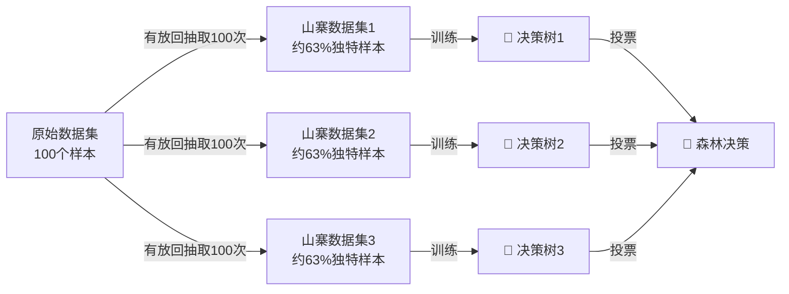
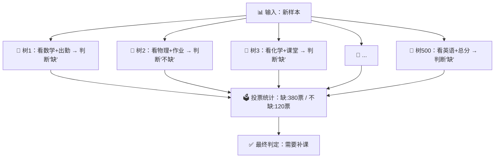

# 第5章：随机森林——种一片会"投票"的决策树

## 🎯 读完本章你能...

用随机森林算法解决一个分类问题，理解"多棵树投票"为什么比"一棵树拍板"更靠谱，并通过Bootstrap和特征重要性看懂模型背后的逻辑。

## 📖 从一个故事开始

期中考试刚过，班主任张老师拿到了全班的各科成绩。她想找出哪些同学需要补习数学——可是直接看总分不够。有些同学总分不低，但数学奇差；有些同学数学还行，但英语拖了后腿。她需要一个"评分员"，能看透每个学生的真正弱项。

张老师先找了数学课代表小李。小李说："这还不简单？我画棵树。先看数学成绩，不到60的直接标记'需要补'；再看物理成绩，不到60的也补；最后看总分，不到400的也补。"小李的这棵"决策树"在班里测了一下，准确率大约70%——还行，但经常把"语文不及格但数学很好"的同学也推到补习班里。

张老师不喜欢把希望寄托在一个人的判断上。她又找了物理课代表小王、化学课代表小周、还有学习委员小刘，让他们每人也画一棵自己的"判断树"。四个人的判断规则各不相同——小李看重数学物理，小王多看重化学，小周从作业完成度出发，小刘看课堂表现。

奇妙的事情发生了。张老师让四个人分别对同一个同学打分，然后投票——三个人以上说"需要补"，才算需要补。结果准确率从70%飙升到了89%！

张老师无意中发明了**随机森林**——种很多棵不同的树，让它们一起投票。一个人的判断可能偏激，一群人的投票却能抵消偏见。这就是本章要讲的核心思想。

## 📖 原理讲解

### 什么是随机森林

**随机森林**（Random Forest）是一种"集成学习"算法，专门用来做分类和回归。它的核心思路可以用一句话概括：**种一片各不相同的小决策树，每棵树单独判断，最后投票决定结果**。

森林由许多棵树组成。每棵树在训练时，用的数据不一样、考虑的特征也不一样——等于每棵树都是一个"有不同的知识背景和视角"的评委。

### Bagging：让每棵树学到不同的东西

随机森林底层用的核心技术叫**Bagging**，全称是Bootstrap Aggregating（自助聚合）。别被名字吓到，拆开理解很简单。

**Bootstrap（自助采样）**：想象你有一个装着100个同学成绩单的袋子。你伸手进去随便摸一张，记下来，然后**把这张放回去**。再摸一张，再放回去。重复100次，你得到了一组100条的"山寨数据集"。

因为每次摸完都放回去，所以有些同学可能被抽到两三次，有些同学可能一次也没被抽到。数学上可以证明：平均约有**36.8%**的原始样本不会被抽到任何一次。这些"没被抽到"的样本叫**袋外样本**（Out-of-Bag，OOB），它们非常有用——可以直接用来测试模型好不好，不用额外划分测试集。

**Aggregating（聚合）**：生成很多份山寨数据集，每份训练一棵树，最后把所有树的意见汇总（分类问题就投票，回归问题就取平均值）。

用数学语言描述Bootstrap采样原理：从含有\(n\)个样本的原始数据集中，独立地有放回地抽取\(n\)次，形成一个新的训练集。某个样本一次都没被抽到的概率为：

\[
P(\text{未被抽到}) = \left(1 - \frac{1}{n}\right)^n \approx \frac{1}{e} \approx 0.368
\]

当\(n\)足够大时，这个值趋近于\(1/e \approx 36.8\%\)。这就是为什么每次Bootstrap采样约有37%的样本成为袋外样本。

### 随机森林的"双重随机"

普通的Bagging只是让每棵树的**训练数据**不同。随机森林更进一步——还让每棵树的**考虑范围**也不同。

具体来说，决策树在每个分叉点（节点）需要选择一个"最佳问题"来把数据分开。比如"数学成绩是否小于60？"或"作业完成率是否低于50%？"。普通的决策树会从**所有特征**里挑最"好"的问题。

但随机森林在每个节点只**随机抽取一部分特征**来比较。比如总共有20个特征（数学、语文、英语、出勤率、作业完成率……），随机森林在每个节点只随机抽4-5个出来，从这4-5个里选最好的。这个机制叫**特征随机子空间**（Feature Random Subspace）。

为什么这样做？如果没有"特征随机"这层限制，可能每棵树在根节点都选了同一个最强的特征（比如"数学成绩"），结果整片森林的树都很像——投票也就没有意义了。限制了可选特征范围后，有些树被迫从"物理+化学"这个角度分类，有些从"出勤率+作业"分类，角度多元了，投票才有价值。

### 随机森林的预测流程

对于一个新样本，随机森林的投票流程如下：

1. 把新样本输入森林中的每一棵树
2. 每棵树根据自己的规则，给出一个判断结果（比如"需要补课"或"不需要补课"）
3. 统计所有树的判断：比如500棵树中有380棵说"需要补"，120棵说"不需要补"
4. 最终输出：少数服从多数，判定为"需要补课"

这是分类问题。对于回归问题（预测数值，比如预测期末能考多少分），随机森林的输出是**所有树预测值的平均数**。

### 特征重要性：谁才是关键变量

随机森林有一个非常实用的"副产品"——**特征重要性**（Feature Importance）。它能告诉你：在所有特征里，哪个对结果的影响最大。

计算逻辑：对于某个特征（比如"数学成绩"），随机森林会故意打乱这个特征的值（把所有人的数学成绩随机互换），然后看模型准确率下降了多少。如果打乱后准确率暴跌，说明这个特征非常重要；如果打乱后准确率几乎不变，说明这个特征是"打酱油的"。

用数学表达，特征\(j\)的重要性：

\[
\text{Imp}(j) = \frac{1}{T} \sum_{t=1}^{T} \left[ \text{Acc}_t^{\text{原始}} - \text{Acc}_t^{\text{打乱特征j后}} \right]
\]

其中\(T\)是树的总数，\(\text{Acc}_t\)是第\(t\)棵树的袋外准确率。差值越大，特征越重要。

🎮 **类比**：特征重要性就像游戏里的"伤害面板"——打了一局副本后，面板告诉你每个技能贡献了总伤害的百分之几。特征重要性告诉你的就是：每个"信息维度"对最终判断贡献了多少。

### 随机森林的优缺点

**优点**：

1. **准确率高**：多棵树投票天然抗过拟合。一棵树可能对训练数据"过度解读"（过拟合），但一大片森林的平均意见就很稳健。
2. **自动处理特征交互**：不需要你手动构造"身高/体重=BMI"这种组合特征，树形结构会自动发现非线性关系。
3. **可以评估特征重要性**：直接告诉你哪些变量最关键。
4. **对缺失值和异常值不敏感**：某些树用了错误数据，大多数树不受影响，投票结果依然可靠。
5. **不易过拟合**：树的棵数越多，模型越稳（但计算也越慢）。

**缺点**：

1. **不可解释**：一棵决策树可以画出来给你看——"先看数学，再看物理，完事"。但500棵树联合投票，没人能说清"到底为什么这样判断"。
2. **计算量大**：树越多越慢。在数据量极大时，训练和预测都可能很慢。
3. **对高维稀疏数据效果差**：如果数据有很多特征但每列大多是0（比如文本分类的独热编码矩阵），随机森林容易被噪声误导。

### 关键超参数

使用随机森林时，你主要调整这几个参数：

| 参数 | 含义 | 典型取值 |
|------|------|----------|
| `n_estimators` | 树种多少棵 | 100-500，越多越稳但越慢 |
| `max_depth` | 每棵树最多长多深 | 3-10，太深容易过拟合 |
| `max_features` | 每个节点随机抽几个特征 | `sqrt`(分类)或`log2`(回归) |
| `min_samples_split` | 一个节点最少要有多少样本才继续分裂 | 2-20，大了树就浅 |

## 🎨 图解专区

### 图1：Bootstrap采样的概率



### 图2：随机森林完整工作流程



### 图3：特征重要性示意表

| 特征 | 重要性得分 | 排名 | 打乱后准确率下降 |
|------|-----------|------|------------------|
| 数学成绩 | 0.312 | 🥇 | 31.2% |
| 作业完成率 | 0.228 | 🥈 | 22.8% |
| 出勤率 | 0.145 | 🥉 | 14.5% |
| 物理成绩 | 0.098 | 4 | 9.8% |
| 课堂参与度 | 0.087 | 5 | 8.7% |
| 化学成绩 | 0.065 | 6 | 6.5% |
| 英语成绩 | 0.041 | 7 | 4.1% |
| 社团数量 | 0.024 | 8 | 2.4% |

## 🤔 课堂活动

### 活动一：班级投票决策——体验"集成学习"

**场景**：班上要决定周末班级活动去哪。有三个选项：A. 博物馆、B. 游乐场、C. 爬山。

**材料**：准备20张投票卡片，每张上面写三个选项的排序。每组5人，共4组。

**任务**：
1. 每个小组派一个人在教室外收集"独门情报"（每组问不同老师的建议、查不同的天气预报、看不同的攻略）
2. 每组内部讨论，给出最终选择
3. 全班汇总：每组投一票，少数服从多数

**讨论**：
- 如果只让一组做决定，风险是什么？（对应单棵决策树容易偏激）
- 如果所有小组都问了同一个老师，会怎样？（对应没有"特征随机"，所有树太像）
- "收集不同情报"对应随机森林里的什么机制？（特征随机子空间）
- 为什么四个不同角度的判断组合起来比一个人的判断更可靠？

### 活动二：Bootstrap抽样体验

**场景**：理解"有放回抽样"为什么会产生不同的数据集。

**材料**：一副扑克牌（去掉大小王，共52张），纸和笔。

**任务**：
1. 把52张牌放入盒子。闭眼摸一张，记下牌面，放回去。重复52次。记录"抽到过哪些牌"和"哪些牌一次都没抽到"。
2. 计算：抽了52次但实际出现的牌有多少张？没抽到的牌有多少张？
3. 重复3次，每次的结果一样吗？

**讨论**：
- 你每次没抽到的牌大约有多少张？（理论上52 × 36.8% ≈ 19张）
- 如果三次抽样结果不一样，意味着三棵树学到的"知识"一样吗？
- 没被抽到的牌如果用来检测"模型好不好"，你觉得公平吗？为什么？

## 🔬 动手写代码

```python
# 导入必要的库
import numpy as np
from sklearn.ensemble import RandomForestClassifier
from sklearn.model_selection import train_test_split
from sklearn.metrics import accuracy_score, classification_report

# === 第1步：模拟500个学生的辅导数据 ===
np.random.seed(42)
n = 500
# 特征：出勤率、作业分、学习时长、课堂参与度
X = np.column_stack([
    np.clip(np.random.normal(0.75, 0.2, n), 0, 1),    # 出勤率
    np.clip(np.random.normal(70, 15, n), 0, 100),       # 作业分(0-100)
    np.clip(np.random.normal(8, 3, n), 1, 20),          # 学习时长(h)
    np.clip(np.random.normal(60, 20, n), 0, 100),       # 课堂参与度
])
# 模拟标签：成绩综合分低于65的标记为"需要辅导"
score = (0.4*X[:,0]*100 + 0.3*X[:,1] + 0.2*X[:,2]*5 + 0.1*X[:,3]
         + np.random.normal(0, 5, n))
y = (score < 65).astype(int)  # 1=需要辅导, 0=不需要

# === 第2步：划分训练集和测试集 ===
X_train, X_test, y_train, y_test = train_test_split(
    X, y, test_size=0.2, stratify=y, random_state=42
)
print(f"训练集: {len(X_train)}条 | 测试集: {len(X_test)}条")

# === 第3步：训练随机森林 ===
rf = RandomForestClassifier(
    n_estimators=200,      # 种200棵树一起投票
    max_depth=5,           # 每棵树最多问5个问题
    max_features='sqrt',   # 每个节点随机抽√4=2个特征
    random_state=42
)
rf.fit(X_train, y_train)

# === 第4步：评估模型 ===
y_pred = rf.predict(X_test)
print(f"\n✅ 随机森林准确率: {accuracy_score(y_test, y_pred):.3f}")
print(classification_report(y_test, y_pred, target_names=['不需要', '需要']))

# === 第5步：看看哪些特征最重要 ===
print("\n📊 特征重要性排名:")
features = ['出勤率', '作业分', '学习时长', '课堂参与度']
for name, imp in sorted(zip(features, rf.feature_importances_),
                        key=lambda x: x[1], reverse=True):
    print(f"  {name}: {imp:.4f}")
```

**运行结果解读**：特征重要性会告诉你"出勤率"和"作业分"是判断学生是否需要辅导的最关键因素。`n_estimators=200`意味着每次预测都有200棵独立的决策树在"投票"。

## 📝 本节小结

- 随机森林是集成学习的经典代表，通过**Bootstrap采样**生成不同的训练子集，训练出各不相同的决策树，最终用**多数投票**（分类）或**平均值**（回归）得到最终预测。
- **双重随机**（数据随机+特征随机）是随机森林的精髓：每棵树看到的数据不同、考虑的特征也不同，这保证了树与树之间的"多样性"，让投票有意义。
- 随机森林是机器学习中**最不容易过拟合**的算法之一，自带特征重要性评估，特别适合表格数据（Excel式的行列结构），是很多数据竞赛的"首选基线模型"。

## 📚 参考文献

1. **Breiman, L. (2001). Random Forests. *Machine Learning*, 45(1), 5-32.** — 随机森林的原始论文，引用超10万次。Leo Breiman提出了Bootstrap Aggregating和随机子空间两大核心思想。（英文原文，但数学推导清晰，适合进阶阅读）
2. **StatQuest: Random Forests (B站/YouTube)** — Josh Starmer用最浅显的图示讲解随机森林和Bagging的原理。英文清晰、节奏友好，强烈推荐初学者观看。
3. **3Blue1Brown: Decision Trees (B站/YouTube)** — 虽然不是专门讲随机森林，但"决策树"的动画讲解让你理解单棵树是怎么工作的，再理解森林就容易了。
4. **Scikit-learn官方文档: RandomForestClassifier** — https://scikit-learn.org/stable/modules/generated/sklearn.ensemble.RandomForestClassifier.html — 每个参数都有详细解释，代码示例开箱即用。
5. **周志华.《机器学习》第8章 集成学习. 清华大学出版社, 2016.** — 中文教材里对Bagging和随机森林讲得最系统的一本。第8.3节专门讲随机森林的数学原理。
6. **Geron, A. *Hands-On Machine Learning with Scikit-Learn, Keras, and TensorFlow*. O'Reilly, 2022. (中文版《机器学习实战》)** — 第7章专门讲随机森林的实战应用，代码丰富，理论和实践结合得很好。
7. **Kaggle Learn: Intro to Machine Learning — Random Forests** — https://www.kaggle.com/learn/intro-to-machine-learning — Kaggle官方的免费互动课程，在浏览器里就能写代码跑随机森林。
8. **B站"同济子豪兄"机器学习系列** — 中文讲解随机森林，配合决策树可视化动画，非常容易理解。
