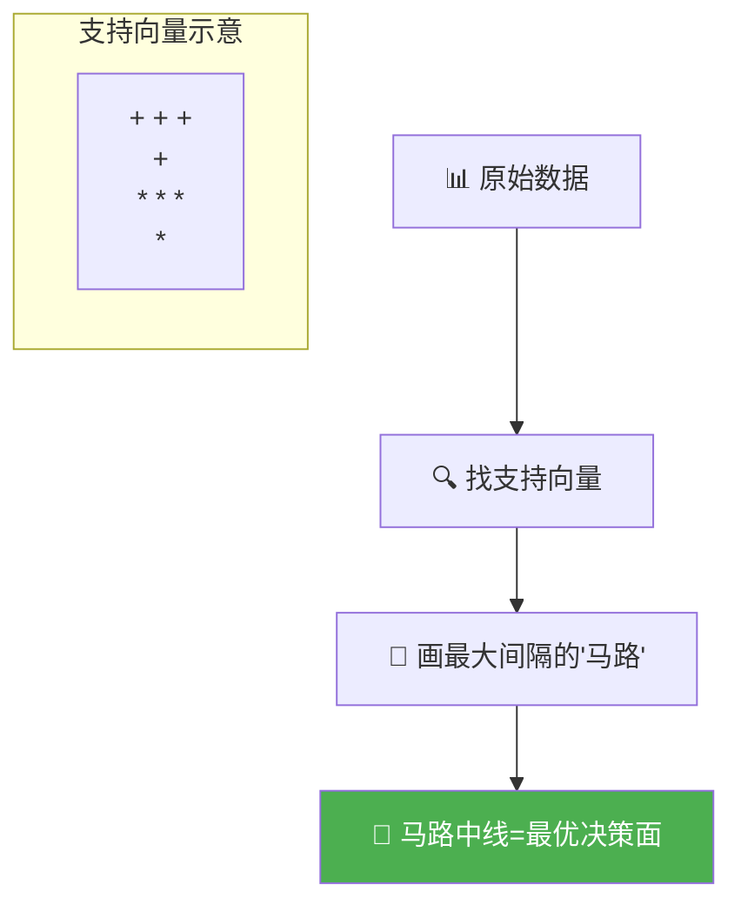

# 第6章：支持向量机——在纸上画一条"最聪明"的线

## 🎯 读完本章你能...

理解支持向量机(SVM)如何找到"最优分界线"，用高斯核函数解决"画不出一条直线分开"的问题，并用sklearn的SVC完成一个分类任务。

## 📖 从一个故事开始

体育课上，王老师让同学们站到操场上做一个小游戏。男生站一堆，女生站一堆——两群人之间大概隔了5米。王老师说："我在地上画一条直线，把男生女生分开。谁画得好，我就给谁免跑圈。"

小明第一个举手。他蹲在地上仔细观察了一会儿，在男生群和女生群的正中间画了一条线。"简单！"小明得意地说。

"等一下，"王老师说，"如果明天新来了一个同学，站在线的哪边就算哪边。小明的线挨着男生这边很近了——万一新同学是个男生，但稍微有点'偏中间'，不就被划到女生那边去了吗？"

小王想了想，重新画了一条线。这条线不仅把两群人分开了，而且离两边都尽量远——就像马路中间的隔离带，宁可留宽一点，也不要贴边。

后来王老师说："大家猜猜，如果男生和女生混在一起，站成了一个同心圆——男生在外圈、女生在内圈。你还能画一条直线把两群人分开吗？"

全班都愣住了——怎么可能！一条直线无论如何无法把一个圆分成"内圈=女生、外圈=男生"。除非……除非我们站起来，把"直线"画在空中，从上方俯瞰时投影下来？或者我们换一种画法——不是直线，而是曲线？

王老师笑着说："你们刚才的直觉，正好引出了本章的两大主角——支持向量机SVM的**最大间隔**和**核函数**。那条'离两边都远'的线，就是最大间隔；把圆形问题变成立体空间中的平面，就是核函数。"

## 📖 原理讲解

### SVM的核心直觉：找"最宽的路"

SVM（Support Vector Machine，支持向量机）是机器学习中最优雅的分类算法之一。它的目标非常简单：**在所有能把两类数据分开的线中，找一条最"稳"的线——离两边数据都尽可能远。**

想象两类数据（比如男生和女生的身高体重数据）画在二维平面上。理论上，能分开它们的线有很多条——有的贴着左边，有的贴着右边，有的斜着。SVM要选的那一条，不是随便哪条都行，而是**让"路"最宽**的那条。

这条"路"的宽度在数学上叫做**间隔**（Margin）。间隔越大，模型对新数据的容错率越高。如果新来的点稍微偏一点，它仍然在正确的"势力范围"内。

用数学语言描述：给定训练数据\((\mathbf{x}_i, y_i)\)，其中\(y_i \in \{+1, -1\}\)（+1是正类，-1是负类），SVM要找一个超平面：

\[
\mathbf{w}^T \mathbf{x} + b = 0
\]

其中\(\mathbf{w}\)是法向量（决定直线/平面的方向），\(b\)是偏置（决定直线/平面的位置）。分类规则是：如果\(\mathbf{w}^T \mathbf{x} + b > 0\)，预测为+1；如果\(\mathbf{w}^T \mathbf{x} + b < 0\)，预测为-1。

**间隔**的计算公式为：

\[
\text{margin} = \frac{2}{\|\mathbf{w}\|}
\]

其中\(\|\mathbf{w}\|\)是向量\(\mathbf{w}\)的长度（L2范数），即\(\|\mathbf{w}\| = \sqrt{w_1^2 + w_2^2 + \cdots + w_n^2}\)。

SVM的目标就是最大化这个间隔——也就是**最小化\(\|\mathbf{w}\|\)**。因为分母越小（w的长度越小），分数越大（间隔越大）。

大白话翻译：SVM就是想找一条线，让线的方程里的\(\mathbf{w}\)的长度尽量小。\(\mathbf{w}\)的长度小，意味着线"平缓"——离两边的数据都远。

### 支持向量：决定了整条线命运的"关键点"

在两类数据之间的"马路"边缘，有一些点紧贴着马路边。这些点叫**支持向量**（Support Vectors），它们是唯一影响SVM最终分界线的点。

为什么叫"支持"向量？因为它们就像建筑物的承重墙——如果把它们移走，分界线会变；但如果移走其他远离分界线的点，分界线纹丝不动。

这在计算上有一个巨大的好处：SVM只需要记住少数几个支持向量，就能做出完整的判断。其他大多数训练样本（马路中间的那些点）在训练完成后可以"忘掉"。

🎮 **类比**：支持向量就像是球赛场上决定越位线的"最后一名防守球员"。整条越位线的位置由他一个人决定。前面站着5个前锋还是2个前锋，不影响越位线画在哪。SVM也一样——只有离分界线最近的那几个点（支持向量），才决定了线的位置。

### 软间隔：允许"犯规"的SVM

现实中的数据很少能完美地分干净——总有几个点"站错了队"。一个男生站在了女生堆里，一条直线怎么画都要么把这个男生划错，要么把旁边的女生也带错。

这时候，"软间隔"（Soft Margin）就登场了。软间隔允许：**不是100%分类正确，而是允许少数几个点出错**。但每犯一个错，都要"罚款"——这个罚款用一个参数\(C\)来控制。

参数\(C\)的含义：
- \(C\)很大（比如\(C=1000\)）：建模态度严格，宁可画一条扭来扭去的线，也不想犯任何错。容易过拟合。
- \(C\)很小（比如\(C=0.1\)）：态度宽松，能容忍一些点"站错队"，画出的线更平滑。可能欠拟合。

用数学语言：软间隔SVM在最大化\(\frac{2}{\|\mathbf{w}\|}\)的同时，对每个分类错误的点加一个惩罚项\(\xi_i\)（宽松变量）。目标函数为：

\[
\min \frac{1}{2}\|\mathbf{w}\|^2 + C \sum_{i=1}^{n} \xi_i
\]

第一部分\(\frac{1}{2}\|\mathbf{w}\|^2\)是"追求大间隔"，第二部分\(C\sum\xi_i\)是"惩罚分类错误"。\(C\)越大，对错误的容忍度越低。

### 核函数：SVM的"升维打击"

回到开头体育课的那个难题——男生在内圈、女生在外圈，围成了一个同心圆。一条直线绝无可能把两类分开。

但是！如果我们加一个新维度——\(z = x^2 + y^2\)（距离原点的平方距离），把原本的二维平面"拎"到三维空间。内圈的z值小，外圈的z值大——在三维空间里，用一个平面就能轻易把两类分开了！

这个"把数据映射到更高维度"的操作，就是**核函数**（Kernel Function）在做的。核函数的神奇之处在于：它不需要真正地把数据算到高维再分类（那样计算量可能爆炸），而是用一个巧妙的"核技巧"（Kernel Trick），在原始低维空间直接算出了高维空间的结果。

三种最常用的核函数：

| 核函数 | 公式 | 一句话解释 | 适用场景 |
|--------|------|-----------|----------|
| **线性核** | \(K(\mathbf{a}, \mathbf{b}) = \mathbf{a} \cdot \mathbf{b}\) | 等于不升维，直接画直线 | 数据基本线性可分 |
| **多项式核** | \(K(\mathbf{a}, \mathbf{b}) = (\mathbf{a} \cdot \mathbf{b} + r)^d\) | 用多项式"弯曲"分界线 | 数据有弧度形边界 |
| **RBF/高斯核** | \(K(\mathbf{a}, \mathbf{b}) = e^{-\gamma \|\mathbf{a} - \mathbf{b}\|^2}\) | 把点"投影"到无限维 | 万能核，最常用 |

高斯核（RBF核）是最常用的核函数。参数\(\gamma\)控制每个样本的"影响力范围"：
- \(\gamma\)大：每个点的影响力范围窄，模型复杂，容易过拟合
- \(\gamma\)小：每个点的影响力范围宽，模型简单，可能欠拟合

🎮 **类比**：RBF核就像一种"地形改造机"。原本两类数据在平地上交错复杂，无法用直线分开。核函数相当于把平地变成山地——有的地方隆起、有的地方凹陷——两类数据自然地分到了不同的海拔高度上。然后SVM只需要在高处和低处之间"切一刀"就行了。

### SVM的优缺点

**优点**：
1. **在特征数多于样本数时表现极好**：这是SVM的独特强项。文本分类（几千个词但只有几百篇文章）中SVM非常出色。
2. **不同核函数适应不同数据形状**：从最简单的直线到复杂的任意形状，SVM都能应对。
3. **最终模型只依赖少数支持向量**：内存占用少。
4. **数学理论严密**：最大化间隔有严谨的最优化理论基础。

**缺点**：
1. **不直接输出概率**：SVM输出的是"正类/负类"，不像逻辑回归输出"70%概率是正类"。需要额外做校准。
2. **数据量大时慢**：训练时间复杂度约为\(O(n^2)\)到\(O(n^3)\)。样本过万就可能很慢。
3. **对参数（C和\(\gamma\)）敏感**：需要认真调参，否则表现可能不如随机森林。
4. **对缺失数据敏感**：数据质量要求高。

### SVM vs 其他分类器

| 对比维度 | SVM | 逻辑回归 | 随机森林 |
|----------|-----|---------|---------|
| 输出 | 类别 | 概率 | 类别/概率 |
| 可解释性 | 中（支持向量可见） | 高（每个特征有系数） | 低（黑盒投票） |
| 大数据性能 | 差 | 好 | 中 |
| 高维数据 | 极好 | 中 | 差 |
| 非线性 | 核函数 | 需手动构造 | 天然支持 |

## 🎨 图解专区

### 图1：SVM最大间隔分类器示意



### 图2：同心圆数据→RBF核升维→线性可分


### 图3：参数C对SVM的影响

| C值 | 间隔宽度 | 错误容忍度 | 决策边界 | 风险 |
|-----|---------|-----------|---------|------|
| C=0.01 | 很宽 | 极高 | 平缓，可能很多点判断错 | 欠拟合 |
| C=1 | 中等 | 中等 | 在正确和简单之间平衡 | 适中 |
| C=100 | 很窄 | 极低 | 每个点都分对，边界扭曲 | 过拟合 |

## 🤔 课堂活动

### 活动一：纸上画线分开散点

**场景**：在纸上用SVM的思想亲手画分界线。

**材料**：A4白纸、铅笔、尺子、橡皮。老师在黑板上画两簇散点（每簇约15个点，分布在两个大致分开的区域，但有一个"刺头"点站到了对方区域里）。

**任务**：
1. 用尺子在纸上画一条直线，尽量把两簇点分开。要求：线不能擦，只有一根尺子。
2. 量一量：你的线到最近的"敌人"点的距离是多少cm？
3. 和同桌交换纸，比较谁画的"间隔"更大。

**讨论**：
- 如果没有那个"刺头"点（站错队的点），你们的最优线会变吗？（引出支持向量的概念）
- 如果必须容忍那个"刺头"分错，线会怎么变？（引出软间隔C参数）
- 如果散点是同心圆的形状，谁能用一条直线分开？（引出核函数）

### 活动二：同心圆问题——感受"维度"的魔力

**场景**：理解为什么低维分不开的数据在高维可以分开。

**材料**：一张白纸，画内外两层同心散点（内圈10个红点、外圈10个蓝点）。

**任务**：
1. 试着在二维平面上画一条直线分开红蓝点。（不可能！）
2. 给每个点算\(z = x^2 + y^2\)的值，写在旁边。
3. 观察：内圈红点的z值范围是多少？外圈蓝点的z值范围是多少？
4. 在z轴上，能用"一个值"把红蓝分开吗？（能！\(z < 某个阈值\)的是红点，\(z > 阈值\)的是蓝点）

**讨论**：
- 这个"z = x^2 + y^2"就是RBF核函数的直觉版。RBF核比这个复杂得多，但思想一样——把低维的困难问题"升维"成高维的简单问题。
- 升维会不会"作弊"？把所有数据都映到很高维，是不是一定能完美分类？代价是什么？（引出过拟合风险）

## 🔬 动手写代码

```python
# 导入库
import numpy as np
from sklearn.svm import SVC
from sklearn.model_selection import train_test_split
from sklearn.preprocessing import StandardScaler
from sklearn.metrics import accuracy_score, classification_report

# === 第1步：生成模拟数据（同心圆问题） ===
from sklearn.datasets import make_circles
X, y = make_circles(n_samples=400, noise=0.1, factor=0.5, random_state=42)
# factor=0.5: 内圈半径是外圈的一半

# === 第2步：划分数据并标准化 ===
X_train, X_test, y_train, y_test = train_test_split(
    X, y, test_size=0.2, random_state=42
)
scaler = StandardScaler()
X_train_s = scaler.fit_transform(X_train)
X_test_s = scaler.transform(X_test)
# 注意：SVM对特征尺度敏感，必须先标准化！

# === 第3步：训练SVM（RBF核） ===
svm = SVC(kernel='rbf',     # RBF核 = 高斯核
          C=1.0,            # 错误容忍度，1.0是默认值
          gamma='scale',    # 自动设置gamma
          random_state=42)
svm.fit(X_train_s, y_train)

# === 第4步：评估 ===
y_pred = svm.predict(X_test_s)
print(f"✅ SVM准确率: {accuracy_score(y_test, y_pred):.3f}")
print(classification_report(y_test, y_pred))
print(f"支持向量数量: {len(svm.support_vectors_)} / {len(X_train_s)}")
```

**运行结果解读**：SVM只需记住少数支持向量（通常远少于训练样本总数），就能在同心圆数据上达到高准确率。对比用`kernel='linear'`（线性核）试试——你会发现直线根本分不开同心圆，准确率只有约50%。

## 📝 本节小结

- SVM的核心思想是**最大化间隔**——在所有能分开两类数据的线中，找一条离两边都尽可能远的线。间隔的大小由\(\|\mathbf{w}\|\)决定，数学目标是最大化\(\frac{2}{\|\mathbf{w}\|}\)。
- 实际数据往往不能完美分开，**软间隔**允许一些点"犯规"但给予惩罚。参数\(C\)控制容忍度：\(C\)大则严格（可能过拟合），\(C\)小则宽松（可能欠拟合）。
- 当数据不是线性可分时（如同心圆），**核函数**将数据映射到高维空间，使得在高维中可以用平面分开。RBF/高斯核是最常用的"万能核"。

## 📚 参考文献

1. **Cortes, C., & Vapnik, V. (1995). Support-Vector Networks. *Machine Learning*, 20(3), 273-297.** — SVM的原始论文。Vladimir Vapnik是统计学习理论之父，这篇论文奠定了SVM的全部理论基础。
2. **StatQuest: Support Vector Machines (B站/YouTube)** — Josh Starmer用一个个小方块动画演示了SVM如何找最大间隔，以及核函数如何工作。全网最直观的SVM入门视频。
3. **3Blue1Brown: 线性代数的本质 (B站)** — SVM的数学核心是向量运算，这个系列让你真正"看见"向量和超平面。
4. **Scikit-learn官方文档: SVC** — https://scikit-learn.org/stable/modules/generated/sklearn.svm.SVC.html — 每个参数的含义和取值建议，代码示例完整。
5. **周志华.《机器学习》第6章 支持向量机. 清华大学出版社, 2016.** — 中文教材里对SVM的数学推导最清晰的一章，从线性可分到核函数层层递进。
6. **Andrew Ng. *Machine Learning* (Coursera) — SVM章节** — Ng用最浅显的比喻讲解SVM，"large margin classifier"这个概念就是他带火的。
7. **Bishop, C. M. *Pattern Recognition and Machine Learning*. Springer, 2006. 第7章** — 从概率视角看SVM，和逻辑回归对照，非常有启发性。
8. **LIBSVM官方网站** — https://www.csie.ntu.edu.tw/~cjlin/libsvm/ — 台大林智仁教授开发的SVM库，被sklearn和几乎所有ML平台引用。网站提供了大量中文资料和实战指南。
