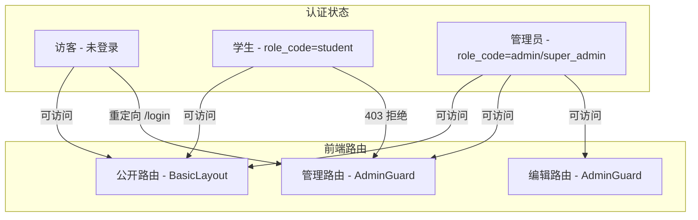

# 认证系统深度分析 + 访客权限方案

> 分析日期：2026-03-31

---

## 一、认证系统现状分析

### 1.1 当前认证架构

### 1.2 前端权限控制现状

**路由层面**（App.tsx）：

| 路由 | 布局 | 守卫 | 访客能否访问 |
|------|------|------|-------------|
| /home | BasicLayout | 无 | ✅ 可以 |
| /ai-agents | BasicLayout | 无（路由层） | ✅ 可以进入页面 |
| /informatics | BasicLayout | 无 | ✅ 可以 |
| /informatics/:id | BasicLayout | 无 | ✅ 可以 |
| /it-technology | BasicLayout | 无 | ✅ 可以 |
| /it-technology/python-lab | BasicLayout | 无 | ✅ 可以进入页面 |
| /personal-programs | BasicLayout | 无 | ✅ 可以 |
| /articles | BasicLayout | 无 | ✅ 可以 |
| /articles/:slug | BasicLayout | 无 | ✅ 可以 |
| /xbk | BasicLayout | 无 | ⚠️ 取决于 Feature Flag |
| /login | 无布局 | 无 | ✅ 可以 |
| /admin/* | AdminLayout | AdminGuard | ❌ 需要管理员登录 |

**页面内部认证检查**：

| 页面 | 内部检查 | 访客体验 |
|------|---------|---------|
| AIAgents | 发送消息时检查 `auth.isLoggedIn()` | ⚠️ 可以看到智能体列表，但发消息时弹登录框 |
| Informatics | 使用 `publicTypstNotesApi`（公开 API） | ✅ 完全可用 |
| Articles | 使用 `articleApi`（需认证的 API） | ❌ 可能 401 报错 |
| ITTechnology | 无特殊检查 | ✅ 页面可见 |
| PythonLab | 需要创建调试会话 | ❌ 需要登录 |
| Xbk | `require_xbk_access` 检查 Feature Flag | ⚠️ 取决于配置 |

### 1.3 后端 API 权限控制现状

| API 路径 | 认证要求 | 访客可用 |
|----------|---------|---------|
| GET /health, /ping, /version | 无 | ✅ |
| GET /ai-agents/active | 无 | ✅ |
| POST /ai-agents/stream | require_user | ❌ |
| GET /articles/public/list | 无 | ✅ |
| GET /articles/public/:slug | 无 | ✅ |
| GET /articles | 需认证 | ❌ |
| GET /categories/public/list | 无 | ✅ |
| GET /informatics/public/* | 无 | ✅ |
| GET /system/public/feature-flags/:key | 无 | ✅ |
| GET /xbk/* | require_xbk_access | ⚠️ 取决于 Flag |
| POST /auth/login | 无 | ✅ |
| GET /classroom/active | 需认证 | ❌ |
| GET /assessment/available | 需认证 | ❌ |

---

## 二、发现的问题

### 2.1 文章页面访客体验问题

**问题**：`/articles` 页面使用 `articleApi`（需认证），而非 `articleApi.getPublicList()`。访客进入文章列表页会收到 401 错误。

**代码位置**：`frontend/src/pages/Articles/index.tsx` 第 9 行导入了 `articleApi`，但需要确认是否调用的是公开接口。

### 2.2 AI 智能体页面的访客体验

**现状**：
- 访客可以进入 `/ai-agents` 页面
- 可以看到智能体列表（`/ai-agents/active` 无需认证）
- 发送消息时，页面内部弹出登录模态框

**问题**：这个体验其实是合理的，但需要确认登录模态框是否正常工作。

### 2.3 导航可见性控制

**现状**：导航栏通过 Feature Flags 控制可见性（`navVisibility.ts`），这是后台可配置的。

**问题**：Feature Flags 控制的是导航入口的显示/隐藏，但即使隐藏了导航，用户仍可通过直接输入 URL 访问页面。

### 2.4 UserMenu 访客状态

**现状**：未登录时显示"未登录"头像，点击弹出登录框。这个设计是合理的。

---

## 三、你提到的需求梳理

### 3.1 访客应该能看到的内容

| 功能 | 当前状态 | 需要修改 |
|------|---------|---------|
| 首页 | ✅ 可见 | 无需修改 |
| 导航栏 | ✅ 可见（受 Feature Flag 控制） | 无需修改 |
| 信息学竞赛笔记浏览 | ✅ 可见（公开 API） | 无需修改 |
| 文章浏览 | ⚠️ 可能 401 | 需要改用公开 API |
| AI 智能体列表 | ✅ 可见 | 无需修改 |
| 信息技术页面 | ✅ 可见 | 无需修改 |
| 个人程序页面 | ✅ 可见 | 无需修改 |
| 选课信息（如果公开） | ⚠️ 取决于 Flag | 无需修改 |

### 3.2 访客不应该能做的事情

| 功能 | 当前状态 | 需要修改 |
|------|---------|---------|
| 与智能体对话 | ✅ 已拦截（弹登录框） | 无需修改 |
| 进入后台 /admin | ✅ 已拦截（AdminGuard） | 无需修改 |
| 看到后台关闭/隐藏的入口 | ⚠️ 部分问题 | 需要检查 |
| 创建调试会话 | ✅ 已拦截（需认证） | 无需修改 |
| 参与课堂互动 | ✅ 已拦截（需认证） | 无需修改 |
| 参与自主检测 | ✅ 已拦截（需认证） | 无需修改 |

### 3.3 后台关闭/隐藏入口的问题

**Feature Flag 机制**：
- 导航栏通过 `featureFlagsApi.getPublic(flagKey)` 控制显示
- 如果 Flag 设为 disabled，导航入口隐藏
- 但直接访问 URL 仍可进入页面

**需要修改**：当 Feature Flag 关闭时，对应页面也应该显示"该功能暂未开放"或重定向。

---

## 四、认证系统本身的问题

### 4.1 你提到的"认证系统有问题"

请具体描述你遇到的问题，以下是我发现的潜在问题：

1. **登录后会话不稳定？** — `fetchCurrentUser` 有 8 秒超时，网络慢时可能失败
2. **Cookie 跨域问题？** — `COOKIE_SECURE=false` 在 HTTP 下正常，但 HTTPS 下需要 true
3. **学生登录方式混乱？** — 支持 full_name+student_id 和 student_id+full_name 双向匹配，可能导致混淆
4. **refresh token 轮换导致并发请求失败？** — 多个 tab 同时 refresh 时，第一个成功后第二个会 401
5. **SSE 鉴权问题？** — query token 和 Cookie 双通道，可能有边界情况

---

## 五、修改方案

### 方案 A：文章页面改用公开 API（必须修）

**前端**：`/articles` 页面对未登录用户使用 `articleApi.getPublicList()` 而非需认证的 `articleApi.getList()`

### 方案 B：Feature Flag 页面级拦截（建议修）

**前端**：在 BasicLayout 的 `<Outlet />` 外层添加 Feature Flag 检查，当 Flag 关闭时显示提示页面

### 方案 C：统一访客体验（可选）

**前端**：创建一个 `useGuestGuard` hook，在需要登录的操作前统一弹出登录框，而非让 API 返回 401

---

## 六、需要你确认的问题

1. 你遇到的具体认证问题是什么？（登录失败？会话丢失？401 报错？）
2. 文章页面访客是否应该能看到所有文章，还是只能看到已发布的公开文章？
3. Feature Flag 关闭的页面，访客直接访问 URL 时应该显示什么？（提示页面 or 重定向首页？）
4. PythonLab 页面访客是否应该能看到界面（只是不能运行代码）？
