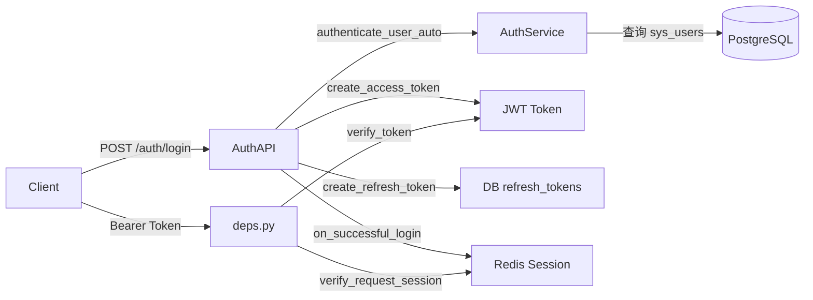
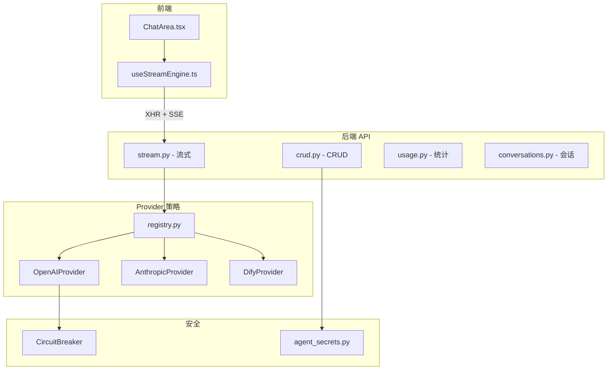
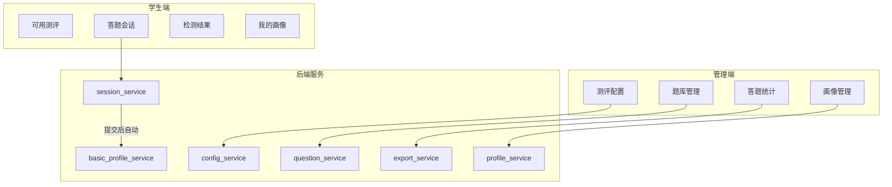

# WangSh 逐板块深度分析报告

> 分析日期：2026-03-31
> 项目版本：v1.5.3（原分析基于 v1.5.2，状态已于 2026-03-31 更新）

### 问题状态更新（2026-03-31）

| 模块 | 问题 | 当前状态 |
|------|------|----------|
| 认证系统 | 访客 401 | **已解决 v1.5.3** — useAuth 修复 + 公开 API |
| 课堂互动 | pub/sub 耦合 | **已解决** — 提取到 app/core/pubsub.py |
| 课堂互动 | SSE 单进程 | **未解决** — 仍为进程内 asyncio.Queue |
| 课堂互动 | classroom.py 过大 | **部分完成** — 581行（pub/sub 已提取） |
| 测评系统 | 缺 mock 测试 | **已实现** — 2 个测试文件 |
| 代码清理 | celery_app 重复 | **已解决 v1.5.3** — 合并清理 |

---

## 板块一：认证系统

### 1.1 架构概览



### 1.2 核心文件

| 文件 | 行数 | 职责 |
|------|------|------|
| `app/services/auth.py` | ~458 | 认证核心：密码验证、JWT 创建/验证、用户认证、refresh token 管理 |
| `app/core/deps.py` | ~195 | 依赖注入：get_current_user、require_admin、require_student 等 |
| `app/core/session_guard.py` | ~143 | 会话守卫：nonce 机制、IP 绑定、会话轮换 |
| `app/api/endpoints/auth/auth.py` | ~320 | API 端点：login、logout、refresh、me、verify |
| `app/utils/security.py` | - | 密码哈希（argon2/bcrypt 双算法） |
| `app/utils/rate_limit.py` | - | 登录速率限制 |

### 1.3 认证流程

1. 登录：`authenticate_user_auto` 自动识别管理员/学生
   - 管理员：username + password（bcrypt/argon2 验证）
   - 学生：full_name + student_id（双向匹配，无密码哈希）
2. 令牌：JWT access token（60min）+ DB refresh token（7天，轮换策略）
3. 会话：Redis 存储 nonce，每次登录轮换，旧 token 自动失效
4. Cookie：httponly + secure + samesite=lax，同时支持 Bearer header

### 1.4 安全特性

- 登录速率限制：同 IP 每 2 秒最多 1 次
- Refresh token 轮换：使用一次即撤销，防重放
- 会话 nonce：防止多设备并发登录（可配置）
- IP 绑定：可选的 IP 唯一性校验
- SSE 鉴权：支持 query token + Cookie 双通道

### 1.5 发现的问题

| 问题 | 严重程度 | 详情 |
|------|---------|------|
| 学生认证无密码哈希 | 中 | 学生用 full_name + student_id 明文匹配，安全性较低 |
| register 端点是空壳 | 低 | `/auth/register` 返回模拟数据，未实现真正注册 |
| auth.py 内部 import 过多 | 低 | 多处函数内 `from ... import`，影响可读性 |
| UserInfo 是 TypedDict | 低 | 用 dict 传递用户信息，类型安全性不如 Pydantic model |

---

## 板块二：AI 智能体系统

### 2.1 架构概览



### 2.2 核心文件

| 文件 | 行数 | 职责 |
|------|------|------|
| `services/agents/chat_stream.py` | ~175 | 流式对话核心：Provider 调度、模型回退、SSE 生成 |
| `services/agents/providers/registry.py` | ~26 | Provider 注册表：自动识别 OpenAI/Anthropic/Dify |
| `services/agents/providers/openai_provider.py` | - | OpenAI 兼容协议（含 OpenRouter/SiliconFlow） |
| `services/agents/providers/dify_provider.py` | - | Dify 专用：多候选 URL + SSE 透传 |
| `services/agents/providers/circuit_breaker.py` | - | 熔断器：连续失败后自动断路 |
| `api/endpoints/agents/ai_agents/crud.py` | ~335 | CRUD API：列表、创建、更新、删除、模型发现 |
| `api/endpoints/agents/ai_agents/stream.py` | ~50 | 流式端点：SSE StreamingResponse |
| `utils/agent_secrets.py` | - | API Key 加密存储/解密 |

### 2.3 Provider 策略模式

```
agent_type == "dify"        → DifyProvider
endpoint 含 anthropic.com   → AnthropicProvider
其他（含 openrouter.ai）    → OpenAIProvider(is_openrouter=True/False)
```

### 2.4 关键机制

- 模型回退（OpenRouter）：`xxx:free` ↔ `xxx` 双向回退
- 熔断器：连续失败 N 次后自动断路，避免雪崩
- Dify 多候选 URL：`/chat-messages` 和 `/completion-messages` 自动切换
- API Key 加密：AES 加密存储，reveal 需二次密码验证
- 全链路 SSE 禁缓冲：后端 `no-cache` + craco proxy `selfHandleResponse` + 前端 XHR

### 2.5 发现的问题

| 问题 | 严重程度 | 详情 |
|------|---------|------|
| STREAM_TIMEOUT_SECONDS 硬编码 | 低 | 120 秒超时写死在代码中，应改为配置项 |
| crud.py 导入了 classroom 服务 | 中 | `from app.services import classroom as svc` 出现在 agents crud 中，模块耦合 |
| 缺少对话消息持久化的流式写入 | 中 | 流式完成后才写入 DB，中途断开会丢失部分内容 |

---

## 板块三：小组讨论系统

### 3.1 架构概览

- 基于 AI 智能体模块扩展，共享 `znt_agents` 表
- 独立的 4 张表：sessions、messages、members、analyses
- SSE 实时消息推送
- Redis 分布式锁防并发建组冲突

### 3.2 核心特性

- 权限控制：学生只能访问自己班级的讨论组
- 禁言功能：管理员可设置 `muted_until` 时间
- 组号锁机制：Redis 锁确保并发加入不冲突
- AI 分析：管理员可对讨论内容调用 AI 生成分析报告
- 跨系统分析：可关联测评数据进行交叉分析

### 3.3 发现的问题

| 问题 | 严重程度 | 详情 |
|------|---------|------|
| 班级解析逻辑复杂 | 低 | `resolve_target_class_name` 有多层回退逻辑，维护成本高 |
| 测试覆盖充分 | ✅ | 4 个测试文件覆盖权限、班级、锁、消息发送 |

---

## 板块四：课堂互动系统

### 4.1 架构概览

```mermaid
graph LR
    Teacher[教师端] -->|创建/开始/结束| AdminAPI[/classroom/admin]
    Student[学生端] -->|响应/查看| StudentAPI[/classroom]
    AdminAPI --> SSE_Admin[SSE /admin/stream]
    StudentAPI --> SSE_Student[SSE /stream]
    AdminAPI --> ActivitySvc[classroom.py - 607行]
    AdminAPI --> PlanSvc[classroom_plan.py - 242行]
```

### 4.2 核心文件

| 文件 | 行数 | 职责 |
|------|------|------|
| `services/classroom.py` | 607 | 活动 CRUD、SSE pub/sub、AI 分析、超时自动结束 |
| `services/classroom_plan.py` | 242 | 计划 CRUD、启动/推进/重置/结束 |
| `api/endpoints/classroom/admin.py` | - | 管理端 API |
| `api/endpoints/classroom/student.py` | - | 学生端 API |
| `api/endpoints/classroom/plan.py` | - | 计划 API |

### 4.3 活动类型

- question（问答）、poll（投票）、discussion（讨论）、quiz（测验）、fill_blank（填空+AI分析）

### 4.4 SSE 实现

- 进程内 `asyncio.Queue` 实现 pub/sub
- 管理端频道：`classroom:admin`
- 学生端频道：`classroom:student`
- 事件类型：activity_started、activity_ended、new_response、activity_changed

### 4.5 发现的问题

| 问题 | 严重程度 | 详情 |
|------|---------|------|
| classroom.py 过大 | 中 | 607 行单文件，包含 CRUD + SSE + AI 分析 + 超时检查，应拆分 |
| SSE 单进程限制 | 高 | 已在 P0 中标注，但代码层面未做防护（多 worker 时静默失效） |
| 超时检查节流粗糙 | 低 | `_last_auto_end_check` 全局变量，30 秒节流 |

---

## 板块五：自适应测评系统

### 5.1 架构概览



### 5.2 数据库设计（7 张表）

- `znt_assessment_configs` — 测评配置
- `znt_assessment_questions` — 题库
- `znt_assessment_sessions` — 答题会话
- `znt_assessment_answers` — 答题记录
- `znt_assessment_basic_profiles` — 初级画像（自动）
- `znt_student_profiles` — 高级画像（教师触发）
- `znt_assessment_config_agents` — 测评-智能体关联

### 5.3 两级画像体系

| 级别 | 触发方式 | 数据来源 | 谁能看 |
|------|---------|---------|--------|
| 初级画像 | 提交测评后自动 | 仅本次测评 | 学生+教师 |
| 高级画像 | 教师手动触发 | 测评+讨论+AI对话 | 学生+教师 |

### 5.4 发现的问题

| 问题 | 严重程度 | 详情 |
|------|---------|------|
| 第 3 期（三维画像）进行中 | 信息 | profile_service 已有代码但可能未完全集成 |
| AI 出题依赖外部服务 | 中 | 出题失败时无本地回退方案 |
| 测试覆盖一般 | 中 | 仅 2 个测试文件，缺少 AI 出题/评分的 mock 测试 |

---

## 板块六：信息学竞赛笔记系统

### 6.1 架构概览

- Typst 在线编辑器 + PDF 异步编译
- Celery typst-worker 执行编译任务
- GitHub 自动同步（定时 + 手动触发）
- 树形分类管理

### 6.2 核心文件

| 文件 | 职责 |
|------|------|
| `services/informatics/typst_notes.py` | 笔记 CRUD |
| `services/informatics/typst_styles.py` | 样式管理 |
| `services/informatics/typst_categories.py` | 分类管理 |
| `services/informatics/github_sync.py` | GitHub 同步 |
| `tasks/typst_compile.py` | Celery 编译任务 |
| `utils/typst_pdf_storage.py` | PDF 存储 |

### 6.3 编译流程

1. 用户编辑 Typst 源码 → 2. 调用编译 API → 3. Celery 异步任务 → 4. typst-worker 执行 → 5. PDF 存储 → 6. 返回路径

### 6.4 发现的问题

| 问题 | 严重程度 | 详情 |
|------|---------|------|
| GitHub 同步在 main.py 定时循环中 | 低 | 已拆分到 startup.py，但同步逻辑与清理任务耦合 |
| 公开笔记无缓存 | 低 | public_typst_notes 每次查询 DB |

---

## 板块七：PythonLab 调试环境

### 7.1 架构概览

```mermaid
graph TB
    FE[前端 PythonLab Studio] -->|WebSocket| WS[/debug/sessions/id/ws]
    FE -->|WebSocket| Term[/debug/sessions/id/terminal]
    WS -->|DAP 协议| Sandbox[Docker 沙箱容器]
    Sandbox -->|debugpy :5678| Python[Python 进程]

    subgraph 管理
        API[REST API] --> SessionMgr[会话管理]
        Celery[PythonLab Worker] --> Cleanup[孤儿清理]
        Celery --> StaleCleanup[过期清理]
    end
```

### 7.2 核心特性

- Docker 沙箱隔离：每用户独立容器，CPU 50%/内存 80MB 限制
- DAP 协议调试：断点、单步、变量查看
- Owner 互斥策略：steal/reject/allow 三种模式
- 自动清理：孤儿容器 + 过期会话定时清理
- 流程图引擎：CFG 解析、Graphviz 渲染、双向同步（前端最复杂模块，~30 个文件）

### 7.3 前端复杂度

PythonLab 是前端最复杂的模块：
- `flow/` 目录：~30 个文件，包含 CFG→流程图转换、Graphviz 渲染、双向同步、确定性测试
- `stores/` 目录：Canvas/Code/DebugSession/RunnerActions/UI 五个 Store
- `workers/` 目录：Pyodide Web Worker
- `pipeline/` 目录：代码管道规则引擎

### 7.4 发现的问题

| 问题 | 严重程度 | 详情 |
|------|---------|------|
| K8s sandbox 预留未使用 | 低 | `sandbox/k8s.py` 存在但未集成 |
| 前端 flow 引擎测试充分 | ✅ | ~20 个测试文件覆盖各种场景 |
| CI 门禁完善 | ✅ | 并发测试 + Phase C 可见性测试 + 自动建单 |

---

## 板块八：选课系统（XBK）

### 8.1 架构概览

- 三张核心表：xbk_students、xbk_courses、xbk_selections
- 支持年份/学期/年级多维筛选
- Feature Flag 控制公开访问
- Excel 导入导出
- 统计分析：班级分布、课程选择、教师分布

### 8.2 核心文件

| 文件 | 行数 | 职责 |
|------|------|------|
| `api/endpoints/xbk/data.py` | 646 | 学生/课程/选课 CRUD（最大的单文件 API） |
| `api/endpoints/xbk/exports.py` | - | 导出功能 |
| `api/endpoints/xbk/analysis.py` | - | 统计分析 |
| `api/endpoints/xbk/import_export.py` | - | Excel 导入 |
| `api/endpoints/xbk/public_config.py` | - | 公开配置 |

### 8.3 发现的问题

| 问题 | 严重程度 | 详情 |
|------|---------|------|
| data.py 过大 | 中 | 646 行单文件包含 3 个实体的完整 CRUD，应拆分 |
| 缺少 Service 层 | 中 | API 端点直接操作 DB，业务逻辑与路由耦合 |
| 测试覆盖良好 | ✅ | 3 个测试文件 + 性能测试 |

---

## 板块九：文章/内容管理系统

### 9.1 架构概览

- 文章系统：Markdown 编辑、分类管理、公开/私有
- 样式系统：自定义 Markdown 渲染样式
- 分类系统：支持搜索、热门、统计

### 9.2 核心文件

| 文件 | 职责 |
|------|------|
| `api/endpoints/content/articles/articles.py` | 文章 CRUD + 公开接口 |
| `api/endpoints/content/articles/markdown_styles.py` | 样式管理 |
| `api/endpoints/content/categories/categories.py` | 分类 CRUD |
| `services/articles/article.py` | 文章服务 |
| `services/articles/category.py` | 分类服务 |

### 9.3 发现的问题

| 问题 | 严重程度 | 详情 |
|------|---------|------|
| 文章缓存测试存在 | ✅ | test_articles_cache.py |
| 样式示例自动初始化 | ✅ | 启动时自动 seed |

---

## 板块十：系统管理与基础设施

### 10.1 系统管理

- Feature Flags：功能开关（公开/管理员）
- 系统概览：Dashboard 统计
- Typst 指标：编译性能监控
- HTTP 指标：请求计数、延迟、错误率（Redis 存储）

### 10.2 基础设施

- Docker Compose：7 个服务（postgres、redis、backend、frontend、gateway、typst-worker、pythonlab-worker）
- Caddy 网关：反向代理、自动 HTTPS
- Celery：两个 Worker（typst 队列 + celery 队列）
- Alembic：22 个迁移文件，含分叉和合并
- CI/CD：6 个 GitHub Actions 工作流

### 10.3 中间件栈

```
SecurityHeadersMiddleware → RequestIdMiddleware → HttpMetricsMiddleware → CORS → Router
```

### 10.4 发现的问题

| 问题 | 严重程度 | 详情 |
|------|---------|------|
| celery_app.py 重复 | 低 | `app/celery_app.py` 和 `app/core/celery_app.py` 两份 |
| admin_stream SSE 与 classroom SSE 独立实现 | 中 | 两套 pub/sub 机制，可统一 |
| dify_network 外部依赖 | 低 | docker-compose 依赖 `docker_default` 外部网络，Dify 未运行时会报错 |

---

## 总结：各板块健康度评分

| 板块 | 代码质量 | 测试覆盖 | 文档完整 | 架构合理 | 综合评分 |
|------|---------|---------|---------|---------|---------|
| 认证系统 | ⭐⭐⭐⭐ | ⭐⭐⭐⭐ | ⭐⭐⭐⭐ | ⭐⭐⭐⭐ | A |
| AI 智能体 | ⭐⭐⭐⭐ | ⭐⭐⭐⭐ | ⭐⭐⭐⭐⭐ | ⭐⭐⭐⭐ | A |
| 小组讨论 | ⭐⭐⭐⭐ | ⭐⭐⭐⭐⭐ | ⭐⭐⭐⭐ | ⭐⭐⭐⭐ | A |
| 课堂互动 | ⭐⭐⭐ | ⭐⭐ | ⭐⭐⭐⭐ | ⭐⭐⭐ | B |
| 自适应测评 | ⭐⭐⭐⭐ | ⭐⭐⭐ | ⭐⭐⭐⭐⭐ | ⭐⭐⭐⭐ | A- |
| 信息学笔记 | ⭐⭐⭐⭐ | ⭐⭐⭐ | ⭐⭐⭐⭐ | ⭐⭐⭐⭐ | B+ |
| PythonLab | ⭐⭐⭐⭐⭐ | ⭐⭐⭐⭐⭐ | ⭐⭐⭐⭐ | ⭐⭐⭐⭐⭐ | A+ |
| 选课系统 | ⭐⭐⭐ | ⭐⭐⭐⭐ | ⭐⭐⭐ | ⭐⭐ | B- |
| 文章系统 | ⭐⭐⭐⭐ | ⭐⭐⭐ | ⭐⭐⭐ | ⭐⭐⭐⭐ | B+ |
| 系统管理 | ⭐⭐⭐ | ⭐⭐ | ⭐⭐⭐ | ⭐⭐⭐ | B- |

### 优先改进建议

1. 课堂互动 `classroom.py`（607行）拆分为 CRUD + SSE + AI 分析三个模块
2. 选课系统 `xbk/data.py`（646行）拆分 + 补充 Service 层
3. 统一两套 SSE pub/sub 实现（admin_stream + classroom）
4. 自适应测评补充 AI 出题/评分的 mock 测试
5. 清理重复的 celery_app.py
