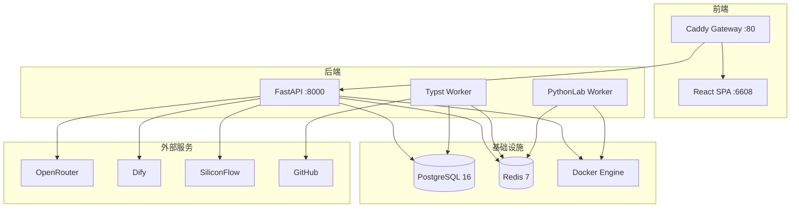
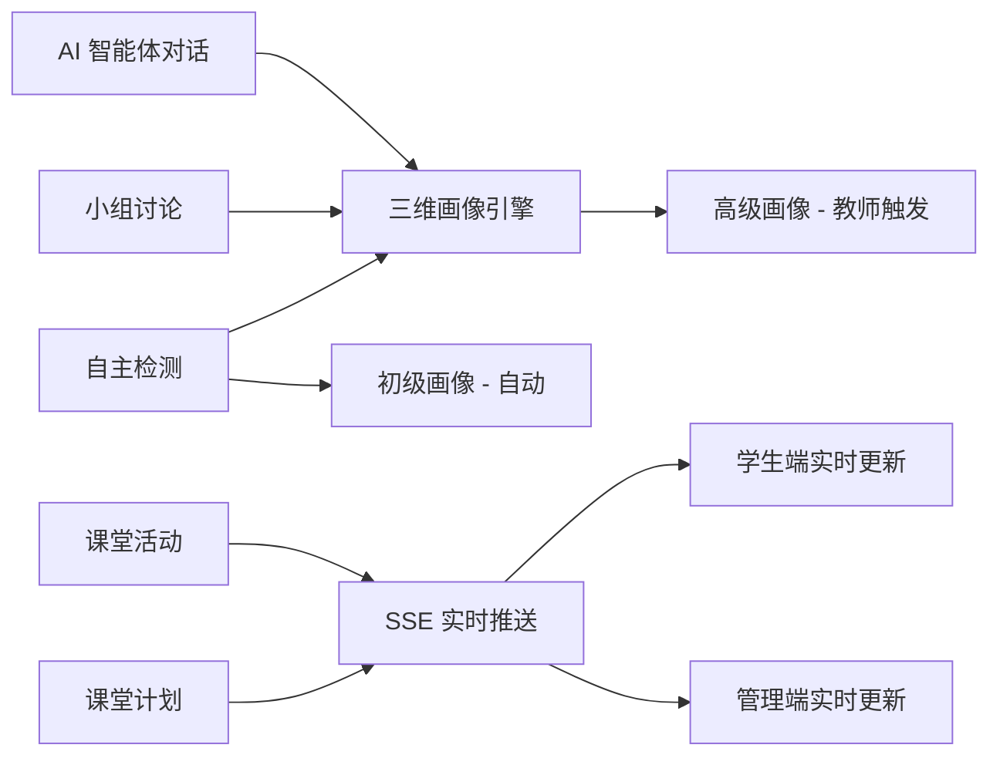

# WangSh 项目深度分析报告

> 分析日期：2026-03-30
> 项目版本：v1.5.2

---

## 一、项目架构总览



### 技术栈明细

| 层级 | 技术 | 版本 |
|------|------|------|
| 前端框架 | React + TypeScript | 19.2.4 / 5.9.3 |
| UI 组件库 | Ant Design | 6.2.3 |
| 构建工具 | craco + react-scripts | 7.1.0 |
| CSS 方案 | Tailwind CSS | 3.x |
| 后端框架 | FastAPI | 0.128.0 |
| ORM | SQLAlchemy | 2.0.46 |
| 数据库 | PostgreSQL | 16-alpine |
| 缓存 | Redis | 7-alpine |
| 任务队列 | Celery | 5.6.2 |
| 网关 | Caddy | 2 |
| 容器化 | Docker Compose | - |
| 迁移工具 | Alembic | 1.18.3 |

---

## 二、功能模块分析

### 2.1 模块清单与成熟度

| 模块 | 后端路由前缀 | 前端路径 | 成熟度 | 测试覆盖 |
|------|-------------|---------|--------|---------|
| 认证系统 | /auth | /login | 高 | 4 个测试文件 |
| 用户管理 | /users | /admin/users | 高 | 2 个测试文件 |
| AI 智能体 | /ai-agents | /ai-agents | 高 | 7 个测试文件 |
| 小组讨论 | /ai-agents/group-discussion | /ai-agents | 高 | 4 个测试文件 |
| 文章系统 | /articles, /categories | /articles, /admin/articles | 高 | 2 个测试文件 |
| 信息学笔记 | /informatics | /informatics, /admin/informatics | 高 | 2 个测试文件 |
| PythonLab | /debug | /it-technology/python-lab | 高 | 大量 flow 测试 |
| 选课系统 | /xbk | /xbk | 高 | 3 个测试文件 |
| 课堂互动 | /classroom | /admin/classroom-interaction | 中 | 1 个测试文件 |
| 自适应测评 | /assessment | /admin/assessment | 中 | 2 个测试文件 |
| 课堂计划 | /classroom/plans | /admin/classroom-plan | 中 | 无独立测试 |
| 点名系统 | /xxjs | /admin/it-technology | 低 | 无测试 |
| 系统管理 | /system | /admin/system | 中 | 无独立测试 |

### 2.2 模块间数据流



---

## 三、发现的问题与改进建议

### 3.1 文档与代码不一致

| 问题 | 严重程度 | 详情 |
|------|---------|------|
| README 仍引用 scripts/deploy.sh | 高 | README 第 20/29 行仍写 `bash scripts/deploy.sh deploy`，但文档匹配性报告已标记此问题并声称已修复 DEPLOY.md/CICD.md，唯独 README 未同步 |
| docker-compose.dev.yml 版本硬编码 1.5.1 | 中 | 第 91/155 行 `APP_VERSION` 默认值仍为 1.5.1，而 .env.example 和 docker-compose.yml 已更新为 1.5.2 |
| package.json 版本 1.5.0 | 低 | 前端 package.json version 字段为 1.5.0，与项目版本 1.5.2 不一致 |
| CLAUDE_MEMORY.md 文档缺失 | 中 | docs/README.md 和 CLAUDE_GUIDE.md 多处引用 CLAUDE_MEMORY.md，但该文件不存在于 docs 目录 |

### 3.2 架构层面

| 问题 | 严重程度 | 详情 |
|------|---------|------|
| SSE pub/sub 单进程限制 | 高 | AUTO_REFRESH.md 明确指出后端 pub/sub 为进程内实现，仅支持单 worker。但生产 docker-compose.yml 中 UVICORN_WORKERS 默认为 1，.env.example 建议设为 CPU 核心数。多 worker 时 SSE 推送会失效 |
| main.py 启动逻辑过重 | 中 | lifespan 函数承担了表创建、视图创建、Alembic 版本同步、超级管理员创建、样式初始化、文章示例初始化、GitHub 同步定时任务等职责，违反单一职责原则 |
| celery_app.py 重复 | 低 | 存在 backend/app/celery_app.py 和 backend/app/core/celery_app.py 两个文件 |
| 开发/生产 DEBUG 行为差异大 | 中 | DEBUG=True 时自动 create_all 绕过 Alembic，虽有 _sync_alembic_version 补偿，但仍可能导致迁移状态不一致 |

### 3.3 安全层面

| 问题 | 严重程度 | 详情 |
|------|---------|------|
| .env.example 中 COOKIE_SECURE=false | 中 | 生产模板默认 false，容易被直接复制到生产环境而忘记修改 |
| kubernetes 依赖在 requirements.txt | 低 | kubernetes==32.0.0 作为生产依赖安装，但 k8s sandbox 似乎未实际使用（sandbox/k8s.py 存在但可能是预留） |
| pytest 在生产依赖中 | 低 | pytest==9.0.2 不应出现在生产 requirements.txt 中，应分离到 requirements-dev.txt |

### 3.4 前端层面

| 问题 | 严重程度 | 详情 |
|------|---------|------|
| 双 ESLint 配置文件 | 低 | 同时存在 .eslintrc.js 和 eslint.config.mjs，可能产生冲突 |
| CSS 文件与 Tailwind 混用 | 低 | CLAUDE_GUIDE.md 规定不新增 .css 文件，但仍有多个 .css 文件存在（Articles.css, AdminLayout.css 等） |
| 路由重定向可能有误 | 低 | App.tsx 第 115 行 `/admin/articles/edit/:id` 重定向到 `/admin/articles/editor/new` 而非 `/admin/articles/editor/:id` |

### 3.5 测试层面

| 问题 | 严重程度 | 详情 |
|------|---------|------|
| 课堂计划无测试 | 中 | classroom_plan 服务和 API 无任何测试覆盖 |
| 点名系统无测试 | 低 | xxjs 模块无测试 |
| 系统管理无测试 | 低 | system admin API 无独立测试 |

### 3.6 数据库迁移

| 问题 | 严重程度 | 详情 |
|------|---------|------|
| 迁移链有分叉历史 | 中 | 存在两次分叉（XBK 分支 + 课堂互动分支），虽已通过 merge_heads 合并，但增加了维护复杂度 |
| 手动 DDL 在 main.py | 中 | _ensure_dev_schema 函数直接执行 DDL（添加列、创建索引），应迁移到 Alembic |
| 旧版初始化 SQL 保留 | 低 | full_init_v3.sql 和 full_init_v4.sql 同时存在，v3 可能已过时 |

---

## 四、代码结构分析

### 4.1 后端目录结构

```
backend/
  main.py                          # 应用入口 + 生命周期管理
  app/
    api/
      __init__.py                  # 路由注册中心（13 个模块）
      endpoints/
        agents/                    # AI 智能体 + 小组讨论
        assessment/                # 自适应测评
        classroom/                 # 课堂互动 + 计划
        content/                   # 文章 + 分类
        debug/                     # PythonLab
        informatics/               # 信息学笔记
        management/                # 用户管理
        system/                    # 系统管理
        xbk/                       # 选课
        xxjs/                      # 点名
        admin_stream.py            # SSE 推送
    core/
      config.py                    # 配置管理（~440 行，字段较多）
      deps.py                      # 依赖注入
      session_guard.py             # 会话守卫
      sandbox/                     # Docker/K8s 沙箱抽象
    models/                        # SQLAlchemy 模型（7 个子模块）
    schemas/                       # Pydantic Schema（7 个子模块）
    services/                      # 业务逻辑层（6 个子模块）
    tasks/                         # Celery 异步任务
    utils/                         # 工具函数
  alembic/                         # 数据库迁移（22 个版本文件）
  tests/                           # 测试（~30 个测试文件）
  scripts/                         # 运维/冒烟测试脚本
```

### 4.2 前端目录结构

```
frontend/src/
  App.tsx                          # 路由定义（~30 个路由）
  pages/
    Admin/                         # 管理端（15+ 子模块）
      AIAgents/                    # 智能体管理
      AgentData/                   # 智能体数据
      Articles/                    # 文章管理（含编辑器）
      Assessment/                  # 测评管理
      ClassroomInteraction/        # 课堂互动
      ClassroomPlan/               # 课堂计划
      Dashboard/                   # 仪表盘
      GroupDiscussion/             # 小组讨论管理
      Informatics/                 # 信息学管理（含 Typst 编辑器）
      ITTechnology/                # 信息技术（含 PythonLab Studio）
        pythonLab/                 # PythonLab 核心（最复杂模块）
          flow/                    # 流程图引擎（~30 个文件）
          stores/                  # 状态管理
          pipeline/                # 代码管道
          workers/                 # Web Worker
      PersonalPrograms/            # 个人作品
      System/                      # 系统管理
      Users/                       # 用户管理
    AIAgents/                      # 学生端 AI 对话
    Articles/                      # 文章浏览
    Informatics/                   # 信息学笔记浏览
    ITTechnology/                  # 信息技术页面
    Xbk/                           # 选课页面
  services/                        # API 服务层（按模块组织）
  components/                      # 公共组件
  hooks/                           # 自定义 Hooks
  layouts/                         # 布局组件
  styles/                          # 全局样式
```

### 4.3 复杂度热点

| 模块 | 文件数 | 复杂度 | 说明 |
|------|--------|--------|------|
| PythonLab flow 引擎 | ~30 | 极高 | 流程图解析、CFG 转换、双向同步、Graphviz 渲染 |
| AI 智能体 providers | ~8 | 高 | 多平台适配、流式输出、熔断器、模型回退 |
| 自适应测评 | ~12 | 高 | AI 出题、评分、两级画像、三维融合 |
| 课堂互动 | ~6 | 中 | SSE 推送、活动状态机、AI 分析 |
| config.py | 1 | 中 | ~440 行配置类，字段过多 |

---

## 五、Docker 部署分析

### 5.1 服务拓扑

| 服务 | 镜像 | 资源限制 | 健康检查 |
|------|------|---------|---------|
| postgres | postgres:16-alpine | 512M / 1 CPU | pg_isready |
| redis | redis:7-alpine | 256M / 0.5 CPU | redis-cli ping |
| backend | wangsh-backend:1.5.2 | 1G / 2 CPU | HTTP /health |
| frontend | wangsh-frontend:1.5.2 | 256M / 0.5 CPU | wget localhost:80 |
| gateway | wangsh-gateway:1.5.2 | 256M / 0.5 CPU | wget localhost:80 |
| typst-worker | wangsh-typst-worker:1.5.2 | 512M / 1 CPU | 无 |
| pythonlab-worker | wangsh-pythonlab-worker:1.5.2 | 1G / 2 CPU | 无 |

### 5.2 网络拓扑

- wangsh-network：内部通信网络
- dify_network：外部网络，连接 Dify 服务（docker_default）

### 5.3 数据持久化

| 卷 | 用途 |
|----|------|
| postgres_data | 数据库数据 |
| redis_data | Redis 持久化 |
| typst_pdfs | Typst PDF 文件 |
| uploads_data | 上传文件 |

---

## 六、CI/CD 分析

### 6.1 工作流清单

| 工作流 | 触发方式 | 功能 |
|--------|---------|------|
| dockerhub-amd64 | 手动 | 构建 5 个镜像推送 DockerHub |
| ci-quality | PR/push main | 后端 pytest + 前端 type-check + lint |
| pythonlab-owner-concurrency | 定时/手动 | PythonLab 并发测试 |
| pythonlab-phasec-gate | 定时/手动 | Phase C 可见性测试 |
| pr-pythonlab-owner-gate | PR | 并发测试门禁 |
| pr-pythonlab-phasec-gate | PR | Phase C 门禁 |

### 6.2 质量基线

- 后端：105 passed
- 前端：53 suites / 280 tests passed
- 前端 type-check：通过
- 前端 lint：0 errors, 68 warnings

---

## 七、改进方向建议

### P0 - 必须修复

1. README.md 中 scripts/deploy.sh 引用需更新
2. docker-compose.dev.yml 版本号同步到 1.5.2
3. SSE 单进程限制需在文档中明确标注，或改用 Redis pub/sub

### P1 - 建议改进

4. main.py lifespan 拆分：将初始化逻辑拆分到独立模块
5. requirements.txt 分离：生产依赖 vs 开发依赖
6. 补充缺失的 CLAUDE_MEMORY.md 或移除引用
7. 课堂计划模块补充测试
8. config.py 拆分：按功能域拆分配置类

### P2 - 可选优化

9. 清理重复的 celery_app.py
10. 统一 CSS 策略（全面迁移到 Tailwind）
11. 修复 App.tsx 中的路由重定向问题
12. 清理旧版 full_init_v3.sql
13. 前端版本号统一
14. ESLint 配置文件去重
15. _ensure_dev_schema 中的手动 DDL 迁移到 Alembic

---

## 八、数据库表清单

### 核心业务表

| 表前缀 | 模块 | 表数量 | 关键表 |
|--------|------|--------|--------|
| sys_ | 系统 | ~3 | sys_users, sys_feature_flags |
| znt_ai_ / znt_agent_ | AI 智能体 | ~3 | znt_ai_agents, znt_conversations, znt_conversation_messages |
| znt_group_discussion_ | 小组讨论 | ~4 | sessions, messages, members, analyses |
| znt_assessment_ | 自适应测评 | ~7 | configs, questions, sessions, answers, basic_profiles, config_agents |
| znt_student_ | 画像 | ~1 | znt_student_profiles |
| znt_classroom_ | 课堂互动 | ~4 | activities, responses, plans, plan_items |
| znt_typst_ | 信息学 | ~4 | notes, categories, styles, assets |
| znt_github_ | GitHub 同步 | ~3 | sync_configs, sync_runs, sync_sources |
| wz_ | 文章 | ~3 | articles, categories, markdown_styles |
| xbk_ | 选课 | ~3 | courses, students, selections |
| xxjs_ | 点名 | ~1 | dianming |
| znt_debug_ | PythonLab | ~2 | sessions, optimization_logs |

---

*本报告基于对项目全部 21 个文档、核心配置文件、后端/前端代码结构的深度分析生成。*
